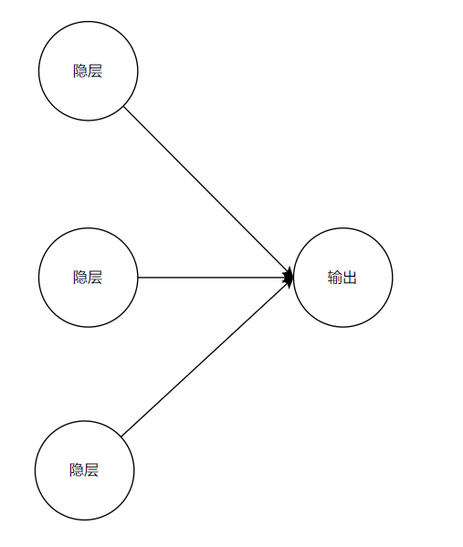

# 基础/总结
## 是什么/作用
## refs
1. 初级: 3bule1brown 神经网络, 梯度下降
2. 初级: python深度学习
## 优缺点, 适用场景
### 优点

# 历史, 现状, 发展方向
## 历史
参见basic大章节 -- 人工智能发展史
## 深度学习得以发展的原因
深度学习用于计算机视觉的两个关键思想，即卷积神经网络和反向传播，在 1989 年就已经 为人们所知。长短期记忆（LSTM，long short-term memory）算法是深度学习处理时间序列的 基础，它在 1997 年就被开发出来了，而且此后几乎没有发生变化。那么为什么深度学习在 2012 年之后才开始取得成功？这二十年间发生了什么变化？总的来说，三种技术力量在推动着机器学习的进步：
硬件
数据集和基准
算法上的改进
由于这一领域是靠实验结果而不是理论指导的，所以只有当合适的数据和硬件可用于尝试新想法时（或者将旧想法的规模扩大，事实往往也是如此），才可能出现算法上的改进。机器学 习不是数学或物理学，靠一支笔和一张纸就能实现重大进展。它是一门工程科学。在 20 世纪 90 年代和 21 世纪前十年，真正的瓶颈在于数据和硬件。但在这段时间内
1. 硬件
从 1990 年到 2010 年，非定制 CPU 的速度提高了约 5000 倍。因此，现在可以在笔记本电 脑上运行小型深度学习模型，但在 25 年前是无法实现的。 但是，对于计算机视觉或语音识别所使用的典型深度学习模型，所需要的计算能力要比笔 记本电脑的计算能力高几个数量级。在 20 世纪前十年里，NVIDIA 和AMD等公司投资数十亿 美元来开发快速的大规模并行芯片（图形处理器，GPU），以便为越来越逼真的视频游戏提供图 形显示支持。这些芯片是廉价的、单一用途的超级计算机，用于在屏幕上实时渲染复杂的3D场景。 这些投资为科学界带来了好处。2007 年，NVIDIA 推出了CUDA，作为其 GPU 系列的编程接口。 少量 GPU 开始在各种高度并行化的应用中替代大量CPU 集群，并且最早应用于物理建模。深 度神经网络主要由许多小矩阵乘法组成，它也是高度并行化的。2011 年前后，一些研究人员开 始编写神经网络的CUDA实现，而 Dan Ciresana和 Alex Krizhevskyb 属于第一批人。 这样，游戏市场资助了用于下一代人工智能应用的超级计算。有时候，大事件都是从游戏
开始的。今天，NVIDIA TITAN X（一款游戏 GPU，在 2015 年底售价 1000 美元）可以实现单 精度 6.6 TFLOPS 的峰值，即每秒进行 6.6 万亿次 float32 运算。这比一台现代笔记本电脑的 速度要快约 350 倍。使用一块 TITAN X显卡，只需几天就可以训练出几年前赢得 ILSVRC 竞赛 的 ImageNet 模型。与此同时，大公司还在包含数百个 GPU 的集群上训练深度学习模型，这种 类型的 GPU 是专门针对深度学习的需求开发的，比如 NVIDIA Tesla K80。如果没有现代 GPU， 这种集群的超级计算能力是不可能实现的。 此外，深度学习行业已经开始超越 GPU，开始投资于日益专业化的高效芯片来进行深度学
习。2016 年，Google 在其年度 I/O 大会上展示了张量处理器（TPU）项目，它是一种新的芯片 设计，其开发目的完全是为了运行深度神经网络。据报道，它的速度比最好的 GPU还要快 10 倍，而且能效更高
2. 数据
人工智能有时被称为新的工业革命。如果深度学习是这场革命的蒸汽机，那么数据就是煤炭， 即驱动智能机器的原材料，没有煤炭一切皆不可能。就数据而言，除了过去 20 年里存储硬件的 指数级增长（遵循摩尔定律），最大的变革来自于互联网的兴起，它使得收集与分发用于机器学 习的超大型数据集变得可行。如今，大公司使用的图像数据集、视频数据集和自然语言数据集， 如果没有互联网的话根本无法收集。例如，Flickr 网站上用户生成的图像标签一直是计算机视觉 的数据宝库。YouTube 视频也是一座宝库。维基百科则是自然语言处理的关键数据集。 如果有一个数据集是深度学习兴起的催化剂的话，那么一定是 ImageNet 数据集。它包含正如 Kaggle 自 2010 年以来所展示的那样，公开竞赛是激励研究人员和工程师挑战极限的极好方法。研究人员通过竞争来挑战共同基准，这极大地促进了近期深度学习的兴起。
3. 算法
除了硬件和数据之外，直到 20 世纪前十年的末期，我们仍没有可靠的方法来训练非常深 的神经网络。因此，神经网络仍然很浅，仅使用一两个表示层，无法超越更为精确的浅层方法， 比如SVM和随机森林。关键问题在于通过多层叠加的梯度传播。随着层数的增加，用于训练神 经网络的反馈信号会逐渐消失。 这一情况在 2009—2010 年左右发生了变化，当时出现了几个很简单但很重要的算法改进， 可以实现更好的梯度传播。
更好的神经层激活函数（activation function）。 
更好的权重初始化方案（weight-initialization scheme），一开始使用逐层预训练的方法， 不过这种方法很快就被放弃了。
更好的优化方案（optimization scheme），比如 RMSProp 和 Adam。 只有这些改进可以训练 10 层以上的模型时，深度学习才开始大放异彩。 最后，在 2014 年、2015 年和 2016 年，人们发现了更先进的有助于梯度传播的方法，比如批标准化、残差连接和深度可分离卷积。今天，我们可以从头开始训练上千层的模型
4. 其他原因: 对人工智能的投资, 人工智能的大众化(比如使用简单的python语言就可以从事深度学习的研究, 以及各种友好的深度学习框架)
## 深度学习的巨大优点
1. 特征工程完全自动化
先前的机器学习技术（浅层学习）仅包含将输入数据变换到一两个连续的表示空间，通常 使用简单的变换，比如高维非线性投影（SVM）或决策树。但这些技术通常无法得到复杂问题 所需要的精确表示。因此，人们必须竭尽全力让初始输入数据更适合用这些方法处理，也必须手动为数据设计好的表示层。这叫作特征工程。与此相反，深度学习完全将这个步骤自动化. 利用深度学习，你可以一次性学习所有特征，而无须自己手动设计。这极大地简化了机器学习 工作流程，通常将复杂的多阶段流程替换为一个简单的、端到端的深度学习模型
一个特征工程的例子


2. 更多的层级, 解决更复杂的问题
你可能会问，如果问题的关键在于有多个连续表示层，那么能否重复应用浅层方法，以实 现和深度学习类似的效果？在实践中，如果连续应用浅层学习方法，其收益会随着层数增加迅 速降低，因为三层模型中最优的第一表示层并不是单层或双层模型中最优的第一表示层。深度 学习的变革性在于，模型可以在同一时间共同学习所有表示层，而不是依次连续学习（这被称 为贪婪学习）。通过共同的特征学习，一旦模型修改某个内部特征，所有依赖于该特征的其他特 征都会相应地自动调节适应，无须人为干预。一切都由单一反馈信号来监督：模型中的每一处 变化都是为了最终目标服务。这种方法比贪婪地叠加浅层模型更加强大，因为它可以通过将复杂、 抽象的表示拆解为很多个中间空间（层）来学习这些表示，每个中间空间仅仅是前一个空间的 简单变换。
深度学习从数据中进行学习时有两个基本特征：第一，通过渐进的、逐层的方式形成越来
越复杂的表示；第二，对中间这些渐进的表示共同进行学习，每一层的变化都需要同时考虑上下两层的需要。总之，这两个特征使得深度学习比先前的机器学习方法更加成功。

## 现状, 发展方向
1. 了解现状的途径
关注kaggle上的竞赛
2. 深度学习会持续下去吗, 还是只是昙花一现
深度神经网络成为企业投资和研究人员纷纷选择的正确方法，它究竟有何特别之处？换句 话说，深度学习是否只是难以持续的昙花一现？ 20 年后我们是否仍在使用深度神经网络？ 深度学习有几个重要的性质，证明了它确实是人工智能的革命，并且能长盛不衰。20 年后 我们可能不再使用神经网络，但我们那时所使用的工具都是直接来自于现代深度学习及其核心 概念。这些重要的性质可大致分为以下三类。
简单: 深度学习不需要特征工程，它将复杂的、不稳定的、工程量很大的流程替换为简 单的、端到端的可训练模型，这些模型通常只用到五六种不同的张量运算。
可扩展: 深度学习非常适合在GPU或TPU上并行计算，因此可以充分利用摩尔定律。此外， 深度学习模型通过对小批量数据进行迭代来训练，因此可以在任意大小的数据集上进行训练。（唯一的瓶颈是可用的并行计算能力，而由于摩尔定律，这一限制会越来越小。）
多功能与可复用: 与之前的许多机器学习方法不同，深度学习模型无须从头开始就可以 在附加数据上进行训练，因此可用于连续在线学习，这对于大型生产模型而言是非常重 要的特性。此外，训练好的深度学习模型可用于其他用途，因此是可以重复使用的。举 个例子，可以将一个对图像分类进行训练的深度学习模型应用于视频处理流程。这样我 们可以将以前的工作重新投入到日益复杂和强大的模型中。这也使得深度学习可以适用 于较小的数据集。
深度学习数年来一直备受关注，我们还没有发现其能力的界限。每过一个月，我们都会学 到新的用例和工程改进，从而突破先前的局限。在一次科学革命之后，科学发展的速度通常会 遵循一条 S 形曲线：首先是一个快速发展时期，接着随着研究人员受到严重限制而逐渐稳定下来， 然后进一步的改进又逐渐增多。深度学习在 2017 年似乎处于这条 S 形曲线的前半部分，在未来
几年将会取得更多进展。
# 思想, 方法
## 标准工作流程
## 思想: 卷积神经网络
## 思想: 反向传播
## 算法: 长短期记忆(lstm)

# 最简单神经网络 ⭐
## 引用
> https://blog.csdn.net/weixin_40432828/article/details/82192709
## 对AI的认知
AI本质上是是一种处理数据的算法
## 从拟合说起
### 线性拟合
用红线拟合蓝线


### 多项式拟合
不妨就理解为用**曲线**拟合的一种就好了


显然的，三次拟合曲线拟合的更好
### 其他拟合
最小二乘法，指数拟合，对数拟合等也是拟合方式
根据不同的数据特点，选择不同的拟合方式，可以达到最佳效果
### 拟合的问题 ⚠️
但不管是哪种拟合，都很难准确拟合复杂的数学关系
## 到机器学习算法
相较于前面的简单拟合，机器学习算法是一个广阔的领域，他们也能解决很多复杂的数学问题
比如：逻辑回归，贝叶斯，决策树，knn，套袋法等

但个人理解机器学习算法在拟合复杂数学问题的时候，仍然是不够用的
## 到神经网络
### 理解神经网络
神经网络是拟合复杂函数的一种方法
在处理你和复杂数学问题方面，神经网络的性能要强于前面的，比如说线性拟合、各种机器学习算法等

神经网络本质上是：是找规律，是拟合复杂函数（复杂数学问题）
#### 可归纳问题与不可归纳问题
我们先理解这两个概念
可归纳: 在数学上就是可以表达为一个函数。
不可归纳: 在数学上无法表达为一个函数，比如说现在数学家发现，我们没有办法找到一套完美的数学公式去表达所有的质数。所以质数的出现就**无法归纳**

而识别一个人，识别猫猫狗狗，识别你的爸爸等。在他们转化为数学问题之后（比如拍摄图片转化为rgb值），虽然很复杂，但是是可以归纳的。或者说整个过程可以表达为一个函数。反过来虽然可以表达为一个函数，但这个函数是复杂的

可拟合的问题就可以简单地表达为如下形式：
 x 与 y 的对应关系  y = f(x)
比如你爸爸 = f (你爸爸的特征)

我们要做的就是找到这个函数f，或者说你和这个复杂函数f
## 最简单的神经网络：BP神经网络
   bp是 Back Propagation 的简写 ，意思是反向传播
### 什么是网络（正向网络）
我们先来看一个指正向传播不反向传播的“网络”，主要是解释什么叫做输入层，输出层，隐藏层，权重
> 假如我手里有一笔钱，N个亿吧(既然是假设那就不怕吹牛逼)，我把它分别投给5个公司，分别占比 M1，M2，M3，M4，M5（M1到M5均为百分比 %）。而每个公司的回报率是不一样的，分别为 A1， A2， A3， A4， A5，（A1到A5也均为百分比 %）那么我的收益应该是多少？这个问题看起来应该是够简单了，你可能提笔就能搞定  收益 = N * M1 * A1 + N * M2 * A2+N * M3 * A3+N * M4 * A4+N * M5 * A5 。这个完全没错，但是体现不出水平，我们可以把它转化成一个网络模型来进行说明。如下图：

 图有点丑，领会精神，领会精神。上面的问题是不是莫名其妙的就被整理成了一个三层的网络，N1到N5表示每个公司获得的钱，R表示最终的收益。R = N*M1*A1 + N*M2*A2+N*M3*A3+N*M4*A4+N*M5*A5 。我们可以把 N 作为输入层 ，R作为输出层，N1到N5则整体作为隐藏层，共三层。而M1到M5则可以理解为输入层到隐藏层的权重，A1到A5为隐藏层到输出层的权重。

这里提到了四个重要的概念 输入层（input） ， 隐藏层 （hidden），输出层（output）和权重（weight） 。而所有的网络都可以理解为由这三层和各层之间的权重组成的网络，只是隐藏层的层数和节点数会多很多。

输入层：信息的输入端，上图中 输入层 只有 1 个节点（一个圈圈），实际的网络中可能有很多个
隐藏层：信息的处理端，用于模拟一个计算的过程，上图中，隐藏层只有一层，节点数为 5 个。
输出层：信息的输出端，也就是我们要的结果，上图中，R 就是输出层的唯一一个节点，实际上可能有很多个输出节点。
权重：连接每层信息之间的参数，上图中只是通过乘法的方式来体现。
在上面的网络中，我们的计算过程比较直接，用每一层的数值乘以对应的权重。这一过程中，权重是恒定的，设定好的，因此，是将 输入层N 的 信息 ，单向传播到 输出层R 的过程，并没有反向传播信息，因此它不是神经网络，只是一个普通的网络。
### 什么是反向传播
神经网络的训练过程一般会用到反向传播

而对反向传播最简单的理解就是
在神经网络每一轮的训练中，如果得到的结果不好，我们就要回去调整各个参数（权重），直到结果变好

这种根据结果回去调整参数的过程，就是反向传播
**或者说反向传播用于修正误差**
**反向传播的就是误差**
**或者说反向传播的是下一步的调整方向和幅度**
**每一轮反向传播就收集一些误差，并更新权重**

**或者说神经网络可以实现权重分配**
### 神经网络的表达式与训练

这样的叫做多元函数，它有很多个X（成百上千个都很常见）
神经网络中也是如此，他也有很多个X，就好像输入的图片中有很多个像素
此外它还有很多个权重θ
所以神经网络的表达式是： **y = f(θ，x)** ，这仅仅也是一种表达形式而已
整个神经网络可以简化成如下函数

而神经网络的运行过程就是：根据已知的X和Y不断的反推调整θ，这个反推的过程中会用到最小二乘法和梯度下降的

我们使用神经网络去拟合数据与数据之间的关系
通过一次正向传播，和一次反向传播，我们就可以将网络的参数θ更新一次
个人理解：正向传播就是计算一次，当前权重参数下还有多少误差，反向传播就是，把误差传递回去，调整权重θ，让误差减小。这样一次正反传播之后，误差就变小了
下一次正向传播一计算，发现误差确实变小了，但是还有误差，就再次反向传播，回去，调整权重θ，让误差减小
所谓训练网络，就是让正向传播和反向传播不断的往复进行n次，不断地更新网络的参数，最终使网络能够逼近真实的关系。

理论上，只要网络的层数足够深，节点数足够多，其能学习到的特征就越复杂，就可以逼近任何一个函数关系
但与此同时参数越多计算也越费时，也越容易过拟合（过拟合就是过度学习了数据的特征，把噪声也考虑进去了）

神经网络可以学习大量数据之间的相关性，但这种相关性并非严格的数学关系，只是非常有效。
## 最简单神经网络代码实现 ⭐⭐⭐
个人实测


https://blog.csdn.net/weixin_40432828/article/details/82192709
https://machinelearningmastery.com/implement-backpropagation-algorithm-scratch-python/
```python
from random import seed
from random import random

from math import exp

 # 正向传播的时候
 # 计算当前神经元的值：是根据当前神经元左边的，插入到当前神经元的箭头（权重）和输入（上一层的神经元）进行计算的
 # 反向传播的时候
 # 计算当前神经元的错误：是根据当前神经元右边的，当前神经元发散出去的箭头（权重）和箭头插入的下一层神经元进行计算的
 # 在这个例子中：正向传播更新activation和output（也就是sigmoid值），反向传播更新error和delta，更新权重时更新weight

 # 初始化神经网络

 # 这三个参数分别是输入层的神经元个数，隐层的神经元个数，输出层的神经元个数
 # 假如传入的是3,3,2，也就是输入层有三个神经元, 隐层有三个神经元，输出层有两个神经元
 # 那他创建的神经网络就如下图所示注意此处生成的是全连接的神经网络

 # 其中输入层其实就是输入样本的一个个特征，比如一个像素点的值
 # 一个特征对应一个输入层的神经元
 # 输出层就是输出最终的判断结果

def initialize_network(n_inputs, n_hidden, n_outputs):
    network = list()
    
    # 先创建一层隐层 (为什么不先创建输入层? 是因为在这里的这个实现中，输入层的信息都保存在隐层了)
    # 隐层有n个神经元
    # 输入层的每个神经元都连接到隐层的神经元（全连接）
    # a1 = w1x1 + w2x2 + b1，其中a1是隐层的一个神经元，w是权重，x是输入（有几个x就需要几个w），b是偏置（一般只有一个）
    # 这里每个隐层神经元a，对应一个weights列表，weights中其实存储的就是比如（w1，w2，b1），供当前神经元a1使用
    # 这里生成的一个隐层神经元大概如下图
    # 也就是**一个**隐层神经元, 和输入层的多个神经元全连接的图示


    # https://blog.csdn.net/hhhhhhhhhhwwwwwwwwww/article/details/122695004
    # 这里最外层是一个列表生成式, 会生成一个列表
    # 列表中有n个对象，其中每个对象代表一个隐层神经元, 或者说用于存储一个隐层神经元的相关信息
    # 每个对象中都有weights一个列表, 代表的是与当前这个隐层神经元相连接的输入层神经元的权重和偏置, 可以参见上图, 每条线上都有一个权重之后, 再+一个偏置, 这里的权重和偏置都是随机生成的
    hidden_layer = [{'weights': [random() for i in range(n_inputs + 1)]}
                    for i in range(n_hidden)]
    network.append(hidden_layer)

    # 创建一个输出层
    # 同理，隐层也全连接到输出层
    # 这里输出层有n_outputs个神经元，所以如上，也需要创建n_outputs个weights列表
    # o1 = w1a1 + w2a2 + b1，其中o1就是输出层的一个神经元，w是权重，a是输入（来自隐层）（有几个a就需要几个w），b是偏置（一般只有一个）
    # 这里的示意图包括存储的数据结构和上面是完全一样的, 无非上面是输入层连接到隐藏，这里是隐藏连接到输出层
    # 这是多个隐层神经元, 连接到**一个**输出层神经元的图示


    output_layer = [{'weights': [random() for i in range(n_hidden + 1)]}
                    for i in range(n_outputs)]
    network.append(output_layer)
    return network
 # 注意上面，在初始化神经网络时是从隐层开始初始化的
 # 或者说第1层是隐藏，这里因为只有一个隐层，所以第2层就是输出层
 # 这是因为输入层的输入都是固定的，就是测试集或训练集当中的一行数据而已。

 # 测试生成神经网络
seed(1)
network = initialize_network(2, 1, 2)
 # print(network)

 # [
 #     [
 #         {'weights': [
 #           0.13436424411240122,
 #           0.8474337369372327,
 #           0.763774618976614]
 #         }
 #     ],
 #     [
 #         {'weights': [0.2550690257394217, 0.49543508709194095]},
 #         {'weights': [0.4494910647887381, 0.651592972722763]}
 #     ]
 # ]

 # 看，这里初始的神经网络一共有两层(如果带上输出层的话就是三层)
 


 # 第1层是隐层(对应到上图就是第2层)，只有一个神经元，所以只有一个weights数组, 这一个weights数组当中包含三个元素, 其中前两个是权重，最后一个是偏置。这里其实是在设置输入层的两个元素，一个偏置，全连接到隐层时的w和b

 # 同理，第2层是一个输出层(对应到上图就是第3层)，它有两个神经元，所以有两个weights数组，
 # 第1个数组设置隐层全连接到输出层的第1个神经元的参数
 # 第2个数组设置隐层全连接到输出层的第2个神经元的参数
 # 这里每一个
 # weights数组都有两个元素， 第一个元素是权重（因为隐层只有一个神经元，所以也只需要一个权重。有多少个神经元就需要多少个权重），第二个元素是偏置

 # 不过注意这里的权重和偏执都是随机初始化的，所以并没有什么意义。如果现在你拿这个神经网络去进行预测，得到的结果很大可能是错误的
 # 训练神经网络就是不断调整这里的权重和偏置的过程（就是调整weights数组），调整好之后的权重和偏置拿来预测，得到的结果很大，可能是正确的

 # 接下来开始前向传播的过程
 # 前向传播就是将数据集中的一行，输入到输入层中，然后按初始化的随机权重和偏置，计算出输出层。就是这个过程

 # 前向传播：计算每个神经元的激活
 # 计算公式：activation = sum(weight_i * input_i) + bias
 # 其实前面的计算公式是：针对每个神经元的计算公式，或者说怎么计算每个神经元的激活
 # 比如对于隐层当中的一个神经元，要计算它的激活值，就是用输入层的每个值 * 权重，然后求和，最终+偏置。这样就得到了隐层当中一个神经元的值，这其实是一个超级简单的计算

def activate(weights, inputs):
    activation = weights[-1]  # 先让激活值等于最后的偏置，然后和后面的值相加
    # print('bias:', activation)
    for i in range(len(weights) - 1):  # 然后让前面一层的input * weight，并求和
        activation += weights[i] * inputs[i]
    return activation  # 最终求出来的其实就是sum(weight_i * input_i) + bias


 # 前向传播：使用sigmoid函数处理神经元
 # 我个人的理解是
 # 前面计算出来的激活值并不能直接写入到神经元当中，而是需要先经过一个sigmoid之类的函数（tanh，relu之类的也可以），将前面的激活值转换成一个0~1之间的数值
 # 采用sigmoid，因为它的函数图像很平滑，容易求导
 # 而将激活值输入到sigmoid的函数之后，求出来的值才能写入到神经元当中
 # 或者你也可以理解为：激活值可以写入到神经元当中，只是从神经元当中流出时还要再经过sigmoid函数。这样也可以
 # 经过下面这个函数，activation值就变成了0~1之间的sigmoid值
def transfer(activation):
    return 1.0 / (1.0 + exp(-activation))  # 这只是sigmoid的计算公式而已，放轻松

 # 前向传播：前向传播的业务逻辑如下:
 # 上面计算激活值也好，计算sigmoid值也好，都是我们前向传播的组件
 # 这里我们正式来书写前向传播的业务逻辑
 # 其实非常简单：就是计算每一层神经网络的输出，变成下一层神经网络的输入
 # 比如一开始是：输入层向隐层进行输入 → 然后隐层的每个神经元都可以：经过activate函数计算出激活值 → 经过transfer函数计算出sigmoid值
 # 这样隐层就计算出来了，隐层就可以继续向后面的输出层传播

def forward_propagate(network, row):
    inputs = row  # 这就是上一层网络的输出，也是该层网络的输入
    for layer in network:  # 获取神经网络中的每一层，我们这里一般三层：输入层、隐层和输出层
        new_inputs = []  # 用来存储当前这一层神经网络的输出（其实就是当前这一层神经网络每个神经元当中的值），同时也是下一层神经元的输入
        for neuron in layer:  # 获取当前层的每一个神经元
            # 每一个神经元都使用自己的权重参数和上一层的输入，计算出自己的激活值
            activation = activate(neuron['weights'], inputs)
            neuron['output'] = transfer(activation)  # 然后将激活值转换成sigmoid值
            # 记录当前神经元的sigmoid值，记录在output属性中
            new_inputs.append(neuron['output'])
        inputs = new_inputs  # 准备好下一层神经网络的输入，然后进入下一轮for循环，或者说进入下一轮神经网络传播
    return inputs  # 这是最后一层神经网络（也就是输出层）的输出，其实也是我们在后面进行预测时得到的预测结果

 # 测试前向传播
row = [1, 0]  # 输入层: 输入1，0
 # 把神经网络和第1层（也就是输入层）的各个神经元的值，传入到正向传播函数中，最终经过一通计算就能得到输出层神经元中记录的值，即在output变量中
output = forward_propagate(network, row)
 # print(output)
 # 但其实这个输出结果是没有意义的，因为我们神经网络中的权重都是随机设置的，此处仅仅是演示过程
 # 下面这是输出, 这也就是说: 输入层输入的是1和0, 经过我们神经网络的计算, 输出层输出的结果是下面
 # [0.6629970129852887, 0.7253160725279748]

 # 其实正向传播的过程也是预测的过程⭐
 # 但很显然现在我们还不能进行预测，因为我们的偏置和权重都是随机设置的，预测起来会很不准
 # 所以下面需要通过反向传播，来调整权重和偏置。
 # 经过N轮的反向传播（其实也就是经过训练神经网络），我们的权重和参数会被调整到很好的地步
 # 这个时候就可以进行真正的预测了，其实也就是将一组数据再次输入到正向传播函数中，得到输出层的输出output。只是这时这个output就很准了

 # print(network)
 # 经过一次正向传播，这时再打印一下神经网络, 发现各个神经元除了有weights权重，还计算出来了output，其实就是每个神经元当中记录的的sigmoid值
 # [
 #   [
 #     {'weights': [0.13436424411240122, 0.8474337369372327, 0.763774618976614], 'output': 0.7105668883115941}
 #   ],
 #   [
 #     {'weights': [0.2550690257394217, 0.49543508709194095], 'output': 0.6629970129852887},
 #     {'weights': [0.4494910647887381, 0.651592972722763], 'output': 0.7253160725279748}
 #   ]
 # ]

 # 反向传播：计算sigmoid的导数
 # 这是一个功能函数，前面我们说过：每个神经元都可以计算出来一个激活值 → 将激活值传入sigmoid函数中，可以计算出来一个sigmoid值，整个计算过程其实就是y = sigmoid(x),或者说:sigmoid值 = sigmoid(activation), activation就是x，sigmoid值就是y
 # 我们知道sigmoid的函数图像，还知道（x，y），我们就能求(x,y)这一点的斜率或者说导数
 # 这里就是在求导数, 仅此而已，非常简单，所以说它是个功能函数。关于求导原因，后面再说
def transfer_derivative(output):
    return output * (1.0 - output)  # 不要害怕，这只是在计算sigmoid的导数。这里直接用的它的导数计算公式，非常简单
 
 # 反向传播：计算误差
 # 我们先说一下这是啥
 # 假如说我们现在要对图片进行分类, 分类的结果只有猫和狗
 # 因为我们这里假设输出层有两个神经元, 所以我们沿用他的这个去讲, 如果图片为猫, 那我们期望的输出就是[1, 0], 即输出层第1个神经元的值是1，第2个神经元的值是0, 表示这是一只猫的可能性是1，这是一只狗的可能性是0. 同样如果图片是狗，那我们期望的输出就是[0, 1]
 # 当然这是我们期望的输出, 可能即便是训练好的神经网络也未必能达到这个效果. 而像我们这种还没有开始训练的神经网络, 给他一只小猫的图片，它的输出可能是[0.3, 0.7], 也就是神经网络觉得30%的可能这是一只猫，70%的可能这是一只狗, 这个值和我们期望的值[1, 0]有很大的误差, 我们要做的就是尽可能的缩小这个误差
 # 那我们就要想误差是从哪儿来的. 假如说我们输入层输入的是一张小猫图片的所有像素值, 这些像素值经过多个隐层计算，最终在输出层输出[0.3, 0.7]这个错误的结果
 # 这其实就是说: 在从输入层到隐层再到输出层的整个计算结果中，一定有哪里(的权重)出错了, 因为整个神经网络的计算过程其实非常简单, 大体只包含: 乘法, 加法和sigmoid三种运算
 # 那我们输入一堆像素值, 比如[0.31223, 0.98767, 0.6712...] → 乘法, 加法和sigmoid → 输出了错误的值[0.3, 0.7]
 # 这一定是中间的"乘法, 加法和sigmoid"这个步骤计算出错了，而中间的这个步骤其实就是权重w和上一层网络的输出o在进行计算，上一层网络的输出也是上上一层的w和o计算出来的，一直回溯到第1层隐层，它的值是权重w和x（也就是图片的像素值）计算出来的，其中图片的像素值是肯定没错的，也无法进行调整。所以唯一能调整的其实只剩下各层权重w
 # 假如说输出层输出的是[0.3, 0.7], 期望的是[1,0], 那我们只能调整前面的各层权重w，输出层往前追溯一层就是隐层，比如说输出层的0.3这个神经元值，就是sum(权重 * 上一层隐层的神经元值) + bias得到的，所以就需要去调整当前神经元的权重(和bias, 只是这里我们不太关注偏置，主要讨论的是权重)
 # 而且输出层输出的是0.3，期望的是1，差距有0.7。这个0.3又完全是由前面的那层神经元 * 权重得到的，所以这0.7的差距必须通过调整上一层的权重得到弥补。

 # 反向传播的实现
def backward_propagate_error(network, expected):
    for i in reversed(range(len(network))):  # 反向传播，从最后一层开始迭代，也就是输出层
        layer = network[i]  # 当前层
        errors = list()  # 记录每个神经元的误差
 
        if i != len(network) - 1:  # 如果当前层是隐层（不是输出层） ⭐3
            for j in range(len(layer)):  # 处理隐层的每个神经元
                error = 0.0  # 每个神经元的误差
                for neuron in network[i + 1]:  # 获取后一层的每个神经元，比如隐层获取输出层
                    # 为什么要获取后一层的神经元呢，这里可以这样理解
                    # 隐层当中的一个神经元，连接到了下一层也就是输出层的所有神经元（全连接）
                    # 所以隐层当中的一个神经元发生错误，这个错误会传播到下一层当中的所有神经元当中。依据传播箭头上权重的大小，传播的错误量也或多或少
                    # 那请问：隐层中的这个神经元，到底引发了多少错误量呢
                    # 答案是：需要看下一层的所有神经元。因为这个神经元的错误传播到了下一层的所有神经元当中，所以要确定这一层这个神经元的错误量，也需要从下一层的所有神经元当中进行提取
                    # 这里就是在从下一层所有神经元当中进行错误提取（提取的方法就是用下一层神经元的错误量 * 权重，其实就是将错误按权重反推回去）
                    # 下一层每个神经元都把自己的错误按权重反推回去，把这些反推回去的错误相加，就可以得到这一层这个神经元造成的错误量
                    # 这个过程其实就是：反向按权重分配误差的过程
                    # sum（这个神经元的连接(传播)线上的权重 * 这个神经元连接(传播)到的那个神经元的误差） = 这一个神经元造成的所有误差
                    error += (neuron['weights'][j] * neuron['delta'])
                errors.append(error)  # 记录当前神经元的总误差
        else:  # 如果当前层是输出层，可以先看这里的代码，因为反向传播就是从输出层向前传播的 ⭐1
            for j in range(len(layer)):
                neuron = layer[j]  # 获取输出层每个神经元
                # 计算输出层每个神经元输出值和标签值（也就是正确值）之间的差距
                errors.append(neuron['output'] - expected[j])
 
        for j in range(len(layer)):  # 对于神经网络中的每一层，都跑这段代码，先从输出层开始，再是隐层... ⭐2
            neuron = layer[j]  # 获取当前层的神经元
            # 计算当前层这个神经元的误差 = 当前层这个神经元的输出值和正确值之间的差距 * 输出值的斜率
            # 个人感觉这里只是换一种形式来记录这个误差值。记录在每个神经元的delta属性中。
            # 首先乘以导数之后，指整体变小了
            # 其次导数有正负，所以正负信息也被记录在了Delta属性中
            # 不管是隐层还是输出层的神经元，其造成的误差都记录在delta属性中
            # 所以这里的errors[j] 和 neuron['delta']表示的都是一个神经元的造成的总误差，只是两种不同的表达方式
            # Todo: 其实这里不是很理解为什么一定要变为delta形式
            neuron['delta'] = errors[j] * transfer_derivative(neuron['output'])
        # print('当前层：', i, layer, '每个神经元的输出误差：', errors)
 # 上面的误差计算可以总结为公式
 # 输出层每个神经元的误差delta计算为 = (output - expected) * transfer_derivative(output)
 # 隐层每个神经元k的误差delta计算为 = sum（(weight_k * error_j)） * transfer_derivative(output_k)
 # 对于上面的两个公式，除去后面的 * transfer_derivative(output)，剩下的前半部分都很好理解
 # 输出层每个神经元的误差：output - expected，就是期待值和实际输出值之间的差距
 # 隐层每个神经元k的误差： = sum（(weight_k * error_j)）当前神经元可以造成的误差，就是从下一层j层所有神经元（的误差）当中，按权重收集误差并相加
 
 # 测试反向传播
 # 期待输出层的两个神经元的值分别是0和1，很显然的，现在我们神经网络并没有经过训练它的输出层输出的应该不是[0, 1], 这就产生了误差
expected = [0, 1]
 # 然后通过一次反向传播，把误差分配给各个神经元。也就是看看各个神经元都造成了多少误差
backward_propagate_error(network, expected)
 # 但是要格外注意
 # 到现在我们仅仅是看看各个神经元都造成了多少误差，还没有根据误差进行权重的调整
 # 而且我们依旧没有训练神经网络，只是拿一条数据（比如说一张图片）作为输入，进行了一次正向传播。然后又根据输出误差，进行了一次反向传播
 # 不妨理解为我们这是针对一张图片做了一次训练，而且仅仅计算出了误差，还没有调整权重
 # 个人理解如果依据此时算出来的误差完全调整好权重，此时的神经网络，针对这一张图片识别的正确率应该是100%。也就是说输入这张图片一定会输出[0, 1], 也就是输出期望值. 因为我们整个模型就是按照这张图片去调整的。或者说针对这张图片过拟合了
 # print(network)
 # [
 #     [
 #         {
 #             'weights': [0.13436424411240122, 0.8474337369372327, 0.763774618976614],
 #             'output': 0.7105668883115941,
 #             'delta': 0.002711797799238243
 #         }
 #     ],
 #     [
 #         {
 #             'weights': [0.2550690257394217, 0.49543508709194095],
 #             'output': 0.6629970129852887,
 #             'delta': 0.14813473120687762
 #         },
 #         {
 #             'weights': [0.4494910647887381, 0.651592972722763],
 #             'output': 0.7253160725279748,
 #             'delta': -0.05472601157879688
 #         }
 #     ]
 # ]
 # 前面经过一次正向传播，每个神经元除了weights属性还多了一个，output属性，其中记录的是该神经元的sigmoid值
 # 而现在经过1次反向传播，每个神经元又多了一个delta属性，记录的是该神经元造成了偏差
 
 # 训练神经网络：更新权重
 # weight = weight - learning_rate * error(也就是delta) * input
 
 # 其中row是一行数据，并带有标签。比如一张图片的像素值，并带有标签一代表这是一只猫
def update_weights(network, row, l_rate):
    # 正向循环遍历神经网络中的每一层，注意这里是正向哦，反向传播的时候是反向遍历。所以这里优先拿到的是输入层，然后是隐层，最后是输出层
    for i in range(len(network)):
        inputs = row[:-1]  # 去除最后的标签，比如说只剩下一张图片的像素值
        if i != 0:  # 如果不是第一个隐层。格外注意我们的神经网络中，第1层是隐层而不是输入层
            # 获取上一层神经网络中的每个神经元当中的值
            # 获取的其实是每个上一层神经元当中的sigmoid值
            inputs = [neuron['output'] for neuron in network[i - 1]]
        # 上面之所以排除掉第1个隐层，是因为上面的代码实际上是在计算神经网络的输入（当前层神经网络的输入，是上一层神经网络的输出）
        # 而第1个隐藏的输入是固定的，就是图片的像素值啊..., 或者说就是前面算出来的inputs = row[:-1], 所以不用再次进行计算
        # 而之后的隐藏的输入，需要从上一层神经网络中提取
 
        # 获取当前这层神经网络当中的每个神经元（还是提醒一下，我们的神经网络是从第1层隐层开始的，所以这里其实处理的是隐藏和输出层）
        for neuron in network[i]:
            for j in range(len(inputs)):  # 获取上一层输出（同时也是这一层的输入）的编号，0，1，2，3...记做j
                # print(neuron['weights'][j],  l_rate,
                #       neuron['delta'], inputs[j])
                neuron['weights'][j] -= l_rate * neuron['delta'] * \
                    inputs[j]  # ⭐ 这就是在更新权重，你看他在重新设置当前层每个神经元的权重的值
                # ↑ 那把权重更新成什么样子呢：新的权重等于以前的权重 - （学习率 * 当前神经元造成的误差 * 当前神经元接收到的输入）
                # 用公式表示就是：weight = weight - learning_rate * delta * input
                # 对当前层每一个神经元的每一个权重都执行此更新
                # 其实这个更新权重的公式非常容易直观理解：我亲自去计算了一下，如果delta为负数，也就是说这个神经元的误差为负数，代表这个神经元的输出值（sigmoid值）比期望值要小。
                # 那此时毫无疑问的：我们期望这个神经元的输出值（sigmoid值）变大，从而才能更接近期望值。那这个神经元的输出值（sigmoid值）怎么变大呢？
                # 答案是取决于与这个神经元连接的上一层神经网络的值（sigmoid值，也是这里的input变量）及其权重，自己计算的时候很容易发现，如果输出层的某个神经元的Delta为负数，那么在参数调整时，与之连接的input * weight得到的结果就会变大，以增大该神经元的值。至于增大多少，也取决于学习率，学习率设置得很低的话，可能调整起来也会很慢，随着多次迭代，输出值和期望值的差距才会慢慢变小
            neuron['weights'][-1] -= l_rate * neuron['delta']
            # 同时也更新偏置，更新偏置的时候，把输入看作1.0
            # 其实在做贡献的时候, 偏置表现的和一个正常神经元也没有太大的区别，只是这个神经元中的值固定为1，但它的权重是可以调整的，也就是可以不断调整这个1中，百分之多少，可以向下一层神经网络做贡献
 
update_weights(network, [1, 0], 0.1)
 # print(network)
 # 这里我们以学习率是0.1为例, 尝试更新一下我们神经网络的权重
 # 仔细对比前面的结果，可以发现更新之后weights权重有非常细微的变化, 因为我们没有动output和Delta，所以这两个值没有变化
 # [
 #   [
 #     {'weights': [0.1340930643324774, 0.8474337369372327, 0.7635034391966902], 'output': 0.7105668883115941, 'delta': 0.002711797799238243}
 #   ],
 #   [
 #     {'weights': [0.24454306223896716, 0.4806216139712532], 'output': 0.6629970129852887, 'delta': 0.14813473120687762},
 #     {'weights': [0.45337971396446314, 0.6570655738806427], 'output': 0.7253160725279748, 'delta': -0.05472601157879688}
 #   ]
 # ]
 
 # 现在参数已经调整过了，其实现在你可以再跑一遍正向传播. 会发现相比于第1次跑正向传播得到的结果, 现在得到的结果更加接近期望值，但接近的不多。因为我们的学习率很小
 
 # [0.6579919757192095, 0.7269438146510598] 1次学习
 # [0.6529523122533234, 0.7285652610807573] 2次学习
 # [0.6114932109546636, 0.7413111849428794] 10次学习
 # [0.17602734753059768, 0.8563207843650327] 100次学习
 # [1.4429999217686302e-09, 0.9998291820793729] 1000次学习
 # 如果学习1000次, 可以发现已经非常接近我们期待的结果[0, 1]
 # 注意这里，我们是针对输入[1, 0], 输出[0,1] 这一条结果学习了1000次
 # 不过这里仅仅是告诉你可以这样学习，实际上训练神经网络，我们可以使用下面的函数
 
 # for i in range(999):
 #     update_weights(network, [1, 0], 0.1)
 # output = forward_propagate(network, row)
 # print(123, output)
 
 # 训练神经网络：执行训练
 # 训练神经网络,这里采用固定的epochs
 # 下面的train是训练集，我们假设训练集中有10条数据
 # l_rate学习率，一般我们自己指定这里可以指定为0.1
 # n_epoch：是训练多少次，比如这里我们可以填入20, 代表要对上面的10条数据训练20次
 # n_outputs：是在设定输出层有多少个神经元，这种写法可能不太常见，只是这个示例代码是这样写的, 假如说我们期望输出层有两个神经元
 
def train_network(network, train, l_rate, n_epoch, n_outputs):
    for epoch in range(n_epoch):  # 训练20次
        sum_error = 0  # 这个仅仅用于打印, 看看我们每次训练是不是说总体误差降低了
        for row in train:  # 从训练集中取出每一条数据
            outputs = forward_propagate(network, row)  # 把这条数据传入神经网络中, 进行一次前向传播
            # ↑ 要注意这里的row数组中，前面是特征（比如图片中的像素值），最后一个则是标签（比如1或0），也就是说它没有去除标签，是因为我们在前向传播中会自己忽略掉这个标签
            # 所以并不是我们要利用这个标签，我们利用的还仅仅是特征。只是这个作者的代码把去除标签放在了前向传播当中
            expected = [0 for i in range(n_outputs)]  # 对于任意一条数据，我们期望的结果总是[0,0]
            # 将期望结果修改为[0, 1]或[1, 0]这个真的没什么，只是作者的一个编程小技巧. 我们知道row变量当中最后一位是标签（1或0），这里就是一个简单的编程技巧来根据row的最后一位是0还是1，将expected变成[0,1]或者[1,0], 因为作者设置的输出层是两个神经元, 所以需要做成最后输出[0,1]或者[1,0]这种编码形式（独热编码）
            expected[row[-1]] = 1
            sum_error += sum([(expected[i] - outputs[i]) **
                              2 for i in range(len(expected))])  # 这只是作者计算总误差的一种方式，就是累积计算误差的平方，从而让误差为正数
            backward_propagate_error(network, expected)  # 经历一次前向传播之后再经历一次后向传播
            # 然后根据后向传播更新参数，这就完成了一条数据的训练，每条数据都如此训练。训练20个回合
            update_weights(network, row, l_rate)
        print('> epoch=%d, lrate=%.3f, error=%.3f' %  # 这个用于每个回合查看效果，看看错误是否变低了
              (epoch, l_rate, sum_error))
 
 # 预测函数
 # 其实就是输入一个数据到神经网络中
 # 然后让他经历一次前向传播, 就能获得输出层的输出
 # 然后在我们的例子中，我们找到输出层神经元中更大的那一个值，那我们就认为它是预测结果
def predict(network, row):
    outputs = forward_propagate(network, row)
    return outputs.index(max(outputs))
 
 # 下面我们使用一些数据进行实际训练
 # 设置随机数种子
seed(1)
 
 # 这是我们的数据集，带标签, 每个数据集有三个数据, 其中前两个是特征，最后一个0或1指的是标签
 # 标签只有0和1，所以这是一个二分类问题的数据集
dataset = [
    [2.7810836, 2.550537003, 0],
    [1.465489372, 2.362125076, 0],
    [3.396561688, 4.400293529, 0],
    [1.38807019, 1.850220317, 0],
    [3.06407232, 3.005305973, 0],
    [7.627531214, 2.759262235, 1],
    [5.332441248, 2.088626775, 1],
    [6.922596716, 1.77106367, 1],
    [8.675418651, -0.242068655, 1],
    [7.673756466, 3.508563011, 1]
]

 # 输入数据的size，其实就是确认输入层有多少个神经元
n_inputs = len(dataset[0]) - 1
print("n_inputs is: %s" % n_inputs)

 # 输出数据的size，其实就是输出层有多少个神经元，这里也是有几种分类结果
n_outputs = len(set([row[-1] for row in dataset]))
print("n_outputs is: %s" % n_inputs)

 # 创建一个神经网络
 # 这里创建的神经网络有一个输入层，一个隐层，一个输出层
 # 每一层都有两个神经元
 # 并随机初始化权重和偏置
network = initialize_network(n_inputs, 2, n_outputs)
print("network is: %s" % network)
 # network is:
 # [
 #   [
 #     {'weights': [0.13436424411240122, 0.8474337369372327, 0.763774618976614]},
 #     {'weights': [0.2550690257394217, 0.49543508709194095, 0.4494910647887381]}
 #   ],
 #   [
 #     {'weights': [0.651592972722763, 0.7887233511355132, 0.0938595867742349]},
 #     {'weights': [0.02834747652200631, 0.8357651039198697, 0.43276706790505337]}
 #   ]
 # ]

 # 训练神经网络，训练20轮
train_network(network, dataset, 0.5, 200, n_outputs)
 # > epoch=0, lrate=0.500, error=6.350
 # > epoch=1, lrate=0.500, error=5.531
 # > epoch=2, lrate=0.500, error=5.221
 # > epoch=3, lrate=0.500, error=4.951
 # > epoch=4, lrate=0.500, error=4.519
 # > epoch=5, lrate=0.500, error=4.173
 # > epoch=6, lrate=0.500, error=3.835
 # > epoch=7, lrate=0.500, error=3.506
 # > epoch=8, lrate=0.500, error=3.192
 # > epoch=9, lrate=0.500, error=2.898
 # > epoch=10, lrate=0.500, error=2.626
 # > epoch=11, lrate=0.500, error=2.377
 # > epoch=12, lrate=0.500, error=2.153
 # > epoch=13, lrate=0.500, error=1.953
 # > epoch=14, lrate=0.500, error=1.774
 # > epoch=15, lrate=0.500, error=1.614
 # > epoch=16, lrate=0.500, error=1.472
 # > epoch=17, lrate=0.500, error=1.346
 # > epoch=18, lrate=0.500, error=1.233
 # > epoch=19, lrate=0.500, error=1.132
 
 # 可见随着训练轮数的增加，误差逐渐变小
 # 实测如果增加到两把轮训练，误差可以变为0.028, 就更小了
 
print(network)
 # 这是20论训练后的神经网络
 # 可见他的各个权重都发生了变化
 # [
 #   [
 #     {'weights': [-1.4688375095432327, 1.850887325439514, 1.0858178629550297], 'output': 0.029980305604426185, 'delta': 0.0059546604162323625},
 #     {'weights': [0.37711098142462157, -0.0625909894552989, 0.2765123702642716], 'output': 0.9456229000211323, 'delta': -0.0026279652850863837}
 #   ],
 #   [
 #     {'weights': [2.515394649397849, -0.3391927502445985, -0.9671565426390275], 'output': 0.23648794202357587, 'delta': 0.04270059278364587},
 #     {'weights': [-2.5584149848484263, 1.0036422106209202, 0.42383086467582715], 'output': 0.7790535202438367, 'delta': -0.03803132596437354}
 #   ]
 # ]
 
 # 用训练好的神经网络进行预测
 # 这里是直接拿训练集进行预测测试了
for row in dataset:
    prediction = predict(network, row)
    print('Expected=%d, Got=%d' % (row[-1], prediction))
 # Expected=0, Got=0
 # Expected=0, Got=0
 # Expected=0, Got=0
 # Expected=0, Got=0
 # Expected=0, Got=0
 # Expected=1, Got=1
 # Expected=1, Got=1
 # Expected=1, Got=1
 # Expected=1, Got=1
 # Expected=1, Got=1
```


# 神经网络
## 概念: 张量
### 是什么/作用
张量, 是存储数据的容器, 是进行数据操作的基础
我们需要把待处理的数据放入张量容器中.
### 概念: 张量
#### 张量
python机器学习的数据存储在多维 Numpy 数组中，也叫**张量**（tensor）。一般来说，当前所有机器学习系统都使用张量作为**基本数据结构**。张量对这个领域非常重要，重要到 Google 的 TensorFlow 都以它来命名。
那么什么是张量？ 张量这一概念的核心在于，**它是一个数据容器**。它包含的数据几乎总是数值数据，因此它是数字的容器。你可能对矩阵很熟悉，它是二维张量。张量是矩阵向任意维度的推广.  注意，张量的维度（dimension）通常叫作**轴（axis）** 张量轴的个数也叫作阶（rank）。
#### 张量的三个关键属性
张量是由以下三个关键属性来定义的。 
1. 轴的个数（阶）。例如，3D 张量有 3 个轴，矩阵有 2 个轴。这在 Numpy 等 Python 库中 也叫张量的 ndim。
即: 这是个正方形, 还是个立方体
2. 形状。这是一个整数元组，表示张量沿每个轴的维度大小（元素个数）。
即: 这个立方体是几乘几乘几的立方体
例如，下面矩阵示例的形状为(3, 5)，3D 张量示例的形状为(3, 3, 5)。向量的形状只包含一个 元素，比如 (5,)，而标量的形状为空，即 ()。
3. 数据类型（在 Python 库中通常叫作 dtype）。这是张量中所包含数据的类型
即: 这个立方体中重装的数据是什么类型
例如，张量的类型可以是 float32、uint8、float64 等。
在极少数情况下，你可能会遇到字符（char）张量。注意，Numpy（以及大多数其他库）中不存在字符串张量，因为张量存储在预先分配的连续内存段中，而字符串的长度是可变的，无法用这种方式存储

### 概念: 标量(0D张量)
仅包含一个数字的张量叫作标量（scalar，也叫标量张量、零维张量、0D 张量）。在 Numpy 中，一个 float32 或 float64 的数字就是一个标量张量（或标量数组）。你可以用 ndim 属性. 来查看一个 Numpy 张量的轴的个数。标量张量有 0 个轴（ndim == 0）
### 概念: 向量(1D张量)
数字组成的数组叫作向量（vector）或一维张量（1D 张量）。一维张量只有一个轴。下面是 一个 Numpy 向量。
```python
x = np.array([12, 3, 4, 5, 8])
x.ndim # 1
```
这个向量有 5 个元素，所以被称为 5D 向量。不要把 5D 向量和 5D 张量弄混！ 5D 向量只 有一个轴，沿着轴有 5 个维度，而 5D 张量有 5 个轴（沿着每个轴可能有任意个维度）。
维度（dimensionality）可以表示沿着某个轴上的元素个数（比如 5D 向量），也可以表示张量中轴的个 数（比如 5D 张量），这有时会令人感到混乱。对于后一种情况，技术上更准确的说法是 5 阶张量（张量的阶数即轴的个数），但 5D 张量这种模糊的写法更常
### 概念: 矩阵(2D张量)
向量组成的数组叫作矩阵（matrix）或二维张量（2D 张量）。矩阵有 2 个轴（通常叫作行和 列）。你可以将矩阵直观地理解为数字组成的矩形网格。下面是一个 Numpy 矩阵。
```python
x = np.array([
	[5, 78, 2, 34, 0]
    [6, 79, 3, 35, 1],
    [7, 80, 4, 36, 2]
])
x.ndim # 2
```
第一个轴上的元素叫作行（row），第二个轴上的元素叫作列（column）。在上面的例子中， [5, 78, 2, 34, 0]是 x 的第一行，[5, 6, 7]是第一列
### 概念: 3D张量, 更高D张量
将多个矩阵组合成一个新的数组，可以得到一个 3D 张量，你可以将其直观地理解为数字组成的立方体(也有点类似于其他语言中的三维数组, 你可以把ndim属性看做是在描述: 这是个几维数组)。下面是一个 Numpy 的 3D 张量
```python
x = np.array([[[5, 78, 2, 34, 0], 
                [6, 79, 3, 35, 1], 
                [7, 80, 4, 36, 2]], 
              [[5, 78, 2, 34, 0], 
                [6, 79, 3, 35, 1], 
                [7, 80, 4, 36, 2]], 
              [[5, 78, 2, 34, 0], 
                [6, 79, 3, 35, 1],
                [7, 80, 4, 36, 2]]])
x.ndim #3
```
将多个 3D 张量组合成一个数组，可以创建一个 4D 张量，以此类推。深度学习处理的一般 是 0D 到 4D 的张量，但处理视频数据时可能会遇到 5D 张量
### 数据批量
#### 概念
通常来说，深度学习中所有数据张量的第一个轴（0 轴，因为索引从 0 开始）都是**样本轴** （samples axis，有时也叫样本维度）。在 MNIST 的例子中，样本就是数字图像.
❀ MNIST数据集是一个三维张量, 形状为(60000, 28, 28), 第一个轴6万表示有6万张照片, 或者说有6万个样本
深度模型处理数据集时, 往往会把数据拆分为小批量进行处理.
batch = train_images[:128] 
然后是下一个批量:
batch = train_images[128:256] 
然后是第 n 个批量。:
batch = train_images[128 * n:128 * (n + 1)] 对于这种批量张量，第一个轴（0轴）叫作**批量轴**（batch axis）或批量维度（batch dimension）。
在使用 Keras 和其他深度学习库时，你会经常遇到这个术语
#### 理解
1. 这里的样本轴和批量中应该是一个轴
### 概念: 张量切片
选择张量的特定元素叫作张量切片（tensor slicing）
### 理解: 张量
1. 张量是一个多维的数值容器
矩阵式二维张量. 而张亮是矩阵向任意多维度的推广
想象一个三维立方体魔法, 魔方中的每一个格子中都存放着一个数字, ，这就是一个三维张量

## 概念: 神经网络
### 是什么/作用
在理解了张量之后, 神经网络和张量又有什么关系呢？ 神经网络又是如何实现"学习"的呢
这个还真比较难理解, 我只理解到这个程度: 张量是容器, 用于存放数据, 神经网络是模型, 是训练方式, 用于对张量容器中的数据加以训练. 训练的目的是分类, 训练的方式是一层一层逐渐展开, 就好像展开团在一起的几张纸一样, 让它们回复平整的分离状态. 每一层都展的更开一些. 训练的方式是调参(或者说展开纸团的方式就是调参), 训练的结果评价依赖与损失函数(即计算预测结果和真实结果的差值), 训练就是不断的调参, 让损失尽可能的小(这可以通过梯度下降训练法达成)
机器学习: 学习是指找到一组模型参数，使得在给定的训练数据样本和对应目标值上的损失函数最小化
学习的过程：随机选取包含数据样本及其目标值的批量，并计算批量损失相对于网络参 数的梯度。随后将网络参数沿着梯度的反方向稍稍移动（移动距离由学习率指定）。整个学习过程之所以能够实现，是因为神经网络是一系列可微分的张量运算，因此可以 利用求导的链式法则来得到梯度函数，这个函数将当前参数和当前数据批量映射为一个梯度值
### 理解: 张量, 神经网络, 深度学习
神经网络完全由一系列张量运算组成，而这些张量运算都只是输入数据的几何 变换。因此，你可以将神经网络解释为高维空间中非常复杂的几何变换，这种变换可以通过许 多简单的步骤来实现。
对于三维的情况，下面这个思维图像是很有用的。想象有两张彩纸：一张红色，一张蓝色
将其中一张纸放在另一张上。现在将两张纸一起揉成小球。这个皱巴巴的纸球就是你的输入数 据，每张纸对应于分类问题中的一个类别。神经网络（或者任何机器学习模型）要做的就是找 到可以让纸球恢复平整的变换，从而能够再次让两个类别明确可分。
这一过程可以用三维空间中一系列简单的变换来实现，比如你用手指对纸球做的变换，每次做一个动作，就让纸团平整了一些

让纸球恢复平整的过程, 就类似于机器学习的过程：为复杂的、高度折叠的数据流形找到简洁的表示。 
深度学习特别擅长这一点：它将复杂的几何变换逐步分解为一长串基本的几何变换，这与人类展开纸球所采取的策略大致相同。深度网络的每一层都通过变换使数据解开一点点——许多层堆叠在一起，可以实现非常复杂的解开过程。
## 概念: 梯度下降
### 是什么/作用
简单来说，梯度下降是一种快速调节权重(调参)的方式.
使用梯度下降, 可以让我们仅进行少量的运算(相比于不使用梯度下降, 使用梯度下降的运算量要小得多), 就能获取到更正确的权重参数, 从而降低模型的损失, 提高模型的准确度. 
梯度下降依赖于网络中的所有计算都可微这一个前提条件. 本章会讲解从梯度下降的引入, 到梯度下降方法的优化, 直至我们今天使用的梯度下降法(带动量的小批量梯度下降)
### 概念: 不使用梯度下降进行训练: 随机初始化权重 → 训练循环 → 向前传播(预测) → 衡量损失 → 尝试调整权重并再次训练
上一节介绍过，我们的第一个神经网络示例中，每个神经层都用下述方法对输入数据进行 变换。
output = relu(dot(W, input) + b) 在这个表达式中，W 和 b 都是张量，均为该层的属性。它们被称为该层的权重（weight）或可训练参数（trainable parameter），分别对应 kernel 和 bias 属性。这些权重包含网络从观察 训练数据中学到的信息。 一开始，这些权重矩阵取较小的随机值，这一步叫作**随机初始化**（random initialization）。
当然，W 和 b 都是随机的，relu(dot(W, input) + b)肯定不会得到任何有用的表示。虽然 得到的表示是没有意义的，但这是一个起点。下一步则是根据反馈信号逐渐调节这些权重。这 个逐渐调节的过程叫作**训练**，也就是机器学习中的学习。 上述过程发生在一个**训练循环**（training loop）内，其具体过程如下。必要时一直重复这些步骤。 
(1) 抽取训练样本 x 和对应目标 y 组成的数据批量。 
(2) 在 x 上运行网络［这一步叫作**前向传播（forward pass**］，得到预测值 y_pred。 
(3) 计算网络在这批数据上的损失，用于衡量 y_pred 和 y 之间的距离。 
(4) 更新网络的所有权重，使网络在这批数据上的损失略微下降。 最终得到的网络在训练数据上的损失非常小，即预测值 y_pred 和预期目标 y 之间的距离
非常小。网络“学会”将输入映射到正确的目标。乍一看可能像魔法一样，但如果你将其简化为基本步骤，那么会变得非常简单。 第一步看起来非常简单，只是输入 / 输出（I/O）的代码。第二步和第三步仅仅是一些张量运算的应用，所以你完全可以利用上一节学到的知识来实现这两步。难点在于第四步：更新网 络的权重。考虑网络中某个权重系数，你怎么知道这个系数应该增大还是减小，以及变化多少？ 
一种简单的解决方案是，保持网络中其他权重不变，只考虑某个标量系数，让其尝试不同的取值。假设这个系数的初始值为 0.3。对一批数据做完前向传播后，网络在这批数据上的损失 是 0.5。如果你将这个系数的值改为 0.35 并重新运行前向传播，损失会增大到 0.6。但如果你将 这个系数减小到 0.25，损失会减小到 0.4。在这个例子中，将这个系数减小 0.05 似乎有助于使 损失最小化。对于网络中的所有系数都要重复这一过程。 但这种方法是非常低效的，因为对每个系数（系数很多，通常有上千个，有时甚至多达上 百万个）都需要计算两次前向传播（计算代价很大）。
### 概念: 使用梯度下降进行训练
#### 是什么/作用
简而言之, 在微积分中我们知道: 如果一个函数可导, 你就说明这个函数是光滑的, 而函数在一点的导数可以反映这个函数在这一点的前进趋向: 如果导数是负的，说明 x 在 p 点附近的微小变化将导致 f(x) 减小, 如果导数是正的，那么 x 的微小变化将导致 f(x) 增大。此外，导数的绝对值（导数大小）表示增大或减小的速度快慢. 这是微积分中的基本概念.
而梯度是导数向多元函数的推广. 可以把梯度理解为多元函数的导数(只不过梯度是一个张量而已). 恰好的是: 神经网络模型也可以抽象为一个多元函数, 其输入是W权重矩阵, 输出是损失值: loss_value = f(W). 和导数一样, 我们通过将W向梯度的反方向移动, 就可以降低f(W), 即降低损失.
所以有了梯度下降, 我们就不是在随机调整权重了, 而是在明确的往下降的方向(损失更小的方向)调参, 注意使用梯度下降调参, 运算量要小很多
#### 可微
一种更好的训练方法是利用网络中所有运算都 是可微（differentiable）的这一事实，计算损失相对于网络系数的梯度（gradient），然后向梯度 的反方向改变系数，从而使损失降低.
假设有一个连续的光滑函数f(x) = y，将实数 x 映射为另一个实数 y。由于函数是连续的， x 的微小变化只能导致 y 的微小变化——这就是函数连续性的直观解释。假设 x 增大了一个很 小的因子 epsilon_x，这导致 y 也发生了很小的变化，即 epsilon_y： f(x + epsilon_x) = y + epsilon_y 此外，由于函数是光滑的（即函数曲线没有突变的角度），在某个点p附近，如果epsilon_x足够小，就可以将 f 近似为斜率为 a 的线性函数，这样 epsilon_y 就变成了a * epsilon_x： f(x + epsilon_x) = y + a * epsilon_x 显然，只有在 x 足够接近 p 时，这个线性近似才有效。 斜率 a 被称为 f 在 p 点的导数（derivative）。如果 a 是负的，说明 x 在 p 点附近的微小变化将导致 f(x) 减小（如图 2-10 所示）；如果 a 是正的，那么 x 的微小变化将导致 f(x) 增大。此外，a 的绝对值（导数大小）表示增大或减小的速度快慢

对于每个可微函数 f(x)（可微的意思是“可以被求导”。例如，光滑的连续函数可以被求导）， 都存在一个导数函数 f'(x)，将 x 的值映射为 f 在该点的局部线性近似的斜率。例如，cos(x) 的导数是 -sin(x)，f(x) = a * x的导数是f'(x) = a，等等。 如果你想要将 x 改变一个小因子 epsilon_x，目的是将 f(x) 最小化，并且知道 f 的导数， 那么问题解决了：导数完全描述了改变 x 后 f(x) 会如何变化。如果你希望减小 f(x) 的值，只需将 x 沿着导数的反方向移动一小步
#### 梯度
梯度（gradient）就是张量运算的导数。
它是导数这一概念向多元函数导数的推广。多元函数是以张量作为输入的函数。 假设有一个输入向量 x, 有一个矩阵 W、有一个目标 y 还有一个损失函数 loss。你可以用 W 来计算预测值 y_pred，然后计算损失，或者说预测值 y_pred 和目标 y 之间的距离:
y_pred = dot(W, x)
loss_value = loss(y_pred, y)
如果输入数据 x 和 y 保持不变，那么这可以看作将 W 映射到损失值的函数。 
loss_value = f(W)
假设 W 的当前值为 W0。f 在 W0 点的导数是一个张量 gradient(f)(W0)，其形状与 W 相同，每个系数 gradient(f)(W0)[i, j] 表示改变 W0[i, j]时 loss_value 变化的方向和大小。 张量 gradient(f)(W0) 是函数 f(W) = loss_value 在 W0 的导数。 前面已经看到，单变量函数 f(x) 的导数可以看作函数 f 曲线的斜率。同样，gradient(f)(W0) 也可以看作表示 f(W) 在 W0 附近曲率（curvature）的张量。 对于一个函数 f(x)，你可以通过将 x 向导数的反方向移动一小步来减小 f(x) 的值。同样，对于张量的函数 f(W)，你也可以通过将 W 向梯度的反方向移动来减小 f(W)，比如W1 = W0 - step * gradient(f)(W0)，其中 step 是一个很小的比例因子。也就是说，沿着曲 率的反方向移动，直观上来看在曲线上的位置会更低。注意，比例因子 step 是必需的，因为
gradient(f)(W0) 只是 W0 附近曲率的近似值，不能离 W0 太远。
#### 随机梯度下降, 反向传播, 小批量随机梯度下降(SGD)
1. 即便使用梯度下降, 也无法直接通过运算找到让损失函数最小的值
给定一个可微函数，理论上可以用解析法找到它的最小值：函数的最小值是导数为 0 的点， 因此你只需找到所有导数为 0 的点，然后计算函数在其中哪个点具有最小值。 将这一方法应用于神经网络，就是用解析法求出最小损失函数对应的所有权重值。可以通
过对方程 gradient(f)(W) = 0 求解 W 来实现这一方法。这是包含N个变量的多项式方程， 其中N是网络中系数的个数。N=2 或 N=3 时可以对这样的方程求解，但对于实际的神经网络是无法求解的，因为参数的个数不会少于几千个，而且经常有上千万个
2. 所以还是需要用梯度下降, 来不断的调参...以达到尽可能小的损失, 下面是使用剃须刀在我训练的过程. `反向传播` `小批量随机梯度下降(小批量SGD)`
基于当前在随机数据批量上的损失，一点一点地对参数进行调节。由于处理的是一个可微函数，你可以计算出它的梯度，从而有效地实 现第四步。沿着梯度的反方向更新权重，损失每次都会变小一点。 
(1) 抽取训练样本 x 和对应目标 y 组成的数据批量。 
(2) 在 x 上运行网络，得到预测值 y_pred。 
(3) 计算网络在这批数据上的损失，用于衡量 y_pred 和 y 之间的距离。 
(4) 计算损失相对于网络参数的梯度［一次反向传播（backward pass）］。 
(5) 将参数沿着梯度的反方向移动一点，比如W -= step * gradient，从而使这批数据 上的损失减小一点。
这很简单！我刚刚描述的方法叫作小批量随机梯度下降（mini-batch stochastic gradient descent，又称为小批量SGD）。术语随机（stochastic）是指每批数据都是随机抽取的

除了小批量SGD外, 还有真SGD和批量SGD:
真SGD: 每次迭代时只抽取一个样本和目标，而不是抽取一批 数据。
批量SGD: 还有另一种极端，每一次迭代都在所有数据上 运行，这叫作批量SGD。这样做的话，每次更新都更加准确，但计算代价也高得多。这两个极端之间的有效折中则是选择合理的批量大小
图 2-11 描述的是一维参数空间中的梯度下降，但在实践中需要在高维空间中使用梯度下降。 神经网络的每一个权重参数都是空间中的一个自由维度，网络中可能包含数万个甚至上百万个 参数维度。为了让你对损失曲面有更直观的认识，你还可以将梯度下降沿着二维损失曲面可视化， 如图 2-12 所示。但你不可能将神经网络的实际训练过程可视化，因为你无法用人类可以理解的 方式来可视化 1 000 000 维空间。因此最好记住，在这些低维表示中形成的直觉在实践中不一定
总是准确的。这在历史上一直是深度学习研究的问题来源

3. 小批量SGD的缺点
如你所见，直观上来看，为 step 因子选取合适的值是很重要的。如果取值太小，则沿着 曲线的下降需要很多次迭代，而且可能会陷入局部极小点。如果取值太大，则更新权重值之后可能会出现在曲线上完全随机的位置. 而且还可能出现卡在局部最小点的问题, 以至于无法找到全局最小点
4. 小批量SGD的变种(优化器): 带动量的SGD
此外，SGD 还有多种变体，其区别在于计算下一次权重更新时还要考虑上一次权重更新， 而不是仅仅考虑当前梯度值，比如带动量的 SGD、Adagrad、RMSProp 等变体。这些变体被称 为优化方法（optimization method）或优化器（optimizer）。其中动量的概念尤其值得关注，它在 许多变体中都有应用。动量解决了 SGD 的两个问题：收敛速度和局部极小点。图 2-13 给出了损失作为网络参数的函数的曲线

如你所见，在某个参数值附近，有一个局部极小点（local minimum）：在这个点附近，向 左移动和向右移动都会导致损失值增大。如果使用小学习率的SGD 进行优化，那么优化过程可 能会陷入局部极小点，导致无法找到全局最小点。 使用动量方法可以避免这样的问题，这一方法的灵感来源于物理学。有一种有用的思维图像， 就是将优化过程想象成一个小球从损失函数曲线上滚下来。如果小球的动量足够大，那么它不会 卡在峡谷里，最终会到达全局最小点。动量方法的实现过程是每一步都移动小球，不仅要考虑当 前的斜率值（当前的加速度），还要考虑当前的速度（来自于之前的加速度）。这在实践中的是指，
更新参数 w 不仅要考虑当前的梯度值，还要考虑上一次的参数更新，其简单实现如下所示


#### 反向传播算法
在前面的算法中，我们假设函数是可微的，因此可以明确计算其导数。在实践中，神经网 络函数包含许多连接在一起的张量运算，每个运算都有简单的、已知的导数。例如，下面这个 网络 f 包含 3 个张量运算 a、b 和 c，还有 3 个权重矩阵 W1、W2 和 W3。 f(W1, W2, W3) = a(W1, b(W2, c(W3))) 根据微积分的知识，这种函数链可以利用下面这个恒等式进行求导，它称为**链式法则（chainrule）**：(f(g(x)))' = f'(g(x)) * g'(x)。
**将链式法则应用于神经网络梯度值的计算，得 到的算法叫作反向传播**（backpropagation，有时也叫反式微分，reverse-mode differentiation）。反 向传播从最终损失值开始，从最顶层反向作用至最底层，利用链式法则计算每个参数对损失值 的贡献大小。
现在以及未来数年，人们将使用能够进行符号微分（symbolic differentiation）的现代框架来实现神经网络，比如 TensorFlow。也就是说，给定一个运算链，并且已知每个运算的导数，这 些框架就可以利用链式法则来计算这个运算链的梯度函数，将网络参数值映射为梯度值。对于 这样的函数，反向传播就简化为调用这个梯度函数。由于符号微分的出现，你无须手动实现反 向传播算法。因此，我们不会在本节浪费你的时间和精力来推导反向传播的具体公式。你只需
充分理解基于梯度的优化方法的工作原理
### 实例: 用keras训练MNIST数据集

## 操作: 把数据存入张量(约定)
### 是什么/作用
我们会遇到的各种各样的待处理数据, 如: 图像数据, 音频数据, 视频数据. 在存储在一个张量容器中时，往往会遵循一定的约定
这其实是一个现实生活中的数据，映射到深度学习模型中的张量容器中的过程.
### 向量数据：一个数据是一个向量, 一批数据存储为一个2D张量，形状为 (samples, features)。 
举例: 人口统计数据集，其中包括每个人的年龄、邮编和收入。每个人可以表示为包含 3 个值 的向量，而整个数据集包含 100 000 个人，因此可以存储在形状为 (100000, 3) 的 2D张量中
### 时间序列数据或序列数据：一个数据是一个矩阵, 一批数据存储为一个3D 张量，形状为 (samples, timesteps, features)
当时间（或序列顺序）对于数据很重要时，应该将数据存储在带有时间轴的 3D 张量中。 每个样本可以被编码为一个向量序列（即 2D 张量），因此一个数据批量就被编码为一个 3D 张 量（见图 2-3）。根据惯例，时间轴始终是第 2 个轴（索引为 1 的轴)

举例: 股票价格数据集。每一分钟，我们将股票的当前价格、前一分钟的最高价格和前一分钟 的最低价格保存下来。因此每分钟被编码为一个 3D 向量(及向量中有三个元素)，整个交易日被编码为一个形 状为(390, 3)的 2D 张量（一个交易日有 390 分钟），而 250 天的数据则可以保存在一
个形状为(250, 390, 3)的 3D 张量中。这里每个样本是一天的股票数据。
### 图像：一个数据是一个3D张量, 一批数据存储为一个4D张量，形状为(samples, height, width, channels)或(samples, channels, height, width)
图像通常具有三个维度：高度、宽度和颜色深度。虽然灰度图像（比如 MNIST 数字图像） 只有一个颜色通道，此时可以省略掉颜色深度, 指存储高度和宽度, 因此可以保存在 2D 张量中，但按照惯例，图像张量始终都是 3D 张量，灰 度图像的彩色通道只有一维。因此，如果图像大小为 256×256，那么 128 张灰度图像组成的批
量可以保存在一个形状为(128, 256, 256, 1)的张量中，而 128 张彩色图像组成的批量则可以保存在一个形状为(128, 256, 256, 3)

图像张量的形状有两种约定：通道在后（channels-last）的约定（在 TensorFlow 中使用）和 4 通道在前（channels-first）的约定（在 Theano 中使用）。Google 的 TensorFlow 机器学习框架将 颜色深度轴放在最后：(samples, height, width, color_depth)。与此相反，Theano 将图像深度轴放在批量轴之后：(samples, color_depth, height, width)。如果采 用 Theano 约定，前面的两个例子将变成(128, 1, 256, 256)和(128, 3, 256, 256)。
Keras 框架同时支持这两种格式
### 视频：一个数据是一个4D张量, 一批数据存储为一个5D张量，形状为(samples, frames, height, width, channels)或(samples,frames, channels, height, width)
视频数据是现实生活中需要用到 5D 张量的少数数据类型之一。视频可以看作一系列帧， 每一帧都是一张彩色图像。由于每一帧都可以保存在一个形状为 (height, width, color_ depth) 的 3D 张量中，因此一系列帧可以保存在一个形状为 (frames, height, width, color_depth) 的 4D 张量中，而不同视频组成的批量则可以保存在一个 5D 张量中，其形状为 (samples, frames, height, width, color_depth)。 
举个例子，一个以每秒 4 帧采样的 60 秒YouTube 视频片段，视频尺寸为 144×256，这个视频共有 240 帧。4 个这样的视频片段组成的批量将保存在形状为(4, 240, 144, 256, 3) 的张量中。总共有 106 168 320 个值！如果张量的数据类型（dtype）是 float32，每个值都是 32 位，那么这个张量共有 405MB。好大！你在现实生活中遇到的视频要小得多，因为它们不以float32 格式存储，而且通常被大大压缩，比如MPEG格
## 操作: 对张量的操作, 张量运算
### 是什么/作用
张量，存储好之后，我们肯定要对张量进行一定的运算和操作, 这在Python中往往通过numpy来完成
### 运算: 张量切片
### 运算: 张量+
### 运算: 张量×
### 运算: 张量点积 (与逐元素的乘积不同)
#### 是什么/作用
向量点积 可以推广出 矩阵乘法, 可以再向上推广出张量的点积
Todo:  具体的意义呢

#### 张量点积
点积运算，也叫张量积（tensor product，不要与逐元素的乘积弄混），是最常见也最有用的 张量运算。与逐元素的运算不同，它将输入张量的元素合并在一起。 在 Numpy、Keras、Theano 和 TensorFlow 中，都是用 * 实现逐元素乘积。TensorFlow 中的 点积使用了不同的语法，但在 Numpy 和 Keras 中，都是用标准的 dot 运算符来实现点积。 import numpy as np z = np.dot(x, y) 数学符号中的点（.）表示点积运算。 z=x.y
从数学的角度来看，点积运算做了什么？我们首先看一下两个向量 x 和 y 的点积。其计算
过程如下

注意，两个向量之间的点积是一个标量，而且只有元素个数相同的向量之间才能做点积。 你还可以对一个矩阵 x 和一个向量 y 做点积，返回值是一个向量，其中每个元素是 y 和 x的每一行之间的点积。其实现过程如下

你还可以复用前面写过的代码，从中可以看出矩阵 - 向量点积与向量点积之间的关系

注意，如果两个张量中有一个的 ndim 大于 1，那么 dot 运算就不再是对称的，也就是说， dot(x, y) 不等于 dot(y, x)。 当然，点积可以推广到具有任意个轴的张量。最常见的应用可能就是两个矩阵之间的点积。 对于两个矩阵 x 和 y，当且仅当 x.shape[1] == y.shape[0] 时，你才可以对它们做点积
（dot(x, y)）。得到的结果是一个形状为 (x.shape[0], y.shape[1]) 的矩阵，其元素为 x的行与 y 的列之间的点积。其简单实现如下:

为了便于理解点积的形状匹配，可以将输入张量和输出张量像图 2-5 中那样排列，利用可 视化来帮助理解

↑ 其实就是矩阵的乘法
图 2-5 中，x、y 和 z 都用矩形表示（元素按矩形排列）。x 的行和 y 的列必须大小相同，因 此 x 的宽度一定等于 y 的高度。如果你打算开发新的机器学习算法，可能经常要画这种图。 更一般地说，你可以对更高维的张量做点积，只要其形状匹配遵循与前面 2D 张量相同的
原则：
(a, b, c, d) . (d,) -> (a, b, c) (a, b, c, d) . (d, e) -> (a, b, c, e)
以此类推。
### 运算: 张量变形
#### 是什么/作用
张量变形就是改变张量的形状, 变形前后张量元素的总个数不变.
矩阵的转置就是一种张量变形
在numpy中张量变形通过reshape()函数来实现
#### 张量变形
第三个重要的张量运算是张量变形（tensor reshaping）。虽然前面神经网络第一个例子的 Dense 层中没有用到它，但在将图像数据输入神经网络之前，我们在预处理时用到了这个运算。 
train_images = train_images.reshape((60000, 28 * 28))
张量变形是指改变张量的行和列，以得到想要的形状。变形后的张量的元素总个数与初始
张量相同。简单的例子可以帮助我们理解张量变形

经常遇到的一种特殊的张量变形是转置（transposition）。对矩阵做转置是指将行和列互换， 使 x[i, :] 变为 x[:, i]。
```python
x = np.zeros((300, 20)) 
x = np.transpose(x) 
print(x.shape)
 # (20, 300)
```

### 理解: 向量运算的几何解释
低维的向量运算在线性代数中都可以找到明确的几何解释, 具体参见线性代数

 
### 实现: 逐元素运算
#### 是什么/作用
逐元素运算是实现张量运算的一种方式, 这种方式非常适合大规模的并行运算. 我们在对张量进行运算时，往往会采用逐元素运算方式

#### 逐渐元素运算
逐元素（element-wise）的运算，即某运算会独立地应用于张量中的每个元素，也就是说，这些运算非常适合大规模并行实现（向量化实现，这一术语来自于 1970— 1990 年间向量处理器超级计算机架构）。我们对张量的运算往往会采用逐元素运算
如果你想对逐元素运算编写简单的 Python 实现，那么:

根据同样的方法，你可以实现逐元素的乘法、减法等。 在实践中处理 Numpy 数组时，这些运算都是优化好的 Numpy 内置函数，这些函数将大量运算交给安装好的基础线性代数子程序（BLAS，basic linear algebra subprograms）实现（没装 的话，应该装一个）。BLAS 是低层次的、高度并行的、高效的张量操作程序，通常用 Fortran 或C语言来实现。因此，在 Numpy 中可以直接进行下列逐元素运算，速度非常快。
```python
import numpy as np
z = x + y # 实际上会进行逐元素相加
z = np.maximum(z, 0.) # 实际上会进行逐元素relu
```
### 实现: 广播, 广播轴
#### 是什么/作用
实际应用中, 有可能会需要将两个形状不同的张量进行相加(或别的操作), 比如把一个(3, 10)的二维张量和一个(10,)的一维向量相加.
通过广播机制, 可以把定位张量自动添加轴，拓展为高维张量, 比如把上面的一维向量(10,), 拓展为二维张量(3, 10), 形状相同的张量就可以相加了
而所谓的广播机制，其实就是一种简单的算法而已, 这个算法的目的也仅仅是为了方便的把低维张量，拓展为高维张量，使他们可以一起运算而已
#### 实现
上一节 naive_add 的简单实现仅支持两个形状相同的 2D 张量相加。但在前面介绍的 Dense 层中，我们将一个 2D 张量与一个向量相加。如果将两个形状不同的张量相加，会发生 什么？
如果没有歧义的话，较小的张量会被广播（broadcast），以匹配较大张量的形状。广播包含以下两步。 
(1) 向较小的张量添加轴（叫作广播轴），使其 ndim 与较大的张量相同。 
(2) 将较小的张量沿着新轴重复，使其形状与较大的张量相同。 来看一个具体的例子。假设 X 的形状是 (32, 10)，y 的形状是 (10,)。首先，我们给 y添加空的第一个轴，这样 y 的形状变为 (1, 10)。然后，我们将 y 沿着新轴重复 32 次，这样 得到的张量 Y 的形状为 (32, 10)，并且Y[i, :] == y for i in range(0, 32)。现在， 我们可以将 X 和 Y 相加，因为它们的形状相同。 在实际的实现过程中并不会创建新的 2D 张量，因为那样做非常低效。重复的操作完全是
虚拟的，它只出现在算法中，而没有发生在内存中。但想象将向量沿着新轴重复 10 次，是一种很有用的思维模型。下面是一种简单的实现

如果一个张量的形状是(a, b, ... n, n+1, ... m)，另一个张量的形状是 (n, n+1, ... m)，那么你通常可以利用广播对它们做两个张量之间的逐元素运算。广播操作会自动应用 于从 a 到 n-1 的轴。
下面这个例子利用广播将逐元素的 maximum 运算应用于两个形状不同的张量


### 实例: numpy中对张量的操作
0. 以MNIST数据集为例
这个数据集在训练集中，包含60000张 28 * 28像素的灰度图片, 存储在一个三维张量中, 张量的形状是(60000, 28, 28)
1. ndim
numpy中张量的ndim属性表示这个张量是几维张量
2. 张量切片
三维张量(60000, 28, 28)是一个大的立方体, ，我们可以从中切割出小的立方体
`张量[10:100, 0:28, :]`就是一个切割操作
10:100表示从第1个维度, 即60000张照片这个维度, 切割出第10(含)-第100(不含)张
0:28表示从第2个维度, 即高28个像素中, 切割第0-第28像素
:表示从第3个维度, 即宽28个像素中, 切割第0-第28像素, :前后什么都不写, 等效于这一维会被全部选中. :前后还可以是负数
结果是切割出来一个形状为(90, 28, 28)的三维向量: 其实就是切割出来90张照片了
# %auto-expand-line-749%