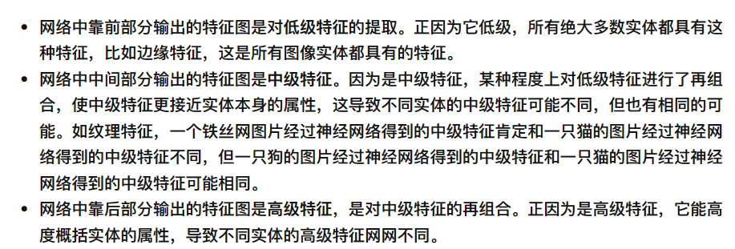
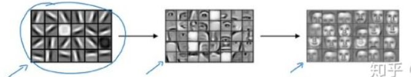

# 高级
## 为什么说深度学习可以提取特征, 靠前的神经网络层提取的是低级特征，靠后的神经网络层提取的是低级特征
以图像识别为例
其实第1个隐层也可以看作是在提取特征
他接收的数据就是最原始的一个个像素点, 其实每一个像素点都可以看作是当前图片的一个特征，它们加在一起才构成了这个图片所表达的小猫或小狗

只是第1层拿到的是所有像素点, 它需要给所有像素点都分配一个权重
并且使用权重和像素点进行线性组合得到一个值z
这个z当中就综合了所有像素点的信息

就好像说: 你要评判一个人的身材好不好，你拿到了他的身高数据和体重数据，现在你给身高和体重分别身高体重线性组合计算出来一个综合值z, 这个z当中就浓缩了身高和体重的信息, 可能通过z的值，我们就能判断这个人的身材好不好

当然现实情况中，z还要通过非线性激活函数得到a

那么来看神经网络中的第2层: 他获取的输入就是第1层的输出
而第1层的每一个输出的a都浓缩了所有像素点的信息, 并且赋予了自己所理解的权重
所以第2层的抽象程度就更高, 不妨说他抽取的是中层特征: 他拿到的是经过第1层判断之后的底层特征，并且对这些底层特征再次赋予权重进行综合, 并且随着权重的调整，它这种综合就是正确的. 所以它得到的就是从底层特征中获取到的高层特征

所以有的人也把神经网络叫做特征网络
⭐ 或者有人说，其实神经网络一层一层的，就是在提取原来数据的降维后的向量表达, 降维就是从低级特征来提取高级特征
TODO: 那岂不是说神经网络中的每一层所包含的神经元都应该比前一层少吗
而且确实有人建议神经元的个数随着层数深度的增加而递减
并且不建议一下子就降低太多，因为可能神经元没有那么大的能力，一下子将多个低级特征浓缩成少数的几个高级特征

而这种神经网络层数越靠前提取的特征越低级，层数越靠后提取的特征越高级的特性, 也是迁移学习的基础

一般来说提取的特征都会表示为1个向量

这大概就是特征提取的直观解释
在图像识别中第1层可能在提取一些边缘, 线条, 这些低级特征
最后一层就是在组合人脸的特征了

个人理解神经网络可以提取数据的特征，有一个非常重要的前提就是随着神经网络的训练(或者你就直接理解为训练好之后的神经网络), 每一层的表达都是正确的. 具体来说就是每一层的权重参数都是正确的. 每一层都在当前层次上正确的代表了样本(如果他无法正确地代表样本，那最终的损失就会很大)
而从深度来理解: 随着神经网络深度的增加, 神经元个数整体上会呈现出一种下降的效果, 也就是表达的越来越抽象. 神经元个数变少，并且还能正确的代表该样本，那就只能说每个神经元提取到的都是高级特征了
而从组合的角度来说: 每一层都是对上一层所有计算结果(输出的a)的再在综合和赋予权重, 并且还能得到自己的正确判断, 或者说每一层的输出本质上都融合了图片像素点的信息和之前所有层的正确判断信息, 然后输出自己的正确判断信息. 这也有点类似于特征提取, 不断的进行抽象

所以神经网络有时也被叫做特征网络
TODO: 这里说白了还是直观理解
# %auto-expand-line-4%