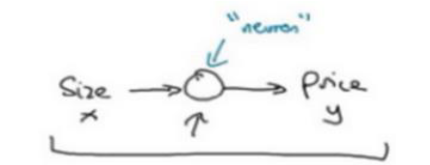

# 基础概念
## 是什么
了解一些和神经网络相关的基础概念
## 神经网络相关概念
### 前置: 结构化数据与非结构化数据
最简单的理解就是下面左侧这种表格中的非常规整的数据，就是结构化数据
非结构化数据，就是右侧那种没有固定结构, 没有固定字段的数据

一般人类强于理解非结构化数据机器强于理解结构化数据，但现在神经网络也可以处理非结构化数据

### 前置: Relu函数
它的函数图像就如黄色方框所示，一开始是平的，然后慢慢上升
或者说你也可以理解，它是从线性拟合得到的: 线性拟合得到一条斜的直线，但如果我们规定这个斜的直线不能<0: 比如拟合房价数据的时候，房子的价格就不可能<零，所以它的底端会变成一条直线

Relu:  Rectified linear Unit
Rectified: 修正, 指的就是取值不要<0

### 神经网络
#### 只有一个神经元的神经网络

以房价预测为例我们收入房子的大小，然后经过中间的圆圈: 就是一个神经元，他一般就是一个relu函数
就能输出房子的价格预测
#### 有多个神经元的神经网络
##### 感性理解
下图有多个圆圈，每个圆圈都是一个神经元
他们其实就是一个个relu函数

最左侧的一行是输入，一共是4个特征
最右侧的price是输出就是预测的结果

这个神经网络复杂在中间还有一层，该层是最左边的特征经过relu函数计算出来的
比如通过房子的大size可以计算出这个房子适合家庭的大family size
比如通过这个房子周边的富裕指数可以计算出这个房子的质量school quality

##### 事实理解
下面是一个全连接的神经网络模型，实际上中间那一层神经元被叫做隐层
可以看到每个隐层的神经元都全连接到输入层的每一个特征

所以说并不是每个隐层的神经元都有自己的独特语义: 事实上每个神经元都会有**全部的输入特征**进行计算得到

个人理解，不妨把中间隐层的神经元当做对第1层特征的抽象提取, 只是它抽象提取到的东西，人类往往无法直观理解: 这里就是从原来的4个特征抽象出三个特征
### 监督学习
视频中说现在的神经网络大多数使用监督学习的方式
就是给定的数据集是带有标签的

### 深度学习
#### 传统机器学习
深度学习算法对应的是以前学习的传统的机器学习算法: 比如线性回归, svm等

传统的机器学习算法的特点是: 
首先当时的数据量较小, 传统机器学习算法基于较小的数据量，也可以达到较好的效果
其次即便是给定很大的数据量, 传统机器学习会遇到瓶颈，也就是说它的效果不会有太多上升

这大概就是传统机器学习的曲线
横轴代表数据量 (准确来说是带有标签的数据量)
纵轴代表机器学习的性能可以简单的理解为准确率
可以看到随着数据量的上升, 它的性能并没有很大的提升

简单来说，传统机器学习既不需要大量的数据，也不适应大量的数据
#### 深度学习
而深度学习在小批量数据中效果未必好
但在大批量数据中它的效果会很好

而且神经网络规模越大就越适应大数据
下面红色的线条是传统机器学习随着数据量增长性能增长的曲线
黄色蓝色和绿色分别代表小的神经网络中型神经网络和大的神经网络, 随着数据增长其性能的增长
简而言之，大型神经网络适应大数据

注意下面的黄色方块是在说: 在面对小批量数据时，其实神经网络的效果未必优于传统机器学习算法

当代社会产生了大量的数据，当然许多时候还需要人手工给这些大数据添加标签
总而言之当我们有了大量带标签的数据之后，只要我们训练足够大的机器学习模型，就能获取足够高的准确率，或者说性能
当然训练大的机器模型除了需要更多的数据外, 也更耗时

 ⭐ 总而言之，大数据搭配大网络

#### 深度学习的算法创新
传统的深度学习正如上面所说通过大数据训练大模型达到高的性能
但最近几年也越来越注重深度学习算法层面的创新，而不再单单追求大数据
算法层面的创新，大体可以分为两类
第1: 为了加快性能
最经典的比如将激活函数从 Sigmoid修改为relu
这样就能使梯度下降法运行的更快，从而使整个模型训练的更快
( Sigmoid慢的原因是其箭头指向的两个位置梯度不明显，从而导致在这两个位置梯度下降较慢，学习也较慢)

第2: 为了减少对大数据的依赖
使得不需要那么多数据就能训练出效果很好的模型

# %auto-expand-line-46%