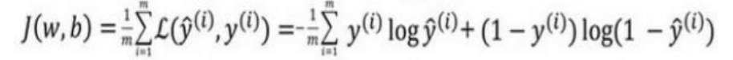
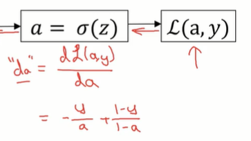

# 基础
## 是什么
此处以逻辑回归为例, 作为深度学习的入门
逻辑回归是一个典型的传统机器学习算法
# 前置概念
## 二分类问题
此处解决一个二分类问题，就是区分出一张彩色图片中，是否是小猫
是小猫的话就返回1，不是小猫的话就返回0


每一条小猫的样本数据中包含12288个特征

因为这是一张彩色图片，大小是64×64
每一个像素点都包含红绿蓝三个数值, 所以最终一张图片的特征是64×64×3个数


在将一张图片表示为1个特征向量的时候，是先将所有红色像素中的数值罗列，然后罗列绿色数值，然后罗列蓝色数值
## 符号约定
在本章课程中，我们使用如下符号约定

样本使用列向量表示
注意这和刘宇波的课程不一样，刘宇波的课程样本使用行向量表示
每个样本有n个特征
一个样本数据集当中有m个样本

样本数据集一般标记为m
有时需要对样本数据集做切分，则切分出来的训练集叫做mtrain, 测试集叫做mtest

每一列特征表示一个样本: 所以一个样本或者说一列特征，或者说一个列向量记作$x^{(1)}$, 这表示的就是第1列对应的那个样本 

整个样本矩阵表示如下

样本矩阵的大小是n行 m列, 代表一共m个样本, 每个样本n个特征

标签也表示为列向量记作Y, 它是一个一行m列的列向量
其中第1个标签记作y^(1), 它就是第1个样本的标签
# 逻辑回归
## 公式推导
### 预测函数
所以预测函数这个名字是我自己起的，其实就是要找到一个表达式: y^=..., 就是y^应当怎样计算

逻辑回归是一个分类算法
它输出的预测值标记为y^

事实上逻辑回归返回的是一个概率值，我们希望如果图片中是一只小猫的话，预测的y^尽可能输出为1

训练逻辑回归模型的过程就是在每一个样本特征前面添加权重w的过程
因为逻辑回归当中的每个样本有n个特征，所以权重向量w也有n个分量

权重向量w也记作列向量, w^T是行向量

此外我们还需要一个b, 代表一个偏置
最终线性回归模型的表达式是，注意这是针对单个样本的： $\hat{y} = w^Tx + b$
x是一个列向量, 代表一个样本的特征
w是权重列向量，此处将它转置为1个行向量
所以w^T乘x得到的就是一个数值，该数值+偏置b得到的就是y^  

不过此时得到的预测值y^并不是一个概率，我们需要让其通过sigmoid的函数将其变为0~1之间的概率值
这个在逻辑回归章节已经讲过


上面的图片中还说，有的时候w^Tx+b (前面说过，这其实就是线性回归得到的一个数值), 有时也被直接标记为z

当z非常大的时候，通过sigmoid的函数之后，得到的概率就会接近一, 当z非常小的时候经过sigmoid函数，得到的概率值就会非常接近0

在别的机器学习课程中，你可能会见过，将权重w和偏置b写成一个统一的向量θ的(在刘宇波的课程中就是如此)，就是上下摞在一起而已


但在神经网络当中，我们最好将下w和b分开来写, 故此处不用那种写法

对逻辑回归模型来说，训练的目的就是寻找w和b，或者说就是寻找上面的θ
要做这个寻找需要定义损失函数
### 损失函数与代价函数
#### 目标
现在我们已知的内容是
黄色这一行是预测函数，它将计算出来一个y^
我们希望的，是通过给定的训练数据集，能让我们预测出来的y^，尽可能的 = 真值y


如果我们预测出来的y^和真值y之间有差距
训练的过程就是让这之间的差距尽可能的小
#### 损失函数 (不好用)
其实想要衡量y^和y之间的差距
可以随意定义一个如下函数

该值越大，则误差越大

但该函数是非凸的，它会出现多个局部最优解，不适合使用梯度下降法进行求解
所以对于梯度下降法而言，这不是一个好的损失函数

我们需要一个凸函数
#### 损失函数 L


要理解为什么该函数是有用的，我们先补充一下-LoG函数的图像
可以看到当x越小, y就越大，当x越大, y就越小

事实上我们只需要取用上述图像的左半段, 也就是y>0的那半段

因为我们输入的x值其实就是y^, 他会始终在0~1之间（因为y^经过了sigmoid函数）, 此时对应的Y值也就是损失量L，会始终>=0
所以这里计算出来的损失量L是始终>=0的

再来看这个损失函数

这个函数实际上根据y=0还是 = 1，大体上是分为黄色和绿色两部分运作的


#### 损失函数: 补充推导
就是为什么要使用上面这个函数作为损失函数


从概率论的角度，
如果我们**约定**y^表示的是输出 = 1的概率

则y^本质上是给定一个样本x, 在当前前提下y=1的概率


换句话说就是
随便选择一个样本, 该样本为1的概率就是y^, 该样本为0的概率就是1-y^ (这是根据我们的约定得到的)


上面两个公式可以合成为下面这一个公式

我们假设给定一个样本x, 它的分类是y=1的概率. 也就是将y=1代入到上面的式子
p(1|x) = (y^)^1  ((1-y^)^0)
上面的式子中出现了1次方和0次方
1次方得到的还是原来的式子本身
0次方得到1
所以上面的式子计算出来 = p(1|x) = y^ * 1 = y^
这就是我们想要的呀:


代入0也是满足的，此处不再演示

TODO: 没看懂
为什么要最大化p(y|x)呢, 这个函数计算出来的是个啥


#### 代价函数 J
代价函数也叫做cost函数一般记作英文字母J
前面的损失函数其实仅仅用于衡量单个样本的损失
而代价函数j用于衡量所有样本的损失之和


逻辑回归模型训练的目标，或者说好多机器学习算法训练的目标，就是使代价函数带最最小

注意代价函数前面还有个1/m，所以它本质上是所有损失的求和再求平均，这样损失值不会受到样本数量m的影响
#### 总结 ⭐⭐⭐
我们给出了3个函数
1是预测函数，用于计算y^，它由w、b计算出来，会通过sigmoid函数变为0~1直接的预测值


2是损失函数L，用于计算单个样本的预测值y^和y之间的差距


3是代价函数J，用于计算所有样本所示的求和，其标志是会含有一个∑符号


## 训练推导 (梯度下降)
### 目标:  代价函数j最小

现在我们有了预测函数和代价函数

接下来我们要训练模型，训练模型的目标就是使代价函数j的值尽可能的
而j的值本质上是由y^决定的, 而y^又是由w和b决定的

所以训练的本质目的寻找w和b

这里给定的代价函数是一个凸函数，它有全局唯一的最小值，所以适合使用梯度下降法进行训练
### 方法: 梯度下降法
#### 原理
假设我们的权重向量w当中只有一个分量 (这里是为了方便绘图才做此假设)
或者说样本只有一个特征

然后我们还有一个偏置b

最终的损失函数j由w和b共同决定

则j, w和b可以构成一个二元函数会置在三维坐标系中
又因为j是一个凸函数，它只有一个全局最小值，所以损失函数绘制出来如下


给定一个w和一个b, 就确定了wob平面上的一个坐标点，该坐标点(w,b)对应的该空间曲面上的一个j值, 就是当前取值(w,b)下的损失值

我们需要的是j值最小, 就是找到上图空间曲面中的最低谷的值
这可以使用梯度下降法来解决

因为梯度向量始终指向该空间曲面上升最快的方向, 所以我们反着梯度向量的方向走，就是下降最快的方向
然后给定一个走的步伐，也就是学习率，我们就能慢慢走到最低谷

再说一下凸函数
视频中说凸函数的图像就像一个大碗
以二维图像为例
上面红色的就是凸函数
下面红色的就不是凸函数，图函数始终有唯一全局最小值, 所以非常适合拿来做机器学习算法的目标函数(代价函数j)
🔖 说实话我总结的它是凹的哈哈


#### 直观理解具体训练方法
首先我们要随机初始化一个坐标点w和b
该坐标点会对应一个损失值j

比如下面红色的点就是我们初始化的点
接下来计算该点的梯度向量，找到下降最快的方向, 并让红色的点沿这个方向移动
每移动1次就会更新w和b，或者说就会让红色的点到达一个新的位置

多移动几次就能找到全局最小值了, 此时对应的w和b就是我们要找的是代价函数j最小的取值. 目标达成
#### 公式推导 
##### 符号约定
学习率一般使用α表示
导数一般以d开头的变量表示，比如dw
:=表示更新一个数值

以二维空间为例, 一个梯度下降的训练公式表示如下
##### 二维梯度下降公式表示 (导数)
梯度下降的过程就是不断寻找或者说不断更新权重w的过程
下图中紫色方框 := 表示更新一个值的意思，此处是更新w
黄色方框的 - 表示要逆着梯度这里是倒数的，方向前进才能下降
绿色方框α表示的是学习率
蓝色方框表示的是导数(在多维空间中将会升格为梯度)


如此不断更新权重参数w直到损失函数j的取值最小
个人理解也可以理解为直到w所在点的导数值 = 0或无比接近于0 (无比接近于0，主要是考虑到学习率的问题，固定的步长可能是我们无法精确的走到一个导数值 = 0的点, 所以很接近零也可以停止学习了, 这个时候的w就够用了)
##### 三维梯度下降公式表示 (梯度)
到三维空间我们就需要计算梯度向量了
梯度向量的各个分量，本质上就是偏导数. 在三维空间中就是针对w的偏导数和针对b的偏导数

如果我们将权重w和偏置b看作一个统一向量θ
那我们计算出来的梯度向量t, 就可以沿着梯度向量的反方向来调整θ
当然再需要×一个学习率α, 以此来更新θ的值, 其实就是更新w和b
θ := θ - αt
上面是向量的表示方法
将其展开为各个分量的表示: 被更新的θ中，其实封装的是参数w和b, 梯度向量t中，其实封装的是偏导数
所以上式其实就是不断的通过偏导数来更新θ中的w,b两个分量


注意在本节课中，为了方便表示
比如下面是求关于b的偏导，有时也会直接简记为导数的表示方式db


同样的只有w的偏导也会简记为dw, 仅仅是表示方法


总而言之就这样使用如下公式，也就是使用梯度下降法，不断的更新参数w和b，直到损失函数j的值最小
个人理解也可以说直到某一点(w,b)的梯度向量 = 0


⭐ 现在为止我们已经推导出了真正训练的公式, 就是如上所示, 不断的寻找w和b. 但我们还需要解决: 导数和偏导要怎么求解呢这个问题, 其实也只是针对损失函数j求w偏导和b偏导而已, 本质上就是一道求偏导的数学题
### 补充: 导数
补充一些和导数偏导相关的东西
### 补充: 计算图 (正向传播和反向传播)
#### 计算图
个人理解计算图是一种将计算绘制成流程图的方式
它最大的好处是它反过来可以非常方便的进行求导，而我们使用**反向传播**就涉及到大量求导的操作
#### 正向计算图
假如我们要计算下面黄色方框这个损失函数
其实可以将它进行拆分计算, 一小步一小步的计算出来中间变量, 并最终计算出来损失值J
整个流程可以绘制成蓝色方框中的流程图: 我们代入a=5；b=3；b=2，通过该流程图就可以计算出来最终的j = 33
而该流程图反过来, 看，红色箭头也可以用于求导

#### 反向计算图: 求导
##### 是什么
计算图反着来用就可以用于求导或求偏导
从而可以实现反向传播的过程

##### 普通求导
比如还是针对上面的计算图，我们看反过来的这条红色箭头就是求j对v的偏导
这里他计算是给新手看的，我们知道j = 3v, 直接带入求导公式就知道这个导数是3
而如果要手动去算的话, 就会发现，如果v增加0.01, 则j增加0.03
导数就 = 增加量相除 = dy /dx = 0.03/0.01 = 3


##### 链式法则
接下来我们演示一下复合函数求导或者说链式法则
这里的问题是如果: a的变化会导致v怎样变化
其传导过程就是从下面的黄色方块到绿色方块再到蓝色方块

同样有两种方法，一种是使用复合函数求导法则
先计算蓝色方块的导数，也就是dv/da, 也就是a的一点变化会导致v怎样的变化
其实蓝色方框可以看作是y = x + 一个常数, 让求dy/dx. 也就是将变化的那个量看作自变量, 将u看作是一个常数, 很明显这个式子求导得到的值是1
所以a的一点变化导致v的一点变化
接下来再计算v的一点变化，导致j怎样的变化，其实前面已经算出来了，是导致j的三点变化
那使用求导的列式法则, 就可以算出来a的一点变化，导致j的3点变化


或者也可以手动去算在上图中a=5, v=11, j=33
接下来我们让a增大一点点变成5.001, 增大了0.001
则v变成11.001, 也增大了0.001, 所以a一点变化导致v一点变化(变化量相同)
则j此时变成33.003, 增大了0.003
所以a一点变化导致j3点变化

这样其实我们就可以求任意一个原始变量，a, b, c或任意一个中间变量u, v针对最终输出的J的导数了
其实就是测定任意一个输入或中间变量对最终输出结果的影响程度大小⭐
⭐ 其实就是可以测定任意一个神经元(输入层也好, 隐层也好)变化一点, 会导致最终输出变化多少. 
⭐ 当然其实也可以用于计算"会导致其之后的某个神经元变化多少", 而不一定是计算对最终输出的影响
##### 导数的变量表示
在编程中这些量abc以及中间变量uv针对最终的损失函数J或者是L的导数，一般被记作变量da, db..dv等等

就好像下面的da和dv一样，他们表示的都是当前变量针对最终的j的导数


##### 反向计算的流程
反向计算其实就是计算每个量abc以及中间变量uv针对最终的损失函数J或者是L的导数

一般从右向左计算，计算起来会更简单

计算出来每个变量对最终j的导数，就完成了一遍反向计算

TODO: 个人理解，这里的反向计算好像是依赖输入的ab和c的具体值的
你就比如说如果我们要计算b对u的导数 db/du, 其中u的表达式是u=bc, 我们将b看作是自变量，u看作是因变量, c看作是常量(整个式子约 = 是y = xc), 所以计算出来的导数应该是c, 在上图当中c=2，所以计算出来的值是2，但该值是依赖输入的c的具体值的
个人理解是: 进行**一遍**正向传播和**一遍**反向传播，在**这一遍**的过程中计算出来的结果就是依赖输入的ab和c的
### 个人理解: 正向传播和反向传播的目的 (神经元中的两个值) ⭐
说白了梯度下降还是为了解决贡献度分配问题

当我们经过一轮正向传播和反向传播，就计算出了每个变量(这里我们主要关注变量w和b)针对最终代价函数j的导数
比如计算出来w1对j的导数, 准确来说是偏导数dw1是-5
那也就意味着，如果w1变大一点, J变小五点
如果计算出来w2对j的导数, 准确来说是偏导数dw2是3
那也就意味着w2变大一点，J变大三点
注意这都是针对当前本轮传播而言
如果我们想要让j尽可能的小，也就是损失尽可能的少
我们就必须调整w和b也只能调整w和b，因为损失函数j本质上就是关于w和b的函数
调整的目标是让w1的偏导dw1 = 0
让w2的偏导dw2 = 0
让b的偏导db = 0
根据高数的知识, 此时这一个点是一个驻点, 在出函数中应该就是极小值点, 此时对应的代价函数j最小

问题是, 该怎么调整w1w2和b才能让它们对应的偏导变小, 并最终变为0呢
答案是沿着梯度相反的方向即可
w1对j的偏导数dw1是-5, 那也就意味着，如果w1变大一点, J变小五点
那我们就让w1变大, J就会变小: 偏导数是个负数, 这里我们又让w1变大, 这就是沿着梯度的反方向
这里以二维图像为例，假设红色这一点的导数是-5，那也就意味着我们沿着x轴的正方向前进一点, y值就下降5点. 所以我们要沿着正方向前进

而目标函数j又是平滑的, 它在红色这一点的导数是-5: x往前移动一格，y就下降5点, 证明红点所在的位置坡度还是很陡的
而极小值那一点是没有坡度的(导数为0)
而连续曲线的坡度变化又是平缓的: 必然是从很陡, 到不太陡，一直到没有坡度. 如果现在坡度很陡，就意味着我们离没有坡度的最小值点还比较远, 那也就意味着当红色的点往前移动的时候可以多往前移动一点点
其实也就是红色的点往前移动的比例和坡度相关, 也就是和|-5|这个绝对值相关
所以我们可以看出来计算出来w1对j的偏导数dw1=-5
这个-5的负号决定了方向，这个5决定了移动的距离
w := -α`dw`
可以看出更新w的时候, 移动的距离确实和偏导dw的值相关(当然也和学习率α相关, 不过α就是一个超参数了, 此处不做讨论)

所以反向传播，计算出来每个神经元的偏导: 其实是指明了当前神经元的移动方向和移动步伐大小⭐
比如让上面的红点往正方向还是负方向移动, 移动多少距离

可以经过一轮正向传播和反向传播
我们可以说每个神经元当中都记录了两个值
一个值是当前神经元的值，比如w1=多少, w2=多少, b=多少
另一个是当前神经元的导数值dw1, dw2, db, 它意味着接下来要如何调整w1和w2和b (其实就是像下面这张图这样调整)

调整之后才会进入下一轮正反向传播

所以正反向传播的流程可以叙述如下:
每一轮正向传播，我们都拿到了针对该轮的w和b
由此可以计算出一个预测值并最终计算出损失J
然后反向传播, 计算每个神经元的导数, 主要是w和b的导数dw和db

接下来根据编导提供的信息结合设定的学习率更新w和b
更新后的w和b会作为下一轮正反向传播的输入w和b

在有的编程实践中，一个神经元被实现为1个对象
对象中有两个属性分别是value和delta，其实记录的就是绿色的值和红色的偏导

一直训练到偏导dw = 0, 也就是意味着坡度没有了, 在凸函数中也就是意味着到达了最小值, 此时训练结束，我们得到了当前的权重和偏置w和b

↑对凸函数来说, 导数为0的点就是极小值点


如果我们将一轮训练过程(正向传播和反向传播)划分为三个步骤的话
第一, 正向传播: 根据得到的当前的w和b计算出来当前的损失j
正向传播，本质上也是包含了预测的过程
第二, 反向传播: 计算出每个神经元的具体偏导，尤其是w和b的偏导dw和db
(理解对于计算偏导, 虽然给定损失函数，我们其实就能直接求解出来其偏导的计算公式(只需要计算一遍), 但反向传播要求我们计算的是具体的偏导. 比如计算出来的偏导公式是dw1 = 2x1, 那此时就要带入具体的x1，求出一个具体的偏导. 或者说, 偏导公式虽然只需计算一遍，但代值求具体偏导，在每次反向传播中都需要进行, 所以每次反向传播都要求具体偏导)
第二, 学习: 根据当前求解出来的具体偏导和我们设定的学习率, 沿着偏导或者是说梯度的反方向进行学习, 修正w和b

使用修正的w和b进入下一轮正向传播和反向传播


再补充一点，之前我们说过, 一轮正反向传播就是
计算出来一个梯度向量t
使用梯度向量去更新权重向量θ(其中包含w和b)
其实说白了就是像上面描述的那样，使用梯度向量中的各个分量
其实就是使用各个偏导dw1, dw2, db
去更新权重向量中的各个分量，其实就是权重和偏置w1, w2, b

这就是每一轮正反向传播的目的所在
### 个人理解: 正向传播是必须的吗
这是我的一点个人理解
给定损失函数j
仔细看一下这个j会发现它本质上就是一个关于w和b的2元函数


它对应的就是一个空间曲面的图形，我们随机取一个w和b, 它就会对应一个j，比如说就是下图的红点

既然二元函数的表达式已经给出，那我们就可以计算关于w和b的偏导也就是可以计算出梯度向量
有了梯度向量，我们可以自己设定一个学习率，让红点往极小值的方向移动

这整个过程就是反向传播的过程，可见只需要反向传播的过程，我们也可以找到极小值，那为什么还需要正向传播呢

个人理解是首先正向传播的过程，本质上也是一个预测的过程，我们训练好模型终归是要执行预测
其次是反向传播过程中需要用到的一些值, 在正向传播中正好可以计算出来，正好可以拿来用，所以做正向传播也不是无用功
TODO: 其他的原因理解一下, 可以自己训练一个不进行正向传播的模型，看跑不跑得通
### 个人理解: 神经网络解决贡献度分配
紧接上一小节，我们说过
正向传播和反向传播训练的目的就是找到一组w和b, 此时他们的偏导为零，也就意味着此时的损失J最小
找到这样的一组w和b之后即停止训练，就可以拿这组参数进行预测了

我们看一下预测函数
可以看出其实训练得到的w会分别和样本的每个坐标分量相乘
y^ = w1x1 + w2x2 ... + b
并最终计算出来一个预测值y^=0或者是1


其实w就意味着当前坐标分量对目标的贡献程度
我们假设一种简单的情况，比如样本特征都是正数
我们想要的预测结果是这是一只猫

则此时, 对于坐标分量x1，如果它前面的权重系数是w1=0.2, 就意味着当前坐标分量(当前特征)和猫是正相关的, 出现了该特征，则增大了图片是一只猫的可能性
对于坐标分量x2，如果它前面的权重系数是w2=-0.7则意味着, 当前特征和猫是负相关的, 一旦出现当前特征，则它就不太可能是一只猫. 而且是非常大的负相关(至少0.7>0.2)

在图片识别中样本的每个特征x1和x2...其实就是一颗颗像素
这样我们就给每颗像素都分配了权重: 看他对最终图片是一只猫的贡献度，到底是正是负又有多大

贡献度是由权重决定的, 权重是正向反向传播训练出来的 ⭐

这很神奇: 现在一张图片上的任意一个像素点都对它是否是一只猫有着正负面影响. 反正如果让人来看是很难看出来的, 但通过这一通, 机器确实算出来了...

所以也有人说神经网络就是为了解决权重分配的问题, 比如解决每个像素点对是否是一只猫的权重贡献大小问题 ⭐
### 个人理解: 代价函数要平滑, 要凸
如果我们要使用梯度下降来训练模型, 求解权重
其实就是在一个比如空间曲面中不断求偏导，求梯度向量从而不断移动坐标点来找到全局最小值

在空间曲面的函数就是代价函数j

那首先就要求再加函数j需要是可以求偏导的, 它至少得是连续的
TODO: 应该也是平滑的
此外还要求他最好是个凸函数，这样他有全局唯一的极小值点, 使得我们的梯度下降，不会陷入到局部最小值

在平滑的凸的代价函数上, 梯度下降才能执行下去 ⭐

## 代码实现
### 是什么
前面我们近乎推导出了逻辑回归算法中要用到的各种公式和计算方法
此处具体实现
### 针对一个样本: 逻辑回归中的正向传播
此处以损失函数l为例

黄色部分是预测函数
绿色部分是单个样本的损失

此处我们用计算图的方式，从左到右计算出单个样本的损失，这就是1次正向传播
为此我们需要拿到样本的特征x1和x2，这里假定样本有两个特征
以及和x1和x2匹配的权重w1和w2以及偏置b
整个运算就可以跑通了

注意黄色部分当中的第2行y^，在此处也被标记为a，它是一个概率值在0~1之间
而绿色部分的l，这是一个关于概率值a和真值y的函数
### 针对一个样本: 逻辑回归中的反向传播 (梯度下降)
接下来我们计算反向传播
假定我们的权重参数w1和w2是随机给定的
则此时的损失函数应当会很大，因为此次预测约 = 瞎猜

经过正向传播我们得到了此次预测的损失l的具体数值
此时开始计算，反向传播看看: 之前的各个方块变化一点点, 会让损失值变化多少

反向传播是反过来计算的，我们先计算a(这个a其实就是y^)变化一点点会导致损失，l变化多少
求出来就是最后一行的那个红色表达式

个人理解上面求解出来的结果中包含a和y东这两个都是可以计算出来的，相当于是常量数值，所以这里计算出来的da也是一个普通数值

再往前求一小点
我们看一下z变化一点点，会导致最终的l变化多少

其推导部分是下面的绿色方块，最终结果是绿色方块当中的黄色方块
注意我们这里求解的是z变化一点点，l会变化多少，也就是dl/dz
这里显然要使用链式法则来求导 = da/dz * dL/da
也就是先计算z变化一点点，a会怎样变化(这个其实就是对sigmoid的函数求导)，然后a变化一点点，l会怎样变化(这个其实已经求解出来了)
最终让两个结果相乘得到的就是黄色方块


再往前走一步，我们需要计算W1变化一点点会导致最终的损失l变化多少
以及w2变化一点点会导致l变化多少
以及偏置b变化一点，会导致l怎样变化

计算出来结果如下


后面本质上也遵循链式求导法则
最终计算出来的结果中，包含x1以及dz
dz前面已经计算出来了，是一个常数值，x1也是一个已知量，所以确实是可以求解出来的具体值的

从变化率的角度而言
此时我们已经求解出了，在本轮正向和反向传播中, w1, w2, z, a...等各个变量变化一点点会导致最终的损失l变化多少

从梯度下降的角度而言:
当我们最终求解出dw1和dw2和db的时候，他们都是相对于L而言的, 比如dw一本质上就是dL/dw1, 所以这本质上就是损失函数L(w1, w2, b)的三个偏导数，这三个偏导数放在一块就形成了梯度向量
为了让最终损失l变小，我们就可以按照指定的学习率来调整W1, w2和b

问题是: 我们不应当计算最终的代价函数j的偏导吗为什么这里计算的是损失函数l的偏导
视频中说这一小节仅仅是演示针对一个样本进行梯度下降，使其最终损失尽可能的小
所以使用的损失函数是l
下一小节会针对m个样本进行梯度，下降那时使用的就是代价函数j了


### 针对多个样本: 逻辑回归中的正向传播和反向传播
#### 针对一个样本和针对多个样本的不同
是个人理解

不管是数据集中有几个样本，其实我们最终训练出来的只有一个w1一个w2...以及一个b
如果针对一个样本进行训练, 其实我们通过不断的调整w1和w2和b，是可能让其损失为0的，此时模型就过拟合了这一个样子
但针对多个样本进行训练，又只能求出一组w1, w2和b. 那就意味着对于任何一个样本进行预测的时候，都是代入相同的w1w2和b. 则各个样本的预测结果的损失可能或大或小, 我们追求的是损失之和的最小
所以这样: 使用训练出来的这一组w1w2和b去预测样本，并不一定每一个样本都能预测正确: 有的样本预测结果好有的样本预测结果坏，不过这同时也减少了过拟和
#### 原理分析
其实就是将最后的损失函数从l变化成代价函数j


然后在一轮反向传播中通过计算图计算出来j相对于w1w2和b的偏导
这里我们是假设样本只有两个特征，所以权重参数也是只有w1和w2
这是计算w1

计算的偏导组合成梯度向量，然后进行梯度下降

注意再针对代价函数j求偏导的时候，视频中给出如下公式
左边绿色的就是针对代价函数J求偏导, 视频中并没有重新去推导他的计算方法，而是给出如下公式, 它就 = 之后的部分
 = 之后的黄色部分，本质上就是前面我们针对损失函数l求偏导
 而 = 之后的整个部分，本质上就是对l的偏导进行求和，再除以m
TODO: 该算法的合理性


#### 代码实现
##### 伪码分析
下面是伪码分析

我们先看前半部分
黄色部分是在随机初始化向量，包括损失和权重w和偏置b
损失一定初始化为0，因为现在我们还没有做任何预测，也就还没有任何损失
权重参数和偏置，一般初始化为零，当然也可以随机初始化

background
methods
results
conclusion

绿色部分是对每一条样本进行循环计算
蓝色部分是计算出当前样本的预测值，y^，也标记为a
紫色部分是代入损失函数L, 计算出本次预测的y^，或者说a和真值y之间的差距
因为此时我们的权重参数w和偏置b是随机初始化的，所以差距(损失)一定很大
然后将这个损失添加到代价J当中去
到现在已经完成了正向传播的过程


接下来看反向传播的过程，反向传播就是求导并且求导公式，我们已经推出来过了，所以可以直接计算, 就是下面这样
注意其计算过程，就如前面我们分析的一样，是在不断对损失函数l的偏导求和，最终再除以m(除以m的代码在后面)
其实下面的这几行代码应当写在循环当中(此时会形成双层for循环)，因为我们样本的特征可能有很多的话，但在这里只有两个特征，所以我们就不写循环了


这就是最终让代价J和偏导都除以m(具体参见上一小节原理分析)
注意下面两行代码，在for循环的外面, 或者说下面我们的分析都是在for循环之后进行的

⭐ 还有个人理解，上面对当前批次的训练样本的dw，dz，db在进行求和，（看上面使用的是+=），这里有除以样本个数，这就相当于把当前批次的训练样本，当做一个样本看待，或者说相当于把当前批次样本当做一个整体看待，求其偏导，是在拟合当前批次训练样本的整体。而不是单独一次次的去拟合某一个

接下来使用梯度下降原理，更新w和b


这样就完成了一轮训练，此时我们已经更新了w1和w2和b
因为我们学习率的设定此时的w和b相对原来可能效果仅仅是稍好一些

利用修正之后的w和b可以进行第2轮循环训练, 得到的w和b会更好一些...
一直训练到梯度降无可降
##### 代码实现


```python
J=0;dw1=0;dw2=0;db=0;
for i = 1 to m
    z(i) = wx(i)+b;
    a(i) = sigmoid(z(i));
    J += -[y(i)log(a(i))+(1-y(i)）log(1-a(i));
    dz(i) = a(i)-y(i);
    dw1 += x1(i)dz(i);
    dw2 += x2(i)dz(i);
    db += dz(i);
J/= m;
dw1/= m;
dw2/= m;
db/= m;
w=w-alpha*dw
b=b-alpha*db
```


## 向量化
### 是什么
前面我们说过
再进行一轮正向传播和反向传播的过程中
需要写双层for循环它的效率较低
此时我们可以使用向量化来加快运行效率
### 原理
以预测函数为例

如果我们自己计算，可能要写for循环的好，但我们还可以调用np是中提供的向量化计算能力来加快运算


速度可能会提高几百倍

这背后的原理是使用GPU或CPU进行并行化处理
并行化处理的指令叫做simd指令, 它可以用一个指令来处理多维数据
相对来说GPU更加擅长做这样的并行化处理，但CPU也可以
一般来说如果没有经过特殊处理，则我们在 Jupiter notebook中调用np.这样的指令是使用CPU完成并行化处理

⭐ 尽量避免使用for循环来处理大量数据，而是使用np当中的内置函数来向量化处理 

 nP当中相关的向量化计算函数，还有比如


### 向量化逻辑回归
#### 改造一轮训练当中可改造的部分
这是逻辑回归一轮训练的代码，包含正向传播反向传播


首先我们改造for循环当中的代码
下面绿色的叉号被改造成了右边的向量化运算, 一共改造了三处


#### 改造正向传播
对于最外层的for循环的改造: 
在最外层的for循环当中，我们首先执行的是对每一个样本的正向传播, 其实就是预测
针对每一个样本都要执行这些函数
这里是演示对前三个样本执行


其实整个计算可以向量化

首先将所有样本写到一个矩阵X当中，每个样本是一个列向量
然后将所有权重也写到一个列向量w当中，并将其转置
偏置b写作一个行向量
然后计算w^TX，再+偏置向量b即可, 得到的就是行向量z


用nP来实现的话，代码如下
注意最后我们+了一个实数b，但是np为了让b可以和前面的向量进行运算，这个b会被自动拓展为1个向量
这是Python当中的广播机制


这里得到的z还要传给sigmoid函数，将它们变成概率:
我们可以直接将得到的z向量传进sigmoid函数当中，它也会返回一个向量 


这样只使用两行代码，我们就完成了所有样本正向传播的过程
#### 改造反向传播

首先我们实现这个dz计算的向量化改造

我们可以将计算结果所有dz, 封装在一个dZ的行向量当中

然后定义如下两个向量

用两个向量相减即可


接下来改造dw, db的运算

 db比较简单，看前面for循环的代码，它就 = 每个样本的db，求出来求和再除以m


 dw的计算则可以用下面绿色这一行实现
下面则是对这一行代码的分析，它最终将得到一个n行一列的向量


#### 总结代码实现 ⭐
这就是向量化的一轮训练
包括正向传播反向传播和进行1次学习

蓝色部分是正向传播或者说预测
红色部分是反向传播或者说求偏的
绿色部分是学习更新w和b


不过这仅仅是一轮训练或者说一轮梯度下降学习
为了将我们的模型调教到最佳状态，可能需要进行许多轮这样的梯度下降学习
这个还是需要for循环来完成: 包裹在上面代码的最外层
# %auto-expand-line-566%