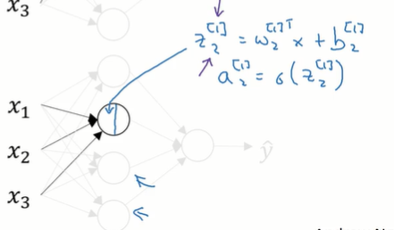

# 基础
## 是什么
# 浅层神经网络(Shallow neural networks) `2层神经网络`
## 从逻辑回归到神经网络
### 正向传播 (直观印象)
这是以前我们学习的逻辑回归模型

输入样本特征x以及权重和偏置w和b先经过黄色方框计算出来一个数值，然后经过绿色方框，也就是sigmoid函数，计算出来一个概率

而在神经网络中每一个神经元都封装了上面的黄色和绿色两个操作

比如对于下图，每一个圆形代表一个神经元

每个神经元中都封装了如下两步操作
第1步是接收到样本特征x权重，w和偏置b计算出来z
然后将z传给sigmoid函数计算出来a
注意是每个神经元都包含这两步，先留下该直观印象

上面突然多的[1]这种形式的角标，也就是方括号中加一个数字代表这是第几层的神经网络，比如[1]代表当前这个数值归属于第1层神经网络
要和样本的角标相区分，样本的角标是: (1), 这代表数据中的第1个样本

在经过所有神经元之后会计算损失函数L

先留下该直观印象
### 反向传播 (直观印象)
反向传播就是针对该计算图，反过来求偏导数

## 神经网络的表示
### 2层神经网络

这个神经网络包含3层
但它被叫做2层神经网络
因为输入层一般不算作一层，输入层的角标对应的也是0
从第1个隐层开始对应的角标才是1

第0层是输入层，用于输入样本的特征x
第1层是隐藏层, 之所以叫做隐藏层，是因为这些数据是神经网络计算出来的，他们在我们输入的原本样本数据中无法看到
第2层是输出层，第2层的输出值就是y^
### 输入 a[1]
我们介绍一种新的符号
注意这里a的上标是中括号，它代表当前这个a属于哪一层神经网络，如果它 = 0就代表它是输入层，如果它 = 一就代表它是第1层隐层...

而a本身的语义就是当前层的输入
我们知道神经网络中每一层都会接受一定的输入并产出一定的输出，这些输入就用a表示

输入层的输入就是a[0], 而我们还知道输入层其实输入的就是样本特征，它也可以用x来表示, 所以a[0] = x

当然每一层的输入不止一个, 所以看紫色方块每一层的输入整体上是一个列向量，它添加一个上角标[1]
该列向量的每个分量可以使用一个下角标1表示

也有许多时候输出层输出的就是一个实数，它也被标记为a[2]这种形式, 这里是因为第2层就是输出层

### 权重和偏置w[1] b[1]
前面我们还知道每个神经元在计算的过程中都需要属于自己的权重w和偏置b
比如看上图绿色部分，它指的就是中间这个隐层的权重和偏置

对于中间隐藏的每一个神经元，它都需要三个w, 分别来为x1x2x3分配权重
这个权重会作为1个行向量进入在权重矩阵w[i]中
TODO: 这里到底是列向量还是行向量

而隐藏一共有4个神经元, 所以权重矩阵中一共有4个行向量 ⭐
一定要记住这里的w矩阵的行和列都表示什么: 有4个神经元，所以有4行
或者说每个神经元的权重w会被存储为1行 ⭐ 所以有4个神经元就被存储为4行

黄色部分对应的则是最后的输出层的权重和偏置
输出层一共接收4个输入，这4个输入就是中间隐藏的输出
针对这4个输入就需要4个权重w, 这个w记做一个列向量就是一行4列的列向量

这里只需要一个b，所以这里的b可以看作是一个常数
## 神经网络的训练
### 正向传播
#### 总体描述
一个2层神经网络的运行，本质上就是多次重复逻辑回归的运行过程
我们先看单个神经元

前面说过，它封装了两个操作，分别是计算出来z, 并将z代入sigmoid函数，计算出来一个概率a
最终它将输出一个预测值y^，该预测值将作为下层神经元的输入

每个神经元的计算都需要上一层的收入x，有时也叫做a, 是一个向量
权重w, 是一个向量
偏置b, 是一个数值

最终整体神经元将会输出一个新的y^就是我们的预测结果
#### 第1层隐层
比如计算第1层的第1个神经元
注意下面这些变量都带有一个上角标[1]表示这是第1层隐层
都带有一个下角标1，表示这是第1层1层的第1个神经元

每个神经元都执行了两步计算，分别计算出来z和a
他们拿到的x就是上一层输入的样本特征
他们拿到的w和b都是随机数

计算第2个神经元也是如此
个人理解，他拿到的x和第1个神经元拿到的**一样**，但他的w和b是属于自己的随机数

隐藏中的整体计算如下
就是计算每一个神经元
个人理解，这基本上算是进行了逻辑回归的正向传播: 进行4次，因为有4个神经元

上面4个式子可以用向量化计算表示 (下面仅仅计算了z, 没有计算a)

也可以表示为下面这种

这里从左到右的向量和矩阵也可以简写为
z[1], w[1], b[1]
代表他们都是第1层的权重偏置和计算出来的z

当然上面这仅仅是求出来了z，我们还要将他们再带入到sigmoid函数，求出来a
其实就是红色字体，我们直接将计算出来的z[1]传递给sigmoid函数即可, 得到的就是a[1]

整个第1层隐层的计算可以表达为如下两个式子

其中x就是输入的样本特征，w,b都是随机出来的

前面我们说过样本特征x其实也可以标记为a[0]
则上式也可以表示为

#### 第2层输出层
第2层输出层的整体计算也是如下两个公式
其中的a[1]就是从第1层隐层拿到的输出, 它会作为第2层的输入
其他的w和b都是随机出来的

其最终计算结果，输出的a[2]，其实就是我们对当前样本的预测值y^
#### 多样本, 向量化
##### 多样本, 非向量化
前面其实描述的是给定一个样本，将其样本特征x输入到神经网络中，走一轮正向传播最终得到一个预测值，y^

其实我们可以将所有样本矩阵都传进去，最终得到一个预测向量y^, 也就是进行向量化运算

这是上一小节我们推导出的内容
就是给定一个样本，经过神经网络两层的运算，得到一个预测，值y^
每层都计算出来z和a

我们也可以对m个样本进行for循环依次传入，上述过程中得出每一个样本的预测值y^

每个样本的计算结果被标记为上角标a[2]( i)

运算的伪代码如下
其中每一个黄色方块都是一个样本的特征
每个绿色方块都是当前这个样本的预测结果

##### 多样本, 向量化

首先我们将所有的样本都存储为列向量，存在一个矩阵当中

然后将这个样本矩阵X传入到公式中即可

看左边的Z和A, 也改成了大写的形式代表此时他们计算出来的都是矩阵或向量
比如最终的A[2]就是每个样本的预测值, 存储为向量的形式

而再看一下Z[1], 它指的就是第1层隐层计算出来的Z的值封装起来, 它其实是一个矩阵
我们知道每一个神经元针对每一个样本数据会计算出来一个z
多个神经元针对当前这个样本会计算出来一个列向量Z(所以下面的一列向量，你不妨就看作是一列神经元, 看成一列圆圈落在一起)
而我们有多个样本，所以最终计算出来会是多个列向量封张成一个矩阵 (第1列是对第1个样本的预测，第2列是对第2个样本的预测, 第几个样本其实都写在(2)这样的角标当中)

那自然的A[1]也是一个矩阵
比如下面第1列代表的就是针对第1个样本各个神经元的a值
比如下面第2列代表的就是针对第2个样本各个神经元的a值

不过Z[2]和A[2]就是行向量了 (个人理解是行向量)
A[2]就是行向量, 就是最终的预测结果，向量每个分量都是一个样本的预测结果

这是隐层矩阵化计算Z的公式, 注意这里，没有考虑偏置b

总而言之，最后批量向量化计算的公式就是

它整体上就 = 之前非向量化计算的如下循环

### 激活函数 ⭐
#### 不同种类
#####  sigmoid函数
在上面正向传播的过程中，我们一直使用的都是sigmoid函数
但它的效果未必是最好的

事实上, 此处也可以使用别的激活函数
##### tanh激活函数

它本质上就是sigmoid函数向下平移
这是sigmoid函数

这是tanh激活函数

它会将-∞到正，无穷之间的数值映射到-1~1之间
视频中说它效果之所以好，是因为它的中心y是0
TODO: 不应当是映射为1个概率吗怎么可以映射为-1~1之间呢

视频中说在隐藏当中使用tanh激活函数的效果，几乎总好于sigmoid函数
所以在隐藏中我们更经常使用tanh激活函数

但最后的输出层因为我们要输出一个0~1之间的概率，所以还是使用sigmoid函数啊
黄色部分隐层使用tanh激活函数
绿色部分输出层使用sigmoid函数

#####  sigmoid函数和tanh激活函数的缺点 
这两个函数的图像是一样的, 只是略有上下平移
我们知道在反向传播的过程中, 针对计算图，我们要计算各个式子的偏导数

比如说我们要计算dl/dz, 也就是z变化一点点，l变化多少
整个传导过程是: z一变化一点点，a会变化小变化一点点，l会变化, 所以这个计算要遵循链式法则
dl/dz = da/dz * dl/da

但如果我们中间使用的是sigmoid函数, 就会出现问题
如果z非常大或非常小的话
比如z非常大，对应的就是下图的绿色方块

此时z变化非常大，也就是横轴变化非常大的时候. a的变化并不大, 也就是纵轴变化并不大
此时的导数da/dz ≈ 0, 非常非常的平
他就会使得最终计算出来的 偏导 dl/dz = `da/dz` * dl/da 非常非常的小, 因为其中的加重的部分非常接近于0，所以式子整体也非常接近于0
而我们又需要根据最终计算出来的偏导dl/dz, 来调整z
偏导的正负号决定调整z的方向，偏导的大小决定调整z的幅度
但这里计算出来的偏导大小始终非常小, 导致每次调整的幅度也会很小
那也就意味着每次学习, z都移动的很慢, 可能要很久才能移动到理想的位置，它会拖慢梯度下降的效率

 Relu激活函数可以解决该问题
##### relu激活函数
该函数直接就是在传入的z和0之间取最大值，也就是如果a<0, 最终的计算结果就 = 0. 如果Z>0，最终的计算结果就还是z本身

右边的斜线始终是一个45度的斜线, 所以它的导数始终是一
左边的直线的导数始终是0

注意该图像在x=0处，由于有一个折角，所以它是无法求导的. 但也仅仅是这一个间断点而已，首先我们很难完全来到该间断点
其次是来到该间断点之后，我们也可以手动设置此时的导数 = 0或者1(也就是从 = 左导数或 = 右导数当中选取一个)
这样这个函数通篇都是可导的了(当然是经过我们的处理之后)
就不会出现梯度下降进行不下去的情况

它的好处是不同的z对应的不同的a之间差异明显
在w → z → a → l
这个传导的过程中比如求w对l的偏导，其实就需要中间各个相邻变量之间求导，最后使用链式法则才能求出来
最终根据求出来的偏导的方向和大小调整w
我们当然希望每次调整w之后 得到的偏导dl/dw都会显著变1些, 也就是最终的损失会显著变1些
这就需要我们调整w是赖以参考的偏导dl/dw具有指导性: 按照它的大小进行调节时, 调节的幅度刚刚好
使用relu函数可以保证z→a这个求导环节不会陷入长期≈0的泥潭(就像sigmoid函数那样), 如果这个环节求导长期约 = 0, dl/dw就会长期约 = 0, 就会使得学习的步伐非常的小, w变化非常的小, z变化也非常的小, 可能很久都无法调整到我们想要的w

这是我的个人理解, 下面也是个人理解
假定1次正向传播，我们得到了w=2, b=3
然后往下走一步，求出来z = 99999, 这个数值非常大，带入到 sigmoid函数求出来概率值 = 0.999
假如此时y的真值是0, 那我们预测值0.999和0之间差距非常大，就造成了非常大的损失, 所以我们就需要反向传播来调整w和b
比如调整w
就需要计算w对l的偏导dl/dw, 它 = dz/dw * da/dz * dl/da
我们单看其中的da/dz, 前面我们分析过，因为此时z非常的大, 他跑到了sigmoid函数的很平整的部分, 比如下面绿色方块所示的部分
此时计算出来该导数≈0  

他就会拖累dl/dw = dz/dw * da/dz * dl/da这个整体, 使得最终计算出来的dl/dw也≈0
这样计算出来了偏导，虽然偏导的方向是正确的
但偏导的数值非常小导致w只能调整一个非常小的步伐
假如调整之后的w = 1.9, b还是3
再进行1次正向传播
此时算出来的z = 99998
此时算出来的a = 0.98, 好家伙，虽然比原来好了一点，但造成的损失还是非常大
比如我们希望z能够某刻跑到比如-30000, 这样计算出来的a才≈0.17, 才和真值y等与零相差不大，损失才不大
按这个学习效率z从99998跑到-30000, 不知道要跑多久

如果将激活函数改成relu就没有这个问题了, 起码计算出来的偏导dl/dw不会被拖累到始终≈0
##### relu激活函数变种: leaky relu
这个叫做带泄露的relu
当传入的z<0时, 通过该函数计算出来的a也会<0
看左边的图像，它在慢慢的跑到y轴以下, 只是非常平缓

它的公式是这样的，也就是在下面两个值当中选择最大值

其中0.01是个经验值
##### 结论: 使用哪种激活函数
现在的神经网络模型隐层的激活函数一般选用ill
如果是二分类任务，则输出层的激活函数一般选择sigmoid, 将最终结果映射为0~1之间的一个概率
##### 激活函数的导数
###### 是什么
在反向传播的过程中，我们需要对激活函数求导(准确来说是在链式法则中需要对激活函数求导)
这里给出4种激活函数的导数
###### sigmoid

 sigmoid函数

你可以看到它求出来的导数当中包含该公式(g(z))本身

我们可以验证一下，当传入较大的值和较小的值时，根据上图可以看出其导数应当非常接近于0, 验证也确实如此
下面还验证了，当横轴 = 0的时候，对应的导数是1/4

这个导数公式还可以写成下面这个样子
看第1行，它其实就是在说以后我们的激活函数首先用g表示
之前激活函数都使用符号σ, tanh, relu, 这种来表示，但因为接下来我们的激活函数可能是三者当中选择的某一个，所以这里要找到一个更抽象的符号就使用g代表激活函数

而将之前计算的z传入到激活函数中得到的就是一个概率值或者说经过激活函数激活之后的值记作a
而上面我们的求导也可以看绿色方块: 标记为'的形式, 它表示的就是z发生一点点变化，则a发生多少变化
可以根据等式看出这个式子的计算结果，其实和a相关

###### tanh

 Tanh本身的表达式如下

它的导数计算公式如下
可以看出它的导数计算公式, 也包含它原本的公式本身

我们也可以验证一下，当z值很大的时候，对应的导数就会非常偏向于0
然后当z = 0的时候，此时的导数 = 1

###### relu, leaky relu

我们先来看relu函数
下面是它的本身的公式和导数公式
注意其导数是一个分段函数，并且在z=0的点它是没有导数的，此时我们会规定一下这里的导数,  = 0或 = 1
使得relu函数通篇都是可导的

可泄露的relu也是如此
我们同样要规定他在d = 零点的导数

#### 为什么需要(非线性)激活函数
##### 不使用激活函数 会退化成线性回归
个人理解，其实神经网络中的激活函数已经脱离了逻辑回归中的激活函数的原本用途
逻辑回归当中引入激活函数是为了将一个值给变化到0~1之间的一个概率值
神经网络中已经不要求激活函数输出的值在0~1之间了（除了最后一层的sigmoid，其仍然起到了转换为概率的作用）

我们可以不使用激活函数
或者说叫做使用线性激活函数，或者说使用恒等激活函数，该函数的作用就是将传入的z再传输出去什么都不改变

该函数的作用就是将传入的z再传输出去，什么都不改变

此时我们得到的a本质上就 = z，本质上它就是使用权重w对样本特征x的线性组合

第1层计算出来的a会传入到第2层，但第2层本质上还是在对x做线性组合

这样一直传导到输出层之前，都是在使用w对样本特征x做线性组合, 这个计算本质上是没有意义的: 做多次线性组合和做1次线性组合并没有什么区别，或者说多次线性组合, 通过恒等变形就是能变成1次线性组合
直到最后一层将线性组合的结果输入给sigmoid函数得到y^
由于前面多次线性组合的效果就 = 1次线性组合, 这里，又将线性组合的结果输入给了sigmoid函数，则此时神经网络其实退化成了逻辑回归
##### 使用激活函数是为了引入非线性
那如果我们引入激活函数，对得到的z使用非线性激活函数计算得到a
这就引入了非线性，我们的神经网络就不会退化为逻辑回归

即便是relu函数也是一个非线性的激活函数
为什么呢，答案是，通过ReLU函数，输入的正部分保持不变，而负部分被映射为零，这就引入了非线性。使得整个神经网络，无法表达为n个线性变换的叠加

引入非线性之后，首先神经网络模型是变复杂了
TODO: 其他理由呢

### 反向传播 (梯度下降)
前面正向传播部分，我们已经计算出了各个样本的预测值，y^

此处我们需要一个代价函数j，它其实和逻辑回归中的是一样的

接下来我们要进行求导
因为在整个神经网络中，我们能调整的只有: 第1层神经网络也就是隐层神经网络的权重w和偏置b
以及第2层神经网络也就是输出层神经网络的w和b(这里是假定神经网络只有两层: 隐层和输出层)
所以我们只关心这种w和b针对最终损失j的偏导
还要注意的是第1层神经网络的w和b和第2层神经网络的w和b并不是一样的，准确来说，针对每一层神经网络, 每一个神经元我们都会为他们随机初始化自己的w和b
其向量化计算公式如下: 其实和逻辑回归当中是一样的，只是其中的w和b换成了矩阵或向量的形式

(注意上面仅仅是整体来看一下，还没有告诉你具体怎么计算每一个w,b的偏导)
在计算出偏导数之后，我们就要使用这个偏导数结合学习率来更新我们的w和b了: 每个神经元的w和b都要更新
这就是更新公式，你可以将那个→看作是:= 
其中a就是学习率

下面我们讲解其中的单个的dw和db是怎么求解的
我们先回顾一下逻辑回归的反向传播，也就是计算偏导是怎么计算的

这里把公式又列了一遍，简而言之就是求解w，b，z和a对l的偏导或导数

先看一下两层神经网络的整体计算模型
这里绿色部分是第1层也就是隐层
黄色部分是第2层，也就是输出层
注意，在后面还连着一个损失函数l
还要注意第1层的参数，w和b和第2层的w和b是彼此独立的, 都是随机出来的
而且下面的运算本质上是向量运算，它包含了每层的每个神经元的运算，简写成了这种向量形式

虽然我们实质上只能调整w和b，我们实质上也只关心dw和db这两种偏导，但根据计算图的规则，我们需要从后往前计算，所以下面的红色字体这些导数都要计算

我们先来看da[2]
a[2]其实就是我们预测的结果
da[2]就是计算输出层神经元的偏导

在逻辑回归章节针对单个样本的预测结果计算偏导如下

而此处是针对一组预测结果计算偏导, 无非是将上面偏导的计算结果封装为1个向量即可

接下来看dz[2]
其实就是输出层z一点变化导致l变化多少
还是先回逻辑回归章节看一下，发现逻辑回归章节当中的dz = a - y, 也就是预测值-真值
不过这求出来的是一个样本的dz

此处在神经网络中，我们要计算多个样本的dz, 并封装为1个向量
所以计算公式就 = A[2] -Y, 其实还是让预测值-真值，只是写成向量的形式
A[2]这个向量中封装的就是预测值, Y这个向量中封装的就是真值

接下来我们看dw2

它指的就是w的一点变化导致l怎样变化
我们不妨先看一个样本的, 并且先看w的变化引发z怎样的变化, 此时的公式是: z = Wx + b
我们不妨假设样本当中有两个特征，x1和x2，则w当中也有两个分量，w1和w2
则原来的式子变成z = w1x1 + w2x2 + b
我们分别计算dw1和dw2, 其实就是求两个偏导
这和逻辑回归章节就一样了，可以计算出来dw1和dw2

计算出来结果如下

但要注意，在神经网络当中拿到的输入并不直接是样本特征x1和x2
而是上一层隐层输出的a1和a2
所以上式需要修改为dw1 = a1dz, dw2 = a2dz

反正针对多个样本计算出来的dW2就是：

A1就是上一层隐层的输出
dz[2]前面已经求解过了

而在逻辑回归中，db就 = dz
在这里也是如此，只是要做一下矩阵的求和再除以m，因为这里是针对多个样本计算的

接下来看第1层隐层

我们先计算da[1]
也就是第1层隐层输出的概率a[1]相比l的变化率
计算它的时候同样要用到面试法则 = 激活函数的导数 * dz[2] * da[2]
个人理解，他只要是一连串的式子算下去, 并且中间的各个式子都能够求导，那这里的偏导就一定能计算出来
然后求解dz[1]
下面的 * 表示对应位相乘

然后求解第1层的w和b

最后那个参数，keepdims是针对np而言的，它代表最终的计算结果始终保持为向量或矩阵，不要自动变化为MP中的数组，也就是说它的shape不要变化成(5,)这种奇葩形式

这是计算一个样本的公式

这是多个样本的计算公式

上面就是整个反向传播计算导数的过程, 以及其中的公式

个人理解
不管怎么样，我们终究能够计算出来各个变量w和b以及各中间变量，z和a的一点点变化，会导致最终的l发生怎样的变化也就是计算出来导数, (不过我们最关注的还是w和b的导数)
而神经网络可以看作是一个超级复杂的函数, 它虽然复杂，但它实际上是由一系列的线性操作和激活函数组合成的
该函数有多少个维度可以看我们当前模型中有多少个w和b
就好像二元函数可以在三维空间中表示一个空间曲面, 然后我们可以在上面取点并梯度下降，找到全局最小值那样
针对神经网络所表示的这个复杂函数(这个复杂函数应当指的就是损失函数，只是这个损失函数中融合了前面我们各种y, y^, z, a, w, b超级复杂)，我们也可以取w和b就相当于找到点，然后计算当前的梯度(也就是计算导数), 并开始下降，找到全局最小值
TODO: 注意有些教程中说神经网络的损失函数其实未必是two函数，不过我们这里先简单这样理解

或者从另一个角度神经网络代表的就是一个非常长的损失函数表达式L(w,b) = ................................................................
这个表达是非常非常长，其中有很多个w和b, 是其未知数
我们一开始给这些w和b赋予随机值, 可能预算效果并不好，所以损失会很大的话，我们的目标是调整w和b, 使得针对当前样本, 损失l可以到最小
这就成了一个最优化问题

个人理解
这里还可以直观理解一下，为什么往神经网络中添加更多的层是有效的
因为添加更多的层就意味着添加更多的w和b，也就是让最终的损失函数l或者说整个神经网络代表的函数维度更高: 一些数据在低维无法切分，在高维就可能有办法切分，我们要的只是训练出这些w,b: 你既可以当做这是在高维损失函数中找坐标点，使其损失最小. 也可以理解这是在调整各个样本分量x1x2前面的系数
简而言之就是提升到更高的维度，可能才能做切分. 比如小猫和小狗的图片在低维很难区分开来
但可能在高维他们是泾渭分明的

### 随机初始化 w, b (直观理解)
在逻辑回归中，你可以将w和b初始化为零
但是在神经网络中不能这样，它会使神经网络失效

假定如下这个神经网络
每个样本有两个特征标记为x1，x2
黄色这个数字表示的就是输入层一共有两个特征，或者说每个样本有两个特征

然后第1层隐层有两个神经元，绿色部分这个数字就是在说隐层有两个神经元
所以针对隐藏的每个神经元，我们都要初始化两个权重w1和w2
我们将[w1, w2]封张成一个行矩阵, 它表示一个神经元的权重参数
有两个神经元，则整体的第1层隐层的W矩阵一共有两行
我们将它们都初始化为0，看看会发生什么问题

同样的这里领偏置矩阵也是0

这样就完成了我们的假设, 也就是所有的w和b都初始化为0 (视频中说其实偏置矩阵初始化为0是没什么问题的，问题出在w初始化为0)

那么首先你会发现神经元当中计算出来的a1和a2他们两个会相等: 因为这两个就是由权重w×特征x+偏置b再通过激活函数得到的
现在对这两个神经元来说，他们的权重, 特征, b, 激活函数全部相同, 那最终计算出来的结果肯定也是相同的
说隐藏的两个神经元，其实在做相同的事情. 这是一种对称性

同样的对于第2层的权重我们也全部初始化为0
因为第2层只有一个神经元，所以权重矩阵只有一行
而这一行需要两个权重: w1和w2, 终于匹配他从隐层接收到的a1和a2

这样通过第2层得到损失函数, 此时损失可能很大，也可能很小，但没关系，我们接下来要进行反向传播
下面是直观理解
但因为反向传播也是依赖这些参数
所以如果原来两个神经元的w相同, 或者说这两个神经元做相同的事情
那么在反向传播中这两个神经元计算出来的偏导也是相同的，对这两个神经元所做的修正也是相同的，修正完之后这两个神经元的功能依旧是相同的

这样不管隐藏有多少个神经元，其实他们计算的东西都是相同的，都相当于只有一个神经元，没有什么太大用处
TODO: 这是直观理解，如果说将权重初始化为0会出现这种问题，那如果全部将权重初始化，唯一不会出现这种问题吗

解决办法是赋予随机权重
其实对于隐层的权重矩阵，偏置矩阵，还有输出层的隐层矩阵偏置矩阵，我们可以这样初始化
其中偏置b可以使中初始化为零
权重则要使用随机初始化, 视频中说他初始化之后再乘以0.01，是为了将权重变成很小

这是因为
如果我们使用sigmoid函数或tanh激活函数，它的图像如下

如果我们将权重w初始化的很大，那么计算出来的z就会很Z，通过上述激活函数求到的a就会很大，那它就会落到左右两端的平缓的时候区域, 此时梯度下降就会很慢
视频中说，如果使用relu的话，则w大一些没有什么问题，但如果你是在处理二分类问题，要注意输出层的w: 二分类问题输出层始终使用sigmoid函数, 它就是类似上述图形的函数，对于这种函数w仍然不能初始化的很大

但其实这里的00:01仍然是一个经验值，在不同深度的神经网络中可以选择别的值，只是说w一般保持足够小即可
# %auto-expand-line-193%