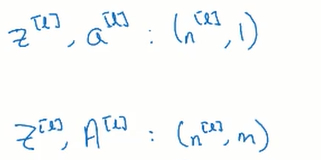

# 基础
## 是什么
前面我们学习了逻辑回归和只有一个隐藏的网络
现在我们来看有更多隐藏的网络

# 深层神经网络
## 深层神经网络基础概念
### 层数

要注意神经网络的层数是不算输入层的，像右上角
它看起来有三层，但我们将其称为二层神经网络
注意二层神经网络当中只有一个隐层，剩下的一个是输出层

所以如果是n层神经网络，那它一共有n-1层隐层, 它实际上带上输入层会有n加一层
### 符号约定
给定一个神经网络的话，我们可以说该神经网络的L = 4, 也就是该神经网络一共有4层，注意此时不包含输入层

n[1], 则表示第1层神经元的个数注意，这个第1层表示的是第1层隐层，这个n是neural的意思
有时我们也会说到n[0]这个概念: 它指的就是输入层有多少个圆圈儿，也就是一个样本有多少个特征
举例:

对于每一层神经网络他们都有自己的输出标记为a[1], 这就表示第1层隐层的输出
它本质上是通过将z[1]传入给激活函数g得到的: a[1] = g(z[1])
个人理解，这里的a[1]和z[1]都是向量
TODO: 是行向量还是列向量

每层的每个神经元都有自己的w和b
w[1], 表示的就是第1层所有神经元的权重参数，其中每层的每个神经元的权重w1，w2, w3写作一行
一层当中有几个神经元就写几行
所以w1是一个矩阵

同理b[1]: 每一行记载的是一个神经元的偏置
有几个神经元就写几行，所以它最终是一个列向量

x = a[0]: 样本特征可以记作x，也可以记作a[0]
a[l] = y^, 这表示的就是最后一层，它的输出其实就是预测值
## 训练 (前向传播，反向传播)
### 前向传播
首先许多原来学习过的东西, 需要以新的符号表示他们在深层神经网络中的位置

对于每个神经网络，它都接受一个输入，该输入其实是上一层神经网络的输出，标记为a[l-1] 

而这一层经过计算，会有一个输出，记作a[l]

计算这个输出过的过程中还会计算出中间的一些量，比如说z[l]
在计算这个输出的过程中还会用到一些额外量，比如w[l]和b[l]
视频中说这些中间量都可以被看作是缓存

从输入计算出输出的过程如下

针对一个样本计算出一层的输入和输出:

针对多个样本计算出一层的输入和输出: 注意好多字母都改成了大写的形式，代表这是针对m个样本或者说代表着是向量化操作

更工整的写成这个样子:

我们要注意这个符号A[0]和a[0]
首先它的角标代表它都是第0层的，也就是输入层的
其中a[0]代表的是一条样本, 注意是某一条样本，而不是第1条样本
A[0]代表的是所有样本，或者说我们的训练数据集, 它是一个向量
这里后面之所以带一个[0]，仅仅用于代表这两个都位于第0层输入层

这样就完成了正向传播的过程
TODO: 损失函数呢
### 反向传播
反向传播，从计算流程上来说就是计算图，反过来一步步的求导数
从另一个角度来说，它就是针对损失函数这个N维复杂函数求梯度向量dw, db, 然后进行梯度下降

其计算过程是这样
它省略了一些中间变量
下面说的是我们拿到后一层的输出比如a[3], 然后对其求偏导
注意，我们现在是位于一个神经元的最后的位置
因为我们是在反向传播，所以接下来我们要计算靠前的一个神经元a[2]
其实这个通路是这样的z[2] → a[2] → z[3] → a[3]
也就是每一层都需要先计算z，再通过激活函数计算a, 然后该层计算结束
现在下面的公式是告诉我们先计算da[3], 再计算前面的da[2]
他显然他跳步了跳过去中间的dz, 不过这无伤大雅，我们可以看懂就好
而除此之外关于这一层还有这一层相关的权重w和偏置b，更重要的是计算这两个的偏导dW[3], db[3], 这里按正向过程来说W[3]和b[3]其实用于计算出z[3], 所以如果我们可以计算出dz[3], 反过来也很容易计算dW[3], db[3]

反向传播所有导数计算公式如下
下面公式的1234, 就可以计算出我们所需的所有偏导了

写成向量化之后是这个样子

使用计算出来的偏导就可以学习调整w和b了
### 总结
我们先看正向传播的过程
这里一共有一个输入层，两个隐藏和一个输出层，注意隐藏用的激活函数是relu, 输出层使用的激活函数是sigmoid函数
最后还连接了一个损失函数

接下来在画上反向传播
在反向传播的过程中，我们着重计算的是绿色方块，也就是对w和b的偏导
但是在计算过程中，我们需要蓝色方块和紫色方块的辅助，它们分别是z以及a

注意蓝色方框这里其实是给出了da[l]的导数公式，因为这里其实是计算最终的输出y^也可以叫做a[l]针对最终的l求导得到的值，该导数是一个固定公式(我们前面推导过)就如绿色方块所示
而黄色方块则是针对所有样本进行向量化运算的计算方式
TODO: 黄色部分为什么要用加号一直从第1个样本加到第个样本

事实上, 从某个角度来说实现一个神经网络就是实现下面这些公式

### 编程实现时要注意的问题
#### 前向传播举例
前面我们已经讲过前项传播的原理了
这里是给定一个具体的例子
并且这里给出了使用for循环来计算每一层, 然后每一层都要使用向量化的方式计算自己的Z和A. 这样一层层的计算完毕就完成了，正向循环

给定一个样本x
我们用这一个样本来跑一遍当前的神经网络

首先这一个样本传入第1个隐层我们使用第1个隐层的权重w和偏置b计算出第1个隐藏的z，然后将这个z传入到激活函数g中获取第1个隐藏的输出，a[1]
输出本质上是一个向量: 其中每个神经元的输出构成了这个向量的一个分量

而这个输出a[1]也会作为下层神经元的输入

接下来计算第2层隐藏
它使用的输入数据就是上一层的输出数据，a[1]

最后一层输出层的计算方式也是一样的
计算出来一个z和一个a即可，这个z算是一个中间变量
这个a其实就是我们要的预测值y^

事实上每一层的计算公式都是一样的, 只是最后一层输出层选取的激活函数不同

而如果要对m个样本进行传播则需要改成向量化的方式
公示如下
个人理解，其中最需要注意的是黄色部分:  他提醒我们着每一个样本计算出来的都被存储为1个列向量

注意视频中说, 因为我们要对好几层进行训练
这个对好几层神经网络进行训练，就不能使用向量化来实现了，而是使用for循环
主要是没有太好的向量化实现方式

也就是循环l对于这里让它从1~4
每轮循环针对具体的l执行上面的向量化操作: 根据得到的输入计算出本层的输出

这也是一个可以显示使用for循环的地方
⭐ 说白了就是: 对于每一层都使用向量化的方式, 根据上一层传入的A, 以及该层所专有的W, b, 计算出该层的Z, A(这里都使用大写字母，是因为这里是使用向量化的方式对所有样本进行计算). 然后开始下一层的计算, 同样还是计算Z和A....然后开始计算下一层. 这就是整个正向传播的流程
#### 核对矩阵的维数 ⭐
##### 使用单个样本进行训练
在编写深层神经网络的时候，最容易出现的错误就是
矩阵的为数不对，从而导致运算无法进行或错误进行，所以要核对矩阵的维数

还是以上面的深层神经网络为例

我们先来看第1个隐层，计算自己的z和a
先看z的计算

看第1个隐层，一共有三个神经元
每个神经元有属于自己的信息
一般神经元的信息会存储维行向量

z的语义是 = w1x1 + w2x2 + b, 也就是根据样本特征计算出来一个线性值
这里是全连接，其中每个隐藏的神经元都可以拿到x1和x2，并通过权重计算出这样的一个z
所以说每个神经元都计算出来了z这个线性值, 第1层隐层一共有三个神经元，所以一共计算出了三个z值
我们还说过神经元的信息一般存储维行向量
所以这三个神经元计算出三个z, 会存储为三行
最终得到一个3×1的列向量

z = [
第1个神经元计算出来的z,
第2个神经元计算出来的z,
第3个神经元计算出来的z,
]
其中这个3也可以用n[1]表示，具体看上面的神经网络图片:  n[1]代表的就是第1层，有多少个神经元个数

接下来我们来看x, x也是一个列向量，它本质上表示的就是一个样本有多少个特征，看上面的神经元示意图，第0层一个样本有两个特征
所以x是一个2x1的列向量
注意这里仅仅是针对一个样本，x它有两个特征，所以存储为1个列向量
如果是多个x，那就存储为多个列向量就会形成矩阵了

x = [
样本的第1个特征,
样本的第2个特征
]
接下来看权重矩阵w，它是一个矩阵
每个神经元都有自己的权重，一个神经元有几个权重取决于我们的样本有几个特征
每个神经元当中都有如下计算：z = w1x1 + w2x2 + b, 可以看出如果样本有两个特征，那我们就需要两个权重
神经元的数据一般存储为行向量，所以每个神经元的两个权重记录为[w1, w2]这样一个行向量
这里有三个神经元，所以权重矩阵就是三个这样的行向量堆叠
[
第1个神经元的w1,  第1个神经元的w2
第2个神经元的w1,  第2个神经元的w2
第3个神经元的w1,  第3个神经元的w2
]
所以这是一个三行两列的矩阵

但是注意权重矩阵w1每一行都代表一个神经元，一个神经元有几个权重取决于: 前面的那一层神经元给定了几个输出, 而不是都取决于样本x有几个特征
仅仅对于第1层隐层来说，一个神经元有几个权重才取决于输入层的x有几个特征, 因为第1层隐层前面的那一层就是样本特征层(输入层)

最后来看偏置b
每个神经元都有自己的b
三个神经元就有三行b
[
第1个神经元的b
第2个神经元的b
第3个神经元的b
]
所以这是一个三行一列的列向量

这个公式的整体维度如下所示

再考虑一下反向传播中的dw, 它其实就是对每一行的每一个w分量求导
所以它相当于对w矩阵中的每一个分量都求导，最终得到的是一个导数矩阵，dw: 其维度和w完全相同

b也是如此: db和b的维度完全相同，因为它就是对每一个神经元当中的b都求导

而求出来的a[l]的向量维度和上面z[l]的向量维度完全相同
它其实就是针对求出来的z再传给激活函数，将其转化为概率值: a = σ(z)

其实还有
dz = z
da = a
因为针对一层每个神经元计算出来的z和a, 也都要求出一个导数
而又因为z的维度 = a的维度

所以有: dz = z = a = da这几个的维度都相等
还有前面: dw = w,   db = b
##### 使用多个样本进行训练, 向量化操作
即便是变成了向量化操作
W, b
这两个向量或矩阵的维度是不变的: 因为这两个向量或矩阵的维度, 只和当前层有多少个神经元/上一层输出多少个结果相关
和输入多少个样本没有关系

同理dw和db的维度也是不变的，和上面两个保持一致

但下面三个会变化:X, Z, A
比如对于X
对于每一个样本都表示为1个列向量，现在有了多个样本则表示为多个列向量，它会形成一个矩阵
X[第1个样本的列向量, 第2个样本的列向量....]

对于Z: 
我们先看第1个神经元
我们说过，每个神经元的数据存储为1行
每个神经元针对每一个样本都会计算出来一个线性的z = w1x1 + w2x2 + b
这里一共有m个样本，所以每一个神经元都计算出来了m个结果[第1个样本的z，第2个样本的z...]
这还只是一个神经元的计算结果，他表示为1个行向量
现在有n个神经元，则就需要出现n
个行向量
Z= [
第1个神经元计算出来的: 第1个样本的z，第1个神经元计算出来的: 第2个样本的z...
第2个神经元计算出来的: 第1个样本的z，第2个神经元计算出来的: 第2个样本的z...
第2个神经元计算出来的: 第1个样本的z，第2个神经元计算出来的: 第2个样本的z...
]
每行代表一个神经元

而对于A, 它就是通过让Z代入激活函数求得的, 所以它的维度和Z一样
A= [
第1个神经元计算出来的: 第1个样本的a，第1个神经元计算出来的: 第2个样本的a...
第2个神经元计算出来的: 第1个样本的a，第2个神经元计算出来的: 第2个样本的a...
第2个神经元计算出来的: 第1个样本的a，第2个神经元计算出来的: 第2个样本的a...
]

最终维度罗列如下

对比一下训练单个样本的z, a和训练多个样本的Z, A的维度

而且此时仍然有dZ的维度 = Z的维度
针对每个神经元计算出来的每个样本的z值, 它都可能导致偏差, 所以对每一个z值都要求导, 最终dZ的维度就 = Z的维度, 相当于元素对应求导了
同样还有dA的维度 = A的维度
就因为Z的维度 = A的维度，所以有

所以有: dZ = Z = A = dA这几个的维度都相等
还有前面: dW = W,   dB = B
总而言之，围度相等的情况和单个样本是一样的
## 构建
前面我们已经理解了神经网络是怎么运作的，此处我们构建一个神经网络
其实和之前的有大量重复可以简单看一下

对于每一层神经网络，我们都需要指定它的权重w和偏置b
他们一般随机初始化

接下来讨论前向传播，他们接收上一层的输出 a[l-1]作为输入, 然后这层神经网络会计算出自己的输出a[l]

每一层均是如此

从接收到上一层的输出a[l-1]到计算出本层的输出a[l]
大体分为两步，就是计算z和a
这也是我们常说的每个神经元当中执行两步计算

一般我们会将计算出来的z[l]缓存起来，因为在反向传播中它仍然要使用

接下来看反向传播
突出反向传播也是1层1层进行的
我们一般将一层反向传播的过程标记为获取后一层的da[l], 然后一路计算出前一层的da[l-1]
其实这是一个计算链路，它中间要计算很多中间值比如dz, dw, db
完成这些值的计算才算是完成一层神经网络的反向传播
具体可以参见上一小节的分析

则针对一层神经网络的正反传播，可以汇总一下
上面的大方块就是正向传播的过程
下面的大方块就是反向传播的过程
其实已经很容易看懂了
注意反向传播过程中，黄色方块都是计算时，需要用到的值
绿色方块都是需要我们计算出来的偏导

 
 而如果单独拎出来，正向传播的过程看正向传播中的每一层: 

而全流程的来看，每一层的正反向传播就是

在一轮正反向传播之后，可以求出来导数并使用这些导数更新w和b，这样就完成了一轮训练, 或者说就更新了1次w和b
整个神经网络的训练过程就是重复许多次上面的训练过程, 许多次w和b, 直到使损失函数最小

视频中说要注意计算出来的z在正反向传播中都是有用的, 建议在正向传播中计算出来之后就缓存起来，防止再次计算消耗性能

## 调参(参数, 超参数)
### 参数 w b
参数就是我们的神经网络模型，自己学习到的东西一般指w和b
### 超参数
#### 是什么
由开发者决定的参数，而不是由模型训练出来的
或者说这些参数的设定会影响/控制模型参数，w和b的计算和结果

#### 学习率 α
#### 迭代次数
有时我们也可以指定固定的训练轮数或者说迭代次数
每一轮都执行1次，梯度下降都调整1次，w和b
到指定次数之后就停止
#### 隐层的数量 L
#### 每层神经元的数量 n
#### 激活函数
使用sigmoid函数或者是tanh或者是relu
#### 还有一些别的超参数
比如小批量训练的小批量
比如添加正则项
#### 调参
调三指的就是调整超参数
对不同的任务而言，超参数的最佳值，不一而足
许多时候设置超参数，就是经验加不断摸索的过程. 当然许多框架也提供一些帮助调整超参数的方法, 比如交叉验证

甚至有些超参数，即便在当前已经是最好的选择，但随着计算机硬件的发展，cpu, gpu进步, 他们仍然需要继续调整
## 理解深层神经网络
### 直观理解
以人脸识别为例
简单来说就是前几层学习一些小的特征
后几层，将这些低层特征组合成高层特征，然后进行判断
或者说先探测简单的东西，然后合成复杂的东西

而且神经网络的深度往往更重要一些
比如给你固定数量的神经元，让你完成某个任务
如果你将其每层的神经元放的少一些，而将整个神经网络的层数拉的深一些, 那它的效果往往会更好
如果你将每层放置很多个神经元，而神经网络的层数可能只有两三层, 效果就会大打折扣

但这并不意味着对于任何问题，我们都要构建很深层的神经网络去解决. 许多时候哪怕仅仅使用逻辑回归或者浅层神经网络就能达到很好的效果时, 就不需要加深神经网络的层数
# %auto-expand-line-0%