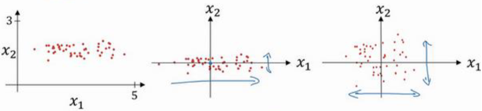
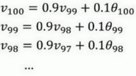
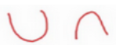
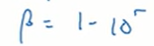
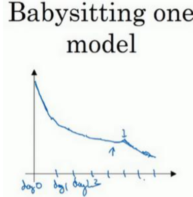
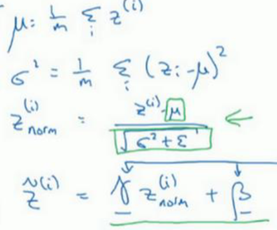
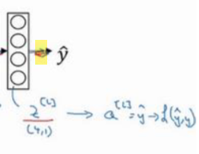

# 基础
## 是什么
# 基础: 构建深度学习模型
## 数据集切分
### 切分为三层
切分为三层，分别是训练集，验证集和测试集
对应的英文名字是train dev和test 

下面是个人理解
在这三层数据上都可以针对我们的模型做评分
Train得出来的平分: 如果在没有test数据集的情况下，它也可以用于反映我们模型的性能

dev评分: 用于在一个模型训练好之后测试他在dev上面的得分, 个人理解，此时我们就不太关心train训练出来的得分了，tiain仅仅负责训练. dev得到得分之后, 我们还要回去修改我们的模型，也使得他在dev上的得分尽可能的高，所以本质上dev是参与训练的, 允许对dev数据过拟合
test: 仅仅用于最终测试，给模型打一个分测试得分之后不能回去修改模型来使其在test上得分更高, 否则就会过拟合当前的测试数据集. 仅用于做最终评判. 

⭐ Dev和test的根本区别就是: 允许模型对dvb的数据过拟合，但不允许对test的数据过拟合. 虽然两者都用于评分

验证集的名字就如同它的名字一样: 在训练期验证我们模型的效果，并辅佐他提高(像代课老师). 而测试集就仅仅是拿来做测试给最终评分了(像高考评卷老师)

从另一个角度来理解训练集验证集和测试集:
我们知道任何一个样本想要对他进行预测, 他都要传到我们的神经网络模型中，进行一遍正向传播
所以这三个数据集都会经历正向传播的过程, 包括测试集: 我们也得对它进行预测之后才能判断预测的准确率
但训练集和验证集是参与训练的模型的: 这两个除了参与正向传播，还参与反向传播，也就是参与调参(调节w和b), 而测试集是始终不会参与反向传播的，不会参与调参
### 切分比例: 小数据
#### 如果仅仅切分为训练集和测试集
可以按7, 3分
8, 2分
或者7.5, 2.5分
#### 如果切分为训练集，验证集和测试集
可以按照6:2:2进行划分
### 切分比例: 大数据
前面的是针对小量数据的情况
再针对大量数据的情况时，比如有100万条数据
其实我们往往并不需要那么多的验证集和测试集

此时可能会发分出来98万条数据来训练模型: 训练模型，使用的数据往往是越多效果越好(对于深层神经网络而言是这个样子)
剩下的1%和1%分别用作验证集和测试集

甚至可能训练集会切分到99.5%, 剩下的平分作为验证集和测试集

当然验证题和测试题也未必是平分的
### 数据来源不同
许多时候我们的训练集测试集和验证级数据来源会不相同
比如我们要训练识别猫咪的神经网络模型
我们的训练集是从网上扒取的，数以万计的图片

但我们真正用于测试的图片, 可能是自家APP用户随手上传的比较模糊的用户抓拍的图片

也就是说我们训练的数据来源和测试的数据来源不相同了，此时模型的效果可能会比较差

⭐一个经验是要保证验证数据，dev和测试数据，test来自同一来源
个人理解，对于此处的例子就是我们最好从用户上传的图片中切分出来一部分数据，用于验证我们的模型
TODO: 为什么
## 偏差与方差
### 偏差与方差: 概念
看见机器学习章节
先去看一下
### 偏差与方差: 找到低偏差低方差的模型的过程 
针对我们当前的任务，我们可能会训练出来一个初步的神经网络模型
接下来我们要验证它是否是高偏差的
#### 解决高偏差
如果是高偏差的: 个人理解此时就意味着他可能是欠拟合了，他在训练集上正确率就不高, 事实上此时我们都可以不必忙着先去验证他在验证集上的性能, 先让他在训练集上的正确率变高吧
对应的解决方案是:
可能我们需要更大的神经网络模型, 这样能够解决一些牵引和问题
可能是要花费更长的时间来训练神经网络模型, 这样他可能拟合程度更好一些(个人理解是: 可能有的时候我们不会让神经网络模型训练完毕，而是指定训练一定次数之后就停止，此时就要加大训练的次数)
还有可能你需要更换一种新的神经网络模型
#### 解决高方差
解决高偏差之后，起码在训练集上，他的表现应该是不错的
但此时他可能会发生过拟合也就是出现高方差的问题: 在验证集上的性能不理想
此时的解决方案是: 
我们可以拿更多的数据去训练我们的模型(但其实我们往往拿不到更多的数据, 会比较麻烦)
或者添加一些正则化选项来抵消过拟合   
或者是寻找新的神经网络模型，这个措施有的时候可以一举两得的解决高偏差和高方差的问题

个人理解，这些做法大体上可以做到在不影响偏差的情况下来降低方差
#### 神经网络的调整偏差和方差通用方案
如果想要减少偏差，也就是减少欠拟合的程度，我们可以加大我们的神经网络
如果想要减少方差，也就是减少过拟合:，我们就往模型中投入更多的数据参与训练

这两种基本上可以做到在不影响，另外一个指标的情况下调整当前指标(这里的指标指的都是方差或偏差)

总而言之，要么加大神经网络，要么加大数据，盐多了加水，水多了加盐

此外降低方差或者说减少或拟合的另外一个通用办法就是添加正则项
### 偏差方差平衡
视频中说现在深度学习研究: 对偏差和方差的平衡做的甚少
好像在机器学习中做的还多一些

视频中说好像是因为1开始没有太多的可调节工具来达到这种平衡
而后来到了大数据时代，其实想要达到这种平衡只需要加大神经网络或者准备更多的数据即可
TODO: 到时候再具体研究一下，到底是为什么不提这个

## 正则化
### 是什么
正则上是一种减少方差，或者说减少过拟合的通用方法

先去参见机器学习章节的正则化
### L1, L2正则项
#### 原理
##### L2正则项
对于神经网络而言，正则化就是在他的成本函数后面+一个正则项
如黄色方框所示

绿色方框则是其中的||w^2||这一项的表达式
这里的这个是L2正则项, 这个在机器学习章节学过
他的目标就是使w尽可能的小, 而w是最终求解出来的预测函数的x前面的系数. 预测函数本质上是一个多项式函数，如果多项式函数未知数前面的系数θ(在这里是w)变小，则整个图像就没有那么扭曲，从而就中和了过拟合

视频中说，其实有的时候也可以通过L2正则的方式来使得偏置b尽可能的小
但偏置b本质上就是一个常量(个人理解就是它不是多项式未知数前面的系数)，让它最小通常没有太大的作用
所以并不怎么常用

#####  L1正则项
在机器学习章节也已经学过了
它使用绝对值来表达

在机器学习章节我们说过使用L2正则项它会使得系数θ或者说w的许多项变为零
这里补充到此时，w将会变为1个稀疏矩阵, 也就意味着其中有许多向量都会是0
而据此我们训练出来的神经网络模型也会是一个吸收模型
视频作者更推荐使用，l2正则项
##### 超参数 λ
在正则项前面都有一个数值λ
它也是一个神经网络模型的超参数
其语义在机器学习章节解释过，代表着当前正则项的权重

要注意lamda在Python当中是一个保留关键字，所以我们命名该超参数的时候，一般省略最后的a那个字母, 剩下的作为变量名
##### 理解: 为什么正则项相对神经网络起作用
###### 直观理解方式1
在机器学习章节我们理解过，为什么正则项对多项式回归起作用
此处我们在直观理解一下，为什么正则项也对神经网络起作用

个人理解，它对多项式回归起作用的原理: 就是使其预测函数x前面的系数都趋向于0，从而减少预测曲线的扭曲程度，本质上也是一种适用于神经网络的直观理解
###### 直观理解方式2: tanh
对于神经网络
我们假设激活函数是tanh

神经网络中间的红线的部分大体上是一段线性的部分，它非常近似于一条直线

我们给我们的损失函数j后面添加了正则项
在整个调整神经网络的过程中，就是让J也就是让损失不断的变小
现在j当中，加法前后包含两项，所以他们在整个调整过程中都会变小
所以下面紫色字体整体也会变小
而如果我们设置λ非常的大, 紫色部分整体又需要变小，那唯一的结果就是w需要变得非常接近于0
(其实也就是前面所说的系数变小)

而如果权重w变得接近于0，那么z也会变得非常小，因为z本质上就是通过w+偏置计算出来的，此时先不考虑偏置

将z映射为a通过的就是tanh这条曲线
如果z变得非常的小，相当于它只在原点附近活动, 其对应的线段就是红色线段
那么此时相当于我们的激活函数tanh退化为了线性函数

前面我们说过，如果激活函数使用线性函数的话，那么整个神经网络就会退化为像逻辑回归一样的效果
而逻辑回归就是一个线性模型，我们只能找到一条直线作为决策边界...
所以只要将λ设置的很大就能完成复杂的神经网络到逻辑回归的退化，或者说就能完成复杂的决策，边界到直线决策边界的退化
也就是从下面的图3变为图1

当然一般情况下我们并不会将λ设置的异常的大, 使得像W的值真的趋向于零
我们会适当的调整符合λ的值，使得w的值也比较适中
###### 直观理解方式2: 从消去神经元的角度理解(神经元个数与过拟合) ⭐⭐⭐
先看上面的理解方式
我们知道添加正则项会使w本身变得很小
或者如果我们使用l1正则项的话，其实就是会将某些神经元直接消去(这个消去指的是当前神经元的参数，都会变为零，神经元，计算出来的结果也都是0, 也 = 没有作用)
而对于一个神经网络，如果其中的很多神经元都被消去了，都失去作用了, 的整体模型的复杂度就下降了, 就不容易那么过拟合了

这里有两个问题
神经元个数与过拟合 ⭐
TODO: 为什么神经元的个数下降就不容易过拟合了
我的个人理解是每个神经元都有着自己所对应的w和b，他们其实就是最终损失函数j当中的未知数, 现在有一些神经元的w和b被削掉了, 也就意味着损失函数的维度变低了, 损失函数的复杂度变小了, 他就没有那么多的能力去过拟合了

todo 第2个问题是即便我能够理解为什么w,b = 零的时候会让神经元失去效果，从而让整个模型不再过拟合，那为什么使用l2正则实w仅仅是变小了(变得接近于0), 也会让神经网络不再过拟合让神经元近似失去效果呢
这里个人理解: 消元让神经网络拟合能力下降，或者说不再过拟合的重要方式之一, 它也可以让预测曲线变得不那么扭曲
但降低预测曲线每一项x前面的系数w, 也可以让预测曲线不那么扭曲, 从而减少过拟合

TODO: 还有为什么不在全连接就可以减少过拟合呢
个人理解是比如说全连接: 假如上一层有4个输出, 下一层也有4个神经元
全连接的话，下一层的每个神经元都完全的接收到上一层的4个输出, 针对这4个输出就要准备4个权重w. 这一层一共4个神经元对应16个w, 相当于为最终的损失函数，在这当中添加了16个未知数，或者说增加了16个维度. 这增加的维度就太多了
而如果不是全连接的话,比如下层每个神经元都只获取上层的两个输出, 则下层的每个神经元只需要准备两个权重w: 4个神经元一共需要准备8个权重w, 这样就只添加了8个未知数，或者说只增加了8个维度
神经网络的复杂性降低, 就没有那么容易过拟合了

⭐⭐⭐总而言之就是参数w越多, 最终的损失函数j越复杂: 整个神经网络模型就越复杂，拟合能力就越强，就越容易过拟合
⭐而添加更多的隐藏，添加更多的神经元，让神经网络变得全连接: 这些都会增加w的个数, 增加模型的复杂度，从而让模型更容易过拟合
⭐减少上面的这些, 就可以减少过拟合. 此外控制w的取值，让其不能取到太大, 也可以减少过拟合(这个是从预测曲线的角度理解: 对于一条曲线如果未知数，前面的系数越大，该曲线就可以越扭曲. 如果前面的系数限定，只能取得比较小, 他就不能那么扭曲)
#### 缺点
我们往往需要不断的调整其超参数λ
#### 神经网络使用l2正则
##### 损失函数+l2正则
在神经网络中
正则项要添加到加函数j的后面

这里是针对多个样本而言的
绿色部分整体就是l2正则
其中的黄色部分就注意要除以样本的个数m
而其中的w本质上是一个权重矩阵

下面这一项本质上 = w矩阵中的每个元素，求平方再相加

此时我们也将l2范数叫做弗罗贝尼乌斯范数
注意这个范数是只包含上面的求矩阵元素^2和这一项不包含上面黄色部分的系数项
##### 此时的反向传播: 导数dw的变化
最重要的一句话是: 总而言之, 只要添加了正则项就是改变了损失函数j,以后，我们的损失函数就是这个改变后的新的j了

此时的损失函数J就变成了这个样子

在反向传播中，我们要求各个变量针对损失函数j的导数
那在求导时也要考虑到后面绿色的l2正则项
如果说原来的dw[1] = 添加正则项之前求出来的导数
那现在的dw[1] = 添加正则项之前求出来的导数 + 绿色方块也就是正则项相对w求导得到的导数

也就是它要+下面的紫色字体

个人理解，绿色方块求导得到的就是上面的紫色字体

而关于别的变量求导应当是不考虑这个正则项的: 因为这个正则项此时会被作为1个常数消掉
只有关于w求导的时候绿色正则项当中的w才被看作是一个变量才不会被削掉

注意d，w其实是相较原来变大了，因为他+的紫色部分始终是一个非负数
TODO: 为什么始终是一个非负数, 我知道他求导之前的整个绿色方块，也就是整个l2正则项始终是个非负数
但它求导之后仍然始终是一个非负数吗
##### 此时的反向传播: 对学习率的影响 (权重衰减)
之前我们学习需要调整w和b
再添加正则项之后调整w的过程会受到影响
原来的调整w

注意其中有减掉dw这一项

而经过上面的分析，我们发现添加正则项之后，dw这一项改变了, 准确来说是变大了
所以这里需要 - 改变之后的dw，-之后，w整体会变得更小
这也叫做权重衰减，因为现在+正则项之后每1次调整w都会让w变的相比添加正则项之前更小
⭐ 这个权重衰减是由于添加了l2正则项导致的

上面意味着减掉的dw更新了

这是上面第2行公式的展开, 可以看到最终得到的w会变得更小
### dropout正则项
#### 原理
他会遍历整个神经网络的每一个神经元
每一个神经元都有50%的概率被删除
一个神经元被删除后与其相关的连线也会断开

这样从左边到右边，我们就得到了一个更小的神经网络，就可以减少过拟合了

#### 实现: 反向随机失活
##### 原理
这里我们只描述对某一层神经网络的处理
简而言之就是我们要创建一个随机失活向量
它对应当前要处理的这一层的所有神经元(一个神经元分量对应一个随机失活分量)
如果神经元对应的这个随机失活分量为true，则让该神经元保持活力，如果神经元对应的这个随机失活分量为false，则让该神经元失活
下面是设置有80%的概率保持活力，有20%的概率失活

注意下面是针对第3层来进行失活操作，所以设置的随机失活向量是d3. d3的维度和a3的维度相同: 这两个向量本质上都是当前层神经网络中有多少个神经元

##### 代码实现
在具体写代码的时候
失活是一层一层进行的
我们以第3层为例
首先要建立如上所述的一个失活向量d3
针对第3层的输出a3，我们需要将他们传递给第4层
但这里因为要进行失活操作，所以并不会完全传递过去
而是让a3和我们的失活向量d3相乘, 这个相乘是对应位数相乘: d3本质上是一个布尔值向量，在相乘的时候，true会被转换为1, false会被转化为0
所以相乘之后得到的新的向量赋值给a3: 该向量当中某些位置的元素就被置为0，某些位置的元素则不改变
这就是要进行的第1步，这就相当于让a3的某些神经元失灵了，其实就是将这个神经元的输出变为0了

上面的a3已经是更新之后的某些元素 = 0的a3了

接下来第2步比较诡异一些，我没有太理解
TODO: 只是把它的步骤罗列出来
第2步还是更改这个a3当中的值

让他当中的每一个元素都**除以**0.8
现在a3当中有些元素是0, 有些元素不是0，那些是0的元素除以0.8得到的结果还是0，那些不是0的元素除以0.8会变大

视频中说是因为我们这里设置让第3层神经元80%有效，20%失效
这样第3层输出，整体上相当于变小了20%
但与此同时我们还希望下一层的神经元计算得到的整体值不会受到影响
所以我们需要让第3层的输出，整体上再变大20%
相当于虽然我们让第3层的某些神经元失效了, 但第3层输出的值的总量是不变的
下行代码就能完成这个操作

视频中说一开始许多框架中也没有这一步, 但事实证明+这一步效果会变好很多
##### 注意的问题: 正向传播,反向传播预测与drop out
按上面的代码实现，我们是针对每一层: 随机选择其中20%的神经元，让其失效
接下来有两种不同的选择: 也就是接下来训练的时候还是让相同的那些神经元失效的话，第2种选择是接下来训练的时候，每1次仍然进行随机，也就是每1次每一层失效的神经元都是随机出来的，可能是不同的
TODO: 选择哪一种呢

此外还需要注意这种失效的神经元，在正向传播和反向传播中都要考虑到

此外还有就是在预测的时候也要考虑失效的神经元: 视频中说在预测的时候就不要让神经元失效了，让所有神经元都有效
TODO: 为什么呢
#### 理解有效性
##### 直观理解

假定说第1层的神经元会被随机的消掉一部分
后面的那个神经元则接收前一层神经元的输出作为输入，但前一层神经元可能会被随机消掉几个
我们知道每个神经元的目标都是使损失尽可能的小
后面的那个神经元也是如此: 它使得损失尽可能小的方法是为前一层神经元的输出分配不同的权重w
假设说他给前一层神经元的第1个输出分配了一个非常大的权重w, 给其他神经元分配了很小的权重w此, 而且时误差很小, 后面的神经元很满意
但接下来训练的时候第1层神经元的第1个输出被dropout清除掉了, 此时就会造成很大的误差(相当于分配给被清除的这个神经元的很大的权重w没有用了, 而其他真正有用的神经元被分配的权重又很小, 此时的计算结果一定有很大的误差)  
⭐相当于之前分配权重的时候, 后一个神经元把宝都压在了前一层输出的第1个神经元上, 或者说它过度依赖上一层输出的某一个特征了. 现在dropout机制对这种行为给予惩罚
dropout机制的存在会使得后面的神经元在对前面的输出分配权重时，在区分重要程度的前提下又尽可能分配的均匀, 其实也一定程度上起到了压缩权重的作用, 压缩权重就是压缩系数，就可以减少过拟合(这种行为和l2正则非常像)
所以dropout机制一直被当做l2正则项的替代机制
##### 清除神经元的可能性一般和该层神经元的个数成正比 keep-prob
比如针对该深层神经网络模型
紫色字体就是该层设置的保留神经元的概率
如果 = 1的话，就代表该层的神经元完全保留: 比如最后那两层尤其是输出层, 一般要完全保留神经元
而中间的各个隐藏比如设置 = 0.5就会清除50%的神经元设置 = 0.7就会清除30%的神经元
输入层也可以设置该概率，但其实输入层一般不会清除神经元

这样做的道理是，我们可以将每一层神经网络都当做对样本特征的提取和转化, 如果这一层包含的神经元有很多，比如有10个，就相当于它将原来的样本转化为了10个别的特征
转化为了10个特征就意味着平均每个特征的重要程度，大概占10%，也就是每个特征都没有那么重要，所以可以从其中去除一部分, 这样不太影响最终的预测结果，又可以防止过拟和
而如果这一层只有两个神经元，相当于它将原来的样本转化为了两个特征, 每个特征就非常重要，此时就可以不清除神经元了, 可能清楚每一个都会十分影响结果

事实上神经网络使用dropout的机制更多一些: 因为神经网络中每张图片作为1个样本，它的特征实在是太多了, 噪音也太多了，其中有很多像素点是没有用的. 使用dropout可以防止过拟合, 而且剪除掉其中的几个像素特征, 一般也不太影响最终的判断结果，所以可以使用dropout
#### 理解其缺点
##### 使用dropout机制之后，损失函数j的定义不再明确
视频中的意思应当是每次训练的时候，由于都会随机拿掉一部分神经元
而最终损失函数j的确定: 又和各个神经元的权重w和b直接相关相关, 所以每次拿掉一部分神经元，就相当于每次都改变损失函数的w和b导致损失函数发生变化

其带来的副作用是损失函数变得难以调试(尤其是在梯度下降的过程中)

视频中建议在采用dropout机制之前, 先验证你的代码是跑得通的，尤其是梯度下降的过程中，每次训练确实损失都在变得更小. 保证代码没有别的bug

然后再设置keep-prob=0.x来清除掉某些神经元开始执行dropout的机制
分为如上两步走
### 其他正则项
#### 增加数据
前面说过增加数据也是中和过拟合的一种方法
但我们获取数据往往没那么简单
在计算机图像识别领域，其实我们可以将图像进行翻转，裁剪旋转等操作来得到新的图像，将它们作为新的训练数据

视频中说这样得到的数据其实效果并不如完全采集来的新的照片效果那样好(因为其实他们并没有引入新的信息, 比如新的背景)
注意这样处理后，一定要保证图片的主体还是小猫
TODO: 而且视频中说最好不要进行上下翻转，可能是因为他不想引入上下翻转
但这是一种很快能使我们数据集翻好几倍的处理方式

在数字识别时，我们也可以采用一定的特效处理数字来模拟人将数字写得扭扭曲曲的情况
不过下面扭曲的情况稍微有点过度了. 轻微变形即可

####  Early stopping
##### 原理
其大概的原理是我们将数据切分为训练集和验证集
使用训练集进行训练的时候，我们不断的监控最终损失j: 根据梯度下降原理，它一般是单调递减不断变小的
但与此同时我们还监测每1次训练的模型在验证集上的效果: 验证集的错误率一般会先下降后上升, 在这个从下降到上升的极小值点一般就是开始过拟合了(过拟和训练集)，其实我们在这里就可以停止了

上图蓝色曲线就是损失函数，大系的单调递减曲线
紫色曲线就是在验证集上的错误率曲线
紫色的点就是开始过拟合的点可以在该点处停止
TODO: 个人理解上面训练过程中, 训练史中使用的是训练数据集. dev数据集仅仅用于评分

另外一个解释是
对于损失函数，一开始我们初始化的权重w都是很小的值
随着训练过程的进行, w会慢慢增大，损失会慢慢减小，整个模型也会慢慢过拟合
前面我们说过w越大整个函数就越扭曲，就越容易过拟合
所以整个训练过程其实也是增W的过程. 当w很小的时候就容易欠拟合，当w很大的时候就容易过拟合
TODO: 这个我大体可以理解, 但觉得需要具体论证一下
TODO: 这也意味着我们要将w初始化为很小的值，对吧

 而上图中**极小值点**的位置就是w变大了，没有欠拟合了，但又没有那么大，没有发生过拟合

##### 缺点
使用early stopping，我们需要在紫色曲线的极小值点处停止训练
但此时可能整个损失函数j的损失还是很大
但我们在此时就不得不停止了

视频中说，这主要是因为我们想要通过early stopping这一个方法来同时解决两个问题: 找到紫色曲线的极小值点，并使得同时j尽可能的
使用一个方法同时解决两个问题，往往是很难的

相比之下，使用l2正则就没有这个缺点
### 补充: 神经网络训练的一般步骤 ⭐
这是课堂中随机说的，但我觉得很有用
首先就是找到一个损失函数j, j是一个关于w和b的函数，可能非常复杂
我们要找到一定的优化方法，使损失函数尽可能的小: 这些优化方法，比如说梯度下降等，此外还有别的方法

随着损失大致的变小，可能我们慢慢会走向另一个问题: 过拟合. 也就是在当前数据效果非常好，但在别的数据效果比较差
为了解决过拟合问题，我们需要一些别的工具: 比如添加正则项

大体上神经网络的训练就分为如上两步: 让损失函数变小 → 取消过拟合
## 归一化输入
### 是什么
首先参见机器学习章节的归一化
这里主要讲的是均值方差归一化
### 均值方差归一化
#### 操作
以二维数据为例
下面的红色样本点是二维数据

规划输入的第1步是均值，归零也叫做零均值化
就是让第1幅图转换为第2幅图: 就是将坐标轴转移到这群样本点的中心

其对应的公式是

第2步则是让横轴和纵轴的方差相同: 你看上图的第2张图，它横轴上更加分散，纵轴上更加密集，也就是横轴的方差更大，纵轴的方差更小
我们要让它转换为第3幅图: 横轴和纵轴的方差一样都 = 1
这个叫做归一化方差
TODO: 这不就改变原来数据的分布状态了吗

均值方差归一化的公式在机器学习章节有更详细的讲解
这里简单说一下，黄色部分其实就是让每个数据的每个特征 - 当前特征的平均值μ
绿色部分就是让-平均值之后，再除以这个特征的方差符号σ^2

一定要注意这里的μ和σ本质上都是通过当前样本的第n个特征，比如当前样本的第3个特征训练出来的
当前样本有几个特征就会训练出来几个μ和σ

训练出来μ和σ之后每一个样本的每一个特征分量都可以使用与之对应的这个第几个特征的μ和σ进行更新了
#### 注意事项

注意我们会针对训练集的数据来计算出一个μ一个σ
接下来我们会使用这个μ和σ去规划验证集和测试集: 而不是说针对验证集和测试集再分别求出来一个新的μ和新的σ

视频中说使用μ和σ对样本x进行处理，本质上是一种数据转换
我们对训练集验证集和测试集应当应用相同的数据转换，所以只需要使用一个相同的μ和σ
#### 为什么这样做
参见机器学习章节
其实主要还是为了解决数据的量纲不一样这个问题
使用均值方差规划之后，可以将数据变为1个均值为零方差为1的分布
也就是说在原点附近以一为半径的这个范围内，就可以涵盖住大量的样本点

而从损失函数的角度来讲
TODO: 其实我不太理解为什么量纲不一样会导致损失函数也变扁，损失函数是否便便不应当是有w控制的吗, x的量纲不一样，也会导致w的量纲不一样吗

对于量纲不一样的数据，它的损失函数大概是下面这种非常扁的形状

要在这种损失函数上进行梯度下降，学习率必须设置的非常的小, 以适应比较扁的那个轴
如果学习率设置的很大，那他可能一下子就完全从比较扁的那个轴的一端跳到了另一端，导致在比较扁的这个轴上难以训练
而为了适应比较扁的那个轴，将学习率设置的较小，又会导致在比较长的那个轴上的训练速度变得很慢

我们在对数据进行均值方差归一化之后，得到了右边的图形，它就更容易训练

## 梯度消失与梯度爆炸 ⭐
### 梯度消失与梯度爆炸: 为什么会出现 ❌
这个吴文达讲的非常不好，不看了
给定如下一个很深层的神经网络
我们让该网络尽可能的简化: 其中的b都 = 0
并且我们使用一个线性的激活函数a = g(z) = z, 也就是输入z返回的还是z
则每一层的计算公式退化为了a = g(wx + 0)
也就是a = z
则整体神经网络的计算公式退化为了下面黄色方框所示

它就 = 各层神经网络的权重相乘，最终在乘以样本x

我们不妨假设，每一层的权重矩阵w都 = 

除了最后一层，因为最后一层只有一个神经元，所以其w是一个行向量
不过最后一层这个影响并不大
此时我们看一下最终求出来的y^，它就 = 
其中黄色部分是最后一层的权重，绿色部分是之前所有隐层的权重，注意它上面有一个l-1的次方，它是一个次方项
最后蓝色的则是样本矩阵x

这里有一个非常惊讶的发现是y^的值其实是和l成指数关系的, 随着l的增加(也就是随着神经网络层数的加深)，y^将会指数倍的增加

而如果我们将矩阵的1.5换成0.5
最终的y^就会呈指数倍的减小

问题: 为什么视频中说是因为矩阵的值大于一和<一导致的，但这是个矩阵呢它怎么会有大于一和<一
回答: ↑ 他这里说的大于1<1，应当是针对单位矩阵I来比较的，如果斜对角上的每个元素都大于1, 则这个矩阵整体就大于单位矩阵I...应当是这个意思
此时这个矩阵就会导致每层神经元的输出不断的变小，可以看下面的例子

举例: 假如我们将上面的权重矩阵也就是0.5这个权重矩阵带入到神经网络中进行计算
假如初始化的x1和x2，也就是样本的两个特征的值都 = 1
那么经过上述权重矩阵，它就会以指数的形式缩小

从左到右隐藏的神经元当中分别是1/2，1/4，1/8一直到最后 1/(2^l)
可以看到每层神经元的输出都在不断变小

视频中说，如果权重矩阵比单位，矩阵大或比单位矩阵小，如果这个神经网络又非常长的话，这种大小会呈指数倍的加速, 最终导致结果非常大或非常小

TODO: 这种只针对单位矩阵样式的w才有效吗
也就是只针对斜对角上有元素的权重矩阵w才有效吗

而且视频中说这种指数倍的增大或减少，其实在反过来求导时也有同样的效果, 也就是梯度爆炸或消失
这也是深层神经网络训练较难的原因
TODO: 验证一下

TODO: 而且这里通篇是使用线性激活函数来举例，而且通篇的w都是只有斜对角上有元素，在这种情况下才推导出了梯度，爆炸和梯度消失
对于w不是斜对角线上的这种矩阵, 以及激活函数不是线性函数时: 还会出现这种现象吗

个人理解这里就是线性激活函数的存在才导致梯度爆炸之类的问题
线性激活函数直接将计算出来的z向下一层传导
而如果不是线性激活函数，比如使用sigmoid函数，不管z再大它都会被归约到0~1之间的数值, 这样向下传导就不会梯度爆炸了
可能relu函数也有梯度爆炸的问题
### 梯度消失与梯度爆炸: 为什么会出现
#### 原因
我们从公式进行推导
这是正向传播的公式, 这里分别是计算出第3层的z和第3层的a
z3 = w3a2 计算第3层的z需要使用第3层的权重参数和第2层的输出
a3 = g(z3) 然后传给一个激活函数中，由z计算出a, 该激活函数是什么都行

接下来是反向传播对第3层进行求导的过程
我们想看的是第3层的w变化一点点，会导致最终的损失l变化多少
他的公式如下
dl/dw3 = dl/da3 * `da3/dz3` * **dz3/dw3**
其实就 = w的变化引发z的变化，z的变化引发a的变化，a的变化引发l的变化
上面`绿色`的部分本质上就是求激活函数的导数, 因为a就是将z传给激活函数得到的
而上面**红色**的部分, 因为我们知道有z3 = w3a2
所以w3每变化一点点，z3就变化a2倍的一点点
所以有**dz3/dw3** = a2
所以上面的公式可以转化为下面这种形式
= dl/da3 * `g'` * **a2**

上面这一部分公式当中出现了dl/da3, 所以我们还要推导他的公式，计算出来也很简单
dl/da3 = dl/da4 * `da4/dz4` * **dz4/da3**
简而言之，我们想要计算的是a3变化一点点，l变化多少. 其整个变化的过程就是a3变化一点点，导致z4变化多少, z4变化一点点，导致a4变化多少, a4变化一点点，导致l变化多少. 也是链式求导
上面绿色的部分同样可以写作激活函数的导数g'
上面红色的部分同样可以写作w4, 分析方法和上个公式是一样的
所以上式就转化成了下面的样子
= dl/da4 * `g'` * **w4**

这样我们就得到了w3变化一点点，导致l变化多少, 他一直会计算到dl/da4, 也就是计算出第4层的a变化一点点, 导致l变化多少
因为反向传播是先计算第4层，然后再往回计算第3层的
dl/dw3 = dl/da4 * `g'` * **w4** * `g'` * **a2**

其实我们可以这样一路往输出层去推, 下面是计算第5层
这样其实就是由第5层的导数一路往前推出第3层的导数
dl/dw3 = dl/da5 * `g'` * **w5** * `g'` * **w4** * `g'` * **a2**

下面是计算第6层...
或者说这就是由第6层一路往前推到第3层的导数
dl/dw3 =dl/da6 * `g'` * **w6**  * `g'` * **w5** * `g'` * **w4** * `g'` * **a2**

其实可以看出来, 除了最后的**a2**
从第3层的导数往第6层去推，就是不断的: ×权重**w**再×`激活函数的导数g'`
其实在反向求导的过程中, 每往前推进一层导数，就要乘以权重**w**再×`激活函数的导数g'`
假如说wg' 在这个过程中始终<0的话
那么不断的往前推导，梯度就会越来越小: 这样导致的问题就是梯度消失⭐
假如说wg' 在这个过程中始终>0的话
那么不断的往前推导，梯度就会越来越大: 这样导致的问题就是梯度爆炸⭐

那我们来看一下wg'
假如我们以sigmoid函数为例，该激活函数g的**导数**g'的函数图像如下所示

可见其取值范围是从0~0.25
接下来再看w
此时如果w取得比较小的话, 那么wg'整体上就会<0，就会出现梯度下降的情况
相反如果w取得很大的话, wg'整体就会大于0，就会出现梯度爆炸的情况

这就是梯度消失和梯度爆炸
如果将激活函数换为tanh相对要好一些, 它的导数取值在0~1之间, 没有那么容易出现梯度消失, 但也好不了太多

总而言之造成梯度消失和梯度爆炸的原因: 和权重和激活函数都有关系
但其实和权重w的关系更大一些
#### 现象
如果发生了梯度消失
从输出层往前进行反向传播的时候，每层得到的导数会越来越小
这会导致每层学习的越来越慢 (因为学习移动的步伐和导数大小相关)
可能会导致正确率，久久上不去
事实上也有如下学习曲线

如果出现了梯度消失
事实上越靠近输出层的那一层隐层学习效率越高
越远离输入层的隐层学习，效率越低基本上就不怎么变动

而如果出现了梯度爆炸
意味着从输出层反向传播时梯度越来越大, 意味着越靠近输入层的层，它的梯度越来越大
这些曾在学习的时候，由于力度过大，会导致他的调整非常大, 出现反复横跳的抖动现象, 难以收敛
### 梯度消失与梯度爆炸: 解决方案
#### 权重初始化 Xavier初始化
TODO: 
它不能彻底的解决梯度爆炸/梯度消失的问题
不过能够缓解
他这一节实在是讲的不好
只需要记住有该方案即可

## 权重初始化
## 梯度检验
### 是什么
参见机器学习章节的题注检验梯度校验
然后再回来看本章

说白了就是检验我们计算出来的梯度是否正确
### 代码实现 (吴恩达) ⭐
这里给定另外一种实现方式
用于调试神经网络的梯度

首先我们要将当前神经模型的所有w和b都写成θ, 将它排成一个非常长的向量
此时损失函数大计将会变成如下形式
J(w,b) → J(θ)
也就是其中的参数都用θ来表示了

接下来反向传播的时候，我们要关于w和b求导
对于所有求出的导数，dw，db等也全部进入一个很长的向量dθ
这样我们就计算出了本轮的导数dθ
我们要校验的就是这个导数向量dθ当中的导数是否都计算正确
此时我们可以使用两点逼近法在计算一下导数(原理参见机器学习章节)

计算方法就是循环遍历θ当中的每一个小的θ
然后使用两点逼近的方法计算出来一个近似的导数

上面是循环循环计算出了一个近似导数ds
我们需要校验这个近似导数向量dθ和真正的导数向量dθ之间是否有很大的差距

计算两个向量之间是否有很大的差距: 可以使用两个向量之间的距离公式
视频中说这个是在计算两个向量之间的欧式距离
或者说是计算它的欧几里得范数
其计算方法是对两个向量的每一个分量先相减得到误差，然后误差再求平方和然后再开平方根

这样得到的是2点之间的距离公式

接下来还要除以一个分母，将其转化为1个误差比例
TODO: 了解一下该公式

下面也是一些经验
如果计算出来的误差比例的值大概 = 10的-7次方，那就没啥问题，代表导数没有计算错误
如果是10的-5次方可能有错误，也可能没有错误
如果是10的-3次方，你就要小心去检查一下你的公式的求导是否计算错误

TODO: 公式求导为什么会出现错误呢它不就是代公式吗
以及这里给定的最后一项差距大概是1千‰, 导数‰的误差就代表出了很大的问题吗
### 使用时的注意事项
#### 请在调试时使用
因为这种两点逼近求导数的方式非常耗费性能
#### 定位到具体出问题的那个导数
虽然我们最终是通过计算近似dθ和真正的dθ两个向量之间的距离来确定是否计算有误
但是在发现导数确实计算有误之后，我们就要查看近似dθ和真正的dθ的各个分量: 一个分量一个分量的去对比看这两个分量之间是否有差距如果两个分量之间有差距，问题就出现在这个θi这里
而每一个θ其实对应的就是神经网络中的一个w或者是b: 这样我们就能够具体的定位出是哪一层的哪个神经元的哪个w或b的导数计算出现了问题: 其导数计算出来和模拟计算出来不一致
#### 如果使用了正则项，则模拟计算导数时也要将正则项考虑在内
因为使用了正则项相当于我们的损失函数j也就变化了
则关于j计算出来的偏导也变化了

模拟计算dθ时，就需要针对变化之后的损失函数j去进行

#### 如果使用了dropout，则就不要进行梯度检验了
因为使用了dropout，它会随机的去掉每一层的几个神经元
相当于随机的从损失函数j中去掉某些w和b

那我们梯度校验的时候就需要考虑到这种随机过程并去模拟这种随机过程，这实在是太复杂了，所以一般两者不一块使用

# 高级: 深度学习算法优化
## 是什么
上一章我们构建了基础的深度学习模型
本章我们主要学习如何加快深度学习模型的训练效率
下一章我们将学习怎么对深度模型进行调仓和调试
## 梯度下降的问题
### 下降率
个人理解
主要出现在下降的数量而非方向上
按照梯度向量或者说导数的方向进行下降是没有问题的, 但下降的数量和导数或者梯度向量的大小成正比，稍微有点问题

以二维空间为例
红色这个点它的导数大，导数E味着x变化一点点，y变化很多，也就意味着此时上升下降的比较猛烈
函数变化是平滑的，如果一个地方上升下降比较猛烈意味着他可能离驻点比较远，所以此时如果要移动红色点的话，可以移动的多一些
绿色的点相反，它的导数比较小，它的移动比较平缓, 一般比较平缓的地方就比较接近驻点了，它的移动可以1些

但上面其实关于移动量的分析是有问题的
以下面的函数为例
假设绿色的点是极小值点
我们要从红色的点移动到绿色的点的话，但这个函数极其的平缓
在红色这一点导数较小, 所以红色的点往绿色的点移动起来会非常的慢
但可以看出来这里红色的点距离绿色的点距离挺远的，需要移动很久才能移动到

三维空间也有这个问题
### 梯度指向的并不是全局最小值
要破除这个错误认知
如果梯度指向的是全局最小值的话那就不会出现在最终优化结果，卡在局部最小值或鞍点的位置了

梯度指向的只是下降最快的方向
它是有可能陷入在局部最小值的

## 加快训练速度: mini-batch
### 是什么
是一种快速训练神经网络的方法
原来在求解梯度向量时: 我们每次都会针对所有的样本求解出来一个误差函数j并在该j上执行梯度下降
现在我们只取样本中的一部分, 比如1000个，然后在这1000个样本的基础上求解出来一个误差函数j, 然后求解出来一个梯度向量

使用这个从小样本中训练出的梯度向量来指导全局的梯度下降?
### 数据集切分
首先我们将训练集切分为每1000个一组
这里的1000, 这个数是我们随机选定的
每一组1000个样本的训练集: 被标记为x{i}
这些子集就叫做mini-batch, 这里一个 Mini batch里面有1000个样本

### 训练
首先假定我们原来的训练集当中有500万条数据
我们按每1000条数据进行拆分一共可以拆分出来5000个mini batch

接下来我们对这5000个 Mini batch进行循环
每次取出一个Mini batch: 每个Mini batch当中包含一千个样本，针对这1000个样本进行1次前向传播，也就是计算出来z和a

下面绿色方框表示的就是针对针对一个 mini-batch进行前向传播       

接下来计算损失函数
此处计算的损失函数也是针对这一个mini-batch的损失函数
绿色的角标代表该损失是针对一个mini-batch的
黄色部分是因为我们的一个mini-batch当中包含1000个样本
蓝色部分是说这里的y和 y^都是从这一个mini-batch中计算出来的
紫色的部分则是添加的正则项

注意这个损失函数其实和使用所有样本训练出来的损失函数就不一样了
接下来梯度下降也是针对当前这个损失函数进行求导

接下来就使用计算出来的梯度向量来更新w和b: 这里的意思是每针对一组 mini-batch训练之后就更新w和b
此处我们一共切分了5000组mini-batch，所以一共会更新5000次，w和b

一般来说我们针对所有样本训练一遍叫做1次epoch: 原来不使用小批量的时候，每执行1次epoch我们梯度下降1次
现在使用mini-batch的时候每遍历1次epoch梯度下降5000次

当然我们还可以循环遍历所有的样本多次, 相当于执行多次epoch
就是在上面的for循环外面再套一个for循环

⭐ 1 epoch =  = 对所有训练集遍历训练一遍
### 原理
视频中其实没有解释
个人理解可以参见机器学习章节的每次使用一个样本进行梯度下降

个人理解，我们从样本中抽出一个mini-batch进行训练, 训练得到的损失函数j也是针对这一个mini-batch的
求到的导数也是针对当前这一个损失函数j的
使用该导数去更新当前这个损失函数，应当可以使其损失下降

但事实上我们会用更新得到的w和b去训练下一个mini-batch, 此时就相当于损失函数j也变化了
我们用上一个j的梯度更新得到的w应用于此次 mini-batch训练, 其实效果未必好
但总体来说应当还是呈现一个总体向下的态势: 因为样本之间具有相似性或者说规律性
比如哪怕随机抽出来1000条样本, 再随机抽出1000条样本，但这些样本终归都是关于小猫的图片，它们有相似性
只是说此时梯度下降往往不再是一种: 根据梯度向量精确的减少损失的状态，而是添加了更大的随机性或者说噪音
整体上来说这样找到的w和b, 从整体上可以使这个损失函数j的损失都逐渐变小

### 超参数 k,  mini-batch当中样本的个数 ⭐
前面我们举历时是让k=1000
也就是每个mini-batch当中包含1000个样本
如果让k = m也就是让mini-batch当中就是包含所有样本，那此时就成了batch训练
如果让k=1，也就是每次只拿一个样本进行训练，就成了随机梯度下降

三者的梯度下降路径如下
蓝色的就是拿全部样本进行训练: 它就是单调递减的，损失会越来越小
紫色的就是随机梯度下降，每次选取一个样本来计算梯度. 它的噪音是最多的，随机性是最大的，它的坏处是首先很难收敛到真正的最小值, 到最小值附近，它可能会打圈圈
TODO: 这个也详细理解一下
其次因为它每次只选取一个样本，这样运算速度其实会慢很多，因为针对多个样本，我们可以进行向量化操作，针对一个样本就不能进行了, 也没有必要了
绿色的就是mini-batch梯度下降，它也有噪音. 它噪音程度位于全部样本和一个样本之间, 同样它也可以应用向量化操作来加快效率, 同样的在最小值附近，它可能也会出现不收敛打转转的情况，也就是很难真正走到极小值

视频中说针对随机梯度下降和mini-batch梯度下降，在极小值点不收敛，四处打转转的情况: 可以通过动态地降低学习率来适当解决  
### 问题
mini-batch每次都是针对不同的1000个样本来计算损失函数j，那是不是每次j都在变化
个人理解确实是这个样子, 只是每次随机的1000个样本都是从全局中取出来的，他们带有全局的特征，所以大体上可以将损失函数视作是不变的

## 指数加权平均
### 是什么
其实在机器学习和深度学习的算法中，我们经常要算多个变量的平均值
计算多个变量的平均值有多种算法

此处给出的指数加权平均是统计学中一种计算多个数值的加权平均的一种算法. 它的优点是实现简单: 只需要一行代码
并且不占用内存: 哪怕你要计算100天温度的加权平均也只需要1个变量

它主要用于下一小节的动量梯度下降法当中
### 指数加权平均: 计算方式
它是统计学中的一种计算方法
假如说我们记录了某个地方一年的温度曲线

地图绘制出来，如下一年的温度是先慢慢升高，到冬天再慢慢降低

带入如下公式可以求出指数加权平均

比如说前面的温度使用θ1来表示
那代入上面的指数加权平均公式，我们得到一个v1, 我们就用v1来代替θ1
其中有一个需要我们确定的参数符号β, 假如说我们设置β = 0.5
那我们在计算第2天的温度时，原本第2天的温度是θ二
现在第2天的温度是v2

这个v2是考虑了前一天的温度，也就是v1, 同时又考虑了今天的温度θ2，并且两者考虑的比重都是50%
v2 = 0.5(v1) + (1-0.5)θ2

同样计算至第3天的温度
可以看到它既考虑了v2, 也就是考虑了前两天的温度
也考虑了今天的温度θ3
前两天的温度加起来占50%的比重，今天一天的温度占50%的比重
v3 = 0.5(v2) + (1-0.5)θ3

v4 = 0.5(v4) + (1-0.5)θ4
这个则是考虑前三天的温度，占50%比重
并且考虑今天的温度, 占50%的比重
所以可见转换之后的v相对于原来的θ: 它始终考虑前面的数, 但同时也考虑今天的数
它到底是着重考虑前面的数还是今天的数，取决于我们β的设置这里设置的是β = 0.5，所以他着重考虑当天的温度
我们还可以设置β = 0.98: 也就是着重考虑之前的温度，今天的温度的比重只占2%
视频中说，此时基本上可以看作是求50天温度的平均数(这个说法非常笼统，具体看下一小节的解释，此时可以简单这样理解)
50 = 100% / 2%
但个人理解事实上肯定并非如此，只是可以大体这样理解
这样我们可以用计算出来的v绘制一条曲线

红色曲线是取β = 0.9，也就是大概计算10天的平均温度

绿色曲线是取β = 0.98，也就是计算大概50天的平均温度可以看到绿色曲线相比样本点有明显的向右偏
这是因为他要考虑50天的平均温度，所以哪怕今天降温了, 这个降温对50天的平均温度影响不大, 只有接下来持续降温，再等几天这个降温才能传递给平均温度v
所以看绿色曲线当中黄色方块的部分，它的降温明显来的更晚一些

我们也可以取β = 0.5此时得到黄色曲线: 它相当于计算两天的平均温度，其波动更大

参与平均的样本个数越少噪音就越大, 所以参与平均的样本越大或者说β设置的值越大，得到的曲线就越平滑，β设置的越小得到的曲线就起伏越大，越扭曲
### 指数加权平均: 理解
还是以温度为例
这里假设我们计算了100天的温度，并且设置符号β = 0.9

注意这100天的温度，为了方便罗列，我们是倒着罗列的

我们不妨将第100天的温度展开，看看它其中都包含哪些项
可以看到最终计算出来的v100，它本质上就是前面所有天的温度的求和
只是每天的温度前面都添加了一个系数
而且这个系数，看下面黄色方块其指数向逐渐上升的，但同时每个黄色方块相比前一个都是在逐渐减小的
也就是越靠前的那一天的温度越不重要: 对于第100天来说，第100天的温度最重要, 第99天的温度相对重要，第1天的温度最不重要
每天温度的重要程度呈指数衰减, 这也是这个算法叫做指数加权平均的原因 ⭐

对于β = 0.9
大概10天之后那一天的温度的重要性大概 = 0.1 * 0.35
也就是相比于第100天的重要性，其重要性只剩下了1/3

这也是我们说如果设置β = 0.9，它大概 = 10天平均温度的原因: 10天之后这一天温度的重要性，大概只有当天温度重要性的1/e, 大概是1/3
TODO: 其实还不是特别严格的证明

而如果我们设置β = 0.98，则大概50天之后, 那一天温度的重要性，只有当天温度重要性的1/e

这个公式可以用于计算当前取定的β大概 = 多少天的平均数
比如β = 0.9，则分母部分 = 0.1，整体 = 10，所以相当于10天的温度

### 指数加权平均: 偏差修正
说的是对起始位置的修正

如果你真的在代码中实现这行公式去计算某些数的平均值
那么你得到的将会是这条紫色曲线，你希望得到的是绿色曲线
注意这两条曲线在起始位置有着很大的偏差

这是因为我们看一下计算的公式就明白了
我们一般初始化v0=0
假如我们设定β = 0.98，那么可以计算得到v1和v2，发现它们的数值都很小
看黄色方块v1其实 = 第1天的温度的2%
再看绿色方块v2，本质上也是将前两天的温度缩小很多倍之后再相加

随着天数的增加, 这种缩小带来的影响会越来越小
个人理解，当我们设置β = 0.98，相当于我们在计算前50天的平均温度, 那么在第1天的时候相当于前面的49天的温度都是0
在第2天的时候，相当于前面48天的温度都是0
直到第50天的时候才相当于前面50天都有温度了，此时的计算才算正常，这也是为什么随着天数增加紫色曲线会慢慢逼近理想中的绿色曲线的原因

这主要还是因为我们的V0=0，这个设置的有问题

解决办法是在计算出来上面的v之后，我们还要执行下面这个公式
中t代表天数

将其应用到v2的计算当中可以看出我们计算出v2之后还要再让它除以一个数，这个数是一个很小的数，相当于对其进行放大了

我们再看一下这个公式的分母，部分: 随着t的增加分母，部分整体将会趋向于1. 也就是随着天数的增加，我们将会越来越不需要这个修正

TODO: 但其实这个更多像是一种修正, 好像没有太多的道理，仅仅是为了让当天数较小的时候让得到的v更大，当天数较大的时候，让得到的v倾向于不改变. 该公式有它独特的地方吗

视频中说，其实一些人在实现机器学习算法时，并不会添加这个修正，他们觉得前面那一部分的不对劲其实不影响什么
## 加快梯度下降: 动量梯度下降 momentum
### 是什么
动量梯度下降法是一种几乎运行速度总比梯度下降要快的训练方法
它的基本思想就是计算梯度的指数加权平均，并利用该梯度来更新我们的权重
### 动量梯度下降: 原理
一说它只对mini-batch梯度下降有用
一说，它对batch梯度下降也有用

此处我们先采用第1种说法

对于mini-batch梯度下降，我们知道它并非总能找到梯度下降最快的方向: 它的下降方向近乎是在摸索

我们希望的是来综合一下他这种来回拐的趋势
使用的方法就是上一小节的指数加权平均: 比如将黄色线条来回乱拐的趋势中合成绿色线条的趋势

它实现的方法就是对每1次求出的dw, 不直接拿这个数去进行更新学习
而是在参考之前求出的dw, 计算出来一个指数加权平均vdw
然后使用这个vdw来进行更新

他大概会将原来胡乱改的曲线中和成这个样子

其计算公式就是指数加权平均的公式，只是将其中的变量替换成w

原来每1次执行梯度下降都只参考本次的偏导
而现在每1次执行梯度下降都会参考之前的所有偏导
离当前这次偏导越近的那次, 对这次的偏导影响越大

直观理解就是
当本次梯度下降方向与上次更新量的方向相同时，上次的更新量能够对本次的搜索起到一个正向加速的作用。

当本次梯度下降方向与上次更新量的方向相反时，上次的更新量能够对本次的搜索起到一个减速的作用

它主要用于减少震荡
TODO: 还是需要详细的数学证明

还有注意就是上面计算其实需要用到一个vdw的初始值，我们一般将其初始化为0向量
其实就是实现指数加权平均
注意此时，如果我们在神经网络中应用动量梯度下降
我们会有两个超参数
α: 学习率
β: 指数加权平均当中的β, β有一个经验值是0.9: 它的意思是大概考虑前10次梯度下降的加权平均也就是前10次梯度dw，对本次梯度下降的dw都有指导作用

注意上面对db和dw都采用动量梯度下降进行计算
注意上面的公式，没有考虑到偏差修正. 如果考虑偏差修正的话，那么计算出来的vdw还要除以一个数

这里之所以不考虑偏差修正是因为: 在β = 0.9的情况下，只要我们训练了10次，更新了10次w, 或者说进行了10次 mini-batch，那我们前半段的偏差部分就被带过去了，一般来说使用mini-batch我们都会进行上千上万次的更新w，所以前面的那10次偏差部分影响不大 

TODO: 他为什么对全batch也起作用呢这是吴恩达说的

### 动量梯度下降: 跳出局部最优点
一说使用动量梯度下降，还有跳出局部最优点的作用
但是有可能会跳出，也有可能跳不出

TODO: 这就导致了一些别的问题
因为现在的梯度是历史加权平均，所以哪怕我们到了全局最小值，此时的梯度仍然≠0，也就代表着小球仍然会移动. 它到底什么时候停止呢, 感觉可能会在移动非常多次之后才停止或者可能他就不停止
### 动量梯度下降: 代码实现

## 加快梯度下降: 均方根梯度下降 RMSprop
### 是什么
root mean square prop
它也用于加快梯度下降
本质上也是反向传播时的一个算法
### 实现
我们先看实线，再看原理
他也是针对 mini-batch形式的梯度下降的
下面的式子只有两个地方需要注意
首先是我们也不计算原来的偏导dw了
看黄色方块
上一小节我们计算的是指数加权平均之后的vdw
此处我们计算的是sdw: 相比vdw，它仅仅是多了一个平方, 注意最后这个平方是加在`dw`这个整体上面的

然后再看绿色的部分，在进行更新的时候，原来我们仅仅是学习率×dw，现在还要除以绿色方块

TODO: 他讲的难以说服我反正就先记住该公式吧
它和动量梯度下降一样也用于减少震荡
### 原理
一种不太理想的训练状态是如下图
此时的函数像一个凹陷的小船
它在横向上是很平缓的
它在纵向上是很陡峭的
或者想象这是一个山谷，横向上是一条道路，而两边都是陡峭的山峰

这里建立坐标系，横轴标记为w，纵轴标记为b
这其实是一个三维图像，在二维上的等高线
w和b是损失函数的两个自变量, 这里只是标记为w和b，其实它可能代表的是w1, w2, b说白了，它就是代表当前情况下损失函数的任意系数w, b
如果升维到高维的情况下，它可能代表的是w1, wn, b
只是分析的时候一般将它标记为w和b

想象上图的梯度下降
梯度下降其实就是在w和b两个方向上求偏导，然后按照偏导的正负号和距离来决定下降的方向和大小
看黄色这一点: 这一点在w也就是横轴上的偏导: 比较小，因为横轴上是很平缓的
在看黄色这一点: 该点在b轴也就是纵轴上的偏导是比较大的，因为B轴是比较陡峭的
综合起来它在横轴上就会移动一点点，因为学习率和偏导的大小有关，而在纵轴上就会移动很多
所以它的移动向量就是那条蓝色直线
当它移动到对岸之后，它还会反过来移动回来, 所以它的整体移动曲线就是这样来来回回的

这种现象叫做zigzag的现象
TODO: 这到底是所有梯度下降都会出现的，还是只有随机梯度下降才会出现的. 个人理解是哪怕全局梯度下降也会引发这种问题

这种现象的本质原因是梯度，其实仅仅是一个极小领域内的最快下降方向. 而不是始终指向全局最小值
再+这里出现zigzag是因为学习率设置的不合适, 使得学习的步长始终和偏导的大小成正比, 就会导致在陡峭的方向上学习率过大(容易走过头), 而在平缓的方向上学习率过小(容易走的很少). 个人理解是针对这种地形容易出现锯齿状的情况

当前算法用于中和这种情况

这是根据动量梯度下降改编而来的
前面绿色的方块指的就是以前的偏导，作为参考
后面蓝色的方块是本次新计算的偏导，我们对本次的偏导求了一个平方

针对上图，他在横轴方向始终移动的很小, 我们希望在横轴方向加快效率
同样的希望在纵轴方向减少学习效率
我们先看此时的w以黄色点出发，可以看到横向上的移动非常的小，所以这里的绿色dw就非常的小, 哪怕+以前的sdw作为参考，还是会得到一个比较小的数
所以这里计算出来的sdw整体就偏小
TODO: 为什么上面一定要使用一个过去记忆的sdw呢

然后我们在更新的时候看绿色方块，我们说过sdw整体偏小，开根号之后仍然偏小
所以这里整个分母部分比较dw除以一个比较小的数, 整个分式整体上相比于dw就会变大, 这就相当于在w方向的梯度的值变大了，就会导致在这个方向的更新增大
TODO: 这应该是要求分母<1才会变大了

而对于b: 因为在纵轴上的更新本来就比较大
所以db^2会变得更大

这里的分式: 分母部分是一个比较大的数, 一个式子除以一个比较大的数，就会让整体变小. 相当于在b方向的梯度向量的值变小了就会降低在这个方向上的更新速度

TODO: 这只是大概理解，我觉得这样是按照分母是大于1还是<1来做区分的
这样得到的运动曲线在纵轴上就会更小，在横轴上就会更大，就变成了绿色曲线

很明显绿色曲线更容易通过这种地形
TODO: 那如果不一定是这种地形呢，我们还能使用这种优化算法吗

还有一点优化是
这里分母部分的sdw可能会逼近于0，或者说它就是零此时就会报错，所以一般我们会在分母上+一个很小的ε, 一般是10的-8次方(经验值)
来使得学习力的更新更稳定一些

总而言之，个人理解该算法就是根据以往的sdw来动态的调节当前的学习率, 主要是让在缓慢的地方没移动起来没那么慢, 在陡峭的地方移动起来也没那么快

此外当前算法有一个超参数: 就是β2，它用于调节过去的经验和本次的dw如何分配
前面我们学习的动量梯度下降中也有一个超参数符号β
有时我们需要结合这两种算法，所以就有了两个β, 这里的标记为β2

## 加快梯度下降: Adam优化算法
### 是什么
 Adaptive moment  Estimation
它就是将动量下降方法和均方根贴住下降方法结合在一起

均方根和这里的亚当优化算法，是酒精考验的能够适用不同深度学习结构的梯度，下降优化算法非常重要
### 实现
 因为要结合使用RMSprop方法和动量方法
所以每1次训练出来的w和b就有了两种类型: vdw ,sdw
前者是使用动量方法求出来的，或者是使用RMSprop求出来的

接下来在一轮梯度下降中
此处以mini-batch为例, 也就是每训练一组mini-batch
首先我们计算出来vdw, sdw, 应用的就是动量方法和RMSprop方法
对于db也如此计算出来
注意他们的超参数，分别是β1和β2

使用Adam方法时，我们一般要进行偏差修正
对于vdw和sdw都代入偏差修正公式(参见指数加权平均章节)

TODO: RMSprop还有偏差修正吗

接下来最重要的就是进行更新
我们先看一下以前RMSprop着更新, 它的分子是dw
分母是sdw

而在此处的更新当中，分子变成了vdw，也就是根据动量计算出来的
而分母还是以前的sdw
只是分子和分母都使用修正之后的数据

### 超参数
α是学习率，视频中说它一般需要根据具体的项目进行调试
β1是动量当中的分配比率: 一般设置为0.9, 也就是让过往的经验占据90%的比例
β2是RMSprop当中的分配比例: 一般设置为0.999, 也就是让过往的经验占据99.9%的比例
TODO: 这个为什么要站这么高
ε是最终更新学习率时加在分母上的那一小点，它一般不需要调试，就是10的负8次方

其中β1也被叫做第一矩
β2也被叫做第二矩

### 原理
TODO: 

## 学习率衰减
### 是什么
就是随着学习时间的增加而减少学习率
### 原理
比如我们使用mini-batch训练
由于每次计算出来的方向并不是真正的梯度向量，所以它跟下降最快的方向可能会有一定的偏差
这就导致当它下降到极小值点附近的时候，由于这个偏差的存在，它可能并不能直接收敛到最小值那个点, 而是会在最小值附近来回的摆动而无法收敛
TODO: 个人理解，使用全批量训练的时候就没有这个问题

此时我们的解决方案是
可以随着训练过程的前进，不断的减少学习率
使得当来到最小点附近的时候学习率也变小了
此时曲线会在一个更小的范围内打转: 这个范围越小，也就越逼近我们收敛的定义
蓝色曲线是始始终使用统一的学习率，可见它最后会在一个较大的范围内打转
绿色曲线是使用了学习率递减，可见它会在一个较小的范围内打转  

### 实现
 还是以mini-batch训练为例，这里是学习率衰减的公式
我们将原来的学习率记为α0，它是一个固定的数
而我们新训练出来的会衰减的学习率，记作α
看下图可见α还是跟蓝色方框中的α零相关的
只是在蓝色方框前面乘以了一个系数
该系数是不断变小的，也就是它的分母部分是不断增大的
看分母部分, = 1 + 黄色方块衰减率 * 绿色方块训练次数

注意每一个epoch指的是对所有的样本训练一轮
所以每对所有样本训练一轮之后，学习率会进行1次衰减

黄色部分的衰减率是一个新的超参数

举个例子，假如我们设置α0也就是固定的学习率是0.2
衰减率是1的话
那不断的代入公式，我们第1轮实际的学习率就是0.1
第2轮实际的学习率就是0.06
三轮实际的学习率就是0.05，它是不断衰减的

当然学习率公式不止上面一个
比如这个公式，它能够实现学习率的指数衰减

这也是一种学习率下降的公式的话，并且注意学习率下降未必非得在epoch上执行
每训练1000条mini-batch也可以执行1次学习率下降取决于你的具体实现

## 局部最优化问题
### 是什么
### 鞍点问题  Saddle point
这是一开始人们谈及到局部最优化时脑海中浮现的损失函数的图片，也就是有一个全局最优点，但是有很多局部最小值
担心我们的函数会优化到局部最小值
TODO: 为什么神经网络的损失函数是一个凸突的

但事实上我们真正会陷入到局部最优解，也就是训练不动的时候，并不是陷入了局部最小值，而往往是陷入了鞍点当中
暗点也是梯度都为0的点
个人理解他就是驻点的一种: 在这个点上对各个方向的偏导 = 0
比如对于下图这是优化函数的一部分，我们很可能就会卡在这个鞍点这个位置而训练不动

之所以会更频繁的陷入鞍点而不是局部最小值，是因为
看下图这是凹函数和凸函数
在他们的极值点导数都为0

如果你想要陷入一个局部最小值: 这些又要从各个维度来说, 经过该点获取的一条空间曲线都是凹函数. 其实该点才是一个局部最小值点
如果经过该点获取的空间曲线有凹函数也有凸函数，那该点就是一个鞍点
就像下面经过这个点的就是一个凹函数，一个凸函数

想象在一个2万维的空间当中，如果这是一个局部最小值就要求经过2万个维度过来的直线，得到的都是凹函数, 这个比例实在是太小了，大部分情况下从2万个维度经过该点获取的空间曲线是有凹有凸的，所以鞍点形成的可能性要远大于，局部最小值
而我们神经网络所优化的函数往往就是非常高维的函数
### 高原问题 plateau
一个和局部最优化问题同等困难的问题是高原问题
它是一个非常平缓的坡度
因为在平缓的坡度上导数或者说梯度很小就会导致我们学习的很慢，移动的非常慢
可能我们要很长的时间才能走出这个平缓的坡度或者走到底

动量梯度下降, RMSprop梯度下降和Adam梯度下降都可以适量的解决高原问题，使得因为有加速度的存在，是我们可以加快在平缓斜坡上的训练速度: 大体的原理是如果前几次在这个方向计算出来的梯度都是正方向，也就是我们始终在朝着一个方向移动，那因为要参考过去的经验，这里就会产生一个加速度，使我们在该方向上移动的更快

而如果之前的梯度向量都是正方向，这1次突然成了反方向就代表我们已经超过了这个缓坡的小坑
首先是它的训练速度会变慢，其次是如果这个小坑本质上就是全局最小值的话，那慢慢的在之后之后之后，之后的梯度计算过程中, 可能前5次的经验: 梯度向量还是正的, 后5次推出向量都是负的. 他们就会产生综合效应，使得小球停留在最低点左右的位置. 可以想象一个带有惯性的小球, 他从左边的斜坡滚下来会越滚越快，然后通过最低点, 他慢慢可能还会再退回来，因为他往右边又跑不出去
### 更困难的问题
损失函数其实是一个非常高维的函数
对于如此高维的函数，人类很难产生非常正确的直观理解去想象出它的函数图像到底是什么样的

所以我们更多的是借鉴低维的经验去模拟这种理解
比如我们谈及损失函数的图像时，一般是使用三维图像来进行模拟，但其实损失函数可能是几万维的这种从低维去理解高维的过程中可能会带有注意不到的偏差
就比如说在二维图像上存在着大量的局部最小值和最大值
但是在三维图像上可能实际上是存在着大量的鞍点, 但这种从二维经验平推过去的理解方式, 使得我们在很长时间之后才发现这个原来是鞍点阻挠了我们的训练效率, 而非局部最小值
## 个人理解: 神经网络的运行过程 ⭐⭐⭐
我们每个神经元都只有自己的w和b
以图像识别为例，第1层输入的就是一个个像素点
每个神经元有自己的w: 它们就相当于每个神经元都有一套对每个项数的权重判断, 并且每个神经元的权重判断都不一样. 就好像对于一件事一群人会各抒己见一样
接下来由于要优化损失函数，所以每个神经元都会尽可能的趋向于判断正确, 也就是会不断的调整自己的权重. 个人理解，虽然每个神经元都在调整权重，但哪怕调整到最后，每个神经元当中的权重应该还是不一样的, 很大的原因，也是因为他们的起点就不一样
然后一层神经元的判断，经过一个非线性激活函数就转化成了另外一堆数据，个人理解就相当于对原来的数据做了特征转换（如果下一层神经元个数变少了，其实还做了特征压缩）, 然后传递给下一层神经元，让他们判断. 他们也有各自有各自的看法，或者说各自有各自的权重, 虽然他们拿到的是经过上一层抽象之后的特征，而非原始特征, 但在训练的过程中，每个神经元也会不断的调整自己的w，让自己的判断尽可能的正确, 然后再将自己的判断结果传递给一个非线性激活函数，相当于又做了1次特征提取, 然后传递给下一层
就这样一直到输出层
又因为有反向传播和链式法则的存在，使得在反向传播过程中，每一层的每一个神经元的每一个w, 都知道自己给模型带来了多少损失: 无论这个神经元拿到的到底是原始的像素数据x，还是经过层层抽象之后的数据a, 他在做出判断，并知道自己带来多少损失之后，都要修正自己的判断，也就是修正自己的权重w. 以人来类比的话，就是不管他拿到的到底是啥数据，像素点也好，非常抽象的东西也好
如果他说他拿到的这一堆数据里面的第1个数据非常重要，权重非常高, 然后最后老师或者是说损失函数告诉他，你这个判断是错误的. 他就得修正: 降低第1个数据的正确性, 在这个过程中，它可能就能形成对各个数据的更正确的认知: 比如分辨出有一些数据确实是没用的，有一些数据确实是很重要的. 每个神经元都在做这样的工作
有的层的神经元他们位于中间位置，他们拿到的是抽象数据，他们输出的也是抽象数据: 每个神经元都是接收一堆a输出一个a, 可以说每个神经元都是在做提炼
如果他输出的这个a给最终带来了很大的损失，就代表他这个提炼是错误的, 他就要调整自己的权重w, 他所做的这个抽象a本质上还是由w所决定的，本质上还是说他对上一层传给他的数据权重分配错误, 本质上还是说他没有清晰的认识到上一层输入给他的数据，到底哪些有用哪些没用.
像这种神经元或者说像这种隐藏，他们就是完成从抽象到抽象的映射, 可能他们并不知道自己接收的抽象是啥，返回的抽象又是啥

以一个班级为例
假设你是这个班的一个学生
现在给你1234, 4张卡片，每张卡片上有一个数字
你就知道上一层神经元一共输出了4个特征a1, a2, a3, a4
现在让你随机为这4个特征赋予权重w
然后计算出来一个属于你自己的值z

你只知道你接收一个样本，它有4个特征，或者说它有4个数字，然后你只需要输出一个数字
你也不知道你输出的数字会被拿过去干什么

假定你看了一下你们班的同学，除了你之外还有2个同学，也就代表你们班一共有三个同学，也就代表该隐藏层一共有三个神经元
你们都在做同样的事情你们拿到了同样的4张卡片, 然后让你们随机选择w，然后计算出来一个值

你们每个人都计算出来了一个值z, 然后通过激活函数传递给下一层，你并不知道下一层一共有多少个神经元

你只知道你们每个人都接收了4张卡片, 你们一共有三个人，所以你们一共计算出来了三个z值, 所以下一个班级或者说下一个隐藏的每个人只能接收到三张卡片

所以你们大体上是完成了一个4个特征到三个特征的抽象，但其实你并不知道你计算的是什么: 你看看手里的卡片上的数字，发现并不是从0~255，所以你可能并不是输入层，也就是你拿到的，并不是像素点，你拿到的就是抽象的东西
而你输出的十有八九也是抽象的东西，所以你就是在完成一个抽象到抽象的映射

你们这个班级只是无数个环节当中的一环

过了一会儿你赋予权重的误差反馈给了你
比如说你为第1张卡片赋予的权重w1造成了最终很大的误差...等等，根据这些信息，你就可以调整每一个权重

同样的，你们班的别的同学也需要根据反馈过来的误差，修改自己的权重判断

此时一轮正反向循环结束了，接下来开始第2轮
老师说的是当误差小到一定程度时，大家就可以下课休息了

你发现你又拿到了4张卡片，但这4张卡片上写的数字完全不一样
你可能有点纳闷，那我上1次计算出来的或者说修正的w是针对上1次的数值, 这1次数值完全都变了，那我更新后的w效果还在吗
个人理解，其实你这里的w针对的是卡片，而不是卡片上的具体数值: 你其实是在判断第1个卡片的重要程度，第2个卡片的重要程度...
这也是为什么训练好的模型被完全全新的测试级数据也可以使用的原因

果然, 这1次你用更新之后的误差来进行线性运算z = wa, 过了一会儿反馈过来说你这次误差变小了，不过仍然有误差，所以你仍然需要调整w

你的同学亦是如此. 
这样就又完成了一轮正反向传播

每完成1次，你们都需要调整，w最终的误差也都会变小，直到有一天就下课了. 这大概就是神经网络的训练过程
以图像识别为例，其实个人理解，每个神经元都是在判断每个位置像素的重要程度w, 而无关像素中具体存储的是什么
每个班级或者说每一层隐层，其实都是在完成特征转换. 比如从4个特征转化为三个特征
这个转换是抽象的, 十有八九神经元自己也不知道自己在做什么

其中最难理解的还是激活函数: 他为各个隐层或者说为最终的损失函数，引入了非线性的部分, 这个为什么会有如此神奇的功用
如果没有激活函数这个非线性的部分，其实你针对卡片线性组合完了, 直接传递给下一层，让下一个班的同学再次线性组合...其实通篇都会退化为1个线性组合，就不需要这么多层了
当然这也只是理解了一部分, 为什么引入非线性就可以提取特征了呢

还有就是有多少层隐层以及每层有多少个神经元: 这相当于是进行多少次特征变换，以及每次特征变换都变换为几个特征
TODO: 这两个地方理解得还不深刻

# 高级: 深度学习调参与调试
## 是什么
系统有效的调整深度神经网络的超参数
## 超参数调参
### 超参数: 有哪些

大体有如下几种
第1个红色方框是学习率，它也是最重要的超参数
第2个β指的是动量梯度下降的参数
第3行的那三个指的都是Adam梯度下降的参数，他们一般不是那么重要
第4个也就是第1个紫色方框是神经网络的层数
接下来是隐藏神经元的个数
接下来是学习衰减率
最后是mini-batch学习的批量数

这里面最重要的是红色方框，最重要的是黄色方框
当然这是吴文达的意见，可能，有的并不同意
### 超参数: 搜索策略
#### 网格搜索
在机器学习时代经常用网格搜索来确定最佳的超参数组合
因为1个算法的超参数数量往往不是特别多
比如以有两个超参数为例，假定每个超参数有5个离散值，那么网格搜索就会搜索25个点，找到其中效果最佳的那个点

#### 随机取值
视频中说对于神经网络其实更推荐随机取值的搜索方式
所以对于两个超参数就在一个平面内随机取值

而对于调试三个超参数就在一个立方体当中随机取值

TODO: 为什么要使用随机取值的方式呢, 视频中说是因为这样其实搜索的可能性更大一些, 但个人不是很理解

TODO: 而且如果要调整的超参数大于三个，那要搜索的数量就非常多了
#### 从粗糙到精细
它指的是一开始在一个较大的范围内随机取超三处的值
接下来你可能会发现当超参数取定某些值，比如取右下角黑色点的值的时候，它的效果较好，那我们就将搜索范围精细化到右下角, 在右下个角进行更详细的搜索

### 超参数: 取值范围
#### 均匀搜索
某些超参数适合在取值范围内均匀取值, 
比如要设置神经网络的层数或者每层的神经元的个数
比如神经网络的层数是从2层到8层就可以均匀的取值， = 2, 3, 4, 5等等神经元的个数从10个到100个，也可以均匀的取值，每次增加一个
#### 不均匀搜索: 对数搜索
##### 学习率α
但是有些超参数则不适合均匀的搜索就好，比如说对于学习率可能它的值设定的较小，是一种更常见的情况. 但也有时候也可能设置的比较大
假如说它的搜索范围是从0.0 01~1，此时搜索就不适合均匀搜索
下面是均匀搜索的例子

这个数轴是均匀的，可以看到从0.001~0.01只占该数轴的10%
也就是说剩下90%的搜索情况都会落在0.1~1之间
但其实学习率的最佳值更有可能分布在0.00 1~0.1这一小段当中

此时可以使用一个对数轴
注意下面的轴是不均匀的
它也是从0.001~0.1，但是它是增长越来越快的
这更符合我们的需求

其实你也可以将它表示为1个函数, 这样它就均匀了

这里横轴和纵轴都是均匀的
横轴表示的是指数位的数字
纵轴表示的是取值, 这就是一个指数函数 y = a^x
大体上我们的搜索策略可以使用该指数函数来搜索

其代码实现如下:
首先我们来指定随机的指数位置的值，也就是x, 在下面标记为r，它的取值是从-4~0是一个随机值

接下来我们来通过指数函数计算出来y, 在下面标记为α

它就实现了一个指数函数

α随着r的变化，其实就是指数函数当中，y随着x的变化
α的变化就是上图蓝色曲线的变化，可见它是不均匀的，在较小的位置会花费更多的搜索精力

这种本质上是如下搜索方式

就是从a到b之间是均匀的
但这是一个指数函数
最终的运算结果是不均匀的

这是一种常见的不均匀搜索方式，我们要确定的就是a到b之间的取值
个人理解像上面这种方式其实就是每10倍的空间搜索量是一致的
比如从0.001~0.01搜索10次 (-3~-2次方)
从0.01~0.1也是搜索10次 (-2~-1次方)
从0.1~1也是搜索10次 (-1~0次方)
从1~10也是搜索10次 (0~1次方)
他和浮点数的表盘越来越不密集，还挺像的
##### 动量梯度下降β
对于动量梯度下降或者说指数加权平均当中的β的搜索，也可以使用对数或者说指数搜索方法

假定说它的取值搜索范围是0.9~0.999
前者代表≈10天的平均，后者代表≈1000天的平均

我们先通过如下公式变形，将其变为从0.1~0.001之间的搜索

假如说我们希望在0.9 ~ 0.99之间搜索10次
(个人理解就相当于搜索10天平均, 20天平均, 30天平均一直到100天平均, 这是10次搜索)
在0.99 ~ 0.999之间搜索10次
(个人理解就相当于搜索100天平均, 200天平均, 300天平均一直到1000天，平均这也是10次搜索)
这就可以使用对数轴来完成

注意这个对数轴是反着来的, 是从大到小的
我们的a和b在[-3, -1]之间取值

其函数图像大体如下
我们从右边开始搜索, 右边y值下降的快，比如从y值0.1下降到0.001
x值也仅仅是从-1跑到了-2, 在这个大的范围内，我们搜索10次 (每次搜索就相当于是上面的10天平均, 20天平均....)

左边y值下降的慢，比如从0.001下降到0.0001
在这个过程中，x从-2跑到了-3, 在这个小范围内，我们也搜索10次(每次搜索就相当于是上面的100天平均, 200天平均...)

越往后y的值变化越不明显，但我们还是在越来越短的距离当中，密集的搜索10次, 比如往后可能就是1万天平均, 2万天平均...虽然y值变化不明显，但它造成的平均天数的间隔却越来越大, 所以非常有必要对他进行密集搜索
个人理解，虽然我们再进行密集搜索，其实也是搜索的越来越粗放了. 真的很像浮点数那种从精细到粗放的意思
或者最简单的来说, 这里使用指数可以达成我们如下的搜索策略
[一天平均, 两天平均,....10天平均, 20天平均...., 100天平均, 200天平均...]这种逐步粗放式的搜索策略, 这种搜索策略比较适合指数加权平均

不过注意，我们这里始终都是在搜索1-β, 它的搜索策略是一个指数函数

其中r的取值范围是-3到-1
但其实我们需要确定的是β: 对上式做简单变形即可

个人理解这里我们对β进行这种指数或者说对数的搜索方式是因为这样搜索更合理
### 每隔一段时间重新搜索超参数
比如在当前情况下针对你的模型，你已经找到一组很好的超参数
但随着一段时间过去你的数据逐渐改变，或者仅仅是因为你们更新了硬件设备

都有重新搜索一遍超参数的必要: 新的超参数可能会使你的模型效果更好或速度更快
视频建议对于尚在活动的模型至少每隔几个月就重新搜索一遍超参数
### 算力搜索策略
#### 是什么
训练神经网络对算力的需求是很大的
根据你算力的多寡有不同的训练策略
#### 算力较少的搜索策略
此时你不可能一口气并行的训练，多个模型
甚至你训练一个模型就需要好几天的时间

下面横轴上就是训练的天数
你可能需要在一天结尾的时候观察今天的训练结果，比如发现它好像还有很大的下降空间，那么在第1天结尾你可能会去加大一下，学习率
比如在第4天的时候你发现模型仿佛出现了反复横跳，它的正确率不稳定甚至有所下降, 这是有可能是学习率设置得过大了，他遇到了一个瓶颈难以下降了，此时可以动态地减少学习率
像照看一个小孩一样，花几天的时间，不断的调整各种参数来训练一个模型
TODO: 我感觉在算力较少的情况下，也不用用这种方式去浪费时间吧
肯定会去采取一些mini-batch的数据去验证, 在小数据上不断调试. 敲定一个比较合理的策略，然后再开始大批量数据的训练，可能对于大批量数据的训练需要像此处说的这样在训练的过程中再不断调整

视频中说，可能在训练的过程中，我们发现当前模型并不理想(比如相比之前训练的模型要明显偏差)，比如此时已经训练了一周
我们仍然可能会直接放弃该模型，开始训练一个新的模型
比如下面的绿色模型

#### 算力较多的搜索策略
就是同时训练多种模型
或者针对同一种模型设置不同的超参数组合
让他们并行训练，然后选择其中效果最好的那条

## batch归一化 `归一化`
### 是什么
### 大体理解
#### 逻辑回归中的归一化
在逻辑回归中，我们曾经对数据做过归一化处理
它可以统一样本特征的量纲，从而使得最终的激活函数变成一个圆形

TODO: 其实上面对为什么能让激活函数变为圆形也有过质疑，因为接活函数的自变量是w和b啊. 但我们统一量纲统一的是x
我大体能够猜想出来这种联系，比如说如果啊某一维度的量刚过大，那么它造成的损失也会偏大: 比如样本特征的某一个维度的量纲是10000, 经常给定的数据是12000, 11767. 假定需要真值是11000, 预测的值是12000, 其实大概只相差了不到10%，但它对应的误差值可能是1000, 甚至是1000^2
而如果某个特征的量纲是0.1，同样是相差10%，但它造成的误差值可能是0.1
而损失函数大体上可以理解为是在每一个维度上减少误差. 所以如果误差值很大，那损失函数在这一个维度上的取值空间就很大，如果误差值很小, 损失函数也就没有什么取值空间.
大体来说样本特征的量纲会通过误差来传导给最终的损失函数j, 使得损失函数j的量纲和样本特征的量纲类似. 所以如果样本特征的量纲相差非常大，那形成的损失函数也会或长或扁，反正就是不圆. 不过这是我个人理解的
#### 神经网络中的归一化
在逻辑回归中，其实我们是对输入层的特征进行归一化处理
在神经网络中，我们可以将每一层的输出a进行归一化处理
并且规范的方案有两种
一种是对每一层输出的z进行归一化处理
一种是对每一层输出的a(也就是让z通过激活函数之后得到的值)进行归一化处理

TODO: 严谨证明其合理性

### 大体实现
#### 均值方差规律化
此处我们采用归一化z的方式
对于每一层隐藏: 它有多少个神经元，它就会计算输出多少个z
我们需要在当前当前层所有神经元计算出来z之后
对z进行均值方差归一化
公式和前面的是一样的
注意下面黄色区域的ε: 它仍然只是在分母位置添加一个非常小的数，使得分母不至于 = 0，从而不会出现除以0的报错

这样我们就得到了归一化之后的z

#### 添加λ和β
但注意到这里并没有结束，在神经网络中还需要多做一步

在我们的z或者说样本特征归一化之前它有自己的均值和方差, 有自己的分布状态
在归一化之后它变成了均值为0，方差为1的这种分布状态
这有一个问题: 对神经网络每一层的输出变为均值为0，方差唯一的分布是否合理
TODO: 其实视频中还是没有解决他的合理性
只是说对于神经网络中要做下面这一步, 就是对计算出来的归一化之后的z仍然需要做下面一步运算

蓝色部分就是归一化之后的z
这里也将它经过运算变为紫色部分的z
运算的方式就是在原来的z前面×一个黄色部分的γ
再+一个绿色部分的β

其中γ和β是神经网络的参数
注意是参数，而不是超参数，它会像w和b一样，在每一轮梯度下降之后都进行更新

使得最终求解出来的紫色的z, 记作z~ 可以不单单服从均值为0，方差为1，这种分布
而是可以通过γ和β的调节服从任意分布
试想一下，如果让γ和β取定如下两个值，你带入原式去计算一下，它其实就是将z又还原为了最初的状态，也就是进行任何规划之前的状态
相当于抵消了均值方差归一化

换一种角度理解，最原始的z，它也是服从某种分布的: 它有自己的均值和方差
所以这也能看出来γ和β取定不同的值的话，可以将z变为不同的分布: 有不同的均值和方差. 而不一定非得是均值 = 0，方差 = 1

所以batch归一化的整体步骤有如下4步
相比均值方差归一化多了最后一步的γ和β

TODO: 不理解最后一步的合理性所在, 尤其是神经网络，怎么训练这两个参数呢

 Batch归一化既适用于隐层，也适用于最原始的输入层
 
TODO: 前面说他还可以通过参数γ和β来使z变回规划之前的状态: 这岂不就意味着, 他可能也无法做到各维度量纲的统一
#### 为什么要添加γ和β
视频中说之所以不让它变为都是均值为零方差为1的状态
是因为z还要经过sigmoid函数
如果z都变成了均值为0，方差为1的数据
就相当于所有的z都会分布在下面的两条横线之间
此时对应的激活函数只是sigmoid函数的一部分，而且这一部分近乎于是一个线性值

 
### 在神经网络中应用batch 归一化 
#### 正向传播
以一个两层神经网络为例
黄色的部分就是在应用batch 归一化: 他就是对计算出来的z再次进行归一化计算，计算出来一个z~ 
绿色部分是第1层神经元的运算的结尾, 它通过归一化之后的Z~传入激活函数计算出来，当前层的输出a. 然后继续传递给下一层

注意对于输入层的x，我们没有应用任何归一化处理

注意此时神经网络需要训练的参数，除了权重和偏置w和b之外
还包括了 batch 归一化当中的γ和β
并且针对每一层的输出z，我们执行1次batch 归一化，就需要找到一组γ和β 
所以不同层的找到的γ和β是不同的

而且不要弄混这里的β和动量梯度下降当中的β: 虽然他们都叫做β，但是没有任何关系
这是我们当前神经网络要训练的新参数

#### 反向传播
那么该如何更新这里的参数γ和β呢
你仔细想一下, 本质上γ和β也只是损失函数当中的一个自变量而已，它的地位和w和b是等同的
上面所谓的归一化的4个步骤，本质上也会融入到最终的损失函数j当中
所以更新他们本质上还是使用梯度下降, 求γ和β相对于损失函数带j的偏导

而且更新他们也不单单只能使用全批量记录下降，也可以使用之前学的mini-batch梯度下降以及动量梯度下降RMSprop梯度下降等

从这个角度理解: 在引入归一化之前，我们的神经网络的整个正向过程就是线性和非线性的叠加: 
每1次计算z其实就是使用w对x进行线性组合，这是1次线性运算
每1次计算a就是将计算出来的z传递给一个非线性激活函数，得到一个a, 这是一个非线性运算

然后整个反向传播的过程也都是在对这些线性和非线性函数进行求导
⭐⭐⭐
现在引入归一化之后:
过程就从下面这个过程
→ 线性 → z → 非线性 a
变成了下面这个过程
→ 线性 → z → 非线性 z~ → 非线性a
个人理解，这里的batch归一化也是一个非线性过程
所以此时我们的正向传播就相当于每经过一个线性过程，要经过两次非线性过程，其实也是增加了我们模型的复杂度，而且它还引入了新的超参数γ和β: 这本质上也是增加了损失函数j的维度, 也是增加了复杂度

反向求导的过程也是一样，相当于每次要对两个非线性过程求导，然后再对线性过程求导: 对求导的结果应用链式法则进行相乘
#### 不需要偏置b
视频中说，如果你要在隐藏后面添加 Batch归一化的话
那就不需要再设置偏置b了
视频中说整个batch归一化的过程会将偏置+来的，值都给去掉的，因为batch归一化本质上就是从均值方差归一化拓展过来的
均值方差规划当中有一个均值归零的环节, 导致我们添加的所有b(偏置)，其实都会在这个环节被清除掉
或者说均值归零，就是一个清除偏置的环节
TODO: 还是具体去运算理解一下

所以此时无需设置b
我们在每个神经元当中计算z的公式就退化了，退化成第2行的样子

然后我们对z做batch规划，则整个式子变成这个样子

黄色部分就是先对z应用均值方差归一化
最后一行的公式就是进行batch归一化: 在均值方差归一化之后的z前面×绿色方块当中的λ, 然后再+蓝色方块当中的β
这个公式以前推导过, 就是batch规划的第4步
注意，其实从某种程度上，蓝色方块中的β起到了原来偏置b的作用, 它类似于是另外一个偏置
而且前面我们也说过: 均值方差归一化之后，我们的数据会变成一个均值为零方差为1的数据
然后再进行batch归一化的第4步之后它的均值和方差都可能改变
而一旦它的均值发生改变，其实就意味着它数据整体上偏移了坐标零点这一个点, 其实就相当于发生了偏置

#### γ和β的维度
视频中说和当前层神经元的个数是相同的，然后是一个列向量
原来每一个神经元都有自己单独的γ和β
我原来一直以为1层神经元才对应一个γ和β

每个神经元都有自己的γ和β: 这意味着
以全连接举例
比如前面一层输出的a1~a10
相当于样本的10个特征

这10个特征的每一个特征都要做均值方差归一化: 注意均值方差归一化是在每一个特征维度上进行的, 比如有一个特征的量纲是1, 它进行均值方差归一化之后可能放缩不大, 而另外一个特征的量纲是1000，它进行均值方差归一化，因为要将该行特征转化为方差为1的数据，所以该行特征会被大幅缩小...总而言之，均值方差归一化是针对每一维特征去进行的, 可以参见机器学习章节

进行均值方差归一化之后，每一维的特征都是以零为平均值，以一为方差的
这样整体一个样本点a1~a10就被变形成了均值为0，方差为1的分布当中的**一个点**
而比如说使用mini-batch进行训练，给定1000个样本，点: 则这1000个样本点或者说1000个a1~a10就被变化成了均值为0，方差为1的一个分布, 该分布中**有1000个点**

接下来由于每个神经元都有自己的γ和β，所以会对这1000个样本点再次做分布变形: 变形成并非均值为0，方差为1的分布. 具体变形呈什么分布取决于γ和β

但这仅仅是当前神经元将这1000个样本转化成了一个具体分布
下一个神经元，由于它有自己的γ和β，所以它会将这1000个样本转换成另外一种分布

所以到头来就是每个神经元都将归一化之后的以零为均值，以一为方差的1000个样本点的分布: 转换成了另外一种分布. 每个神经元中1000个样本的分布状态都不一样

一定要好好理解这一点

#### 和mini-batch搭配
batch归一化是可以和mini-batch搭配的
他每次训练的时候就是针对mini-batch进行训练: 针对mini-batch计算标准值方差进行，均值方差归一化
并在每次mini-batch训练时都更新γ和β
#### 代码实现
 batch 归一化一般和mini-batch下降结合使用
假如说我们训练当前的这个mini-batch，其中包含1000个样本

在正向传播的过程中，我们会针对这1000个样本在当前曾训练出1000个z
然后对这1000个z进行batch 归一化得到z~

在反向传播的过程中
计算w,b, γ和β，对最终损失函数Z的偏导(注意其实是不需要计算偏置b的，因为偏置在此时被去掉了)

然后更新w和β和γ

上面是普通梯度下降的过程
它也支持动量梯度下降，RMSprop梯度下降，Adam梯度下降等优化算法
个人理解这里的γ和β也可以应用上述梯度下降优化算法当中更新w的方式进行更新
TODO: 但更新w的方式可以理解为加速度之类的, 把这种更新方式放在γ和β上，又当如何解释呢
#### 在测试时需要注意的
##### 问题
这是batch规优化的4个计算步骤，只是先放在这里

如果你在神经网络中引入了batch 归一化
那你就必然要传入一堆的数据进行训练: 因为它要求这一堆数据某个特征的平均值和方差. 或者说必须有一堆数据才能求出来其某个特征的平均值和方差，然后再让当前数据-这堆数据的平均值和方差

问题是: 在预测的时候，也就是你模型训练好之后，你是一个样本一个样本进行预测的呀. 一个样本就没有办法计算和-平均值和方差了
问题的核心就是预测时的平均值和方差该如何得到也就是μ和σ^2该如何得到
##### 解决方案1
事实上计算μ和σ^2有许多种方式，此处介绍一种方式

首先要明确的一点是: **每一层**神经网络都有属于自己的μ和σ^2
你想象一下: 以前我们只对输入层进行均指方差归一化，只需要针对输入层的数据计算出来μ和σ^2集合
但现在我们每一层都要进行batch 归一化: 他batch 归一化的样本是上一层输出的a. 这样每一层拿到的上一层的输出, 都不一样, 则每一层针对上一层输出的a计算出来的μ和σ^2也都不一样
所以记好每一层隐层都有自己的μ和σ^2

还有就是我们希望**预测**时，也可以让每个样本-μ和除以σ^2
但这个μ和σ^2必然不能从测试数据中计算出来
所以他们两个一定是从训练数据中计算出来的
并且一定是从所有训练数据而不是某个mini-batch训练数据中计算出来的，这样才具有最大的代表性

那这就有另一个问题, 当我们使用mini-batch结合batch 归一化进行训练的时候: 每一层就是会不断的拿到每一个mini-batch, 计算出来这个mini-batch的μ和σ^2
所以我们需要将每一个mini-batch的μ和σ^2进行整合: 整合为整体数据的μ和σ^2
视频中给定的整合方式是指数加权平均, 就是上一小节我们学过的那个算法

以计算μ为例
针对第L层这一个隐层而言
现在进行的是mini-batch训练，那么在一个epoch当中，它肯定可以拿到所有mini-batch的数据，并针对每个mini-batch的数据，它都会计算出来一个μ和σ^2
有几个mini-batch数据，它就能计算出来几个μ和σ^2
下面就是针对第1个第2个和第3个mini-batch计算出来的μ

对这些数据(所有mini-batch数据)的μ进行指数加权平均, 就能够得到整体数据的μ

要注意最终计算出来的这个符号μ是针对整体数据的，并且是针对当前隐层而言的
别的隐层也会针对整体数据计算出来属于本层的μ
对于σ^2计算起来亦是如此, 此处不做过多赘述

这样每个隐层计算出来的关于全部数据的μ和σ^2, 就可以在预测的时候进行使用了

所以总结一下, 对于batch 归一化整个模型其实需要训练出来如下参数 ⭐
每个神经元: w, b符号γ符号β
每个隐层: μ和σ^2
### 原理
#### 运转流程
个人理解
首先为什么需要每个隐层都进行batch 归一化
这里疑惑的问题是，每个隐藏或者说每个神经元最后不都会通过激活函数，比如sigmoid函数将输出的a归一化到0~1之间吗
那下一个隐藏接收到的数值本来就是0~1之间的...为什么还要进行归一化呢
答案是下一个隐层接收的a: 应当确实都是0~1之间的数，比如在你使用sigmoid函数的情况下，但接下来这些a需要和权重w进行线性组合: w的值可能很大，也可能很小. 线性组合之后得到的z就很有可能各个维度的量纲都不一样了, 有大有小了，所以仍然需要对z进行归一化

还有假如每次训练1000个样本
一个神经元接收到这1000个样本: 这1000个样本会符合某一种分布, 一开始这1000个样本因为都是通过了sigmoid函数之后才来到这里的，所以它们的各个维度的值应当都在0和1之间
接下来这1000个样本当中的每一个样本都会和权重进行线性组合得到z, 这1000个z就属于另外一种分布状态了, 他们可能就是各个维度的量纲都不一样
然后这1000个样本又经过了batch 归一化: 此时就变成了另外一种分布状态
然后这1000个样本又经过了sigmoid函数: 此时又变成了另外一种分布状态，它们各个维度的值又变成了0~1之间
#### 为何有效: 部分减轻上一层训练带来的量纲上的影响, 但保留样本的分布特征
直观理解的话

比如之前我们会对输入层的数据进行均值方差归一化: 以抹掉量纲带来的影响，但保留数据的分布特征
这里所谓的数据的分布特征: 个人理解，比如小猫的图片和不是小猫的图片, 这些样本点应该就处于不同的空间位置，这就是图片的分布特征
样本点的位置可以区分开来，我们就可以找到决策边界

而batch 归一化原理也是如此: 抹掉量纲带来的影响，但保留数据的分布特征
我们想象如果不进行batch 归一化, 当前层计算出来的z的值之间的量纲可能会有很大的差别: 假如当前曾收到的数据是均值方差归一化之后的数据也就是量纲没有差别，但由于本层会训练出自己的w和b, 在使用w和b对输入的归一化之后的数据进行线性组合之后，得到的新数据z可能在量纲上就有差距了

如果我们不对z进行batch归一化, 那下一层神经网络收到的数据在量纲上就有很大的差别

我们可能仍然希望下一层神经网络接收到的数据，抹除掉量纲带来的影响，而仅仅保持分布规律 
所以需要对上一层网络输出的z进行batch 归一化
但对于中间层的隐层来说，抹除量纲带来的影响，仅仅保持分布规律，其实就是抹除上一层计算出来的w带来的影响, 因为上一层量纲的差距本质上就是权重w的差距

视频中说 batch 归一化可以使前一层神经网络训练出来的权重对后一层神经网络的训练影响变小, 个人理解就是抹除权重带来的量纲上的差距. 同时又保留样本本身分布上的规律

这里有个问题
TODO: 如果仅仅抹除炼钢带来的差距，那使用均值方差归一化应该就可以了，为什么非得使用batch 归一化呢: 它其实会将数据变为另外一种分布啊: 该分布是由γ和β决定的
个人理解是: 他想要抹除上一层神经网络训练出来的炼钢上的差距, 保留样本数据的分布规律: 但又不想完全抹除，所以他交由γ和β去部分保留上层网络训练出来的量纲, 偏移...

TODO: 还有一个问题是, 这样抹除上一层训练出来的w带来的影响或者说部分抹除这种做法到底合不合理. 因为我们的训练本质上就是上一层依赖下一层啊, 假如说完全抹除上一层训练出来的权重带来的影响，那就相当于每一层神经网络都在针对原始数据的分布特征进行训练, 这岂不是每一层神经网络都失去了抽象的作用

TODO: 还是不太明白为什么要让训练γ和β两个参数
#### 为何有效: 有小部分正则化作用
TODO: 这里其实没有太听懂
他说的是比如我们进行mini-batch训练的时候，由于拿到的仅仅是64个数据或128个数据等等
从这些数据中计算出来平均值和方差: 这些平均值和方差可能是没那么正确的，或者说是有噪音的, 因为我们参与计算的数据量太少了，它可能无法反映整体的情况

但使用 batch 归一化可以让接下来的计算不被这些噪音所影响
好像是说主要是因为 batch 归一化当中会-平均值并对标准差进行放缩, 这就能一定程度上的中和噪音带来的影响
TODO: 没有太弄明白其原理, 而且说白了，这是均值，方差归一化也能做到的, 没有太理解

但是注意它的归一化效果仅仅是很轻微的
## softmax回归 ` 多分类`
### 是什么
是逻辑回归的变种
逻辑回归，虽然名字中带有回归: 但它是一种二分类算法
softmax回归，虽然名字中带有回归: 但它是一个多分类算法
### 多分类任务
假如说我们要进行一个4分类任务
一是小猫，二是小狗，三是小鸡

如果是其他的动物则标记为0

引入一个标记符号是C，它就是多分类当中**种类的个数**
像上图种类的个数就是4类

针对四分类任务，我们训练出来的神经网络，最后一层应当有4个单元
它分别是: 是4个种类当中每一个种类的概率

也就是说输入一个样本，最终的输出将是一个y^列向量，其中包含4个值, 这4个值就分别是对4种分类的概率预测
它们加起来应该 = 1
###  softmax实现
我们还是先来看算法
softmax可以当做是一个函数

在前面的二分类任务中我们说过，最后一层输出层的激活函数一般是sigmoid函数
最后一层的计算过程大概是从前一层接收到输出的多个a
然后将这多个a和权重w进行线性组合，得到一个数值z
然后将该数值z传给sigmoid函数得到一个概率值a, 其实也就是y^
上一层的多个输出a     →    z = wa    →   y^ = σ(z)
最后输出的是一个数值，也就是概率值

而如果是执行多分类任务，则输出层的激活函数需要从 sigmoid函数替换为softmax激活函数
并且计算出来的z会是一个列向量，最终计算出来的y^也是一个列向量
上一层的多个输出a     →    `z = wa`    →   **y^ = g(z)**

我们先来看z的计算: 它和以往并没有什么区别
⭐ 那z计算出来为什么是一个一行4列的列向量
个人理解这里是这样计算的
在多分类任务中，其实后面这个整体才算是最后一层，它可以理解为是4个神经元连接到最后一个y^神经元

其中前4个神经元仅仅计算z: 他们各自有各自的w，然后会根据前一层的输入a, 让w和a进行线性组合得出来一个z
因为有4个神经元，所以可以计算出来z1一直到z4, 从而形成一个列向量z. 注意计算出来列向量z之后，这4个神经元的任务就结束了，接下来这个列向量z会传递给y^神经元, 然后开始执行下面的算法，所以最后y^神经元拿到的就是一个z列向量

⭐那softmax的输出层具体指的到底是最后4个神经元还是y^是一个神经元
个人理解也可以将上面的最后4个神经元和输出y^看作一个整体: 叫做输出层
视频中大体上也是这样说的，他说最后那4个神经元是输出层，它其实只输出z
然后z经过softmax函数才变成了y^
黄色方框的位置就是写入一个softmax函数，它完成z到a或者说到y^的映射

这里一边计算公式，一边给例子: 假定z计算出来，如黄色方块所示

接下来我们要将z传递给softmax函数计算出来一个列向量y^或者说a
但计算之前需要引入一个中间变量t
这个t的意思其实就是指针对列向量z当中的每一个分量都求 e^该分量
看右边的例子就很明白了, 这里假定计算出来的列向量z如上面的黄色方框所示
则计算出来的面向量，t就是针对z的各个分量取$e^{z的分量}$ 
这里我们还对t做了一个求和求和，出来的结果是176.3，这是因为下一步计算要用

有了中间变量，t还有t的求和，我们就可以求解a了
求解a非常简单，它其实就是让t当中的各个分量除以t的求和
这本质上是一个归一化的操作
最终计算出来的a也是一个列向量，其中存储的就是概率

我们来看实例
前面说计算出来t的求和是176.3
我们说a的计算方法就是让t的各个分量除以这个求和176.3
t的各个分量如下 

除以之后就 = 下图
这就是输出层的计算方法它求解出来的是4个概率

整个从z计算出来a的函数被叫做softmax函数

直观来看一下，如果一个神经网络没有隐层，只有输入层和输出层，那么它使用softmax进行多分类的结果，如下
是三分类的任务，因为此时没有隐藏，所以绘制出来的决策边界都是直线

这是多分类任务，由于没有隐藏，所以绘制出来的决策边界也都是直线

如果softmax回归当中的C也就是分类的种类个数 = 2的话，那softmax回归就会退化为逻辑回归

###  softmax原理
这里有一个误区: 千万不要以为是softmax其中的逻辑实现了精确的分类等等
精确的分类肯定是由神经网络实现的
softmax仅仅是将前面的上一层的输出a(不管有几个分量)汇总为1个列向量. 它仅仅是一个映射函数, 他也仅仅需要做这一点点功能而已
 Softmax实现的是上一层特征到分类列向量的映射

就好像对于二分类而言，千万不要以为最后一个sigmoid函数当中的逻辑精确的实现了二分类, 二分类是由神经网络实现的
 sigmoid函数的作用也仅仅是将上一层输出的a, 转换成d，然后再转换成0~1之间的一个概率值而已, 它也仅仅是一个映射函数
  sigmoid函数实现的是上一层特征到概率值的映射
  
他们只需要完成这种映射, 我们就能够计算最终的损失
比如二分类: 最终我们想要让它输出的是1，它输出的是0.7，那就有0.3的损失
比如多分类使用softmax: 我们最终希望它输出的是[0,1,0,0], 他输出的是[0.2, 0.1, 0.6, 0.1]那这样也可以计算损失(计算的方法参见下文，反正肯定是可以计算的)

只要有损失就可以回去调节权重
只要权重调节了它肯定就能慢慢变化，让损失变小, 让最终的输出慢慢变成[0,1,0,0]. 所以多分类的问题本质上还是神经网络在做，调节softmax本质上只是一个映射函数，将上一层的特征映射成一个列向量
神经网络一开始是随机化初始w和b, 并且一层一层的往后计算, 计算到最后通过softmax得到的这个列向量，和真值列向量相比肯定损失非常大
那就回去优化w和b, 不断缩小输出的列向量和增值列向量相比的损失
其实softmax并不知道自己的输出列向量, 第1位代表小猫，第2位代表小狗: 这是训练出来的, 训练到最后, 如果第1位不是代表小猫的概率, 那损失就会非常大...所以训练到最后第1位就是成了代表小猫的概率. 对，这不是我们在规定输出的y^每一位的值, 而是我们的真值y当中, 是小猫就写作[1,0,0,0], 也就是是小猫的话，永远将第1位标记为1
是小狗就写作[0,1,0,0], 也就是如果是小狗的话，永远将第2位标记为1
而训练的过程中，就是在缩短softmax输出的一侧直y^和真值y之间的差距
只要缩小差距,  y^第1位就会慢慢具有这是小猫概率的语义,  y^的第2位就会慢慢具有这是小狗概率的语义. 这本质上还是我们真值当中把小猫标记在第1位，把小狗标记在第2位 + 外+通过训练不断减少对第1位预测的损失，对第2位预测的损失...从而达到的效果

⭐总结: softmax就是一个映射函数，它将上一层输出的特征映射为1个列向量, 该列向量的维度和真值列向量y的维度相同. 仅此而已. 之所以输出的这个列向量具有预测功能, 都是神经网络通过训练慢慢, 减少误差来实现的
⭐ 就好像sigmoid函数，它只是将上一层的输出映射为1个0~1之间的小数值而已, 之所以这个输出的小数带有了概率预测的功能，也是通过神经网络慢慢训练，减少误差来实现的

总而言之，softmax也好，sigmoid函数也好，本质上都是一个极其普通的映射函数. 之所以他们输出的值可以被当做概率预测，这是神经网络训练, 减少误差得到的. 神经网络只是将softmax或sigmoid函数的输出值/向量作为概率容器
### 在神经网络中使用softmax ⭐
#### 是什么
此时损失函数代价函数梯度下降等都需要调整
#### 回顾最后输出层的计算流程
我们先看一下最后一层的计算过程
他先计算出来z，然后计算出来中间变量，t最后计算出来，最终的概率y^或者说a
概率的总和为1

可以看出来其实最终的概率和z的大小是成正比的
看黄色箭头指向的5它对应的概率是0.842也是最大的
#### 损失函数L
使用softmax的时候，损失函数会有一定的变化
假定我们传入一个样本，该样本是一只小猫(一个样本定然值归属于一个类别)

此时我们训练出来的y^如下, 可见它预测的这是一只小猫的结果是0.2, 这个预测可以说是非常不准确

此时损失函数计算如下

注意这是在计算单个样本的损失, 单个样本损失的计算要考虑到它的所有预测值，这里是4个预测值

我们将这个式子展开一下，就很容易理解了
它其实就是4个子项相加
L = - (y1 logy^1 + y2 logy^2 + y3 logy^3 + y4 logy^4)
先看一下真值y: 其中y1，y3和y4都=0，所以上面的式子直接被削掉三项只保留y2 logy^2
然后其中y2又=1，所以上面的式子就变成了

我们想要让损失尽可能的小，则针对上面的式子，就是我们希望y^2尽可能的大. 这正好符合我们的目标，我们希望预测出来是一只猫的可能性尽可能的大
#### 代价函数j

同样的它就 = 单个样本的误差相加，最后再除以样本个数m 
我们训练就是要使代价函数J，尽可能的小
#### 向量和矩阵的维度
稍微提一下
比如上面假设是一个4分类任务
所以针对一个样本计算出来的y^会包含4个值，是一个列向量

那如果我们针对多个样本进行训练，则最终得到的Y^当中会包含多个列: 它表示的是对多个样本的预测结果，其中对每个样本的预测结果记为1个y^列向量

所以最终不管是Y还是Y^，都是一个4行m列的矩阵
其中四行代表这是一个4分类的任务
m列代表我们此次预测了m个样本

#### 梯度下降
梯度下降也会变化
我们先看使用 softmax使得输出层如黄色方框所示，它会计算出来z是一个列向量，并通过softmax函数得到a或者说y^也是一个列向量

那么在反过来求导的过程中，假如看绿色方块，我们要计算z变化一点点，会导致最终的代价函数J变化多少, 这是反向传播中典型的求导
这里求导出来的dz也会是一个列向量

视频中只讲解到这里
他说求导的过程框架会帮我们搞定
TODO: 这是不是意味着如果使用softmax激活函数，则在反向传播中, 求出来的各个偏导，比如dw, db都会是一个列向量

一个dw列向量
它可能意味着当前的
这个w对第1个分类预测结果(比如分类为猫)造成的损失...
这个w对第2个分类预测结果(比如分类为狗)造成的损失....
总而言之，看一下当前这个w对所有分类预测结果造成的损失
###  补充: hard max
这是一种和softmax分类算法类似的算法，只是它最终输出的值只有0和1
其实它就是将z最大的那个数标记为1

TODO: 所以这是一个二分类算法吗
# %auto-expand-line-1763%