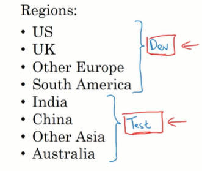

# 基础
## 是什么
准确来说就是训练神经网络的一些经验
防止你在错误的方向上越走越远

本章多是经验
# 正交化
## 是什么
正交化大体指的就是可以1次只调整一个东西
并且调整这个东西，不会影响到别的东西

在训练神经网络时调整超参数的时候，我们也希望: 
⭐ 面对当前问题，我们进行了一种调整, 这个调整只解决当前问题，而不会让我们以前调教好的参数需要重新再调教一遍. 这就是机器学习中的正交化

## 正交化
### 正交化举例
假如说现在你有一个投影仪，该投影仪上有几个按钮可以让你操纵投影的位置, 你现在的目标是把投影的位置摆正, 并且让大小, 颜色也合适

但你却发现, 比如你现在大小调好了，你想要调整位置，结果一条位置大小也跟着变
你现在位置调好了你想要调整颜色，结果发现一调整颜色, 位置和大小全部都变化了
这就很难调整这就不是正交化的例子

从数学的角度来说，正交就意味着两个向量垂直
或者说一个向量在另外一个向量上的投影长度为0
就意味着一个向量对另外一个向量没有影响
比如常见二维坐标系的两个坐标轴就是正交的
而下面这个坐标轴当中的那个向量: 他和横轴不是正交的，他和纵轴也不是正交的. 它是两个量的组合

### 正交化与神经网络 ⭐
神经网络中也有很多可以调整的地方
我们也很希望当我们调整一处的时候，不会影响到其他地方

举例来说，如果你的神经网络在训练集上工作的不好, 那你可能要增加你的神经网络的层数或增加神经元. 或者采用更加高效的梯度下降算法，比如Adam梯度下降

现在假如说你的神经网络在训练集上工作的很好，但是在验证集上准确率不高
那你可能会想着要增加正则项, 因为可能此时你的模型过拟合了训练数据.
但你就很希望: 添加正则项这一个操作是正交的: 它只会影响到当前模型在验证集上的表现，比如让当前模型在验证集上工作的更好，但它不会降低当前模型在训练集上的表现 ⭐

假如当前你的模型在训练集和验证集上工作的都很好, 但在测试集上工作的不好
你就再次需要调整你的模型, 比如你需要增加验证集的数据数量: 此时很可能你的模型过拟合了验证局当中的数据
你也希望增加验证集的数据数量，这个操作是正交的: 它不会影响你的模型在训练集和验证集上的表现

而如果你训练好的模型在训练集验证集和开发集上表现都很好，但用于真实世界是表现的不好. 那你可能需要重新找一个损失函数，或者你可能需要重新切分训练验证和测试集的比例.
你也希望这个操作是正交的，他不会影响到前面你已经调教好的东西

视频中说上面罗列的这些调整方式都是正交的. 调整他们不会影响到之前调整的内容
TODO: 但我觉得恐怕没有那么正交吧...尤其是最后更换损失函数，它难道不会导致前面调教的各种超参数都需要重新调教吗
但应该大体来说这些操作可以解决我们当前遇到的问题: 比如在训练集上效果很好，但是在验证集上效果不好. 那么使用此处的解决方案，应当可以在不太影响已经调教好的超参数的情况下，让我们的模型变得更好
⭐ 个人理解也就是说我们使用这里的措施使用之后，一般不用再去调整之前已经训练好的超参数. 这就是正交化的意义
# 评估与优化指标
## 是什么
其实就是机器学习当中的那三个指标，精确率召回率和F1
在这里则叫做查准率查全率和F1

一定要先回去看一下机器学习的相关章节
## 单一数字评价指标 F1值
### 是什么
就是推荐我们使用单一数字评价指标来帮我们挑选模型
### F1值
视频中不推荐我们使用精确率和召回率这两个指标
因为它是两个指标，并且这两个指标是互斥的
假如我们训练了如下两个模型，它们的精准率和召回率如下

可见A和B两个模型，一个精准率高, 召回率低
另外一个精准率高, 但召回率低

因为有两个指标的存在，我们很难决定到底是哪个模型效果更好
此时作者推荐使用F1值: 因为它可以综合精准率和召回率

这里根据F1值应当选择A模型

⭐ 但是在刘宇波的章节，他推荐我们根据具体的情况去选择精准率高或召回率高的模型. 我觉得这两种说法都有合理之处
### 错误的平均率
这应该不是一个算法，仅仅是一个举例
他说假如我们训练了abcdef这么多个模型
它用于识别小猫，可以识别us China，India和其他地区的猫
因为不同地区的猫有不同的特征，所以这些模型在不同地区可能错误率也有所不同
我们统计这些模型在不同地区的错误率，但很难一眼看出，哪个模型总体上来说更优秀

视频推荐我们还要去计算一下错误率的平均数，这样就很容易找到最优秀的模型了

不过个人理解，他这里仅仅是这样给一个例子
在机器学习章节其实我们学过对极度有偏的数据, 单看它的准确率(这里的单看错误率其实就是另一种单看准确率)其实并不能验证模型的准确性. 不过这里的意思我们能领会到就行就是将多个指标统一为1个指标
## 满足指标, 优化指标
### 原理
这是两种设置指标的方式
有时我们需要根据这两种指标来选择我们的模型
比如我们训练了ABC3 个模型，我们关心这三个模型的准确率和运行时间
这个运行时间指的是训练好之后, 给定它一个样本，它进行预测的时间
比如我们知道knn这种算法训练好之后，如果样本数量过多的话，那么它预测一个样本也需要花费大量的时间

对这两个指标我们要求: 
准确率: 越高越好，这是一个优化指标
运行时间: <=100毫秒，这是一个满足指标，只要满足<=100毫秒，我们就不再关心该指标了(至少没那么关心了), 但我们会始终关注准确率这个指标

如果有n个指标的话，那么经常的: 有一个是优化指标，我们要求它越好越好
剩下的是满足指标: 它们必须满足最低要求
还挺常见的这种情况
# 训练/验证/测试数据集
## 如何划分
### 训练验证和测试数据集应当来自相同分布
 前面我们也说过这个

这里给个具体的例子
假如你收集的数据来自如下8个国家
你将前4个国家作为训练集和验证集
后4个国家的数据作为测试集

这就是一个非常坏的划分方法
因为在你训练整个模型的过程中，可能会花费数个月的时间来调教各种超参数，使其在dev这个集合上的表现尽可能的好, 它很可能会过拟合前4个国家的数据

从而导致它真正投放使用的时候，在后4个国家的数据上表现的很烂

正确的做法是从这8个国家的数据中都随机抽取, 对随机抽取的数据(或者说洗牌之后的数据)划分为两部分作为训练集和测试集

⭐ 其实这是一个老生常谈的话题，但在真正做项目的时候，一定要确认你的训练数据来自相同分布. **这是一部必要的前置验证，否则你很可能白忙活了**
### 数据集的大小
其实前面已经讲过了
在机器学习时代我们的数据样本一般较少比如少于1万个
那很可能按照七三分来划分训练集和测试集
或者按照6:2:2来划分训练集，验证集和测试集

但在大数据时代，比如有100万以上的数据
那我们就会将绝大部分的数据，比如99%的数据用作训练模型，因为深度学习模型需要大数据
剩下的部分评分作为验证集和测试集，因为测试并不需要那么多的数据

在大数据和神经网络时代的话，我们之所以要增大训练集: 是因为神经网络需要大数据来训练 ⭐
而对于测试集: 如果测试集越大，那么测试出来的分数就越准确，也就意味着我们的模型的评估的可信度就越高. 但一般情况下，比如有100万条数据，抽出1万条或最多抽出10万条就够了 ⭐

而验证集之所以英文叫做dev: 是因为它切切实实参与了开发，参与了模型调教，所以模型可能会对它过拟合.  Test数据是万万不可参与模型调教的，只可参与模型评分 ⭐

有些时候可能有些人只把模型划分成了train和dev，也就是不使用test: 但这并不是一种常见的做法, 也不太推荐
## 修改指标与数据集
我们一般使用一个指标来判断训练出来的模型的优秀程度
比如使用错误率
假如这是两个模型的错误率，这两个模型都用于识别图像中的小猫

但你接下来发现, 虽然a模型错误率更低，但是更应该部署b模型
也就是你当前的指标，其实不能严格地反映实际: 此时你要么应当改变指标的算法，要么应当改变数据集

举两个例子为什么会出现指标无法反映实际的情况
假如第1个模型它虽然错误率只有3%: 也就是它能识别出图像中的大部分小猫, 但他犯错的时候却倾向于将一些色情图片识别为小猫. 这对公司来说是不可接受的, 因为他可能要用这个算法来向用户推荐可爱的小猫的图片，但该模型就会偶尔推荐一些色情图片
第2个模型虽然错误率有5%，但他犯错的时候可能会推荐过去一些小狗小狐狸之类的. 这是可接受的, 所以公司决定部署第2个模型

这里出现最大的问题是我们的指标无法真正给我们提供参考了
此时应当修改我们的指标，找到一个新的错误函数: 比如如果错误地将色情图片识别为小猫的话，就加重对他的惩罚, 将其当做一个严重错误(也就是增加该错误的权重, 比如如果发生这种情况的话，就让损失函数损失的更多)
使用这个新的损失函数指标来评价AB模型得到的指标就是可供参考的

还有的时候指标无法参考，是因为
比如下面a模型的错误率只有3%
B模型的错误率只有5%
但是当部署到实际环境中时却发现B模型效果更好

后来发现原因是我们在训练ab模型的时候使用的都是网上的高质量图片
但用户上传的都是随手拍的模糊图片
模型a过拟合了网上的高质量图片模型并没有那么过拟合，所以反倒模型B对于用户上传的图片识别的准确率更高
⭐ 这告诉我们我们训练验证和测试神经网络模型所用的数据要和真实环境中的数据同源 ⭐⭐⭐

此时我们应当修改: 使用用户上传的模糊图片来训练我们的模型
⭐ 总而言之，如果我们设定的指标无法帮我们正确决策的话，那么要么修改评价指标，要么修改数据集. 往往是这个样子
# 改善模型的表现 `3个错误率, 2个差值(可避免偏差, 方差)`
## 是什么
文章主要是介绍了三个错误率的概念

人类水平的错误率
我们训练的机器学习模型的错误率
以及理论上最小的错误率: 贝叶斯最佳错误率

然后使用这种错误率指标，+看看我们模型在训练集和验证集上的误差
来指导我们去优化偏差还是方差(去解决欠拟合问题还是过拟合问题)
## 贝叶斯最优错误率
### 贝叶斯最优错误率
贝叶斯最优错误率指的就是理论上可以达到的最低错误率
或者说是理论上神经网络或机器学习可以达到的最好效果
 
我们经常可以发现这种情况就是随着时间的推移，我们机器学习模型的正确率不断增加
但是在超越人类的表现不久之后，它的正确率增加速度就没那么快了
也很难达到贝叶斯最佳错误率

TODO: 这个贝叶斯最优错误率是怎么计算的, 它 = 100%吗
### 机器学习错误率, 人的错误率, 贝叶斯最优错误率

这个图描述起来就是机器学习模型在超越人类之前进步的很快
在超越人类水平之后进步的很慢
并最终无法达到贝叶斯最优错误率

出现这种现象的原因是
第1: 大多数机器学习所解决的任务中，其实人的正确率就很高，他离贝叶斯最优就没有那么大的差距. 所以机器学习模型的表现超过人类表现之后，其进步速度会变慢
第二: 当机器学习的准确率过低，尤其是低于人类表现的时候，其实我们可以找到很多工具来帮助他进步
比如可以人工标注数据来帮机器学习训练
比如可以人工审核分析错误原因(人工错误率分析)
比如可以更好的分析偏差和方差
TODO: 这个不太理解

只要模型比人的能力差，人就可以使用如上三种方式或还有其他的方式来帮助机器学习模型
但是当机器学习模型准确率上去之后, 人也不知道该怎么帮助他了

视频中说，其实有的模型正确率可能会超过贝叶斯正确率, 此时可能发生了过拟合
## 可避免偏差
这是吴文达说的一个概念，他说该概念可能并不常用

它指的是我们评价机器模型的错误率是不应当以0%的错误率作为基准线而应当以贝叶斯或者是人类的错误率为基准线(因为贝叶斯和人类的错误率是相当的)

比如说当前模型
在训练集上的错误率是8%
在验证集上的错误率是10%

如果你使用10%的错误率作为基准线或者说作为目标: 你会发现当前这个模型错误率有点太高了, 他有点欠拟合的意思. 所以你可能会集中火力去增加拟合程度, 但这个方向可能是错误的

因为其实应当以贝叶斯错误率或人的错误率为基准，比如说此时贝叶斯错误率是7.5%，也就是理论上，最好的情况下你也得犯7.5%的错误
而此时训练集的错误率是8%，他已经接近理论上的最佳值了
但在验证集上的错误率是10%, 这样来看，可能我们的模型过拟和训练集了, 导致他在验证集上的效果不是很好的话，此时我们其实应当添加正则项去取消过拟合

可见不同的判断基准可能会导致你采取完全相反的操作

定义: 贝叶斯最佳错误率和你在训练集上的错误率相减，得到的就是可避免误差. 比如在这里就是8%-7.5%=0.5%

不过个人理解, 还是以贝叶斯作为基准线比较好, 因为机器学习模型在许多情况下确实是可以比人做得好的. 如果现在模型在训练集上做的没有人好，则代表它可能确实存在进一步优化的空间, 确实可以进一步增强它的拟合程度

TODO: 而且应当怎么找到一个模型的贝叶斯最优错误率呢，尤其是针对我们当前的具体任务
看视频中的意思好像它并不是算出来的，而是它比当前人们公认的人类最优错误率还要低一些，这大概就是贝叶斯最优错误率
⭐或者说你可以使用对人类水平的大概估计来近似贝叶斯最优错误率: 贝叶斯最优错误率<=人类水平错误率. 这种方法更可行一些, 在确定好贝叶斯最优错误率之后, 你就可以决定到底是优化偏差还是优化方差(或者说优化建立和问题还是过拟和问题)
但如果现在已经有模型超越了人类的错误率, 此时的贝叶斯最有错误率就会变得难以估计. 因为之前都是使用人类的最佳水平来估计贝叶斯最佳错误率
参见超越人的表现章节
## 人类水平错误
### 人类水平错误
 Human level ever
 

视频中说，对于人类水平错误其实在论文中很常见，但大家对他的理解并不一样

有的是拿人类水平错误去近似贝叶斯最优错误率
有的人拿人类水平错误去表示"一种可以部署上线的错误率", " 普通从业者的错误率" "普通人的错误率"

举例来说
假定下面的4个错误率是针对某种疾病诊断可能会犯的错误
普通人可能会犯3%的错误
普通医生可能会犯1%的错误
友有经验的医生可能会犯0.7%的错误
有经验的医生团队可能会犯0.5%的错误

⭐ 如果拿人类水平错误去近似贝叶斯最优错误率的话，那么此时的人类水平错误指的应该是0.5% ⭐注意这也是求解贝叶斯最优错误率的一种方法
而如果拿人类水平错误表示"可接受或可以部署上限的错误率", 那可能它指的是1%，也就是说我们当前的系统相当于一个普通医生, 和普通从业者的水平差不多，可以部署上线了
### 超越人的表现时如何调校
视频中说如果现在的算法已经超过了人类的表现
那么可避免误差就很难指导人去调整偏差还是方差了(之前我们一直使用，可避免误差的大小来指导人们调整偏差还是方差)

但现在假如说机器学习模型的错误率已经<了人类的最佳错误率
比如在某个问题上，人的错误率是1%
机器学习在训练集上的错误率是0.5%
机器学习在验证集上的错误率是0.6%

第1个问题就是，此时我们无法估计贝叶斯最佳错误率了，之前我们都是使用人类最佳水平来估计贝叶斯最优错误率
此时显然贝叶斯最优错误率要<人的1%的错误率, 其实也要<=当前机器学习的0.5%的错误率
难以估计贝叶斯最优错误率, 也就难以计算可避免误差, 也就难以使用具体的数值去指导我们调教偏差还是方差

但个人理解，此时我们仍然可以偏差方差都往下调教吗, 不用什么方向指导，有本事你将在训练集和验证集上的错误率都调整到0.3, 这也没什么问题吧
## 使用这些指标指导你的模型构建 ⭐
首先你的模型应当尽可能的到达贝叶斯最优错误率
或者换句话说，你应当尽可能的减小可避免误差
也就是让你的模型在训练集上的正确率尽可能的高

其次你应该尽可能的减少方差
也就是让你的模型在测试集上的正确率尽可能的高

要达成这两个目标，都有一系列的正交方法: 使得可以达成一个目标的情况下，不影响别的方面的性能

# 误差分析
## 是什么
误差分析就是去分析一下你的模型为什么犯错
这里给定误差分析的标准流程
## 人工误差分析
### 遇到的问题
假定你有一个识别小猫图片的分类器
其错误率是10%，还挺高的
你发现它会将一些长得比较像猫的小狗的图片当做是小猫

你有一个想法: 训练一个能够分辨小狗的分类器，然后让他和你的小猫分类器协同工作，从而让你的小猫分类器获得更高的准确率

但你这个想法很可能花费几个月去实践，却发现最终效果并不好

下面给定一个标准的错误分析流程，让你快速确定往某个方向尝试是否正确
### 标准的错误分析流程
注意下面会涉及到一些手动分析的内容
在某些研究者看来, 开发深度模型的时候，手动分析样本是一件不好的事情, 但视频中并不这样感觉. 我也觉得人工检查造成错误的数据是很重要的

针对上面小猫的例子，因为它识别的错误率有10%, 比较高
此时我们抽出识别错误的100张图片, 看这100张图片当中有多少张是小狗
假如只有5张是小狗: 那我们没有必要设计一个专门识别小狗的模型，因为即便这个专门识别狗的模型能够到达100%的正确率，它也仅仅是能从这100张图片中把那5张关于狗的图片给排除掉, 我们的错误率会下降到9.5%，下降的不多
假如有50张都是关于小狗的图片，那我们可能就有必要去专门设计一个识别小狗的模型了，因为它可能能将我们的错误率从10%降低到5%，这其实是一个很大的降低了

更标准的流程如下
针对抽出来的100张错误照片大体观察一下，确定几个主要问题
比如这里确定了三个问题: 小狗被错误识别成了小猫, 其他的大型猫科动物被错误的识别成了小猫还有因为图片模糊造成的识别错误

接下来把这三个错误罗列成表格，然后仔细看每一张图片看它归属于哪种错误
并且可以添加一栏注释: 比如注释，这张图片模糊是因为下雨导致的
并最终计算出错误的百分比

在这个过程中，你可能会发现其他类型的错误那就再添加一列: 比如因为图片旋转导致识别错误
有的时候一张照片可能犯了多种错误

找到最大量的错误优先解决
# 数据清理
## 是什么
## 清除错误标注Y
标注是人工添加的，难以避免的会有失误
比如下面蓝色方框的小狗就被标记为了小猫

 So

遇到这种标签错误该怎么办呢
视频中说深度学习模型其实对随机错误还是挺健壮的，随机标错几个标签，其实并不影响我们训练出来的模型的准确性
许多时候只要错误是随机的并且占比不大，其实在训练集中可以不去处理这种标注错误

但深度学习对系统性的错误一点也不健壮: 如果有个标注人员始终把白色的小狗标注为小猫, 这就是个系统性错误，那么深度学习很有可能会学习到这个行为，导致他对白色的小狗始终判断为小猫

视频中说对于验证集和测试集当中的标签错误, 其实也没有那么重要, 如果是比例不大的随机错误的话，许多时候也不需要专门去处理
但更稳健的做法是, 假如当前模型的准确度评定已经得出来了，错误率是10%，然后我们手工做错误分析
如果发现这10%的错误中有0.6%的错误，是由于标签标错造成的
剩下的9.4%的错误是由于错误的将小型犬识别为小猫造成的
那我们就可以先不去管这种错误标签, 而先处理小型犬的问题

但如果这10%的错误中, 其中有3%的错误是由于标签造成的，剩下7%的错误是由于小型犬造成的
那么此时可能就有必要去清理一下错误标签了
因为此时, 在当前测试集下，你评定出两个模型的错误率分别是2.1%和1.9%. 这个数据就是不可信的了, 标记出错在此时造成的干扰实在是太大了

下面有几条原则
⭐ 如果确定要对错误标签进行清除，则在训练集验证集和测试集上都要进行清除. 以此来保证清除之后训练集验证集和测试集仍然属于同一分布
但视频中说如果要清理训练集的话训练集中的数据往往非常非常多, 其时间成本可能不可接受. 
其实也可以只清理测试集或者清理测试集和验证集, 这样会导致测试数据和训练数据来自稍微不同的分布，但这有时也是可以接受的. 后文也有如何处理轻微不同分布的数据的办法
⭐ 在寻找错误标签的时候, 不要仅仅从模型判断错误的那100张照片中寻找, 这样会有遗漏. 应当从所有参与训练和测试和验证的数据中都寻找. 不过这就会导致要找的范围大大增加
个人理解应当还是判断错误的那一些图片中标签错误的可能性更大一些, 可以优先从判断错误的图片中找
⭐ 还有个人理解，如果你要评估两个性能相差无几的模型, 那么最好清除掉标签中的错误数据. 否则尤其是测试集中的标签错误带来的扰动, 会导致你的评分压根不可信
## 处理不同分布的数据
## 切割不同分布的数据 ⭐
在实践时，其实有些时候你不得不面对不同分布的数据
尤其指的是训练集和测试集的数据来自不同的分布

前面说的只清理测试集的错误标签，会导致这种数据到的不同分布
但更常见的时候比如还是识别小猫的这个程序，你现在从网上爬取到了20万张高清的小猫图片, 然后你手里还有1万张用户随手拍的小猫图片
你最终的模型要处理的大部分数据是用户随手拍的数据，你希望你的模型在用户随手拍的小猫图片上能取得更好的效果

一种方法是将你手头已有的1万张随手拍的小猫图片，用作测试集: 这会造成训练和测试数据的非常不同的分布，一般不推荐这样做

第2种方法是将这21万张图片混合洗牌，然后再做切分
这也有一个缺点，就是切分出来的每个集合中其实绝大多数都是网上下载的高清图片，而用户随手拍的图片仅占少部分比例
此时训练出来的模型可能仍然只是在网上下载的高清大图上正确率更高
这导致最终你对模型进行评分时及时获取的评分是: 该模型在大部分图片是网络图片，少部分图片是随手拍图片，这种数据上的准确率. 当你把模型投入到真实环境中，上传的都是用户随手拍的图片，你会发现模型的准确率远远没有测试时那么高

⭐一个更好的划分做法是将20万张网上高清大图完全放在训练集，并且将5000张随手拍图片也放入训练集，此时训练集中有205,000张图片
然后将2500张随手拍用作验证集
将剩余的2500张随手拍用作测试集
这个的好处是: 首先我们正对了目标. 我们最终获取的测试评分就是当前模型在用户随手拍图片上的准确率 
其次是训练集中也有一部分随手拍数据, 不过比例不多，如果仅在训练集上进行训练，其实模型还是更拟合网上的高清大图
但验证集中又全部都是随手拍数据，它可以矫正在训练集上训练出来的模型对网络高清大图的过拟合现象
总体来说这是一种比较好的划分方法，不过也可以注意到此时训练集 vs 验证集和测试集 这两者之间的数据分布并不一样
但此时是可以接受的

TODO: 有没有过拟和验证集，但是欠拟合训练集的情况存在
## 不同分布数据的偏差与方差: `4个错误率, 3个差值`
### 是什么
如果训练集 vs 验证集和测试集来自不同的数据分布的话，那么在分析方差和偏差时也会遇到问题
### 遇到的问题
假定你的训练集验证集合测试级数据来自同一分布
现在你的模型在训练集上的错误率是1%
在验证集上的错误率是10%
因为你的数据都来自同一个分布
所以此时你可以大胆的说，模型存在方差问题. 也就是他过拟合了训练集上的数据(可能是学习到了训练级数据上的噪音)

但如果你的训练集和验证集来自不同分布呢: 此时就不能说我们的模型存在方差问题了
可能这个错误率上的不同仅仅是数据的不同带来的，比如在训练集上你用的是高清小猫图片，在验证集上你用的是随手拍小猫图片. 那很可能即便我们模型训练的不错, 那他在验证集上的效果也不好, 因为数据分布都不一样
### 解决方案: training dev数据集
现在我们假定将数据切分为三份
第1份是训练集: 他来自一个分布
第2份和第3份试验证集合测试集: 这两者来自另外一个分布

然后我们对训练集进行随机刷新一下，从中切分出来一小部分作为training dev数据集

现在也就是训练集和training dev数据集: 来自同一个分布
验证集和测试集: 来自同一个分布
也就是黄色部分是同一个分部的话，绿色部分是另外一个分部
接下来我们再说训练集，指的就是: 原来的训练集排除掉training dev数据集剩下的部分

我们在训练集上得到的错误是1%
然后在training dev数据集上进行验证得到的错误是9%
然后在验证集上进行验证，得到的错误是10%

因为训练集和training dev数据集来自同一分布，在同一分布上还有如此大的错误，那只能代表我们的模型就是过拟合了，训练集当中的数据此时应当添加正则项之类的来取消过拟合
此时我们的模型中确实存在方差问题: 此时的方差指的是training dev数据集的错误率-训练集上的错误率, 在这里是8%. 有方差问题就需要使用正则化等手段来取消过拟合
方差指的是我们当前的模型泛化到**相同分布**的数据上的能力较弱. 上面计算方差也确实是在两个相同分布的数据上计算出来的，所以我们的模型确实有方差问题⭐

而training dev数据集的错误率和dev数据集的错误率相差并不大: 这部分误差就真的是因为数据分布不同而带来的

如果此时错误率变一变
在训练集上是1%
在training dev数据集上是1.5%
在验证集上是10%

根据上面的分析，此时我们的方差是0.5%, 方差问题不是很大
但因为数据不匹配，或者说数据来自不同分布，造成的误差是8.5%. 数据不匹配或者说data mismatch造成的错误率很大

如果错误率再变一下 ⭐
假设贝叶斯最佳错误率是0%
我们在训练集上的错误率是10% (此时可避免偏差是10%)
在training dev数据集上的错误率是11% (此时方差是1%)
在验证集上的错误率是20% (此时数据不匹配是9%)

此时我们的训练集存在着严重的偏差问题, 也就是欠拟合
然后方差问题不严重
然后数据不匹配的问题很严重(也就是训练集和验证集的数据来自不同分布)
### 总结 ⭐⭐⭐ (4种错误率, 3个差值)
上面我们其实就是介绍了4种错误率
以及三个指标: 可避免偏差, 方差, 数据不匹配
他们的计算方式也已经列出来了

其实还可以+一个在测试集上的错误率
看最后一行，这个12%-12%这里 = 0%，其实就是我们的数据对验证集的过拟合程度
⭐ 视频中说，如果对验证集发生了过拟合那可能要增大验证集的数据量

### 补充: 奇葩的情况
有时你可能会遇到这种情况
比如你在训练集上的错误是3%
在training dev数据集上的错误是6%
在验证集上的错误是2%
在测试集上的错误率是2%

3%和6%意味着你的模型对训练集发生了过拟合
但让人惊讶的是，当前模型在验证集和测试集上的错误率极低, 比上面两个都低
视频中说有的时候是因为验证集和测试集来自同一分布，而该分布当中的数据都比较容易识别
而训练集和training dev数据集来自另外一种分布: 该分部中的数据比较难以识别
就会发生这种诡异的错误率

视频中说在语音识别项目中可能比较常见, 语音识别中的验证集和测试集中的样本可能会更简单更容易识别
## 解决数据不匹配问题
### 要解决的问题
在上一小节其实我们推导出了4个错误率和三个差值
这三个差值分别是: 
第1个差值可避免偏差, 其实就是在训练集上的错误率-贝叶斯最佳错误率, 它过大的话就代表我们的模型存在很大的偏差，需要进一步进行拟合
第2个差值就是方差, 其实就是training dev数据集的错误率-训练集的错误率. 或者是相同分布情况下的验证集的错误率-训练集的错误率
如果这个数过大的话，代表我们的模型存在较大的方差问题他过拟合了训练集当中的数据. 此时需要采用正则化等手段来取消过拟合
第3个差值就是数据不匹配带来的误差其实就是来训练集和验证级数据来自不同分布时，验证集的误差-training dev数据集的误差
这个数据不匹配的问题该怎么解决呢
### 解决方案
其实没有太好的解决方法，但有一些可以尝试的方案

假如说现在我们的训练集来自一个数据分布
验证集合测试集来自另一个分部

并且因为数据分布的不同导致了误差

那么接下来我们一般要进行错误分析，一般是查看验证集和训练集找到数据到底哪里不同

比如对于语音识别任务你可能会发现验证集中的数据有很多的噪音
而训练集当中的数据没有噪音

这是所谓的数据分布不同的具体点之一
那你就需要尽可能的让两种数据的分布比较相似

比如你可以给训练集中的数据也添加噪音
比如此时人工合成数据就是一种解决方案
### 人工合成数据
比如你要给一段清晰的话+嘈杂的背景音
你就可以人工合成

但人工合成也有一些注意事项

比如你有1万个小时的人，说话的声音
但你只有一个小时的汽车噪音

你现在需要把这两个数据进行合成，你可能会将这一个小时的汽车噪音复制1万倍，这样他们才能等长度的进行合成
但这样训练下来，你的模型很可能会拟合这个汽车噪音，因为他经常出现, 经常出现的数据可能会被模型认为是特征而不是噪音

还有一种情况是仅一个小时的汽车噪音，其实无法反映各种场景的噪音情况, 这一小段噪音仅仅是全部种类噪音这个集合当中的一个小子集. 可能人听不出来，但如果我们的模型没有见识过大量的真实的噪音，或者说没有见识过这个噪音集合的小子集之外的部分, 那我们的模型在真实场景中可能就不会运转的太好

总而言之，合成的数据没有真实采集的适用性那么强
 
# 系统构建, 快速迭代
## 是什么
## 快速构建第1个系统
视频中推荐，当你要在某个领域建立一个深度学习模型来解决某个问题时
推荐你快速构建起你的第1个深度学习系统

先不考虑数据收集的问题
假定你已经拿到了数据
快速将你的数据切分为训练验证和开发级
然后快速的构建起你的第1个神经网络, 不用太过于考虑超参数
然后拿一些数据去训练他，并看一下他的准确度
关注一下它的偏差和方差，决定你接下来调整的方向, 对偏差和方差作出一些比较标准的调整
可以在一系列比较粗糙的调整之后, 去做错误分析: 着重看一下当前模型出错的数据, 对这些出错的数据进行统计和分类，你往往能够确定当前问题遇到的主要麻烦

比如你很快就会发现语音识别遇到的大量错误是: 比如用户离麦克风太远，比如背景有杂音等等

这会使你快速形成对该问题的认知: 包括某个神经网络模型对该问题的准确性有多少, 该问题最可能遇到的挑战是什么

⭐ 这件事的要点是不要把你的第1个版本的系统想的太复杂，尽快的实现并验证并分析问题, 并不断的迭代和尝试, 这主要适用于拿神经网络模型去解决一个新领域的问题. 快速而粗糙的构建模型并验证效果，其实非常适合研究新问题, 千万不要一开始就想着要搞出一套完美的模型, 然后许久都不开始实践

⭐ 视频指出这种方法适用于拿神经网络去解决某个新领域的问题，对于比较成熟的研究领域: 或许去看一些书籍教程和专业论文，更能够快速构建起你对该领域问题和解决方案的认知
# 迁移学习, 多任务学习, 端到端学习
## 是什么
用从一个任务中学习到的知识
来解决另外一个任务

这就是迁移学习
## 迁移学习
### 做法
假如下面这个神经网络模型是一个识别小动物的神经网络模型
它已经训练好了，并且正确率不错
现在你想将该模型用于识别医学领域的X光片上

此时你仅仅需要拿掉最后一层输出层, 前面的曾和前面曾训练好的参数保持不变
然后添+一个新的最后一层, 这个新的最后一层赋予初始化的新的随机权重
然后针对当前模型进行训练即可

如果你的医学X光片样本比较少
你可以不改变前面任何一层的训练好的权重，而只训练最后一层的权重, 或者只训练最后几层的权重(让反向传播，仅在最后几层传播，然后就停止)
如果你的医学X光片样本比较多，你也可以让反向传播在所有层上进行: 调整每一层的每个神经元的权重w和偏置b

TODO: 这个迁移可以从二分类迁移到多分类吗

像这种拿小动物图片训练出来的调整好的模型可以叫做预训练模型, 这个过程叫做预训练pre training
然后又使用X光片图片对这个模型的权重进行微调, 这个过程叫做fine tuning
谷歌的bert就是这种迁移模型的结构

其实从另一个角度也不妨理解为
如果没有迁移学习，则我们识别X光的这个模型的权重w和偏置b就是随机设置的
如果有迁移学习，我们就可以使用训练好的识别小动物的模型当中的w和b来设置我们识别X光的这个模型的w和b
总而言之，一种是随机参数初始化，一种是使用别人的模型进行参数初始化 ⭐

而从知识学习的角度来说，就是将从识别小动物当中学到的知识应用到识别x光

注意有时也不单单是仅拿掉输出层，然后添加一层输出层
你也可以往其中多添加几层, 是否这样做更多取决于你手头有多少数据
TODO: 那我能不能多拿掉几层

此时训练的时候可以只训练我们新添加的层，也可以将老的层也训练一下
### 原理
视频中说，比如对于图像识别
一开始的模型用于识别小动物
其实它会学到一些很底层的特征, 比如什么是点线，什么是边缘等等
这些知识在识别X光的时候仍然有用
TODO: 好像是说越靠前的隐层, 学习到的越是底层特征. 那高层特征也就是靠后的几层，不需要拿掉吗
TODO: 还有为什么靠前的层学习到的是底层特征
如果越往后的隐藏学习到的越是高级特征的话，那他们在迁移学习时就越需要被调整

个人理解: 应当是迁移的任务越相近，那么迁移的效果就越好
适用场景
### 适用场景
首先从任务a迁移到任务B要求，这两个任务有着相同的输入，比如输入的都是图像的像素
并且个人理解，两个任务越相近迁移学习效果越好

其次要求
适用于针对迁移来源问题，你有很多数据. 比如上例当中的识别小动物
但针对迁移目标问题，你只有很少的数据. 比如识别X光
反过来就不适用了

最后个人理解，如果你手头关于迁移目标问题就有很多数据，那不妨直接训练而不要迁移了
不过此时使用迁移一下可能可以加快一些训练效率
### 优点
许多时候我们手头没有那么多的数据集
别的大型公司或科研机构，他们有很多的数据集，他们就可以先执行预训练调节参数
比如预训练出来一个图像识别模型
该模型一般已经有非常好的效果了，因为它可能是在数以千万计的数据集上训练出来的, 它的权重之类的已经调教的非常好了

然后我们再拿到这个预训练的模型，利用我们手头有的数据，或者根据我们手头要处理的具体任务进行微调
我们手头的数据量较小, 直接拿我们手头的少量数据进行训练的话，其实未必见得训练出来的深层神经网络模型有多好的效果
现在我们可以拿手头仅有的数据来微调, 尤其是微调最后几层, 可能整体效果会更好一些

还有个例子
比如你要训练一个识别出来唤醒词的语音识别模型，比如"小爱同学"
那你迁移前的模型可能就是一个普通的语音识别模型，它使用大量的数据训练好了
迁移后的模型就是使用你手头少量的"小爱同学"的录音来基于训练好了的语音识别模型进行微调

## 多任务学习
### 是什么
### 多任务学习神经网络
#### 是什么
其实和softmax网络非常相似的
仅仅是将最后的输出层替换掉

当然跟着的还要替换损失函数，代价函数之类的
#### 原理
比如在自动驾驶任务中
我们的传感器拍摄了一张前方的图片
我们要同时识别出来，这张图片中是否有别的车辆行人交通灯停车标志等等
也就是此处要一口气检测4个目标
那我们输入一张图片也就是一个样本，x，得到的就不是一个y^
而是一个y^列向量, 其中包含4个分量，第1个分量是: 图片中是否包含行人，如果是的话则标记为1，不是的话则标记为0
第2个分量表示图片中是否包含汽车
第3个分量表示图片中是否包含停车标志牌
第4个分量表示图片中是否包含交通灯

此时我们如果要训练多个样本，也就是多个x，也就是输入多张图片
那么得到的预测结果以及真值y, 他就成了一个矩阵
距震中的每一列是一个样本的预测，结果: 每一列当中包含4行

#### 神经网络
此时我们构建的神经网络模型如下所示
注意它的输出层，也包含4个神经元
但是不同于多分类任务: 那个4个神经元是, 它是否归属于该分类4个神经元加在一起的概率和是100%
这里的4个神经元指图片中是否出现了该物体，所以这4个神经元加起来最大是400%，最小是0%
前者是我们要检测的4个物体都出现了，后者是我们要检测的4个物体都没有出现

#### 损失函数
视频中说它使用的还是逻辑回归当中的损失函数
因为我如果我们要识别图像中的4个物体: 其实就是做4个二分类
比如图片中是否有汽车: 如果有汽车，则该神经元输出为1, 否则输出为0. 所以这个神经元是一个二分类问题
同样的是否有行人，有的话输出为1，没有的话输出为0，所以第2个神经元也是一个二分类问题

二分类问题的损失函数就是逻辑回归当中使用的损失函数
这里测定的是最后一列4个神经元当中每一个神经元的损失

#### 代价函数
最后一列一共有4个神经元
所以要将每个神经元造成的损失相加
一共有m个样本，所以一共要对m个样本的损失相加
最后再除以样本个数，m

#### 反向传播
这个没有详细讲解
但个人理解和softmax很像
也就是会计算每一个w和b对每一个分类，比如汽车分类, 行人分类等等造成了误差
所以整体上还是在求偏导列向量
### 数据标注
#### 数据标注
同样的我们的数据也要将图片中是否出现了汽车，行人，停车，牌，交通灯这4项都标注出来
标注为1个列向量
如果存在的话则标注为1，不存在的话只要标注为0
#### 残缺的数据集也可以使用
假如说你现在手头的数据集对照片中是否有4个物体当中的某些物体做了标注，而某些物体没有做标注
这种标注和没有标注是随机的
比如第1张图片标注了其中有汽车没有行人，但剩下的项他都没有去做这个标注，或者说标注为问号
第2张图片里头标注了没有交通灯有行人，但剩下的项也都没有标注，或者说标注为问号

视频中说对这种数据也可以拿来训练
对于当前样本标注了的数据，我们就求他的损失，没有标注的数据我们就不搭理他，不求他的损失了
### 适用场景
个人觉得最重要的是你当前的任务就是和使用多任务学习来解决
就比如自动驾驶识别前方的物体这种任务

如果你训练的任务具有可共享的低层层次特征, 就适合使用多任务学习
比如上面的图像识别任务，不管是识别交通灯车辆还是行人，他们都是图像识别任务，它们底层的特征是相同的，此时就适合使用多任务学习

还有就是如果你要一块训练的这些任务的样本数量相近
比如识别，行人是一个任务，识别车辆是一个任务，识别交通灯也是一个任务，他们都有1000个样本
TODO: 这1000个样本指的是最终一共有1000张图片啊，还是说不知道最终有多少张图片，但这么多张图片中，一共标记出来了1000个行人，1000个交通灯....
视频中说这个规则并不绝对

还有一种情况是你要训练的任务对应的样本数接近, 但同时又都比较少
比如上面的例子，对于每个任务你有1000张图片
此时你可以进行多任务训练，它可能比你单纯的训练这1000张图片效果要好
比如你手头只有1000张行人的照片，你要拿着1000张行人的照片训练一个深度学习模型，可能样本数量太少了
但你手头还有1000张交通灯的照片, 1000张汽车的照片....假如你同时要训练10个物体的识别, +行人的照片，一共是1万张
此时你可以拿着1万张去训练你的模型: 使用多任务学习，它的效果可能比你单单拿1000张行人照片去训练识别行人的模型效果要好
其原理类似于迁移学习: 在别的照片中，哪怕这些照片中没有行人，我们也可以从中学习到一些低层次的特征，毕竟他们有9000张照片，数据量比我们大得多, 这些学习到的知识可以迁移到识别行人这个任务当中来, 以达到更好的效果
TODO: 那如果我要对这1万张图片进行多任务学习, 我是不是还要对他们重新标注一下，对这1万张图片都进行多任务标注，因为他们可能原来只是单任务标注

视频中说现在多任务学习没有迁移学习那么常用: 它一般用于计算机视觉当中的多物体识别
试用多任务学习的主要难点是: 我们要找到针对多物体的, 数量比较一致的样本数据集,这是比较困难的
### 性能
视频中说训练一个多任务学习模型，其性能一般要优于训练解决单个任务的单个模型
个人理解，这其中可能有共用一部分知识的功劳

研究发现，如果多任务学习模型性能低于单个任务模型，一般是因为训练的神经网络还不够大

## 端到端学习
### 是什么
### 端到端学习
以语音识别为例
在我们收集到语音材料之后，中间可能要经过很多个处理阶段
而端到端学习就是将中间的各个处理阶段都丢到深度学习模型中，让他去处理
TODO: 上面的这些处理阶段没有太理解呀
TODO: 而且都丢到深度学习模型当中去，难道不需要做标注了吗这不就成了无监督学习了吗

视频说端到端学习一般要求非常海量的数据量
如果数据量不多的话，那它的效果不如传统的流水线式学习

我的个人理解是
比如对于机器翻译
在原来的流水线过程中可能包含很多个环节，这些环节未必都是由神经网络去负责的
比如将英语翻译成法语, 我们可能需要先将收集到的英语资料做文本分析，做一大堆的中间步骤的处理，然后中间再放入一个神经网络, 拿前面分析出来的比较结构化的数据去进行训练, 最终输出法语, 或最终输出的也不是法语，而是需要再进行其他步骤的组合, 合成法语

但现在如果你有大量的从英语到法语的数据, 你可以直接让他们丢给神经网络，直接输入英语输出，法语中间的步骤都不需要了
如果数据量够大的话，这个神经网络的效果可能更好

最后以图像识别为例
这是一个手部的X光片，我们要判断这个人的年龄
传统的流水线式的作业方式是: 我们需要先将图片中的骨骼划分出来，然后准备一个数据表，该数据表中是不同年龄段骨头的长度
然后测量我们拿到的X光片各节骨头的长度，对照数据表做出预测
但在端到端的学习方式中，我们就是直接输入图片输出年龄了. 不过它需要海量的数据去喂养

### 适用场景/优缺点
#### 优点
第1个好处是让数据说话，而不必强迫神经网络一定学习人类的思考方式
比如在语音识别当中，人类语言学家发明出来了音素的概念，并且觉得想要进行语音识别，就需要先将语音划分为音素
但是在端到端学习中，我们就是直接将语音传进去并获得输出出来的文字. 具体怎么学习数据中的特征，完全交给了神经网络去处理

此外它需要更少的人工构建的组件，比如说如何将语音划分为音素，这种工作就不需要去做了
#### 缺点
需要大量的数据
TODO: 它为什么需要大量的数据, 可能是因为这个任务本身是复杂的, 此时就需要大量的数据和大的模型

第2个缺点是他可能将比较有用的人工设计的组件给排除在外了
因为它端到端整个过程不需要人来介入
视频中认为神经网络主要是学习知识，而他学习知识的两个来源，一个是数据，一个就是人已有的知识. 尤其是在数据量较小的时候，人已有的知识可能能提供很大的帮助
但端到端学习将人已有的知识给排除在流程之外了
人的知识是一把双刃剑，他可能帮助到神经网络模型，也可能伤害到神经网络模型
视频中说，在你的数据较少的时候，人的知识一般起到帮助作用，而如果你的数据量足够大，可能就不怎么需要人的知识了
#### 什么时候使用
你要有大量的数据, 来使得神经网络可以自行从数据中发现规律, 来解决x到Y的复杂映射

单纯的端到端学习一般是使用神经网络去解决一个很复杂的问题
如果将它们拆分为流水线形式，让人工介入设计一部分组件或做一部分处理，其实可以简化问题
所以端到端学习需要更大的数据，更大的模型

事实上有些时候端到端学习的性能, 不如将事物拆分为传统流水线的方式，并引入人工处理
比如在自动驾驶的过程中，你想要直接拍摄一张图片就获取方向盘的转角，从而让车子自动跑起来，其实是很难的. 此时并不适合用端到端来处理

但个人理解, 到底什么时候试用端到端, 许多时候也只能靠你自己摸索

# %auto-expand-line-742%