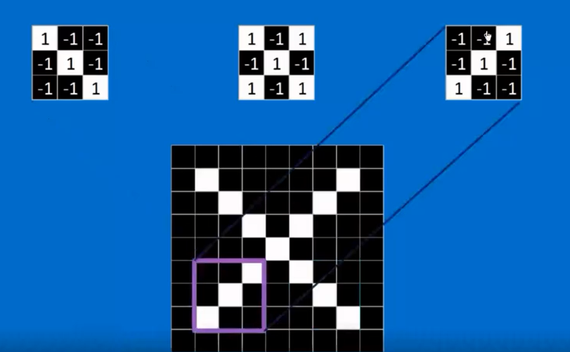
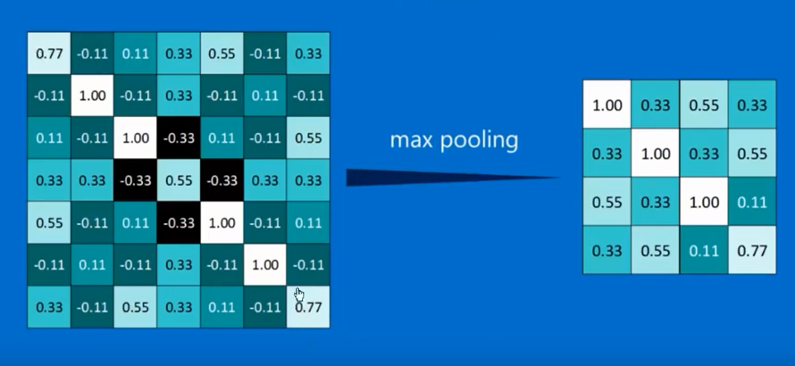

# 卷积神经网络的直观理解
## 是什么
这是网络上的一个课程
不是吴恩达的教程
## 解决的问题
仅用于先形成一个直观了解

卷积神经网络就是输入一张像素图片
通过神经网络之后可以告诉你这个图片是啥

输入x的图像, 输出的就是x这个字符
输入o的图像，输出的就是o这个字符
而且抗干扰性非常强，看下面不管是图像发生了旋转放缩加粗等都不影响输出结果

## 原理
卷积神经网络会识别图像的特征
比如下面两张图片虽然发生了旋转，但彩色方框内它的特征还是存在的

上图中给了三个特征
这三个特征就是三个卷积核 
我们可以使用任意一个卷积核去匹配图像，它就会将图像中符合该卷积核的地方给找到

比如这里就是用第3个卷积核，其实就是上图中的紫色部分去图片中进行匹配

卷积核大概是CNN的核心
## 具体运算
### 卷积核提取特征
黄色部分就是一个卷积核，它会在绿色的原图上进行滚动并运算
从而将原图提取为1个粉色的特征

其实你大体就可以理解为这个过程是在做图像匹配
如果图像完全匹配的话，就返回1代表100%匹配
如果图像部分匹配的话，大体可以理解为返回的是匹配的程度比如返回0.55就是55%匹配

我们拿左上角的卷积核对左边那个大的黑白图形进行卷积运算，也就是逐行的图像匹配
就得到右边的卷积之后的图片: 右边各个方框中其实写的都是匹配程度， = 1的话就代表100%匹配
看黄色部分, 其实他就是说在这一点上(个人理解就是卷积核的中心在这一点时), 图像和卷积核完全匹配, 此时就在这一点上写上一个1
个人理解，他这里之所以卷积后的图片变小了，应该和卷积核的移动路径有关系

我们使用不同的卷积核对原图进行运算，就能得到不同的卷积之后的图像
中间的那个乘号表示的就是卷积运算
其实对某一个卷积核小图片进行卷积运算，就是从原图中提取改卷积核所代表的特征
可以看到提取之后的彩色图片和小小的卷积核长得很像

事实上，如果你拿一个随随便便的卷积核去对原图进行运算，如果原图中压根不包含该卷积核所代表的特征，那最终形成的彩色图片近乎于是乱码

右边得到的彩色图片叫做future map, 特征图
### 池化 pooling (下采样)
池化用于对特征图进行缩小，而不是对原来的图片进行缩小 
TODO: 为什么要对特征图进行缩小呢, 个人理解，对原图进行缩小，才可能降低我们卷积核的运算量啊

下面是如何缩小卷积运算之后得到的特征图
比如这里是将特征图当中的每4个像素压缩为1个像素
至于压缩之后的这一个像素的选取策略: 有最大池化，就是选择4个值当中的最大值
也有平均池化，就是计算4个值的平均值

以最大池化为例，特征图就会被转化为右边的小图片

最终得到的效果就是大图压缩成了小图
可以看到在进行池化之后，它仍然保留了原来图像的特征: 从左上角到右下角有一条斜着的白方块儿 

则上面使用三个卷积核提取出来的三个特征图，都可以在进行池化缩小

### relu
我们还需要对这张图当中<0的单元格全部变成0 (大于0的只要不改变)
也就是全部变成右图的黑色方块
这个操作可以通过relu实现
视频中说这步操作可以也方便之后的矩阵运算和梯度下降

### 三步走

对原图进行卷积，relu和池化，然后就变成了右边三个小小的特征图

其实中间的那三个方框就是神经网络

卷积relu和池化可以铺开很多层, 相当于构建了一个深层神经网络
最终形成的就是越来越小的特征图

我们来看这张图
我们输入了一个手写数字4，也就是最底下那一层
然后往上一层就是对这个数字进行卷积，它生成了特征图
再往上一层就是对这个比较大的特征图进行池化，将它变成较小的特征图
再往上就是重复这些步骤: 再次转机再次池化

像我们得到的比较小的特征图，排成一个列向量

然后就能判断出输入的到底是X还是O了
这个过程本质上是通过神经网络训练调整权重得到的
说白了，左边的列向量就是当前图片的特征(被压缩成了这个样子)
这样一列就代表了输入的整张图片
然后神经网络会为这一列的每一个值赋予权重，这个权重会在神经网络运行的过程中不断调整学习
最后根据这一列特征就可以判断出是x还是o了

所以这本质上是一个特征，压缩的过程

我们说上面每一个方块都对应一个权重
这是它的权重视图，该权重和方框中的值相结合并进行运算，最终可以得出输入的是X还是O的概率

上面这个网络是全连接的，个人理解就是我们将图片压缩成了一个列向量和列向量当中的每一个值可能都比较重要，所以要全连接

而这个全连接层其实还可以放很多层

### 四步走
卷积核
池化
relu
全连接
### 总结
个人理解整个卷机的过程, 就是提取图片特征的过程, 最终将图片的特征提取为1个列向量，这个列向量就代表了当前图像最大的特征

接下来你可以理解为以该列向量为输入层，以输出x还是o为输出层, 中间添加几个全连接隐层，也就是针对该列向量进行训练了
其实就是针对压缩提取后的图片的特征进行训练
### 卷积核
卷积核其实也是神经网络学习出来的，而不是人手工指定的
卷积核就是一个数值矩阵, 他一开始是随机的: 但它是随机的就会导致非常大的误差(也就是卷积核无法正确的提取图像的特征), 所以在反向传播中就会修改卷积核, 这样卷积核就会被修改的越来越正确

所以个人理解，在CNN当中，神经网络学习两个东西: 一个是不断的调整卷积核来学习到正确的卷积核来提取图像的特征, 这样我们就能把图片转化为1个列向量. 说白了就是正确的找到图像的特征
学习到的第2个东西就是: 在全连接层当中，我们输入的是一个代表图像特征的列向量，输出的是x和o. 这个过程中神经网络要学习如何从特征列向量中判断输出x还是O，其实就是学习列向量中每个元素的权重
### 超参数
卷积核的大小
卷积核的数量

池化的窗口大小
池化的步长

全连接的层数和神经元个数

这些是需要人去指定和调整的
##  CNN用于其他任务
 CNN很适合图像识别
但它也可以用于其他任务
只要你的任务可以表示成这样的类似图片的像素矩阵
我们就能找到这个像素矩阵的特征

 CNN也可以用于处理音频和文本

注意这里有一个问题就是
必须是能够表示为像图片那样的像素矩阵的才能用CNN处理
而不是说只要可以转换为1个矩阵就能用CNN处理
因为有的数据虽然也可以写成矩阵的形式，但它的两列或两行是可以任意对调而不影响最终结果的，比如学生的成绩单, 你将两行对调，将张三写在李四的前面，或者将李四写在张三的前面，他表示的仍然是同一个数据，这就不能使用CNN来处理, 它就不是一个像图片那样的像素矩阵
 
# %auto-expand-line-156%