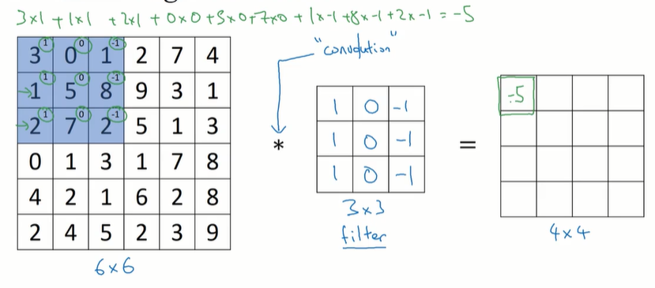
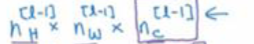
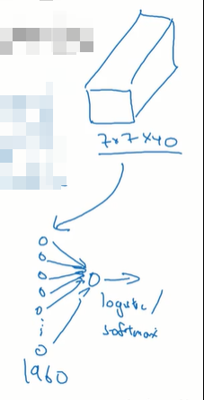
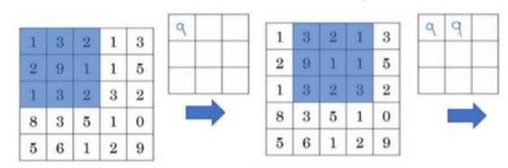
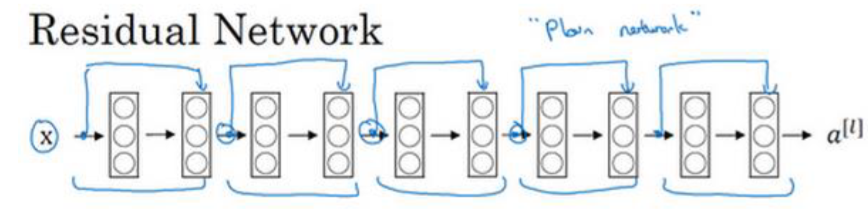
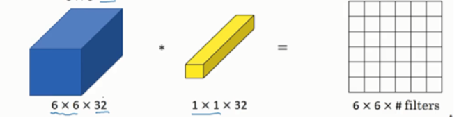

# 基础
## 是什么
## 计算机视觉
### 应用
图像分类: 比如识别图片中是一只小猫还是小狗

物体检测: 比如下图中检测到两辆汽车，并且用红框框出他们的位置

风格迁移

### 现状
对于神经网络来说，大体上数据量越多就需要越少的人工介入
数据量越少就需要人进行越精细的加工

在计算机视觉领域, 有一些任务有着大量的数据，主要指的是带标签的数据，比如图像识别
它可能就不需要太多的人的精细加工
而有一些任务比如目标检测, 它需要更精细的标注，所以它可用的数据就更少，所以现在这种网络的时候就需要更多的人工介入，可能需要更多的人工组件或更复杂的操作

## 卷积神经网络解决的问题
比如一张64×64大小的彩色图片
其中每一个像素点要记录红绿蓝三个颜色
所以最终形成的一个样本当中包含64×64×3个分量, 有12,288个分量

而如果是1000×1000像素的图片, 一个样本当中就包含300万个分量

假如你要将这个1000×1000像素的图片输入到神经网络中，假定你的第1层隐层有1000个神经元
由于每个神经元都要针对样本中的每一个分量分配一个权重w，所以每个神经元当中包含300万个权重w，1000个神经元当中就包含30亿w, 这就很难训练了, 实在是太大了
这个问题可以用卷积来解决

# 卷积神经网络
## 卷积核, 卷积运算
### 是什么
个人理解卷积运算共向是算机图形学或者说photoshop当中的一种算法，只是被借鉴到了机器学习当中

这一小节讲的主要是卷积的各种运算和操作, 还没有和深度学习结合在一起
### 引例: 卷积核提取图像边缘
#### 目标: 提取图片的纵向横向边缘
我们说过神经网络在识别图像时，前面的网络用于检测一些低级特征
后面的网络用于检测一些高级特征
这些低级特征中可能就包含图片的边缘

假定给定我们下面这张图片，我们想要检测出它的横向和纵向的边缘，应当如何做呢

#### 卷积运算提取纵向边缘
假定我们有一张6×6的图片, 其中每个图片中填写的数字是0~9之间
下面绿色部分这个星号代表整机操作
黄色部分是卷积核有时候也叫做过滤器
我们构造黄色这个卷积核可以用于提取纵向的边缘, 先看怎么计算

如果不做特殊说明的话，* 表示的还是乘法, 当其表示卷积操作时，会额外说明 

我们对这个图像应用这个卷积核会得到一个4×4的新的小的图像
应用卷积核的算法如下
首先我们将卷积核也就是蓝色部分放在图片的左上角
现在图片的左上角的每个单元格中有两个数字: 分别是图像的像素和卷积核中的数字
每个单元的两个数字都相乘，然后各个单元相乘得到的结果在相加，最后会得到一个数字, 这里得到的是-5
我们就将这个-5填写在右图第1个单元格的位置

我们把右图叫做特征图

接下来计算特征图当中红色位置这个单元格的值
算法同上: 让左图每个单元格中的两个数字, 相乘相乘之后的结果再相加最后得到的结果是-4, 

以此类推，可以得到特征图的第1行的4个数字

接下来来到第2行
也就是让整机和在原图中也下移一行

同样的就可以计算出第2行的所有内容

同样就可以得到最终的整个特征图

其实得到的右边的特征图也可以看作是另外一张图片

补充一下，卷积运算在框架中的函数名一般叫做conv2D

但这咋就实现了垂直边缘的检测呢
我们来换一张图片
下面这张图片是灰度的
数字10代表这个像素非常的亮数字零代表这个像素非常的暗
它的图像大概如下所示
在明暗分界处有一个非常明显的垂直边缘线

我们对它应用我们的3×3过滤器
其实也可以将我们的过滤器看作是一张图片
它左边是最亮的，中间比较暗淡，右边是最暗的

对左边的大图片，应用我们的过滤器进行卷积操作，得到右边的特征图

可以看到中间的两列被标记为了30，他们是很亮的
他恰巧就对应了左边图的垂直边缘
不过这里检测出来的边缘有点粗了，这是因为左边的原始图片本身像素就比较少, 如果输入图片大一些的话，其实这个卷积核可以比较精确的检测出垂直边缘

个人理解，当我们对任意图像应用这个卷积核的时候: 图片的边缘就会被高亮出来. 这应当是一种photoshop当中的提取边缘所用的算法
#### 直观理解卷积核为什么生效
在这种算法中，其实对一个图片应用卷积核大体上可以理解为去匹配图片中和卷积核比较相似的部位

我们先看一下诊结核所描述的特征
视频中说中间的那一列不用关心，它所描述的特征就是左边亮右边暗
TODO: 为什么中间那一列不用关系

那当我们对图片应用这个转接盒的时候，该卷积核就能找到同样的左边亮右边暗的区域
比如标黄的这个区域
而如果他找到了这样一个区域，那么在最终的特征值当中它就会标注一个类似相似度的数值: 卷积核的特征和图片的特征越匹配那么, 在右边特征图的单元格当中，标记的数字就越大, 就像概率那样

比如对于上图黄色方块, 它和转机和就相当匹配
那么在此时, 这个黄色方块对应特征值当中的一个单元格, 在这个例子中对应的就是下面的绿色单元格: 该单元格当中的数值就会被标记的很大, 表明上图黄色方块和卷积核非常的匹配

#### 补充: 正边和负边
其实就是边缘是从亮过渡到暗，还是从暗过渡到亮
这是两个例子，可以看到左图经过了三转第1行的左图是从亮到暗
第2行的左图是从暗到亮
但对它们应用的都是相同的卷积核 
可以看到计算出来的特征图也不一样
第1行的垂直边缘被检测出来了，而且因为他就是和卷积核的特征相匹配的，所以最终这些边缘被用亮色标注了出来
第2行的垂直边缘也被检测出来了，但它被检测出来的原因是因为它和我们卷积核描述的特征恰恰左右相反, 所以他在特征图中被标记为了非常小的负数，也就是非常暗的颜色

### 更多卷积核
#### 检测垂直和水平边缘
左边的剪辑盒可以检测垂直边缘右边的卷积核可以检测水平边缘
不过也要注意卷积核本身的特征
左边的卷积核: 适合检测，从亮到暗的过渡
右边的卷积核也适合检测从亮到暗的过渡(上边是亮的，下边是暗的)
不过当然他们也可以用于检测完全相反的情况(参见上一小姐)

假定我们使用上面的水平边缘检测的卷积核应用于左边的大图
可以发现最终得到的特征图当中标记为30的部分，就是找到了一个符合卷积核描述特征的边缘: 这个特征就是上边亮，下边暗
它对应的就是左图中的绿色方框的部分可以看到这一块，确实是上边量下边暗
而特征图当中的-30对应的就是和整机和描述的情况，正好上下颠倒的部分: 也就是上边暗下边亮
它对应的是左图的紫色方块: 它确实是上边按下边亮的

#### 卷积核当中的数字不一定是0或1

这个转接盒叫做Sobel卷积核，它其实也用于检测垂直边缘
不过可以看到它标记为2和-2的部分，代表此处的权重变得更大了(个人理解可以将数值的绝对值看作权重，不管这个权重是正向的还是反向的)

下面这个卷积核叫做Scharr卷积核
与检测垂直边缘，不过你将它翻转90度，它也可以检测水平边缘

上面这些都是专门的学者研究出来的
#### 让神经网络训练卷积核
我们也未必总要使用学者研究出来的卷积核
我们可以让卷积核当中的每一个单元都作为1个参数让神经网络去训练
也就是让神经网络自己去寻找卷积核

一开始卷积核当中的权重是随机初始化的，所以很可能该卷积核无法捕捉到图片的任何特征，或者说任何边缘
此时神经网络识别图像的效果就会很差，然后经过反向传播不断优化，上面单元格中的数字也会不断变化，它慢慢就会拥有捕捉图片特征的功能
但此处是捕捉图片的边缘特征: 他可能捕捉的是横向的，纵向的也可能是斜向的拐弯的, 但经过训练这个卷积核，慢慢确实会拥有捕捉图像边缘特征的能力
### padding
#### 是什么
#### 之前卷积运算的问题
前面我们学习的卷积操作的话，比如使用一个3×3的卷积去匹配一个6×6的图片
最终得到的是一个4×4的特征图
这个4×4是因为我们的卷积核在6×6的图片中，一共有4×4种可能位置

这里有一个计算输出的特征图的维度大小的公式
它的维度就是下面这个
其中n表示的是原始图像的维度, 假设原始图像是正方形, 在这里是6
f是卷积核的维度, 在这里是3

运算得到输出特征图的维度就是4
视频中说，在深度学习当中，我们可能并不希望生成的特征图变小. 因为我们一层一层的神经网络层，可能会包含一层一层的卷积核, 如果经过每一层神经网络图片都变小了，那就很难支撑起层数较深的网络的训练

这导致几个问题
第一它会让生成的特征图的尺寸<原始图片的尺寸
第二是这个运算上也有一些不公平，靠近中心的像素点(沙土中的红色的点)会被多个卷积核使用的话, 而靠近角落的点(下图中的绿色的点)只会被一个卷积核所应用
所以可能角落中也是一些边缘，但他的信息没有被完全利用到

#### 解决方案: padding
我们可以在原来的图片外围都填充一圈为0的像素点 (习惯上用零填充)
这就是padding
此时对该图像进行卷积他就会得到6×6的特征图
TODO: 这样补充没有问题吗不会对边缘之类的产生影响吗

p = padding = 1, 在这里我们只在外围补充了一圈像素点

此时生成特征图的计算公式变成了如下所示

所以最终生成的特征图是6×6

这样的一个好处是此时原来6×6图片的角落上的像素也可以多次参与卷积运算: 至少现在原来图片中的各个像素参与卷积运算的次数就都是相等的了
TODO: 是相等的吗

当然也可以填充更多的painting，比如让P=2

#### 两种padding方案: valid卷积 same卷积
其实就是两种拍定方案
1. valid卷积: 就是不填充, p = 0

2. same卷积: 就是要求卷积之后得到的特征图和原始图像的尺寸相同
卷积之后得到的特征图的大小和卷积核的大小有关系, 所以这个时候确定填充多少，或者说确定p = 多少, 公式 = 
其中f就是卷积核的维度
比如碱基和的维度是三能，下式计算出来p就 = 1，所以应该在原图外围填充一圈像素

如果卷积核是5×5的话，那外层就需要填充，P=2的就是填充2000像素
在计算机视觉中，卷积核的维度一般f是奇数
很少有用到偶数的, 所以上面的公式总是可以计算的

之所以整洁和的维度一般都是奇数，是因为奇数的话我们就能找到卷积核的一个中心点, 这样计算起来也比较方便

不过也不是说完全不能应用偶数维度的卷积核只是在计算机视觉中更常用基数维度的卷积核
### 卷积步长
#### 是什么
#### 原理
之前我们的步长都是一
比如我们设置步长为2

那就是在横向上1次走两格

同样在纵向上移动的时候也是1次走两格

#### 此时特征图的维度计算
这样得到的卷积核就更小了
我们上面7层7大小的图片，经过了一个3×3大小的卷积，核设置步长 = 2，最终得到了一个3×3的特征图

这是最终形成的特征图的维度计算公式

其中n就是原始图片的维度
p就是外面补充的padding有几圈
f就是卷积核的维度
分母上的s就是步长stride

在我们的例子中就是7+0-3=4，最终再除以2 = 2, 再+1=3
所以最终特征图是3×3维度的

注意有的时候计算出来的不是一个整数，则需要向下取整
 ⭐
这个符号表示的就是向下取整

之所以要向下去争，是因为我们在实操对某张图片应用某个剪辑核实，要求蓝色的卷积核，必须被完全包裹在图片内时，我们才应用这个操作

否则的话就不计算这一块的卷积, 这是一个惯例
其实如果觉得上面这种要求会导致有些图片像素无法被卷积核计算到的话可以在图片外围添加padding
### 数学中的卷积 和 机器学习中的卷积
其实数学中的卷积 和 机器学习中的卷积定义并不一样
数学中的卷积其实要求先对卷积核做1次水平和垂直翻转，然后再应用到图片上
正如下图所示
黄色部分就是翻转之后的卷积核, 会将它作用到图片之上

而机器学习中则是直接将卷积核应用到原始图片上
其实直接将卷积核应用到原图片上，在数学中叫做互相关
不过在大多数的深度学习中，都直接将这个操作叫做卷积，所以我们此处沿用深度学习中的叫法，而非数学中的叫法: 

机器学习中的卷积 = 就是不翻转卷积核，直接应用在原图片上 ⭐
其实他就是数学专业学生嘴里的互相关

ps 视频中说，之所以数学中的卷积操作要先进行翻转，是因为这样的话整机操作就可以满足结合律

不过在深度学习当中，是否满足结合率并不重要. 所以我们就不翻转了
### 三维卷积
前面我们都是对灰度图像做卷积
其实我们也可以对彩色图像做卷积
此时就需要使用到三尾卷积核

对于彩色图像，每个像素当中都包含三个值分别是红绿蓝
所以彩色图像的数值可以表示为这样的红绿蓝立方体
注意此时的卷积核也变成了一个三维立方体

上面的6×6×3分别是图片的高度宽度和通道

这里有几个注意事项
图片的通道和卷积核的通道在这里都是三: 他们两个必须相等
最终得到的还是一个4×4的矩阵: 也就是当前图片的特征图

特征图中每个数值的计算方式: 在这里就变成了把卷积核立方体放到图像立方体当中
现在图像立方体的每个小格子中有两个数: 分别是图像的像素值, 卷积数值
让他们对应相乘，再相加
一般先取红色通道中的数，再取绿色通道中的数再取蓝色通道中的数(不过个人理解，先取哪个后取哪个，应该没什么所谓吧，反正最后他们都是相加), 相加得到一个数(这里一共是27个数相加得到一个数)，输入到特征图当中

整个第1行的计算就是在不断的移动这个黄色立方体，也就是移动卷积核

那卷积核该如何编写呢
如果你只关心红色通道当中的数值边缘那可以这样编写
可以看到分为三层
其中第1个方块代表的就是红色通道对应的这一层卷积核
它其中编写了一个提取图像垂直边缘的卷积核
剩下两个卷积核当中都是零
那整体上来说下面这个剪辑和就只能检测红色通道中的边缘

如果你不关心什么颜色，只想提取图像边缘，那可以这样编写卷积核: 可见，每一层的卷积核都在提取边缘

补充: 视频中我们将图片或卷积核的第3个维度叫做channels, 通道
其实在某些论文中也叫做深度depth

### 应用多个卷积核
一般来说一个卷积核只能识别一种类型的边缘，比如识别图像的垂直边缘
如果我们关心图像中的: 垂直边缘,水平边缘,斜45度边缘,70度的边缘等等，那我们可能就要对该图像应用多个卷积核

下列就是对图片应用检测垂直边缘的卷积核和检测水平边缘的卷积核
垂直边缘的检测结果存放在紫色的特征图当中
水平边缘的检测结果存放在蓝色的特征图当中
视频中说，也可以将这两个特征图叠放在一起，形成一个4×4×2的立方体
在立方体中就存储了原始图像的水平和垂直方向的边缘特征数据

总结一下维度
上面我们对6×6×3的原始图像应用3×3×3的，两个卷积核得到了4×4×2的特征方块
整体维度可以总结为下面的公式
下面的n就是原始图像的长和宽
两个黄色方块代表的是通道数，在这里都 = 3两个黄色，方块必须相等
绿色方块就是前面我们计算特征图维度的公式: 并且是步长为1的公式
紫色方块则是: 我们对原始图片应用了几个卷积核紫色方块就 = 几, 此处 = 2

## 卷积神经网络 `主讲卷积层`
### 是什么
接下来我们将上一小节学的卷积操作应用到神经网络中
让神经网络帮我们训练卷积核并找到图像的特征
### 单层卷积网络 ⭐
就是最简单的卷积神经网络

之前我们说过，神经网络的每一层都是在提取特征
在传统的深层神经网络中, 处理图片的时候我们可能是将图片的所有像素写成一个列向量，然后作为x输入到第1个隐层
第1个隐藏当中的每一个神经元都会为这张图片的每一个像素分配权重, 最终计算出来一个z再通过非线性激活函数计算出来a
然后输入的这张图片的列向量x就被转化成了列向量a, 这就完成了1次特征提取, 接下来的每一层神经网络就是在做更高级的特征提取

在CNN中也是类似, 每层网络也是在做特征提取
不同的地方如下:
首先输入层不是一个列向量的: 而是我们直接将图片表示为
比如这样6×6×3的矩阵的形式

这样的: 图像数据肯定会被每一层隐层进行特征提取, 则每一层隐层输出的仍然是矩阵, 比如像下面这个4×4×2的矩阵, 而不是输出向量

也就是说: 输入输出始终都成了矩阵(除了最后的输出层)

然后每一层进行特征提取: 在原来的DNN中, 所谓的执行特征提取操作其实就是给每个像素点分配权重w, 特征提取的结果a其实好像说不清楚是啥

而在 CNN当中, 执行特征提取操作其实就是对原始图像应用多个卷积核, 这多个卷积核其实都是神经网络自己训练出来的，但不管他是怎么来的，反正就是对原始图片应用卷积核, 来获取图片的种种特征，比如低层的神经网络提取的就是边缘特征

然后每层输出的其实就是特征图组成的特征方块

比如如果我们对图像应用水平边缘识别圈集合和垂直边缘识别圈集合，那最终输出的a, 就是一个深度为2的特征方块, 其中存储的就是当前图片的水平和垂直边缘特征(只不过现实情况中卷积核是神经网络训练出来的，它到底提取的是什么边缘还是别的东西我们并不能确定)

所以 CNN当中的每一层, 比第1个隐层为例
它就是接收图像立方体

计算并返回特征值立方体

之后的每一层都是这样接收上一层传输过来的立方体 → 应用本层的卷积核 → 计算出来一个新的特征立方体
越靠后的曾提取出来的特征就越抽象，不过此处我们仅仅研究单层的CNN
每一层当中包含多个神经元: 每个神经元当中包含一个卷积核, 或者说需要训练一个卷积核
这一层有多少个神经元，就是训练多少个卷积核
每个卷积核当中的每一个位置都是参数w, 想象下面每个小黄色方块当中都填写一个w

这些w1开始是随机初始化的，随着神经网络的运行, 像W会越来越准确，这个卷积核就会越来越真的具备提取图像某种特征的能力

神经元代表的操作: 在之前的DNA当中，每个神经元封装了两步操作
第1步是让w和a做线性组合得到z
第2步是将d传给激活函数得到a
a1 → z2(线性组合得到) → a2(激活函数得到)

而在CNN当中, 每个神经元也是两步操作:
第1步是使用该神经元代表的卷积核去对输入进行卷积，从而得到一张特征图
第2步是将该特征图传给relu激活函数
a1 → z2(卷积得到) → a2(激活函数得到)
这里计算出来的z就成了一个特征图: 每张图片都会计算出来一个特征图, 特征图可以看作是一个矩阵
而再传给激活函数, 经过激活函数运算其实得到的还是特征图: 它仅仅是对传入的原始特征图当中，每一个单元格的数值做了一些改变
所以对每个单元格来说: 他接收一个图片样本, 就返回出来一张特征图矩阵
或者说他接收一个图像立方体, 就返回一个特征图矩阵(就是特征图)

⭐ 而对于整个这一层来说: 它接收一个图像立方体就返回一个特征图立方体(有多个特征图(或者说特征图矩阵)组合而成)

而如果是1次训练多个样本的话
对每个神经元来说，它就是返回这m个样本的m个特征图
而对于当前这一层来说它就是返回这m个样本的m个特征立方体
⭐ 总而言之，记住: 一张图片立方体通过一层, 就变成了一个特征图立方体. 一张图片通过一个神经元就变成了一个特征图(特征图矩阵)

总体示意图如下

上面两个卷积核就组成了一个神经网络层
该神经网络层当中有两个神经元，其中每个神经元当中封装了一个卷积核
该卷积核的参数w是可以被神经网络不断训练的

输入一张图片，每个卷积核都会计算出来一张特征图, 该特征图会传给relu函数, 得到的其实还是一张特征图, 注意传递给relu函数之后还会再+偏置b

总结一下每个神经元当中要训练的参数:
卷积核当中的每一个数值: w1, w2, ....
偏置: b, 这个应当是每个神经元当中只有一个

下面是一道题
假如我们的第1层神经网络层一共包含10个卷积核
每个卷积核的大小是3×3×3
我们该层一共有多少个参数

我们先看一个神经元当中包含多少个参数:
3×3×3大小的卷积核一共是27个w
+一个偏置be，所以每个神经元有28个参数
一共10个卷积核就意味着当前层有10个神经元，所以一共是280个参数

注意每一个神经元或者说每一层的参数多少只和卷积核的大小有关, 和图像大小没有关系
之前我们说过使用DNN来做图像识别的时候，每一层参数的多少其实和图像的大小有关: 那是因为我们是在给每一个像素分配权重，所以自然就和图像大小相关了
而CNN当中每一层参数的多少只和卷积核的大小有关, 这样模型就小了不少, 更容易训练

### 标记约定/维度分析
这三个参数是针对每一个神经层而言的
分别是这一层卷积核的维度
这一层的padding数量
这一层卷积核移动的步长

看来这三个指标对于一层的卷积核而言都是统一的: 比如每一个神经网络层当中的每一个神经元当中的卷积核大小相同, 对图片进行padding补充的padding相同, 卷积核移动的步长也相同
然后不同层的这些指标是不同的

输入这样表示
这里角标当中的l减1表示这是从上一层得到的输出
这里的三个n表示的是上一层输出的这个立方体的宽高和深度(通道)

图片的宽高是可以不同的, 不一定非得是正方形

而本层输出的也是一个立方体，它只是将上面的角标从l减1变成了l

输入输出的其实都是特征图立方体
这个特征图立方体的维度计算公式如下, 其实还是以前我们学过的公式，只是这里分别针对宽和高给出两个公式, 因为之前我们推导公式都是假设图片的宽和高相等都是正方形，而这里允许宽和高不相等
下面实际上是给定了两个公式

通过该公式我们就能计算出每一层输出的立方体大小了

还要注意上面本层输出的最后那个紫色方块
我们说过输出的其实就是特征图立方体
最后那个紫色方块其实就是这个特征，图立方体是由几个特征图叠加得到的
而一个卷积核计算出来一个特征图，所以最后这个紫色方块其实就是当前这一层所包含的卷积核的数量

整机盒也是一个立方体，我们来看一下它的维度
卷积核一般是矩形的，所以前两个维度相同
卷积核还有一个渠道数(深度), 它应当 = 上一层输出的立方体的渠道数(深度)

 每一层的激活值其实就是输出的a，其实在上面已经分析过了，就是前面output的值

它也是一个立方体

而如果包含m个样本，则每一层输出的激活值就是m个a, 就是m个立方体
标记为A

每个神经元当中有多少个权重: 其实就是当前这个神经元当中包含的卷积核的维度
因为卷积核当中的每一个小单元就对应一个权重w
而其实一层神经元对应的卷积核的维度是相同的
所以看下面两个值也是相同的

他如果问你当前这一层一共包含多少个权重w就要看看当前这一层一共包含多少个神经元或者说包含多少个卷积核
就要再乘以当前层卷积核的个数

最后是偏置: 当前曾有多少个神经元/卷积核就有多少个偏置
不过有时他也写成下面那种四维张量的形式

不过上面这些标记方法也并不通用, 比如有的人习惯将通道数放在最前面...
### 输出层
每一层输出的都是一个特征立方体
一直到最后一层，输出层会将该特征立方体展开成一个列向量a，然后为该列向量分配权重w
然后让w和a做线性组合，得到一个z
最后比如将这个小吏传给sigmoid函数得到一个a: 这就是二分类任务的处理方法

现在我们应该知道根据不同的任务会连接不同的输出层
比如二分类任务，比如识别图像是否是小猫, 那么输出层十有八九是sigmoid函数
而多分类任务的输出层十有八九是softmax 
### 损失函数
视频中说和之前讲解的损失函数没有什么区别

### 初始化
等级神经网络中需要初始化的参数也是w和b看下文就会理解了
随机初始化就可以
### 反向传播/梯度下降
反向传播的过程还是在调整w和b
其语义就是调整训练每个卷积核, 使每个卷积核都真的可以帮助我们寻找到图片中的特征

它的梯度下降也支持动量梯度下降等加速操作
### 总结
个人感觉卷积神经网络和普通深度神经网络最大的区别就是
卷积神经网络使用卷积核提取特征
普通的深度神经网络为每个像素分配权重来提取特征

### 实例
假定我们有一张三9×39×3的图片
这是一张很小的图片

接下来我们使用卷积核提取它的特征
卷积核的大小是3×3×3
卷积核的步长是1
卷积核不使用padding
下一层神经元层当中有10个卷积核, 也就是有10个神经元

最终我们得到的该层的输出就是37×37×10的一个特征图立方体

这个时是因为1共有10个神经元，所以一共输出了10张特征图

假设我们再接上一个卷积层
该卷积层的卷积核大小是5×5×10
它的步长是2
它的padding是0
该层当中一共包含20个神经元

所以最终生成的特征立方体的大小是17×17×20
这个20是由20个神经元生成了20张特征图
这个17×17是根据当前这一层的输入, 也就是下面这个
然后根据我们这一层的卷积核的大小和步长计算得到的

假如后面再连一个卷积层
此时我们的输入就是这个

下一层的卷积核是5×5×20的卷积核
步长为2
下一层当中一共包含40个神经元(也就是40个卷积核)
所以最终输出的是7×7×40的特征图立方体

最后输出的这个7×7×40的特征立方体的话，我们可以将它展开为1个一个列向量
这就是最后一层要做的: 为这个很长很长的列向量，其中一共是1960个，分量分配1960个权重, 让向量和权重进行线性组合得到一个z，然后通过激活函数得到一个概率值来查看当前的图片中是否有一只小猫

当然如果我们执行的是多分类任务，则最后一层就不是sigmoid函数了，而应该是连接softmax 

### 神经网络的层数和神经元的大小
看被圈起来的绿色字体和紫色字体
视频中说对于CNN网络有这样一个趋势: 
看绿色字体也就是特征的宽和高，在逐渐变(因为原始图像通过卷积核之后，本身就一定会变小的, 当然我们可以通过在原始图像的外围补上padding来使得图像尺寸保持不变)
看紫色字体也就是特征的深度(其实也是每一层神经元的个数，也是每一层卷积核的个数)在逐渐变大

先留下这种直观印象即可
## 卷积神经网络当中的三种层 `主讲池化层, 全连接层`
### 是什么
CNN当中的三种层

分别是卷积层池化层和全连接层
现在我们只学习了卷积层
### 池化层 Pooling
#### 是什么
用于压缩特征图
使我们的模型变得更小，训练更快
#### 原理
##### 最大池化
池化可以将大的矩阵压缩为小的矩阵
这里介绍最大池化
将左边4×4的矩阵压缩为右边2×2的矩阵
对左边相同颜色的4个数，比如蓝色的4个数找到其中的最大值，写到右边的一个单元格中即可
对左边4个颜色都执行该操作就实现了，将4×4矩阵压缩为2×2矩阵

如果我们使用卷积层的视角来看
也可以理解，为黄色方块部分应用了一个类似于卷积核的东西
它的大小是2×2
他的步长是2
将黄色部分的整机和应用到原始矩阵上, 就能实现最大池化效果

上面的f是黄色卷积的维度
s是黄色卷积核的步长
注意这两个是超参数, 它不是神经网络训练出来的，而是我们自己凭经验设置的数值
##### 在卷积神经网络中应用池化操作
还是以最大池化为例
我们一般将其应用于特征图上
注意是应用到特征图上，而不是应用到原始图片上

它可以压缩特征图的大小，并保留特征图提取到的特征
以下面这个最大池化为例
假如左边是一个特征图, 假如左边单元格的取值范围是0~9, 9就是最大值了
前面卷积的运算中我们知道: 比如提取垂直边缘，如果这一块确实有一个垂直边缘的话，那么其对应的特征图当中，这一个单元格就会被标记为10, 也就是一个超级亮的单元格(不过这里最大值就是9, 所以在下图中标记为9就代表是一个非常亮的单元格了)
而如果没有提取到垂直边缘，那这个单元格就会被标记为1个比较小的数，比如2, 3之类的
最大池化的作用就是它检测左图的4个位置: 如果其中有一个非常亮的单元格，也就是数值为9的单元格就将它记录下来, 进入到池化之后的小矩阵当中
比如下面的蓝色方框，我们就找到了数值为9的单元格, 并将它记录下来
而其他的三个颜色的方框都没有找到数值为9的单元格，所以只是单纯的计算这个范围内的最大值而已
可以看到右边的矩阵虽然缩小了，但它仍然保留了我们找到的类似垂直边缘的特征也就是最亮的单元格, 把它保留在了左上角: 左上角这个位置和左边的原始特征图也是对应的

不过上面是最大池化的直观理解
实际上我们在机器学习中应用最大池化的最主要原因是，实践中它的效果很好
其实关于他的非常明确的理解，可能还没有特别建立
##### 超参数 f, s, max, p
前面说过最大池化也可以理解为卷积核
它也有两个超参数: 
F: 最大池化卷积核的维度
s: 步长
之所以将最大池化理解为卷积核，是因为前面我们推导的和卷积核相关的公式都可以用在这里
比如计算最大池化之后的小矩阵的维度的公式
这就是直接从整机和章节拿过来的:

我们来将下面5×5的原始特征图压缩为3×3的缩小后的特征图
此处需要采用一个3×3的最大池化卷积核, 它的步长设置为1

看这个3×3的卷积核就在不断的移动并且取每个蓝色方框中的最大值

如果将最大池化看，做一个卷积核
设置它的f=2, s=2
就相当于将原来的特征图: 的长和宽都除以2，也就是缩小到50%
还有一种设置是f=3，s=2

此外还有一个超参数是max还是average，也就是采用最大池化，还是平均池化后文会看到平均池化
平均池化
一般最大池化比较常用

在比较罕见的情况下: 在最大池化的时候也会给特征图添加padding, 但非常少见

⭐ 注意对整个池化过程，或者说对整个池化层而言，没有需要神经网络去学习和调教的参数，只有如上几个超参数
##### 三维最大池化
上面这是在二维特征图上应用最大值化
如果在三维特征立方体上应用最大池化的话
注意此时是和普通卷积核不一样的地方: 它输出的还是一个立方体

比如我们在一个5×5×2的特征立方体上应用一个3×3的最大，池化卷积核
得到的是一个3×3×2的最大池化之后的缩小的立方体
这和普通的卷积核是很不一样的

最大池化始终是一个**平面**(而不像普通的卷积核普通的卷积核可能会是一个立方体), 它会在各个颜色通道上都运行一遍，从而得出各个颜色通道上的缩放

所以对于CNN来说，如果我们使用最大池化来缩小特征，立方体: 那仅仅能缩小前两个维度而不能缩小深度
比如它能够将一个7×7×1000的特征立方体缩小为1个3×3×1000的特征立方体，第3个维度无法被缩小
##### 平均池化
它没有最大池化常用

它是对每个方块中的数进行求平均,就是这个意思 而不是找最大值

#### 优点
池化层可以降低模型的大小，并且增加模型的运行速度和鲁棒性
#### 实现
### 全连接层
#### 是什么
#### 原理/构建一个数字识别CNN ⭐
前面我们已经学习了卷积层和池化层
此处我们学习全连接层
以手写数字识别为例
这里给定一个32×32×3的彩色图片

接下来他通过一个卷积层
卷积，层的卷积核大小是5×5×3部，尝试衣这一层一共有6个卷积核的话，经过这一层得到一个28×28×6的特征立方体
这个立方体当中呈放的都是图像的特征

接下来我们来一个池化层，对上面的特征进行压缩
这个池化层的参数是f=2步长，s=2，它会将上面的特征立方体压缩为14×14×6的小立方体
该小立方体当中成放的仍然是图像的特征，只不过是被压缩之后的

 
 注意在学界中有两种看法
一种是将卷积层和池化层都看作单独的层
另一种看法是因为池化层当中没有要学习的参数，像W和b, 他们认为只有当前曾需要学习时, 才将他们看作一层，所以他们会将像这种一个卷积层连接一个池化层的情况看作是一层
视频中也将他们看作是一层

TODO: 那要是一个卷积层连接着多个池化层呢，不过好像也没有这个必要

接下来再连接一层卷积层和一层池化层, 他们被标记为第2层
最终我们得到了5×5×16的一个特征立方体

接下来我们就把该立方体展为1个列向量，开始连接全连接层
这个列向量是一个400行一列的列向量

视频中说，接下来我们要连接一个有400个神经元的层
个人理解之所以要有400个，是因为这里就是把前面计算出来的400个值当做x, 或者说当做输入层来用了, 有了输入层，接下来连接全连接层，并最终连接到输出层，这整个过程就是普通DNN的连接方式方式
或者可以说一个CNN模型可以分成两节
当我们把卷积层和池化曾训练出来的立方体展为1个列向量的时候, 剩下的部分就是普通的深度学习了

接下来再连接几个全连接层
全连接层，可以有多个也可以只有一层

此处我们一共连接了三层全连接层
这三层一共有400个，120个和84个神经元

最后那个还有84个神经元的将会输出a1到a84
接下来因为这是一个手写数字识别的问题
所以将它连接到一个softmax层做多分类
个人理解，最后这个softmax当中, 应该是包含10个神经元的, 因为它是在对0~9这几个数字做10分类
每个神经元都会接收上一层输出的84个输出a
然后每个神经元计算出来一个自己的z
10个神经元计算出来，10个z形成一个列向量, 该列向量经过 softmax当中指定的运算转化为概率值a, 最终输出的a或者说y^也是一个包含10个数的列向量: 就是对各个数字概率的预测

视频中说这个架构其实就是杨乐坤提出来的LeNet-5模型

这是我们此处的架构，视频中说也可以在多次卷积之后再连接一个池化
#### 层数和神经元个数
上面的例子可以看出输出的特征，立方体的宽度和高度都在逐渐减
但信道或者说深度在不断增加

整体输出从一堵墙慢慢变成了一根放倒的木杆

#### 参数个数
还是针对上帝的话，我们可以罗列一下各层输出的激活值的大小
也就是输出的特征，立方体的大小, 以及各层参数的大小

输入层和池化层是没有参数的，所以他们的值都是0
卷积层参数的多少和卷积核的大小相关都不是很大
但全连接层的参数都非常的大, 因为全连接层就是之前我们说过的普通的DNN用于图像识别时的场景, 它每层的参数个数 = 输入的图片的像素点的个数 * 当前层神经元的个数
在这里所谓输入图像的像素点，其实就是最后一层池化层2输出的激活值的个数也就是400, FC3当中有120个神经元，所以这一层的参数的个数就是400 * 120, 还要再+一个偏置参数, 最终 = 48001

整体上来看，每一层的输出都在不断变小(看第3列), 并且它的缩小不能非常的急速，否则性能就会变差
## 为什么要使用卷积神经网络
### 是什么
视频中说卷积神经网络相比普通的全连接神经网络最大的好处是
参数共享
稀疏连接

### 参数共享
参数共享指的是
卷积神经网络的参数非常的少
看下面这个例子
它的输入层是32×32×3的立方体，也就是一共3072个特征或者说输入层一共有3072个神经元
它的输出层是28×28×6的立方体, 也就是该层输出的值，一共有4704个
如果使用卷积神经网络来实现该层一共只需156个参数

而如果我们用全连接来实现一个层:
这个曾经收3072个输入, 输出4704个输出
有4704个输出就意味着该层要有4704个神经元，这4704个神经元和上一层3072个输入全连接，一共需要1,400万个参数
非常难以调教

这是因为全连接其实是在给每个像素点分配参数
而卷积神经网络: 卷积核则可以应用在原始图片上的多个像素点, 比如来寻找它的边缘
想象卷积核在左边的图片中不断移动，也就意味着左边图片的多个像素点共享了卷积核当中的9个参数, 这就是参数共享

或者说我们训练出了一个神经元的一套权重，也就是卷积核的权重: 这套权重既适应图片的左上角的像素, 也适应图片中间的像素, 还适应图片右下角的像素等等等等，无需为每个像素都分配权重
因为可能图片的各个位置都有这个卷积核所描述的比如垂直边缘, 那就可以共用这个卷积核
### 稀疏连接
他指的是比如右边那个绿色的圆圈该值仅仅由左边图片的绿色方框，也就是左上角的那一块地值所决定
只有绿色方框中的值变化了，绿色圆圈中的值才会变化，其他位置的值变化了，绿色圆圈中的值不变

而如果是全连接状态下: 上一层的任何一个值变化了，都会影响到下层的任何一个神经元

这种稀疏连接的特性也可以减少或拟合
准确来说是全连接太容易过拟合了: 对每一个像素都要学习它的权重
而卷积神经网络相当于指学习图片本身的线条等特征, 就少了很多

⭐ 或者这样说吧, 全连接拟合每一个像素点, 或者说为每一个像素点分配权重
⭐ 卷积神经网络，拟合图像特征, 或者说为图像特征分配权重

⭐ 你为什么东西分配权重就意味着你认为什么东西重要, 或者说你认为什么东西对我们的识别有影响. 全连接为像素分配权重，整机神经网络为特征分配权重

所以有的说，卷积神经网络对图片平移也有很好的效果: 因为他学习的是图片的特征, 平移之后图片的特征仍然存在
而全连接对平移之后的图像效果不佳，因为平移一下每个像素都变了
TODO: 为什么一定要进行池化, 卷积本身也可以实现降维啊
# 典型卷积神经网络示例
## 是什么
上一章我们已经学习了卷积神经网络的原理和整体构建流程
这一章我们来看一些典型的卷积神经网络事例

一般我们做简单的项目，根据项目要求抄这里的模型就可以了😂
## LeNet-5
### 是什么
### 原理
这是一个手写数字识别的卷积网络，他针对的是灰度图像

它的特点是
首先这篇论文是发表在1998年
当时的人们更喜欢用平均池化，而现在更喜欢用最大池化
而且当时没有引入padding的概念，所以从左到右图像的尺寸在不断缩小
上图中引入的池化层都是围度 = 2，步长 = 2，所以它会将特征图立方体的宽和高缩2倍
后面连接了两个全连接层
这是一个手写数字识别的案例，但当时使用的不是softmax层，现在更多的是使用softmax来实现多分类

整个模型大概有6万参数是比较少的
现在千万和上亿的参数都比较常见
当时使用的激活函数是sigmoid函数或tanh，现在更多的用的是relu 
这篇文章最经典的是他引入的先卷积在池化最后在全连接的结构
这篇论文还使用了很多比较复杂的方法来针对当时羸弱的计算机性能进行优化, 现在这些优化大多已经不必再去学习了
## AlexNet
### 是什么
### 原理
它针对的是三通道的彩色图片
使用的是最大池化
先注意这一步，从上一步到黄色方块是一个卷积层蛋卷积之后特征图的宽和高都还是27，这是因为他在外围添加了 Padding故意使特征图的尺寸不变
这种操作被叫做same卷积
在下面的过程中也大量用到，可以看到好几次卷积操作之后，特征图的宽和高都没有变化

最后他使用的是softmax来做多分类
而且他使用的是relu激活函数

模型大概有6,000万个参数
它的性能比lenet要好

它还引入了一种新的层，叫做局部响应归一层LRN, 但在现在用的比较少. 但许多研究者发现这一层的效果没太大作用, 所以现在就不讲了
## VGG-16
### 是什么
### 原理
这是一个非常深层的网络

这里表示的意思是他一开始连接了两个卷积层，这两个卷积层的大小是3×3
但是因为使用的是same卷积也就是会在外围添加padding，所以卷积之后特征图的宽和高不变

这大概就是应用两个卷积层的效果, 经过第1次卷积 和经过第2次卷积，得到的图像是一样的

接下来经过一层池化，将图像压缩到原来的一半

接下来又是两次卷积+1次池化，再次将图像缩1半

以此类推连接多个卷积，然后再连接1次，吃话，一直到黄色方框开始连接全连接层

最终使用softmax做多分类
注意这个softmax是做1000种分类, 可以分类出1000个对象

这个vgg16的16表示这个网络中一共连接了16个卷积层和全连接层
看来他是不统计池化层的 

它一共有1.38亿个参数，在现在看来也是很大的网络
这个网络由于参数比较大，还是比较难训练的

这个网络很规整的地方，在于它每1次卷积核池化之后，基本上特征图的宽高都在倍减，而信道的深度都在倍增, 非常的规整

## 残差网络 residual  Networks ⭐
### 是什么
主要用于训练更深层的神经网络的话，更深层的神经网络其实比较难训练，因为有梯度爆炸和梯度消失的问题
使用残差网络可以部分解决这个问题

TODO: 残差网络主要用于CNN吗不能用于别的地方吗
### 操作方法
正常的普通神经网络中
其正向传播是这样的，上一层的输出a会经过一个线性过程，再经过一个非线性relu激活函数得到下一个a
如此循环往复，在不同的神经层之间传播

而残差块指的是前面神经层输出的a，可以直接越过几个中间的神经层，而直接传递给后面的神经层

一定要注意它传递到哪儿了
对于目标层的神经网络它有两步计算，一步是线性计算得到z，然后将z传递给非线性激活函数relu
残差网络是将之前好几层神经网络的输出a传递到了本层: 线性运算之后激活函数之前
其实它代表的运算是: 本层a = g(本层z + 好几层之前的a)
也就是好几层之前的神经网络的a会和本层计算出来的z相加再通过激活函数得到本层的a ⭐

使用残差块构建残差网络
一个残差块由多个神经网络构成
他们靠远跳链接或者说捷径连接在一块

比如这个残差网络就包含5个残差块 
这就是一个残差网络

### 为什么有效
假定我们已经有了一个层数比较深的神经网络

假定我们在这个神经网络后面又添加了两层，并且使用一个捷径
也就是将添加的这两层构成一个残差块

a[l]经过这个残差块之后变成a[l加2]
则这个残差块的计算公式是
注意它会接收到黄色部分，也就是两层之前的神经层，输出的a[l], 来参与本层的激活函数

先稍微提醒一下上面括号中的式子要求可以运算，那就要求d和a是同一维度，而这里的a是从前面的神经网络传递过来的, 对于CNN这就要求前面几层神经网络的输出和本层神经网络的输出维度相同，这样这两个数才能相加运算. 当然如果维度不相同也有一些解决办法，比如引入一个转换矩阵Ws将a变得和z维度相同, 此处不做赘述

将上式展开

TODO: 这里讲的很不清晰
视频中说，如果我们的神经网络引入了正则项正则项会中和，过拟合它会让w和b都尽可能的小
在上面加法前面的那一部分就会尽可能的小, 甚至可以将他们看作是≈零
此时括号中的部分其实就只剩下了前面神经网络层传递过来的a[l]
如果加号前面的部分就是 = 0，就相当于这个残差块对应的两层神经网络被跳过去了, 就好像没有这两层一样
而如果加号前面的仅仅是≈0，还保留了一些值, 那就相当于残差块对应的这两层神经网络还是学习到一些东西的
知乎上说，其实它主要还是保证在反向传播求导的时候, 也可以走这个捷径
本层的梯度如果向前传播，传递到前几层就会出现梯度下降
但因为有了这个捷径，本层的梯度可以直接通过捷径传递给前几层的神经网络, 梯度就下降的没那么厉害. 这样就能构建更深层的神经网络了
TODO: 不过这都是非常大体的理解
### 优势
事实上人们一般以为随着神经网络层数的增加，其效果会越来越好，误差会越来越小
但对于普通的深度神经网络

随着我们神经层数的增加，其实它会越来越难训练
要面临梯度爆炸或梯度消失的问题，所以事实上会出现增加神经网络层数到一个地步之后，反倒错误率开始上升，网络效果变差

而使用残差网络则没有这个问题

甚至有人用残卡网络训练过超过1000层的神经网络
## 1x1卷积核 ( Network in network)
### 是什么
### 原理
这就是一个1×1的卷积核，看起来稍微有点滑稽
这个卷积核当中的数值是2，他就会对原图当中的每一个小单元格放大二倍

看起来没什么用

不过如果拓展到三维，也就是具备多个信道的时候就有点用了
下面的输入是一个6×6×32的特征立方体
我们对其应用一个1×1×32的卷积核, 注意卷积核的信道数量必须和特征立方体的信道数量相同都是32

思考一下三维卷积核的计算方式
我们将三维卷积核放到立方体当中, 他会照住32个数, 这32个数会相乘再相加, 变成一个数, 输入到特征图当中
其实也可以理解为变成一个数，再经过非线性激活函数relu, 再输入到特征图当中
可以回去看一下前面的计算方法, 三维特征立方体×三为卷积核得到的是一个二维的特征图

一个神经元代表一个三维卷积核, 和上一个神经层输出的特征立方体进行运算，得到一个特征矩阵
如果这一层有n个神经元，那就代表n个三维卷积核和上一层神经层输出的特征，立方体进行运算得到 n个特征矩阵, 也就是得到一个新的特征立方体
这个特征立方体的深度或者说信道个数就是本层神经元的个数n

那从这个角度理解:
一个神经元或者说一个卷积核, 相当于将32个数(也就是上面蓝色立方体当中的黄色立方体: 它代表卷积核当中的32个数字和蓝色立方体当中的32个数字相乘, 其实就是卷积核和立方体重叠的部分相乘), 映射到了一个数字(也就是将相乘之后的结果再相加)
对于每个卷积核都会执行这个操作
所以对于n个神经元或者n个卷积核，就相当于将这32个数字映射为了n个数字

大体画了一下，它的示意图左边和右边都是特征立方体或者说都是某一层神经层的输出
中间是一层神经层: 它有三个神经元，或者说它对应三个卷积核
这里以黄色卷积核在原来蓝色立方体的某一个具体位置上进行运算为例
黄色卷积核和蓝色立方体重叠的32个数相乘再相加, 得到右图中的一个小点
三个卷积核就得到右图中的三个小点
这三个小点，本质上是由最左边的32个数(和卷积核进行)计算得到的
所以这算是完成了32个数到三个数的映射

⭐ 将32个数字映射为了n个数字, 其实这就像是全连接神经网络当中的两层，前一层有32个神经元后一个神经元，后一层有n个神经元
32个数和三个卷积核进行运算得到三个数, 这三个卷积核就相当于是三个神经元的权重w

所以上面这个一维卷积核实现的操作有时也被叫做网络中的网络
如果一个卷积层当中的卷积核是一维卷积核, 他就完成了这样32个数到三个数的全连接
而黄色卷积核在蓝色立方体中，一共有6 * 6=36种摆放方法
所以相当于一共完成了36个: 这样32个数到三个数的全连接

它只是一种思想, 只是这种思想在许多地方都会应用到
### 应用: 压缩性信道数
一维卷积核一个经常的用法是用于压缩信道数

像这个图, 我们不想改变它的宽和高，还想让它是28×28，但想将它的信道数从192压缩到32
这就可以使用一维卷积核: 一维卷积核不会改变宽和高
我们在中间这层神经网络层中写上32个神经元，也就是应用32个一维卷积核
最终就将信道的个数从192压缩到了32

它的功能和池化层有点对应
池化层用于压缩宽和高
一维卷积核则经常用于压缩信道个数 

当然，其实一维卷积核也可以用于保持信道个数或增加信道个数: 这取决于你在该神经网络层使用的一维卷积核的数量，或者说神经元的数量 ⭐

⭐ 而且其实说白了，任意大小的卷积核都可以对信道进行缩小，这取决于你这一层一共有多少个神经元
## 谷歌 Inception 网络
### 是什么
简而言之就是在构建CNN网络时，谷歌的inception可以帮助你决定一层神经网络中使用什么卷积核/池化参数
虽然他构建的网络可能比较复杂，但一般效果不错
### 组件1:  Inception层
这就是神经网络中的一层，类比你自己写的: 比如一层卷积层或一层池化层等等

但该层比较复杂，它会应用三个卷积核加一个池化
这三个卷积核分别是1×1的卷积核，3×3的卷积核和5×5的卷积核
在应用这三个卷积核的时候，会适当的进行padding，以保证最终输出的特征图立方体的宽和高保持不变

比如这里输出的还都是28×28的宽高
三个卷积核都会对原来的信道进行缩小
这里原来的信道是192三个卷积核缩小后的信道分别是64 128和32
注意这三个卷积核，不是说先后应用的: 而是分别应用的每对左边的特征，立方体应用一个卷积核就得到一个新的立方体, 应用三个卷积核就得到三个新的立方体这里把它们拼接在一块作为输出
所以一个inception层本质上还是: 接受一个特征，立方体输出一个特征立方体
只是输出的这个立方体有特点首先它是由三个卷积核的结果拼接而成的: 这就省去了我们选择卷积核大小的困扰, 它使用各个大小的卷积核对图像的特征提取了一遍，并且将提取的特征拼接到一块. 所以最后输出的这个特征，立方体还是很能表达图像的特征
第二是它输出的特征立方体和输入的特征，立方体的长宽一致在这里都是28
TODO: 为什么一定要保持长宽一致呢
为了达成这个长宽一致，他还会在适当的时候使用padding操作

其实完整的 Inception曾不单单包含卷积核，还包含一个最大池化
看最后这个黄色的方块就是最大池化的结果，它也会拼接在最终输出当中
这个最大池化非常特殊一点一点来说
首先对上一层输出的特征，立方体应用最大池化是否合理: 是合理的，因为你想想在我们自己构建的CNN网络当中，最大池化层也是接受一个特征立方体返回一个特征立方体, 它的作用就是对接收到的特征立方体进行特征压缩
而在这里他也是接受上个神经层的特征立方体, 进行特征压缩，然后返回一个新的特征立方体
其次是这里的最大池化: 输入的是28×28的宽高输出的还是28×28的宽高, 这说明它在外层添加了padding，一般最大池化是不在外层添加padding的，这里也是一个例外. 它主要是为了输出28×28大小的立方体，好和别的卷积核输出的立方体拼接在一块
但这并不代表他没有对特征进行压缩: 他还是进行了特征压缩得到的还是特征压缩后的特征，立方体因为添加进来的padding补充进来的都是0, 没有添加额外的信息. 所以它相当于往结果特征立方体方块中又添加了一个压缩特征方块
此时右边的特征立方体当中包含的信息就更丰富了，不过这些信息都能反映样本特征
它还有一个特点是最大池化是不会压缩信道个数的，但这里却将信道个数从192压缩到了32, 看后面的视频好像是他在最大池化层后面实际上又接了一个一维的卷积核用于信道个数的压缩  
TODO: 但视频中并没有解释，为什么他非得要将最大池化的结果压缩到32维

整体来看，这个inception层输出的特征，立方体就是28×28×28×256大小

总而言之，它就是这样一个神经网络层, 该神经网络层会使用各个大小的卷积核和最大池化对输入的特征立方体进行进一步的特征提取, 从而得到一个新的特征立方体. 无论如何该新的特征，立方体也能反映样本的特征
### 组件1: 使用一维卷积核降低运算成本
一个 Inception层的运算成本是非常高的
它其中包含了非常多个卷积核
我们只看一下其中5×5卷积核的运算消耗

这里我们只抽出来inception层当中的5×5卷积核使用，它将原来的特征立方体变成一个28×28×32的特征立方体
单看乘法的话该转换步骤一共使用了1.2亿次乘法, 非常非常的消耗性能
具体计算方法是最终的28×28×32立方体当中的每一个元素, 都是通过卷积核对原来的立方体压缩来的, 都需要进行5 * 5 * 192(也就是卷积核大小)次乘法运算
而最终28×28×32个元素就需要进行28×28×32×5×5×192次运算也就是1.2亿次乘法运算
这还单单是其中5×5的卷积核, 一个inception层当中，可是包含很多个卷积核

我们可以使用1×1的卷积核来简化运算
过程是先使用1×1的卷积核将原来的特征立方体压缩的信道数, 压缩到16个信道
然后将中间这个28×28×16的立方体, 通过5×5的卷积核变成28×28×32的特征立方体
这整个过程只需要1,240万次乘法, 大概快了10倍
它块的核心原理就是使用一维卷积核压缩了信道个数

TODO: 这样做不会丢失信息吗, 视频中说实践中这种做法效果还挺好的. 是什么原理呢
上图中一尾卷积核或者说中间那个小方块对应的这一层，有时也被叫做瓶颈层, 因为他非常的细小

然后对inception层当中的每一个卷积操作，我们都可以使用上面的方法来压缩运算量
不过对一维卷积核就不需要用该算法来压缩运算量了，因为卷积核运算量本身就不大
###  Inception网络
有了上面两个组件，我们就可以比较快速的计算出来一层Inception层
一层 Inception 层其实就相当于普通神经网络当中的一层: 它接收特征立方体输出新的特征立方体

所以我们可以把多个inception层添装到一块，就形成了inception网络
一个in section如下所示

它包含一位卷积核，三维卷积核五维卷积核和池化
其中计算三维卷积核和五维卷积核之前都先使用一维卷积核来降低运算量
而一维卷积核就不需要再连接一个一维卷积核来降低运算量了
最后注意最大池化，后面还要连一个一维卷积核来降低它的信道个数

上面这个就是一层inception层的示意图
它输出的就是右上角所示的这个特征立方体

我们将多层联缀起来, 就形成了inception网络
最后再连接一个softmax，就可以完成图像分类识别了
这大概就是inception网络的原理，简而言之就是用inception层来代替我们自己写的卷积层和池化层

看下面的绿色圆圈，视频中说有时inception网络在运算的中间也会生出来一个 Softmax层, 就是绿色圆圈圈住的部分
大概的意思是说模型运行到中间，我们也可以拿来分类, 可能此时已经训练的差不多了，这仅仅是对原来网络的一种细节更改

因section网络也有不同的变种，比如inception v2 v3 V4以及引入残差等等
# 构建自己的卷积神经网络
## 是什么
我们了解了卷积神经网络的原理
并且看了一些经典的常见的卷积神经网络
本章教我们如何在自己的电脑上构建和部署服务于我们自己或服务于我们自己项目的卷积神经网络
## 使用开源方案
### 为什么
一个原因是想要通过论文复现出来别人的深度神经网络或卷积神经网络模型是很困难的，其中涉及到很多难以调教的参数, 以及硬件差异, Let me see the research paper 样本差异等等使得你很难完全的实现论文中介绍的复杂网络

我网上有很多开源的，经典的 CNN实现方案
不用从零开始, 直接克隆一下来使用即可
### 以残差网络为例
简而言之就是去get up上找到一些高star的模型下载下来即可，比如下面这个模型

一般这些网络都是训练好的，你可以找到他的神经网络的具体参数文件其中有各个层各个神经元的训练，好的参数
比如可能会放在prototxt这个文件中

总而言之，参照项目的文档安装，相应的框架和依赖跑起来该网络即可
## 迁移学习
### 是什么
就像使用bert那样, 下载别人一训练好的模型，然后针对自己的任务进行微调

视频中说计算机视觉还挺常用到迁移学习的
### 操作 ⭐
#### 你手头的数据量很少
假定你要训练一个对小猫做三分类的模型
这是你的私人模型，你的数据也不多
此时你可以从网上下载下来一个预训练好的模型, 比如imagenet的模型
他是一个图像多分类模型，最终的softmax会区分1000个类别
你拿掉它的softmax层, 替换成自己的softmax层，将其转换为1个三分类任务

接下来训练的时候
你一般要设置不再更改(冻结)你下载的这个模型的参数, 只训练你自己添加的softmax层的参数
许多框架都支持该功能
TODO: 只训练softmax层可以吗, 感觉不太可行, 是不是一般情况下都会再在softmax前面连接几层自己的神经网络层 

视频中说你可以将预训练的模型看做一个函数
也就是下图紫色的部分整体上看作一个函数，它输入一张图像会输出该图像的特征向量a

你要做的就是拿到它的特征向量a，然后拿这个特征向量a自己训练一个很浅的softmax模型
也就是说白了，你不再直接使用自己的图像进行训练, 而是使用你的图像，经过这个预训练模型函数输出的特征向量进行训练, 这样会快，非常多

一般情况下，比如你只有1000张图片，作为样本
建议你先将这1000张图片扔到预训练模型当中, 获取它的特征向量(特征向量就是去除掉预训练模型的softmax层, 然后剩下的倒数第2层神经网络的输出值)
然后把这1000张图片对应的1000个特征向量缓存到本地硬盘中，接下来就是用这款存在本地硬盘中的特征向量训练你自己的非常浅的模型
#### 你手头的数据量很多
如果您手头的数据量还算多的话，视频中建议你少冻结几层
比如这里画的就是仅仅冻结前4层
然后剩下的层都可以用于训练
当然你还要记得把他的softmax替换为你自己的softmax

或者你把它第4层之后的网络层都给删掉, 连接上自己的新层进行训练
其实前一种不删掉的方式，无非就相当于使用它训练好的后几层的参数来初始化自己添加的新层的参数, 而不是随机初始化参数了. 就这一点区别

⭐ 规律是你手头的数据集越大, 那你就删除掉他越多的层. 总而言之，就看你手头的数据量可以支撑起几层神经网络模型的训练, 你就删掉他的后面几层，然后自己添加几层进行训练
#### 你有超级大的数据量
不要冻结它的任一层，而是直接重新训练它的整个模型
当然因为你的是三分类任务，所以你仍然要去除它的1000分类的softmax层，添加自己的softmax层

这其实就是相当于用别人预训练的模型参数来初始化你的模型了，就这一点作用
## 数据扩充
### 是什么
就是从原有数据获得更多数据
### 原理
比如图像镜像翻转

随机裁剪出来几块
但要注意剪出来的图像仍然要像一只猫

旋转扭曲

色彩转换
也就是增加或减少RGB的数值
不过下面的效果稍微有点夸张了, 它主要是模拟现实生活中，比如在阳光下和在灯光下的不同效果, 来增加系统的鲁棒性
