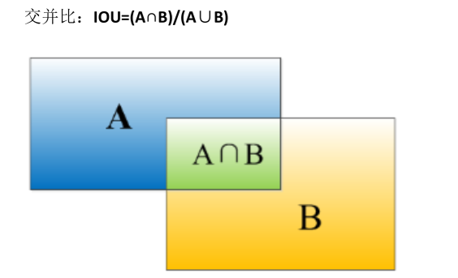

# 基础
## 是什么
# 目标检测
## 目标定位
### 是什么
从左到右是三个任务
图片分类也就是识别出来它是一个车
中间的是图片分类，并且标注位置，也就是标出车在哪
而目标定位是右边这一张: 它可能需要找到图片中的多个车子, 并且要找到的可能未必是只有车子，可能还要找情人之类的，也就是要找到多个目标

个人理解，其中第2张图也算做目标定位
只是他不支持对多个元素进行定位

个人理解在这个视频中
只对一个车子定位这种被叫做目标定位
侦测多个车子的叫做目标检测
### 目标定位 (只支持对一个元素进行定位)
#### 符号
它指的就是我们除了要识别出图像中是一辆车，还要标注汽车的位置

这样最终的那一层就不单单是像普通的softmax那样输出一个当前图片归属的类别了
它还要输出一个定位框
该定位框由4个参数决定，分别是bx，by，bh和bw

其中bx表示的是红框的中心点
一定注意是中心点
bw和bh表示的是定位框的宽和高

#### 数据标签, y
训练这种神经网络
理论上来说每一个y标签中要包含4个值: 当前图片的种类，当前图片的bx，by，bh和bw

但其实我们的y经常定义为下面这个样子
假如我们这是一个多分类的问题, 物品的种类有行人，汽车和摩托车，如果都不包含这三个对象的话，则标记为"仅包含背景". 所以是一个4分类问题

而且假定我们的图片中只包含上述对象中的一种或不包含任意一种. 不会同时包含两种对象物体

则下面y是一个列向量
第1个分量pc表示的是我们当前这张图中是否有我们关心的物体: 行人，汽车和摩托车, 有的话就标记为1, 没有的话(没有这个代表，只有背景), 则标记为0, 所以pc是个2值的
中间的bx，by，bh，bw: 他们是数值用于描述位置方框
最后三个C1C2C3, 他们也是二指的
 C1 代表行人, C2代表汽车, C3代表摩托车有任意一个对象出现，对应的变量就标记为1没有的话就标记为0. 因为我们的图片中最多只包含一个物体，所以这三个变量最多只有一个为1，其他的为0

举例，这是下面这张图片的y标签
他其中确实出现了某个对象，所以PC标记为1
中间和b相关的记录，红框的位置
然后C2标记为1标记出现了汽车, 其他和C相关的标记为0

#### 损失函数
在图片分类带位置信息这种任务当中
每个图片样本对应的y当中都有8个分量

则我们预测出来的y^当中也有8个分量

计算他们的误差就是让8个分量相减，求平方再求和也就是求误差^2和

下面是它的误差函数，注意这是一个分段函数
黄色的部分是y1=1的时候
绿色的部分是y1=0的时候
黄色部分其实就是: 图片中确实侦测到了某个物体，也就是PC=1
既然存在物体, 那肯定存在物体的边框, 那C1C2C3也会被赋予值. 所以此时针对8个分量都要计算平方和
绿色部分的是pc=0, 代表我们这张图片中压根就没有我们关心的问题
此时我们只计算pc这一个分量的误差即可

它的损失函数还有不同形式
我们这里定义的叫做误差平方和的形式
## 特征点检测
### 是什么
这也是CNN的一个用法
比如它可以识别人类面部的某些特征点
### 原理
这样的一个个红点就是人类面部的某些特征点
如果我们训练神经网络去识别人类面部的特征点，那我们可能就能判断当前人物是否在微笑，他的眼睛是否张开等等

具体方法如下
假如我们要识别4个眼角这4个特征点
那我们的样本数据中就要将眼角给标志出来
每个眼角对应一个x和一个y: 其实就是对应一个坐标
4个眼角就是对应4个x，y坐标

然后我们可以训练神经网络去寻找这样的4个坐标
一开始找肯定有很大的误差，但神经网络可以不断的缩小这个误差
最终给定一张图片，我们就能找到图片中眼角所在的坐标点
### 标签 y
每个样本数据对应的标签，y也需要经过设计
它其实和前面的目标定位非常相似，其实本质上这里也是一种目标，定位，只是定位的不是特征方框而是特征点
y = [hasFace, l1x, l1y, l2x, l2x....]
他大概是这个样子
其中第1个分量表示当前图片中是否有人脸，有的话就标记为1，否则标记为0
剩下的每两个分量x, y指定一个坐标点
如果我们一共要找到面部的64个坐标点的话, 则一共需要128个x, y
再+第1个是否出现人脸，也就是一共有129个y分量
### 损失函数
损失函数和目标定位那一小节的损失函数是一样的
### 其他应用
姿态识别也可以通过标注特征点来实现

## 目标检测: 滑动窗口法
### 是什么
是一种检测图片中是否有汽车的算法
### 原理
首先你要训练一个比较简单的图像识别卷积神经网络
它输入的是这样裁剪之后的图片
输出的是1或者是0
如果裁剪之后的里头有汽车就输出1，没有汽车就输出0
注意这个裁剪药物尽可能的小，但同时又要完全包含我们的汽车

现在我们就得到了一个根据输入的这种小图片，能够知道小图片中是否包含汽车的整机神经网络

接下来我们开始滑动窗口
给另一张比较大的图片，我们想判断其中有没有汽车
我们给定一个红色窗口, 让他从左到右从上到下的在原图中以一定的步长进行移动，就好像移动卷积核那样
每移动1次，它就会裁出来一张小的图片，将这张小的图片丢给我们刚才训练好的整机神经网络，就可以判断出这张小的图片中，有没有包含汽车

然后增大窗口, 再次滑动一遍，把这个大窗口裁出来的图片也丢到我们训练好的整机神经网络中，看看其中有没有包含汽车
这样不管图片中汽车站的位置大小(反正我们的红色窗口也会有大中小等好几个版本), 都会被我们找到并识别出来

### 缺点
#### 性能问题
每个窗口都要在图片中不断的移动来裁剪出来小方片
而且移动的步长不能过大，否则可能会漏掉某些图像
而且还要使用大小不一的移动窗口来裁剪出大小不一的小方片

这些小方片都要丢入到神经网络中去判断, 这个性能会有一些问题
### 滑动窗口的卷积实现
#### 是什么
上面的滑动窗口运算效率太低
我们可以使用卷积来实现这个滑动窗口，运算效率会变高
但是我们先要对原来学过的 CNN进行改造: 将其中的全连接层改造成卷积层
#### 把全连接层改造成卷积层
假定我们构造了这样一个识别图像的整机神经网络
这是一个多酚类任务: 他最终识别出来的有4个类别: 行人，汽车，摩托车和啥也没有

接下来我们想将上面的神经网络 后面的全连接层改造成卷积层

我们先改造第1层全连接层，也就是上面绿色圆圈那个
改造方法其实就是对黄色方块的这个输入应用一个与之同等大小的卷积核: 也就是卷积核的大小如绿色方块所示也是5×5×16
经过该卷积核, 黄色立方体被缩放成了一个数字(准确来说是黄色立方体经过卷积核变成了特征图不过该特征图是1×1大小的)
然后我们在这一列放上400个这种卷积核, 就得到400个1×1的特征图
也就是最终会输出紫色方框所示一个1×1×400的特征立方体

上面紫色方框的1×1×400的特征立方体其实和最上面绿色圆圈圈住的全连接层效果一致
首先他们其中都包含400个数
最后它也包含全联接的一位: 想象紫色方块中任意拿出一个小单元: 这个单元是上图黄色立方体和绿色卷积核对应相乘再相加得到的
而黄色立方体和绿色卷积核等大小, 如果将绿色卷积核当中的每一个数值都看作w的话，其实就是在用绿色卷积核当中的w和黄色方框中的每一个小单元作线性组合. 这就是全连接
所以紫色方框中的每一个单元都和前面的黄色方框全连接
这不就是全连接层的作用吗

接下来改造后面两层，也就是蓝色部分的有400个神经元的全连接层，以及最后那个只有4个单元的全连接层(准确来说是softmax层)

下一层应用的是1×1的卷积核，一共有400个卷积核，所以最终输出的还是1×1×400的特征立方体

再下一层应用的还是1×1的卷积核，只是该层只有4个圈集合，所以最终输出的是1×1×4的特征立方体

这样我们就实现了使用卷积层来代替全连接层
#### 使用卷积实现滑动窗口
假定黄色的是我们的图片，蓝色的就是我们的滑动窗口
这里的滑动窗口稍微显得有点大，但是无所谓

假设滑动的步长是二(1次移动两个像素), 那么滑动窗口就会将上面的黄色部分划分为4个蓝色小图片
在原来我们会将这4个蓝色小图片都输入到训练好的图片，识别卷积神经网络来看看它其中是否包含汽车
但这4个蓝色图片当中其实有着大量的相似像素点，所以好多计算是重复的

其实我们可以直接把这整张图丢到神经网络中
TODO: 其实这边他没讲好，反正你就知道当我们把卷积神经网络的全连接层修改为卷积层之后, 就可以直接将一张大图丢给我们训练好的识别小图的卷积神经网络当中了: 它就相当于指定一个窗口在该大图上进行移动，然后对移动得到的小图进行判断, 看他是否包含汽车

## 补充: 交并比 IoU
### 是什么
用于评价对象检测算法

### 交并比函数
假如对于下面这张图片
红色边框是它的正确边框
紫色边框是我们的算法添加的边框
怎么评价算法此时的表现好坏呢

我们引入交并比
并是指上面两个方框并在一起的面积大小
交就是指上面两个边框相交的部分  

让两者相除: 并集作为分母, 交集作为分子
如果最终得到的值>=0.5，一般就认为是正确的
也就是0.5是个阈值

当然你也可以将阈值修改的更高一些, 比如设置为0.6或0.7
该公式的语义其实是计算我们标记的方框和真正的方框的重叠程度⭐

## 目标检测: YOLO算法
### 是什么
另外一种目标识别算法
### 原理
上面基于滑动窗口的算法有一个很大的问题，就是它输出的边界线是不精确的

就比如说: 他输出的边界线必然就是我们指定的一个滑动方块正方形的，即便我们设置它可大可小，但它仍然是正方形的
比如下图当中长方形的这个车: 使用滑动窗口算法就无法得到它的精确边界，得到的边界可能始终是一个正方形，要么大了，要么小了

yolo的意思是你只看1次

他的大体思想如下好，首先你要将一个图片注意是一张大的图片划分为3×3的格子
这里划分为3×3，只是为了方便演示
在实际实现时肯定要划分的更密集，比如划分为19×19

然后针对从左到右从上到下的每一个小格子，我们都要给它+一个标签，y
这个标签y和我们前面说过的目标定位的标签y一样
从上到下分别是这个格子中有没有东西, 以及东西的边界盒也就是4个b(如果有东西就标注他的4个b)
然后最后的三个c是: 如果有东西，这个东西到底是汽车，行人还是摩托车
这一共是8个分量

注意是针对每一个小格子都这样标注
其中边框盒子那4个b的标注比较有讲究，我们待会再说

反正这里一共是划分为了九宫格，所以我们需要标注9个y: 每个小盒子都对应一个y
我们要将这所有的标注写成如下这种立方体的形式

注意是一张图片，我们就要给定这么多个标注信息
如果是化成19×19的宫格, 那就需要标注19 * 19 * 8的信息, 这还是一张图片的标注

我们整个模型就是输入一张图片让它输出3 * 3 * 8和y^, 然后将它和3  * 3  * 8的y做比较, 看损失.

整个模型就是像普通的CNN那样的图片连接卷积层连接池化层，连接全连接层，只是最后输出的y是这样的立方体

接下来我们主要看一下对每个小格子怎么标注

比如对于左上角的格子，它其中就没有汽车，它标注起来是这样的
没有汽车，当然也就没有边框盒子了

 Yolo算法判断一个格子中有没有物体，比如有没有汽车是依靠中心点来判断的
比如下图有绿色和黄色两个中心点，他们就位于各自的小格子当中
这样就不会出现一个物体同时位于多个格子当中，这种情况了
因为1个物体不管再大它的中心点只有一个，这个点必然落在某个小格子里面

但仍然可能出现一个格子中包含多个中心点，这种情况
也就是一个格子中包含多个物体
我们这里学的yolo算法暂时不考虑这种情况，也就是不支持这种情况. 实际情况中，我们经常划分为19×19公格, 出现多个物体，在一个小方框中的概率也比较小. 此处先不考虑这种情况

我们再看一下黄色中心点所在的这个格子该怎么标注

首先其中是有物体的, 所以第1个分量标记为1
然后这个物体是个汽车, 所以最后三个分量标记为0, 1, 0

困难的是中间的b怎么标记

答案是b的标记是参照这一个小小的单元格的
小单元格的左上角定义为0，右下角定义为1
bx, by, 就是汽车的中心的这个黄点大概标记为0.4, 0.3
都是这个黄点相对于当前小单元格的偏移
所以bx和by的值都是>=0和=<1的
也就是它这个黄点是不可能出这个小单元格的
然后bw和bh都是这个汽车的宽和高, 相对于这个小单元格的宽和高的比例
这里汽车不是很高, 大概是单元格的一半, 标记为0.5
但汽车比较长, 大概有单元格的90%, 笔记为0.9
有的时候汽车会更长, 比如横跨3格, 那就标记为3
总体来说: bw和bh需要大于0, 但不需要<1

所以这里bw和bh就是汽车的精确比例
bx, by就是汽车的中心点, 有了这两个信息就能精确描绘出汽车边框线

就看神经网络能不能训练和找到正确bx, by, bw, bh的数值了
yolo整体上也是cnn算法, 会通过卷积核提取图像特征, 汽车和背景有明显的分野, 经过训练应该是慢慢可以找到的
### 优点
 Yo ll的性能很高，可以用于实时检测
### 非极大值抑制, 一个物体只保留一个边框线
#### 原理
大概就是在预测的时候，它可能会输出多个边框
比如这个图中虽然只有两个车，但它输出了好多个边框

这样的原因是，比如我们将图像拆分为19×19的空格，那就意味着一共有361个格子
我们知道该算法最终输出的y: 在这里也会有361个，其中每一个y都包含8个分量, 分别是对这一个小单元格的描述: 这个小单元格中是否有物体, 是什么物体，物体的边框又是怎么样的
其实每个小单元格中的数值都是概率值: 他可能会出现当前这个小单元格有80%的可能有物体, 是汽车的可能是97%，是人的可能是2%...
而根据我们的算法，只要这个小单元格的首位，pc>0(或者大于某一个阈值，比如60%)，那么就会计算出来一个图片的边框线
所以多个小单元格就可能输出多个边框线
就像下面黄色和绿色的格子: 他们很可能都会认为啊，我这个小格子里有一辆汽车，那它都会去尝试计算一个边框线

最终得到的效果就是一个汽车周围可能会出现多个边框线它们本质上是多个小格子绘制出来的一个小格子绘制出来一个边框线

TODO: 其实我还是没有太理解, 我们拿来训练的数据, 一个物体周围只有一个边框线, 神经网络无法学习到这种特征吗? 他如果说旁边的格子也可能有车，也应该会是边框线: 但是在真值中旁边的格子并没有车, 并没有边框线. 它这样不会造成很大的损失，并在训练过程中导致这种行为被抑制吗, 个人觉得它最终应当就是可以准确的找到车子的中心点啊, 否则会带来很大的损失的
不管怎么样，就先按他说的来
有多个单元格会绘制多个边框线
我们要做的是将矿选同一辆车的边框线给移除掉
比如上图是矿选两辆车, 一共有那么多条边框线，我们只需要保留两条即可
保留两条的策略
我们先找到所有边框线当中PC值最大的那一条，也就是它最有可能包含物体的那一条, 这一条是我们要保留的, 记做边框线a. 但他周围的是需要被删掉的
怎么定义哪些边框线是他周围的边框线的: 使用上一小节介绍的交并比函数: 把和边框线a相交范围比较大的边框线都去除掉(交并比超过某个阈值的边框线都去除掉)
这样我们就找到了第1辆车，并且把第1辆车旁边的边框线给去掉了

但可能图片中还有第2辆车, 第2辆车一般和第1辆车不怎么重合，所以在上一步通过交并比去除边框线的过程中，第2辆车相关的边框线并不会被去掉
TODO: 万一两辆车重合度很高呢
所以对于剩下的边框线, 除去边框线a我们再找到一条PC值最高的边框线b, 他就是第2辆车. 然后通过交并比把河边框线b重合范围高的边框线都去掉: 这样就找到了第2辆车，并且去除了第2辆车周围的边框线
以此类推去找第3辆车....
这样就能把所有车的边框线都找到了

这个过程就叫做非极大值抑制: 它指的是不是最大值的都被抑制掉了，所以只保留了最大值

视频中说这仅仅是针对找车的情况
如果要同时识别多个物体，比如识别车人摩托车之类的，可能对每个类别都要单独运算

TODO: 我比较纳闷的是这个非极大值抑制过程会添加到神经网络的哪个地方? 难道是输出y^之后
### anchor boxes 一个格子中包含多个对象
#### 原理
TODO: 讲的很烂
总而言之就是将每个单元格的标签从8个分量拓展为16个分量
### YOLO总述
我们这里以使用anchor box为例
首先要标注数据: 假定图片还是被切分为3×3，一共9个格子
其中每个格子标记8个分量
所以一张图片对应的标记是3×3×16, 形成了一个立方体

接下来开始训练
把整张图片传给神经网络，我们期待着对于这张图片的9个格子的预测y^, 它也是一个3×3×16的立方体: 和我们的真值y相差无几

但事实上针对每个单元格神经网络都会给他画多个边框, 只是每个边框对应的概率不同
TODO: 我一直没理解，为什么会画出来多个边框, 这样会使损失函数很大

这是我们训练出来边框的结果
接下来执行非极大值抑制
也就是首先去除PC的值较低的那些框, 就从图1得到了图2

假如上面我们执行的是多分类: 区别行人和车辆: 那么接下来分别针对行人和车辆两种类别分别执行非最大值抑制
TODO: 视频中也没有说如何针对两种类别分别做
然后就从图2得到了图3

TODO: 总而言之yolo他讲的很烂, 但这是一个好的算法, 到时候用的话可以具体研究一下
## 补充: 候选区域
### 是什么
它是对滑动窗口法的补充
可以增快滑动窗口法的效率
原理是先通过图像分割算法，找到图片中可能包含物体的区域，然后只针对这些区域进行图像身心得到放松嗯，确实会好一点因为很多人觉得等我有效果就是运动，你会感觉在某一就是你整体上的精神头会上来识别
### R-CNN 它有区域的CNN
这是针对滑动窗口算法
它的效率实在是太低了，因为它的窗口一直在滑动: 每次滑动都找到一个小小的切片扔到训练好的图像识别算法当中让识别其中是否有东西

现在我们可以先对图片运行一遍图像分割算法
他会找到图片中可能出现物体的地方
然后我们仅针对这些地方裁剪出来小方片丢到图像识别领域中
这样就会大大增加效率

当然这只是大概原理

它运行较快，而且它可以比较精确的找到物体的边框
它最大的问题是: 在上面的色块分隔部分，找到不同的色块, 得到候选框, 这肯定也是需要计算的，这也很耗时间
它的一个改进是Faster R-CNN, 它的原理是在从色块中寻找后选框的时候也使用卷积神经网络, 它比传统的图像分割算法要快许多. 但整体上还是比yolo要慢
# %auto-expand-line-0%