# 基础
## 是什么
# 人脸识别
## 术语
### 人脸验证
人脸验证是1对1的问题，就是你给定他一张图片, 并且给定他这个人的名字或ID
然后让神经网络判断这张图片是否对应这个人

视频中说这个系统其实对准确率要求很高
因为你很可能要在一个很大的数据库上，比如上万人的人脸上, 做到精确的一一对应, 并且要求不在这个数据库中的人可以被识别出来，不在这个数据库中
比如99%的准确率就是不够的
### 人脸识别
应该是从一张照片中识别出所有的人脸吧
## 人脸验证
###  前置: One shot学习
#### 是什么
 指的就是只有一个训练样本
#### 原理
人脸验证就是只有一个训练样本: 
我们经常只让用户上传一张照片, 然后接下来就能识别他的人脸
如果仅使用一张照片去训练出来一个神经网络模型，它的效果往往不好，样本数量实在是太少了

并且这个神经网络模型的设计也会遇到麻烦，假如当前我们有4个员工: 要开发一个人脸识别系统就是一个4分类问题: 识别出当前这个人是哪个员工之一
该系统后面会接一个softmax输出四维列向量

那如果再来一个新员工呢，我们就需要修改模型，让softmax输出五维列向量: 也就是判断这个人是5个人当中的哪一个，这就需要重新训练模型了，这就非常麻烦
### 前置: 相似度函数τ 
#### 原理
该函数接收两张图片判断这两张图片的差异性
差异越大的话，输出的值就越大
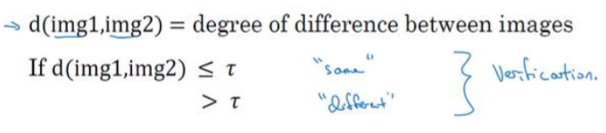
我们要设定一个阈值τ
当<=该阈值时就返回: 是同一个人，否则返回不是同一个人

人脸验证要用到该函数
假如我们训练了一个针对4个人的人脸识别系统: 第2天员工来使用这个系统摄像机，拍下一张他的照片, 接下来就会和数据库中的4张照片做比较计算相似度
从而确定他到底是哪个员工
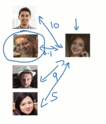
同样的，如果来的这个人不属于4个员工之一，那么要求输出的差异值非常大
#### 解决one shot问题
使用相似度函数τ可以解决one shot学习问题
我们要使用相似度函数τ或者说d作为我们的目标函数或者说预测函数
训练该预测函数的输出: 使得同一人的照片输出的差异尽可能的小, 不同的人输出的差异尽可能的大

在训练好该模型之后, 我们的人脸验证系统就完成了
以后再来新员工只要将他的照片放到数据库当中, 因为我们训练好的相似度函数d已经具备分辨不同人的功能, 所以无需针对新员工再次训练
### siamese网络: 就是应用相似度函数d训练的网络
#### 原理
这是之前我们学习的简单的卷积神经网络
输入一张图片，经过卷积层，池化层和全连接层
最终会输出一个列向量
注意在这里我们不连接 softmax之类的输出层，我们要的只是这个列向量
这就相当于我们将原来的图片在这里转化为了一个128维的列向量，记作f(x1), 它就代表了这个图片的特征
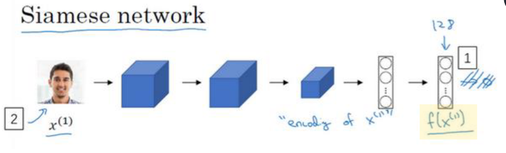

接下来传入另外一张照片就能训练出来那个照片的特征向量, 也是128围的
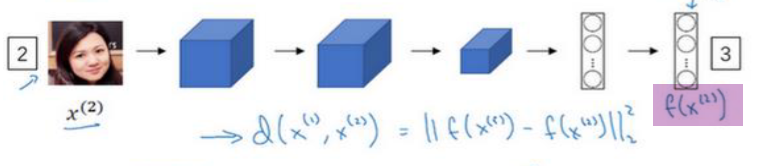

现在两张照片被转换成了两个特征列向量
注意上面两张照片是被传入到了同一个训练好的卷积神经网络当中, 然后转化成了特征列向量

接下来我们计算这两张照片之间的差异
差异的计算函数定义如下
就是计算两个向量之差的范数
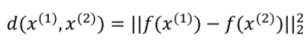
在数学中向量的范数
指的就是向量的模
TODO: 这里这个范数到底是怎么计算的

我们要做的就是如果两张照片属于同一个人就让d尽可能的
反之就让d尽可能的大
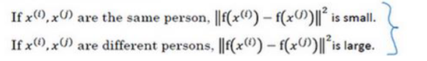
#### 损失函数: triplet损失, 三元组损失
在训练神经网络时
我们会1次看三张照片
其中第1个叫做 Anchor，可它是锚点照片
第2个叫做positive: 他和 Anchor是同一个人，但是是不同的照片
第3个是negative: 他和Anchor不是同一个人
这是三张照片形成一个三元组
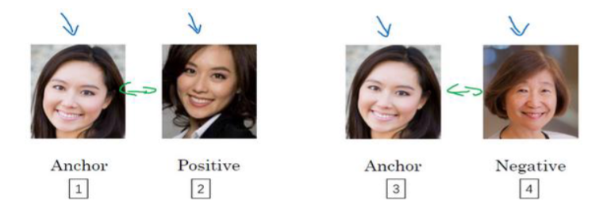

我们想要的结果是: 
锚点照片和正向照片之间的差距，尽可能的
锚点照片和反向照片之间的差距, 尽可能的大
本身来说是下面这个关系
TODO: 仅仅是<=就可以了吗

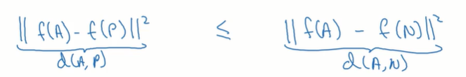

也就是说我们想让神经网络训练好之后可以满足下面这个式子
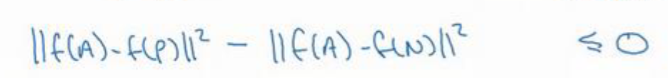
在上面这个式子有个问题就是, 如果神经网络将 Anchor positive和negative的特征列向量都标记为0，那它就始终满足上面这个式子
所以神经网络这会尝试着将所有图像的特征列向量都标记为0
我们不能让他这样做

所以我们给他+一个编剧α
这样减号前面的式子就必须真的比减号后边的式子小才行了, 这也正是我们想要的
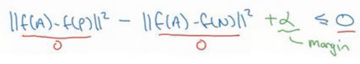

举个例子，如果α也就是编剧设置为0.2的话就好，其实他的语义就是要求
比如如果锚点照片和正向照片之间的距离是0.5 (距离越小表示越相近)
那锚点照片和负向照片之间的距离就至少得是0.7, 此时才满足这个式子
他会要求神经网络尽可能的区分开锚点照片与正向照片vs锚点照片与负向照片

所以最终的损失函数定义如下
这里的APN指的就是前面的anchor, positive和negative
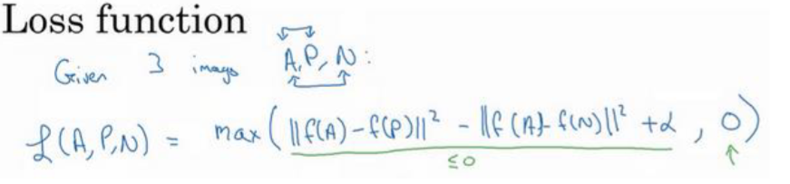
注意上面那个绿色的<=0: 它<=0的话，其实就是说: 锚点照片与正向照片之间的距离 < 锚点照片与副相照片之间的距离, 这就是我们想要的, 所以此时就没有什么损失，就将损失标记为0

而如果绿色的大于0, 那就不是我们想要的, 此时绿色部分计算出来的值就是损失
#### 代价函数J
TODO: 这里为什么代价函数不需要除以样本数量m呢

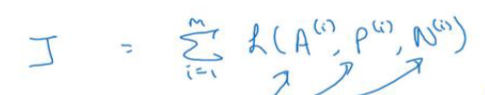
训练这个系统需要找到三张图片，形成三元组才能训练
并且上面要求A和P是一个人的图片

所以这里训练，数据并不像我们说的只使用一张图片就能训练好，而是要求每个人至少要有两张图片(A, P)训练的结果才可能比较好
视频中给的例子是训练1000个人，有他们的1万张图片，也就是平均每个人有10张图片，可能比较适合训练这个模型

训练之前我们需要先将这些图片组合成三元组，其中A, P是同一个人的不同照片
N是不同人的照片
#### 如何选择APN三人组
前面我们说要求A和P是同一个人的照片
N是另外一个人的照片
其实还有更严格的要求

就是我们要找尽可能相似的APN, 也就是让尽可能地难以训练, 这样训练出来的神经网络才有效果
因为如果我们不使用难以训练的照片的话
假定A和P是一个女人
N是一个男人
那么他们本身就没有那么相似
神经网络模型很快就会就训练好了，但其实他真正区分不同人的能力并不咋地

我们要求的其实是这个
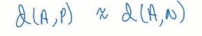

该公式可以转化成这个样子
TODO: 为什么可以转化成下面这个样子，我觉得任意两个差异较大的PN照片都满足下面这个公式啊?
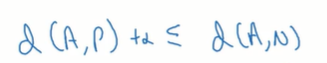
反正这里的意思就是要找比较相近的例子让他去训练
#### 神经网络
视频中没有讲
个人理解，它就相当于是一个CNN和一个普通DNN的叠加
其中CNN是是那样好的: 给定一张照片，它会返回它的特征向量

真正需要训练的是这个普通的DNN网络, 他接收三组照片的特征向量，并且计算他们的损失
并且通过梯度下降使损失尽可能的小

TODO: 还是说要把CNN和DNN连缀在一块一块训练? 也就是说要求针对每张照片输出的特征向量也要不断改变
### siamese网络: 变种, 解决二分类问题
#### 原理
他的思想是在 CNN网络背后接一个逻辑回归单元
如果这两个人是同一个人的话，最终逻辑回归单元返回 y^要接近于1
否则如果不是同一个人的话，要求最终的y^要接近0
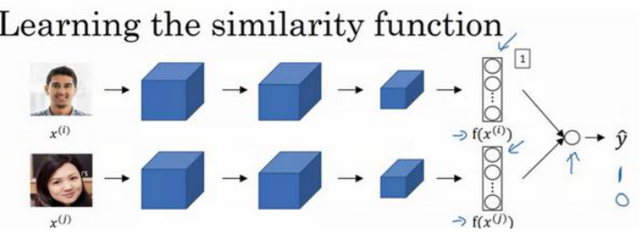

这个网络也可以完成人脸验证问题
个人理解就是将当前抓拍到的这个人脸的照片和数据库中别的人脸照片做比对

它可以取代上文介绍的三元组损失

它的目标函数或者说预测函数是这样的
注意看最后的那个逻辑回归单元: 它接收到的是两张图片的特征列向量假定每张图片转化成了一个128位的列向量, 它就是接受到了两个128围的列向量
接下来看下面的黄色部分就是让两个内向量对应维度的分量相减再求绝对值
再看绿色部分就是将求得的绝对值，外面在套上属于当前逻辑，回归这一层的权重b和w
最外层还有一个求和符号, 指的是针对128个分量都这样做, 这样最终得到的就是z
将z传给sigmoid函数得到的就是0和1之间的y^
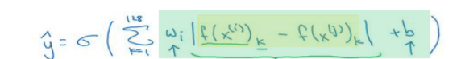
整体上它还是一个普通的逻辑回归神经元
它接收上一层的输入，并针对上一层的输入分配权重和偏置，然后传给激活函数, 得到一个0~1之间的值

TODO: 这个w是针对每一个分量的吗, 也就是说有128个w吗. 还是说只有一个

TODO: 而且这个网络是和前面的CNN一块训练的，还是说CNN是训练好的, 只是把CNN当做一个输出图片特征向量的工具
然后这里是拿CNN输出的特征向量来训练一个普通的DNN
也就是说，DNN得到的输入始终是不变的: 始终是CNN将图片转化为的特征向量
### siamese网络: 预训练
不管是哪种实现方式
我们都需要将参与比较的图像转换成对应的特征列向量
这里的预训练指的就是可以将我们数据库中已有的员工的标准证件照先转换成特征列向量

接下来一个员工想进门，我们会抓拍他一张图片, 只需要将这张抓拍到的图片转化为面向量, 然后和之前预训练好的列向量进行比较即可，这是可以大量节省时间
### siamese网络: 变种
这里简单提了一下下面这种训练方法
它的数据是这样的
准备两张照片，而不是三张照片
如果这两个人是同一个人对应的y就是1，否则就是0
使用该数据去训练一个二分类网络，它也可以具有人脸验证功能
这里仍然要用到siamese网络的思想: 就是将各个图片先转化为特征的
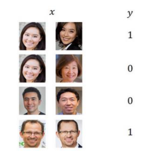
## 人脸识别

# %auto-expand-line-191%