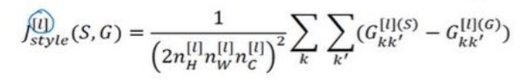

# 基础
## 是什么

这就是神经风格，建议
左图提供内容
右图提供风格
然后生成一张图片
# 神经风格迁移
## 符号标记

左图被叫做 Content 也标记为C
右边是style也被标记为S的话，最终生成的图片被标志为G

用汉语来说就是内容风格和生成的图片
## 卷积神经网络学习到了什么
### 是什么
他其实就是在说卷积神经网络
靠前的隐藏提取到的是图像的低层特征
靠后的隐层，则提取到的是图像的高级特征
### 原理
我们知道整机神经网络当中每一层的卷积核都是整机神经网络自己训练出来的
而且在一些文章中我们知道越靠前的隐藏, 提取到的越是图片的低级特征，比如说一些边缘线条之类的
越靠后的隐藏提取到的是一些高级特征，比如它可能会提取出人的面部轮廓特征

这里只是把这个观念又直观的告诉了我们
这大概是从左到右5个隐藏到的东西
可以看到第1个隐藏曲到的大多数是一些线条
第2个隐藏
越往后其实提取到的越偏向于全局, 越是高级特征, 比如有狗狗有人脸之类的

## 神经风格迁移
### 代价函数
首先要构建一个神经风格迁移神经网络，正好我们要准备一个代价函数
这个代价函数是针对生成的图片G的 

而这个生成图片G的损失函数就 = 内容损失函数+风格损失函数
其实它指的就是需要我们生成的图片，和内容图片和风格图片都相似
内容损失函数就是生成的图片和内容图片不相似带来的损失
风格损失函数就是生成的图片和风格图片不相似带来的损失
在这两种损失前面+α和β来分配他们的权重，这是两个超参数

它的大体思路好，假定左图是内容图片，右图是风格，图片

我们想让这两个合成一个生成图片

在神经网络中，一开始我们随机生成一张生成图片G
将该图片带入到损失函数中，他计和内容图片不相似，也和风格图片不相似，所以它会造成极大的损失

接下来我们就调整该图的每一个像素点让损失变小
慢慢慢慢的图片可能就会变成下面这种样子，这就是我们想要的效果

### 内容代价函数

这是我们的总体损失函数
本小节我们要看的是其中的内容损失函数
也就是生成的图片G和内容图片C，有多不相似

这里讲的很大体

我们要计算的是内容损失函数，它和图片C和G相关
而我们这里训练的神经风格迁移也是一个卷积神经网络

它输入一张内容图片，一张风格图片，然后输出一张合成图片
然后不断通过代价函数调整合成图片中每个像素点的值
而这里的内容代价损失函数其实就是计算内容图片和合成图片之间有多不相似
它好像是将内容图片和合成图片都转化为面向量，然后计算这两个列向量之间的差距
TODO: 就讲这么一点点，他们是怎么转化为列向量的，尤其是合成图片，他最终输出的不是像素值吗

### 风格代价函数
#### 计算方法
风格代价函数
其实不是计算我们的生成图片和风格图片之间的图像内容有多相似
而是计算这两个图像的风格有多相似

那就需要先用数学的方式来表示出来一张图像的风格
在数学上确实有这样的方法，我们可以用一个矩阵来表示一张图像的风格，这个矩阵叫做Gram矩阵, 也叫做风格矩阵

如果两张图片的风格相差越远，那他们两个图片对应的gram矩阵的差值就越大

所以我们可以求出风格图片的gram矩阵以及生成图片的gram矩阵, 定义它们之间的差值作为代价函数
并训练使这个代价函数越来越小

大概就是这个样子，两条竖线中间的就是让风格图片和生成图片之间的风格矩阵相减
前面黄色的不用理会它，它就是一个权重值, 用来做归一化

上式也 = 下面这个样子，一会儿我们会推导该公司

我们既可以在最后输出生成图片的时候，计算一下生成图片的风格和风格图片的风格之间的差异
也可以在神经网络的每一个隐藏之后都计算一下差异
TODO: 这个怎么操作呢

最终我们得到的风格代价函数, +内容代价函数就是整体的代价函数
我们需要让整体代价函数尽可能的小

#### 风格矩阵
其实这边没听太懂
这里叙述一下它的大概原理

TODO: 

## 从一维到三维
### 是什么
其实卷积神经网络也可以用于处理一维二维或三维数据
### 二维
我们一开始学习卷积神经网络的时候，就是处理二维数据 
给定一个灰度的图片
然后给定一个卷积核这，就是我们一开始学的最简单的卷积神经网络

### 一维
对于一维数据，我们也可以定义一个卷积核
比如下面绿色部分
让绿色部分在黄色部分从左向右滑动，就可以得到对一维数据的卷积
它的语义也是: 一个卷积核代表一种特征, 它可以提取出一维数据上的某些类似的特征
这其实是卷积神经网络在医学领域的一种应用

经过卷积数据也会变小
在这里14维的数据应用，五维的卷积核最终会得到一个10维的数据

其实在下一张序列模型中: 序列模型，更适合处理这样的一维数据
但现在仍然有人在研究使用CNN处理这样的一维数据

当然你也可以在一层神经网络中罗列多个神经元，也就是使用多个卷积核
最终将生成一个特征图矩阵(该矩阵就是有一行一行的特征，值从上至下排列而成)
注意在二维的情况下，此时将生成一个特征图立方体
### 三维
其实我们之前讲RGB3通道的彩色图片，它也算是三维数据
但此处应对的是另外一种三维数据, 和这里的三维数据相比，前面彩色图片的那种更像是二维数据

比如这种灰度的切片数据
当然在扫描仓中缓缓移动就会生成人身体的多个横截面

这多张图片就会生成一个图片形成的立方体
这个立方体就是一张图像 ⭐ 或者说一个样本
注意该立方体是由多张灰度图片堆叠而成的
TODO: 他这里没讲清楚
# %auto-expand-line-30%