# 基础
## 是什么
适合处理序列数据
# RNN
## 网络模型可视化
这是一个全连接的普通神经网络
 
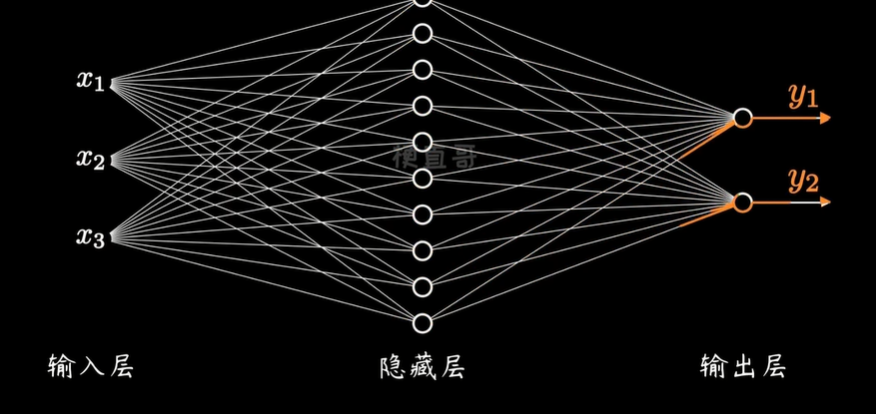
 RNN关注的则是根据时间不同, 一个隐层的不同状态
 
 每一时刻有自己的权重参数, 但这些权重参数也可以相同
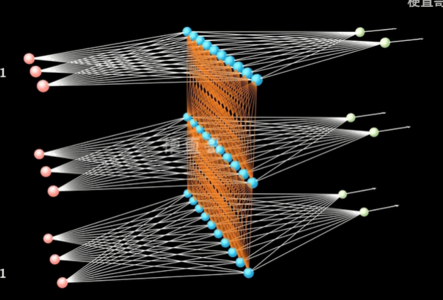

他们的网络一般表示成这种形式，但其实他还比较抽象
好像隐藏可以循环一样
它其实对应的是上面那张图
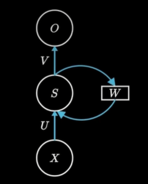

他另外一种表示方式是这样
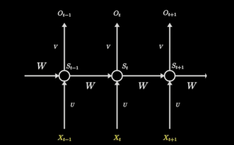
它其实就是上面那张彩色3D图片的另外一个视角
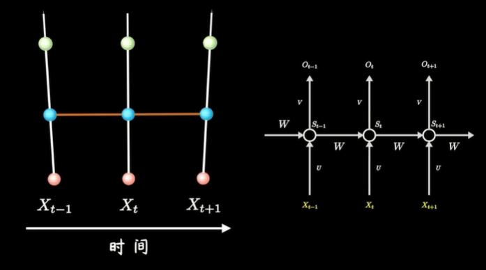

## 处理的任务类型
可以一对多，多对一，多对多
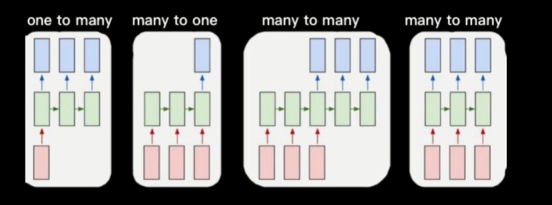

一对多，比如输入一张图片，可以输出对该张图片的描述
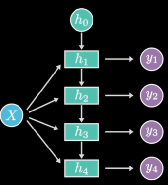

多对一可以输入很多内容，输出一个内容
比如判断这段文本是正面还是负面情绪，就可以使用该类型
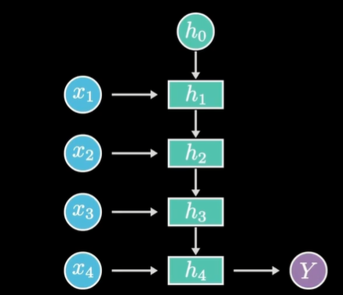

输入输出等长的: 比如可以生成小说文章
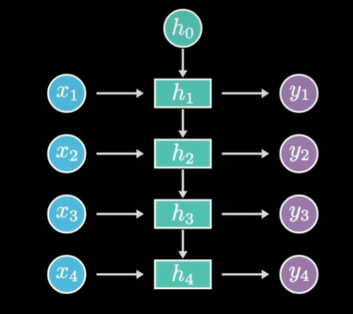

而像这种输入输出虽然都是多个，但是不等长的情况
这种叫做encoder decoder模型
也叫做sequence to sequence模型
他先将输入数据，生成一个上下文向量
然后再根据这个上下文向量输出预测的序列
经常用于机器翻译
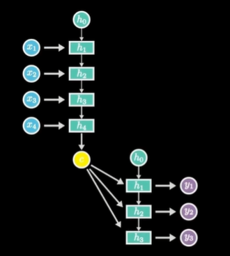
## 训练
梯度下降训练即可

# LSTM
## Rnn的局限性/LSTM, 长短期记忆网络
虽然有记忆功能但能记得不是很多的话，比如超过10步他就很难去记忆了
## 原理

这是循环神经网络rnn
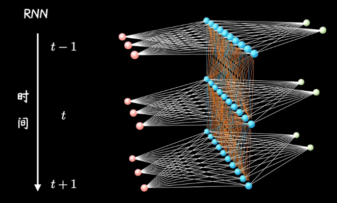

左边是不同时刻的输入
中间蓝色的是一个隐藏
右边是输出
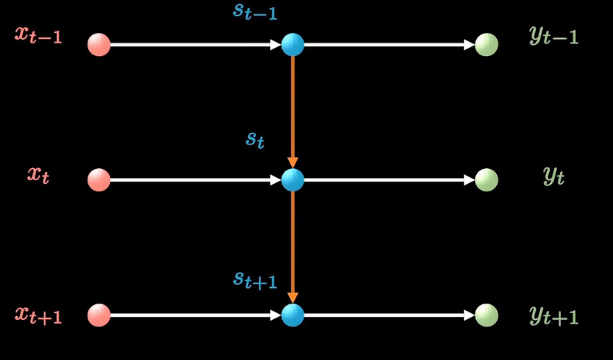

 LSTM则增加了一个新的时间线
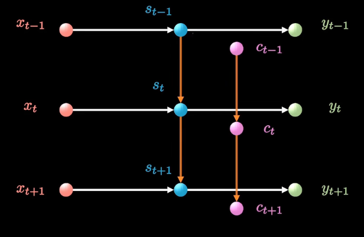

并和原来的时间线连接起来
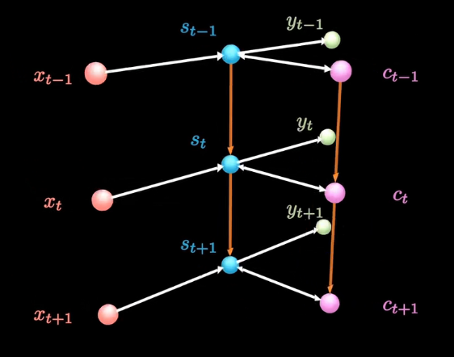

这是原来rn模型计算蓝色隐层状态St
它需要输入层的Xt以及上一时刻蓝色的St减1
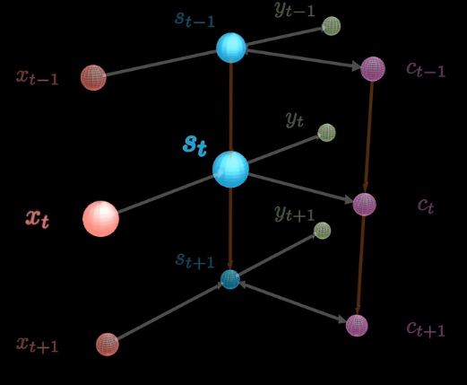

而在LSTM当中，它还要拿到紫色小球的信息
紫色小球中就是长期记忆
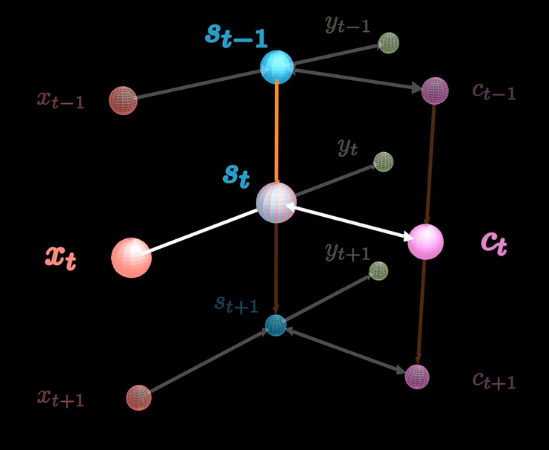

更细致的运行流程比较复杂
先看f1
他根据这一时刻的输入xt, 以及上一时刻的隐藏St-1
通过函数F1来决定是否删除一个长期日记
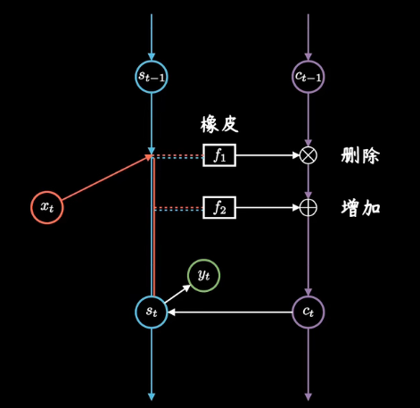
这就是F1运算的具体公式
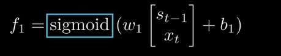

 F2则根据昨天的记忆St-1和今天的输入xt决定要增加哪些记忆
这是F2的具体计算方法
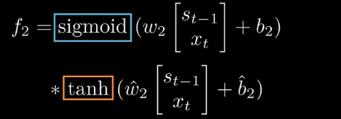

 F1和F2合起来
就可以由上一时刻的记忆Ct-1，得到这一时刻的记忆Ct
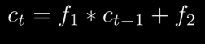

而这个Ct，它会继续往下传递，同时它也用于更新这一时刻的短期记忆，St并产生一个输出Yt
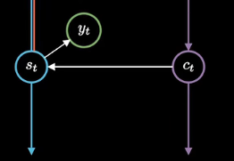

S就是短期记忆链条
C就是长期记忆链条
他们两个会彼此更新

这是LSTM的示意图
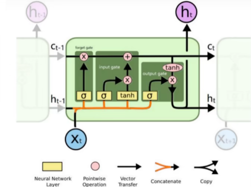

他其实描述的还是这个信息
蓝色是短期记忆，紫色是长期记忆
红色是输入，绿色是输出
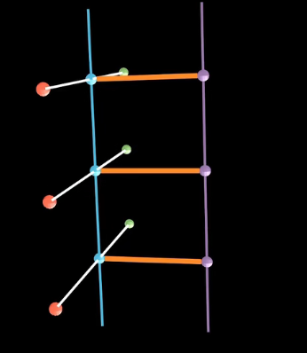

我们先来看一下它的俯视角
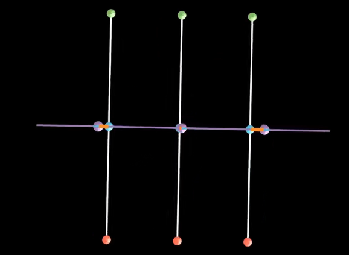

然后缩短一下靠下面那部分的红色小杆
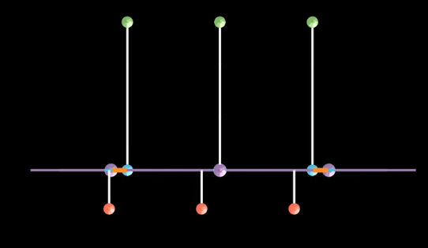

然后移动一下长期记忆点的位置，将它变成二维平面图的形态
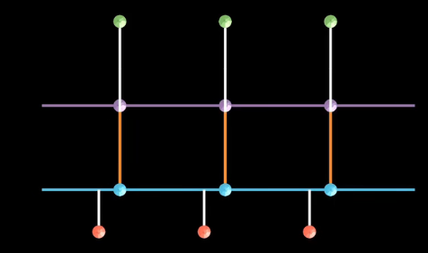

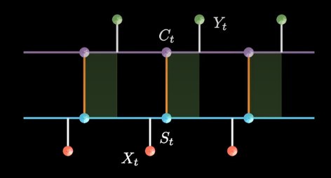
对应的就是下图了
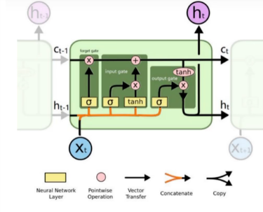
## 训练
梯度下降训练即可
# Encoder decoder
## 原理
就是两个RNN组合在一起
其实就是我们上面所说的虽然是多输入，但输入和输出个数并不一样

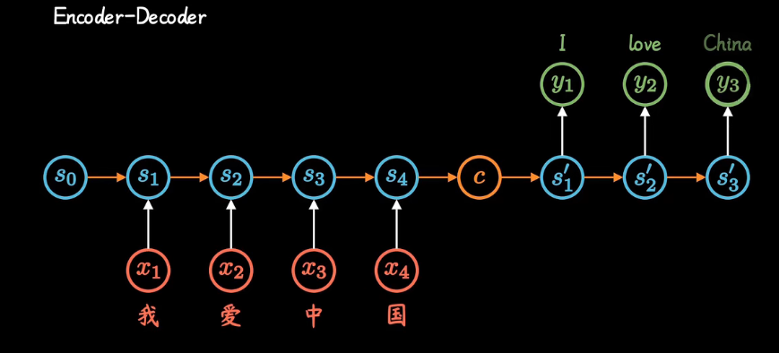
以中间的C为分隔，前后就是两个RNN

# attention 注意力机制
## 本质
通过加权求和解决对上下文的理解
在不同的上下文下专注不同的信息
## 原理
 Attention就是权重
 
 这是传统的rnn模型

它建立了网络隐层的持续关联
 
 它主要的改进就是让隐藏当中的一个神经元s2的状态不单单取决于上一层的输入x2
还取决于上一时刻该神经元的状态，s1
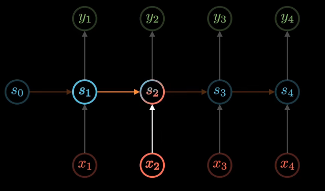

这是之前encode decode的模型的话，它就是两个RNN衔接
它的缺点是中间的特征向量C始终是固定长度的, 并且只有一个

Attention机制就是对encoder decoder的变形
你别看他画的复杂，其实它就是增加了一些中间变量，C
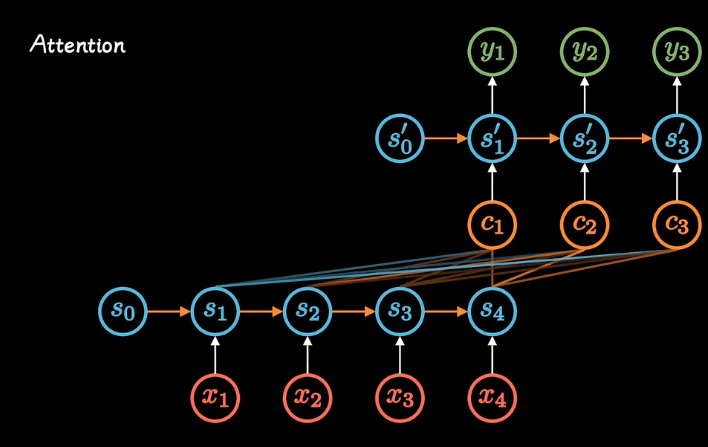

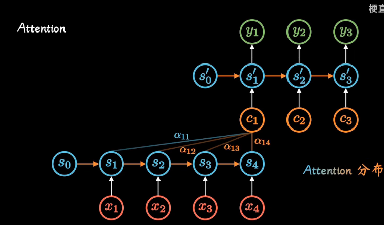

 Attention指的就是不同的C会关注不同的信息
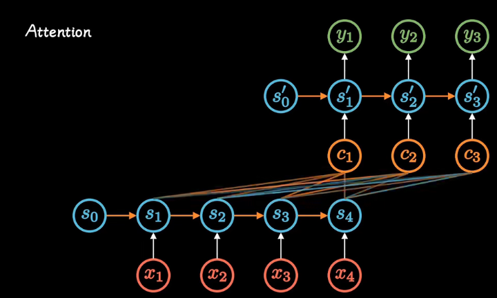
##  Self attention

是对上面这个模型的变形
拿掉了其中的RNN

就成了这个模型
而且rnn不太适合并行运算
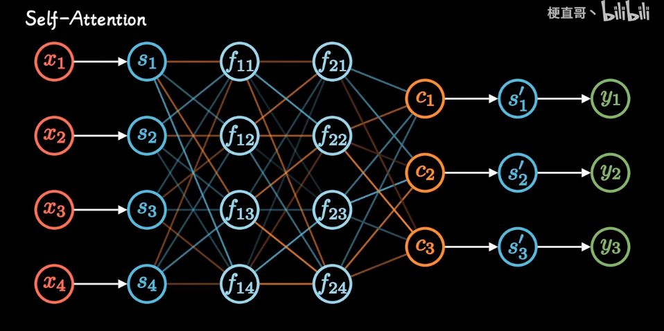
## 优点
参数更少，速度更快
效果也很好
# %auto-expand-line-18%