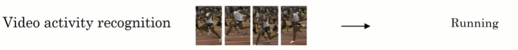
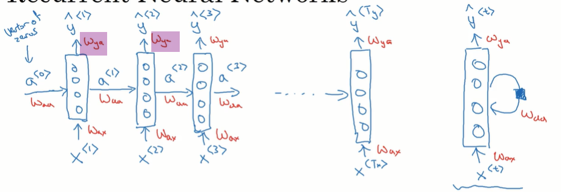
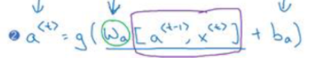
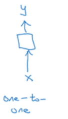
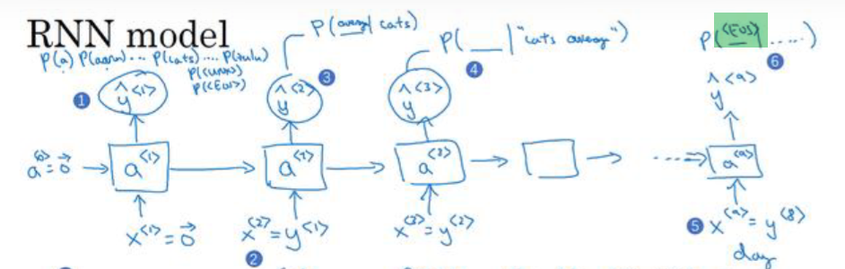

# 基础
## 是什么
循环神经网络RNN
在语音识别和自然语言处理方面有大量的应用
# 序列数据与RNN
## 序列数据使用RNN
比如语音识别
输入的x是一个声音序列
输出的y是一个文字序列

而像音乐生成
输入的可以是∅或仅仅是一个数字
输出的是一个声音序列

而像这个是评论分类
你根据他输入的评论文本来决定他应该打几星
输入的是一个序列，输出的不是

在翻译中也有着大量的应用

或者给定一系列视频片段，或者说一个图片序列让你分析出这个人物正在跑步

或者进行命名实体识别

这里可以看出
其实序列数据使用RNN具体细分情况还挺多的
比如输入的是序列，输出的是序列
或者输出的不是序列
或者输入的也不是序列
或者输入一个序列返回一个东西
或者输入一个东西返回一个序列
## 符号约定
### 符号约定
以命名实体识别为例
这里的x是输入的一串字符串，其中一共包含9个单词
它本质上是哈利波特当中的一个句子，我们要识别其中的实体
输出的y则是也有9个元素分别是其对应的单词，是否是命名实体的一部分，如果是的话标记为1，否则标记为0
这个y的输出方式并不好，但这里仅用于演示说明

序列中的各个元素使用<1>这样的角标来标识        

使用Tx来标志输入序列的长度
Ty来标志输出序列的长度

此外我们还可能有多个序列
比如有多个待训练的句子
这分别表示的就是第i个训练样本当中的第t个元素, 在这里一个元素就是一个单词
以及第i个训练样本一共有多少个元素

对于y也是如此表示

## 单词编码 `包括one-hot编码` 
### 准备词典
首先你会有一个字典，该字典当中就是从a到z的单词的话，就是我们平时用的那种字典
然后你要从第1个单词开始给这些单词标上序号像这里就是一共从1标记到1万

这个词典是偏小的，一般熵业应用的词典是3万到5万
有一些大公司用来训练的词典，甚至是10万乃至于百万级别的词典
### one-hot编码
#### 原理
一种编码方案是one-hot编码
比如说我们要标记hurry这个单词
他在字典中的位置是4075
那我们就创建一个一万维的列向量: 这个1万其实就是字典中有多少个单词
然后只将第4079这一位标记为1，其他的标记为0

一定要注意，one-hot编码, 一个单词表示为1个向量⭐
#### 为什么要用向量

他这不浪费存储空间吗
为什么不直接使用一个数字, 而要用一个向量呢
### UNK, 未知单词
有时词典中需要有一个特殊的单词叫做<UNK>
它也是一个标记

一旦我们要处理的文本中出现了单词，而该单词又不在我们当前的词典当中，就将它标记为unk

当然此外还有别的处理方法，这只是一种处理方法
# RNN 循环神经网络
## 使用深度神经网络解决
### 是什么
这里是也是一个命名实体识别的任务
发现深度神经网络并不能好好的解决它
会有很多问题
### 原理
还是以命名实体识别为例
这里输入的是一个文本序列，或者说是一个句子
输出的是一个列向量y^
该向量当中的每一个分量表示的是: 它对应的这个单词是否是一个实体的名字的一部分
这里输出的x采用的是one-hot编码，也就是每个x<1>指的都是一个one-hot向量 

### 问题
首先我们训练的神经网络有多少层，每一层有多少个神经元都是固定的(训练好之后都是固定的)

假定现在我们拿到的这个句子有10个单词, 最终输出的y^也是预测这10个单词是否是命名实体的一部分. 这就意味着输入层和输出层都是10个神经元
但在实际应用场景中，很可能下一个输入的句子就是20个单词...此时神经网络就不能试用了

第2个问题是
第2个问题说白了就是他无法应用到上下文信息
我们给定一个句子，包含10个单词，并且给他添加标签说其中第1个单词是实体的一部分，第2个单词不是实体的一部分...
那我们的神经网络很可能会学习到很多和位置相关的信息. 也就是判断一个单词是否是实体, 神经网络依赖的主要特征恐怕是这个单词是什么，以及这个单词位于哪个下标. 而无法应用上下文信息
简而言之就是拟合单词信息, 拟合单词下标信息，但就是不拟合单词上下文信息
比如第1个单词是hurry, 我们训练出来的神经网络很可能是: 当哈瑞仍然出现在第1个单词位置时就效果较好，而当hurry出现在别的位置时就效果较差, 可能无法识别出来hurry是一个命名实体 
对于文本前一个单词和后一个单词之间，往往存在着非常大的联系
比如一个单词，它可能根据所处上下文的不同连词性和语义都不一样
## 循环神经网络 RNN
### 大体原理, 不是特别精准
仍然以命名实体识别为例
输入一段话，经过神经网络的运算，输出一个y^向量
这一段话中包含n个单词，y^当中包含n个分量: 分别是这个单词是否是/属于一个实体

如果用普通神经网络来实现
输入层可能有很多个神经元，一口气把这个句子全部扔进去
中间只有一个隐藏: 比如说它有64个神经元, 也就是隐层输出的是一个64维列向量
输出层有10个神经元, 分别是输入的10个单词当中每一个单词是否是实体
该模型只接收输入10个长度大小的句子

使用RNN来改造
还是只有一个隐层，该隐层输出一个64维列向量(也就是该层有64个神经元), 然后传递给输出层
仍然是从一个句子中分辨实体
但现在一个单词一个单词的输入
每个单词采用one-hot编码，假如说有1万个分量, 是个列向量

第1个单词列向量x1传入到输入层
然后再传递给隐层, 配1万个权重w1, 变成一个64位的特征向量a1

第2个单词列向量x2传递给输入层
然后传递给隐层, 分配1万个权重w2, 但是等等现在先不输出一个64位列向量 
拿到第1个单词对应的特征列向量a1 (这就是rnn不同的地方, 上一个单词的特征列向量a1会被缓存记录下来)
然后这个单词的特征列向量a2 = w2x2 + v1a1
也就是第2个单词的列向量是由接收到的第2个单词x2分配权重w2 + 上一个单词的特征向量a1分配权重v1得到的
大体是这个样子

第2个单词的列向量a2: 其实包含第2个单词的信息也包含第1个单词的信息. 这样在考虑第2个单词是否是实体时，就可以应用到第1个单词的信息了
 a2也是64为列向量

第3个单词输入到输入层再输入到隐层得到a3, a3是由第3个单词分配权重 + 第2个单词的特征向量a2分配权重得到的, 
而第2个单词的特征向量a2: 本质上包含了第1个单词的特征向量a1的一部分信息+第2个单词的一部分信息
所以第3个单词的特征向量a3: 本质上包含了第1第2第3个单词的一部分信息
这个a3还是64维的

一直到这个句子结束, 最后一个单词，比如说第9个单词: 它输入到输入层再输入到隐层得到特征向量a9 = 这个单词分配权重+第8个单词的特征链向量分配权重
本质上最后输出来的这个特征向量a9: 包含了前9个单词的信息
它也是一个64位列向量

就这样一个单词一个单词的处理, 第1层神经元就将整个句子处理完了，并且最终输出一个64位列向量a9, 这就是本层神经元运行的结果

是rnn网络经常用到的一个示意图
它有一个输入层，一个隐层和一个输出层

但其实隐藏是针对一个单词一个单词去计算的，并且每一个单词的计算结果a, 都会输入给下一个单词来参与下一个单词的计算

而h0一直到ht，指的就是对各个单词的预测结果 
比如h0就是对第1个单词的预测结果, 像ht就是对最后一个单词的预测结果
TODO: 也有地方说ht，其中包含了各个单词的预测结果. 难道说ht将前面h0h1的结果都累加起来了吗

### 原理（格外注意，该例演示只包含一层隐层，所以该隐层既展示时间步的运算，也展示预测结果y^的输出）⚠️
#### 示意图
第1个隐层会分不同时间步去计算 
也就是说它会一个单词一个单词的输入
该隐藏的最终计算结果就是y^

下面的x是输入的一个个单词
这里前后输入三个单词
中间的a是上一个时间步计算出来的结果, 或者说是关于之前单词的结果
a会和x一起参与到下一步的运算
而输出的y^<1>, 这些指的是对第1个单词的预测结果, 它是否是一个实体

对于第1个时间步 : 为了和接下来的保持一致，我们一般也会让他输入一个a
这样第1个时间步的输入也有a和x两个元素了  
下面标黄的a是我们编造出来的或者说随机出来的
它也叫做伪激活值

有时上面的绘图方式也浓缩为下面的形式
右边的那个循环戴一个黑色方块表示的是不同的时间步
这针对的是一层神经网络，隐层它输入x，输出y 
不过这种示意图比较难看懂，此处不使用

#### 权重 uvw
在普通的深度神经网络当中
我们从接收到x，然后会给x分配权重w

但在RNN当中，我们接收到的不仅仅是x, 还有上一个时间步的a
我们要给x分配权重的话, 记住Wax, 也就是下面的黄色方块
还要给a分配权重, 记住Waa, 也就是下面的绿色方块
黄色和绿色方块的权重是不同的
但每一个黄色方块或者说每一个Wax是相同的
每个绿色方块也是相同的

这是因为当前你别看这个图画这么热闹: 它仍然属于同一个隐层，只是是不同隐藏的不同时间部
而每一个隐层只有一个Waa和一个Wax 
这两个参数在不同的时间步共享

#### ⭐⭐⭐ 关于上图，根据ChatGPT补充一句、时间步
假设第一个隐层有64个神经元
句子有10个单词，每个单词编码为onehot词向量
首先，第一个隐层完全运行结束，进入第二个隐层运算之前：第一个隐层会输出一个64维向量，这是由第一层隐层的神经元个数决定的，这个64维向量会作为第二层隐层的输入
其次，10个单词会一个一个的输入第一个隐层进行计算：
第一个单词，会输入第一个隐层的64个神经元进行计算，格外注意，不是一个单词对应一个神经元，而是第一个单词就会输入到隐层的每个神经元
每个神经元都有自己权重矩阵w，会对第一个单词的词向量进行运算，得到一个值a（注意是a，不是y^）。64个神经元会得到64个值，形成上下文64维向量a

个人理解：这就是一个时间步

然后，第二个单词也会输入所有神经元进行运算，但此时，各个神经元除了接收第二个单词的向量x，还接收第一个单词输出的上下文向量a，也就是接收两个输入，每个神经元都接收这两个输入，其实就是当前单词和前文信息，分配权重后，每个神经元输出一个输出，64个神经元输出64个输出，形成一个新的上下文向量a，该a融合了第一个和第二个单词的信息，供下一个单词处理时使用

个人理解：这也是一个时间步

然后第三个单词向量x，同样输入给每个神经元，每个神经元除了拿到x，还拿到包含前文（前两个单词）信息的a...
注意这里讲述的是上图中a这条线，没有讲述y^这条线，个人理解，如果当前隐层不负责最终预测，而只是一个中间隐层，是不输出y^的，只是不断的输出a，直到最后一个单词也处理完，会输出一个包含所有上下文信息的64维列向量，作为下一层隐层的输入

其实接下来还有第3个参数
紫色部分的Wya
它指的是我们根据权重综合x和a计算出来一个值
这个值其实才相当于当前时间步输入的值
我们要对这个值赋予权重, 就好像在普通的DNN当中给输入的x分配w权重那样
最终它会输出一个y^

个人理解
从语义的部分来理解Waa和Wax其实是在分配: 上下文的权重和当前单词的权重
紫色部分的Wya其实是相当于普通神经网络当中的w

这三个参数在有的教程中也叫做uvw
#### 前向传播
 我们先来看第1个时间步
 他有两个输入a<0>和x<1> 
 它有两个输出
a<1>和y^<1>
我们要计算的就是: 如何从这两个输入得到这两个输出

首先来看a的计算
它就 = 先给输入的a<0>分配黄色权重矩阵 
再+给输入的当前单词x<1>分配绿色权重矩阵
再+偏置b, 然后通过一个激活函数得到a<1>

这里黄色下头的角标aa: 第1个a指的是这里是用于计算一下a<1>的
第2个角标指的是, 它是针对a<0>的权重参数 
这里绿色方框下面的角标ax: 第1个a指这里是用于计算a<1>的, 第2个角标x指的是，这是针对x的权重矩阵
此处的激活函数g1经常是tanh或者relu
TODO: 为什么是这两个

接下来再看第2步如何计算y^，也就是预测当前这个单词是否是一个实体
可以看到它根据上面一行计算出来的a<1>并给它赋予一个蓝色权重+一个偏置，通过一个激活函数得到了y^ 
其实这就是普通DNN当中最经典的计算方式：给上一层的输入分配权重+偏置通过激活函数

此时的激活函数g2: 就是我们普通DNN当中激活函数的选择策略
如果是一个二分类激活函数，则选用sigmoid函数
如果是一个多分类，则选用softmax
要注意第1个激活函数g1和第2个g2的选择策略是不一样的
这里我们是命名实体识别问题: 针对每一个单词，我们要做的就是判断它是否是个实体
所以此处接的激活函数应该是sigmoid函数

用普通的针对每一个时间步的计算公式如下，其实和上面是一模一样的

#### 向量维度
首先我们要转换一下公式的记录方式
注意这是针对某个时间步的计算公式

先转换a的计算
可以写成下面这个样子
绿色圆圈的Wa, 就 = 下面的大的绿色圆圈
提取公因式了，属于是

大的绿色圆圈其实就是将两种权重参数水平摆放
而大的紫色方框其实是将上面两个竖直摆放
所以他们本质上也是一种质证的计算方式，和原来的式子是等价的，就 = 下面的绿色字体

↑可以看出来这两个方框计算然后展开得到的和原来的式子是一模一样的

接下来我们来分析一下围度

再看一下这个图片
这里a的维度，x的维度和y的维度都是不一样的
个人理解a的维度取决于该层有多少个神经元，假如有100个神经元的话，那a就是一个100维的列向量
它指的是将一个单词转化为1个100维的特征列向量
(前面我们说过一个单词，一般是采用one-hot编码，它一般是一个1万位的列向量，这里是将1万维的列向量压缩为了100维的列向量) 
而在之后的时间部当中接收到的a其实并不是由一个单词压缩过来的，而是包含了前面所有的上下文，但它仍然是一个100维的列向量

而x: 它是使用one-hot编码编码的一个单词，它是一个1万维的列向量
TODO: y呢
TODO: y的权重Wya

而我们还要给a和x分配权重
a的权重Waa: 它也是一个100维的向量, 其中每一个维度分量和a对应相乘, 要一个数
上面的一个100维的列向量，应该是一个神经元当中的
而有100个神经元，所以最终的Waa是一个100×100的矩阵: 每个神经元计算出来一个数，所以最终计算出来的是100个数
所以个人理解下面这是一个100×100的矩阵， x 一个一百维的列向量: 得到的是: 一个100位的横向量
TODO: 但它是不是应该会被转化为1个100为的列向量

x的权重Wax: 它是一个1万维的向量, 它和每个x的分量相乘得到的还是一个数
因为我们一层有100个神经元，所以最终的Wax是一个100×1万的矩阵

所以上面这个式子本质上是一个100×1万的矩阵， × 一个10000维的列向量, 得到的也是100个数，或者说是一个100维的列向量
而前面我们讲过简化的式子，会将这两个矩阵叠在一起，所以它们最终的维度是100×10,100, 非常非常的宽

同理，紫色部分是两个向量纵向堆叠在一块
它达到的是一个10,100维的列向量

所以最终这个矩阵和这个向量相乘，也就是下面这个式子
它是一个100×10100维的矩阵， x 一个10,100为的列向量
他得到的是一个100为的行向量，个人理解他应该还是会被转化为列向量

而根据公式这个列向量会通过g激活函数得到at，所以得到的at仍然是一个100维的列向量传递给下一个时间步

这样每一个时间步得到的都是一个100维的列向量
传给下一个时间步

最后对于第2步，它也可以简写成这个样子
它仅仅是将黄色的a去掉了

#### 前向传播: 整体计算过程
这是个人理解

个人理解，rnn的网络计算包含三个维度的话，首先我们
聚焦在某一个隐层，注意只看这一个隐层
然后改隐层当中的一个神经元: 神经元永远是输出一个值，或者说是一个数字

然后我们要在每个时间步去分析
在当前隐层的, 当前时间步的, 当前神经元 
一个神经元会拿到当前输入的单词x以及前面时间步计算出来的a
对它们两个分别分配权重Wax以及Waa, 最终浓缩出来一个值
注意计算出来的，仅仅是一个值

然后每个神经元都会这样计算: 每个神经元都会计算出来一个值，这些值堆叠在一块, 形成一个列向量: 就形成了当前时间步的输出列向量a<t>

这个输出列向量a<t>会传递给下一个时间步
下一时间步也会接收a<t>以及一个单词x，并经过同样的计算得到a<t+1>
这样时间步就能不断运算下去
注意a<t>当中的每一个分量都是由当前隐层, 当前时间步中不同的神经元计算出来的

TODO: 那当前隐层最终输出的是a<t>呢, 还是y^呢
 
这是前向传播的整体计算过程

#### 损失函数
来解释一下这个损失函数
首先它的角标<t>指的是: 当前损失计算的是当前序列中每一个单词预测的损失
假如说当前这个单词它是一个实体, 那它的真值y<t>就应该是1
但他的预测值y^可能预测出来的是0，此时就造成了很大的损失
此时计算的就是一个单词的损失 ⭐
可以看到这个损失的计算: 其实和逻辑回归的非常非常像，逻辑回归也是真值可能是0或者是1, 而预测出来的值可能也是0或者是1，从而造成一些损失
所以这里用的损失函数其实就是逻辑回归章节的交叉熵损失函数
TODO: 为什么这个叫做交叉熵损失函数

一定要注意，这里定义的是神经网络某个隐层的某个时间步的某个单词造成了损失, 或者说白了，它就是下图一个黄色位置造成的损失

我们来看看整个序列造成的损失

它其实就是上图中每一个y^造成的损失
下图中的黄色角标是Ty，它指的就是对上图中的y^<1>一直加到最后一个y^<t>
其实就是每个单词造成的损失相加

注意这个序列的损失函数L是不带角标的，而每个单词的损失L<t>是带有小标的

有时这个公式的角标也标为Tx，因为本质上Tx和Ty是一样的: 输入几个单词就有几个对单词的预测结果，或者说输入几个Tx就有几个Ty

总体示意图如下
就是针对每一个y^<t>计算出来一个L<t>, 也就是黄色的部分
接下来对黄色的部分相加，汇总得到当前序列的整体损失，也就是紫色的部分

个人理解，这里计算出来的最终损失L其实是当前隐层最终预算结果的损失
也就是当前隐层的每一个时间步都走完了，对每一个单词的预测都预测完了，然后在当前隐层运算结尾的地方, 我们可以计算一下它的损失L
TODO: 那岂不是说每一个隐层都可以计算一下损失

 Rnn的反向传播有一个很霸气的名字叫做穿越时间的反向传播
 你可以看一下上面的红色箭头: 它其实是在逆着时间步往回移动的, 这也是他名字的由来，其实仅仅是一个名字而已

#### 反向传播
其实就是各个计算步骤反过来

 
我们来看一下整个的计算过程
对于每一个a，我们都是拿前一个a和前一个x+权重按W计算出来的
对于每一个y，我们都是根据当前时间步得a+权重带Wy计算出来的
下面绿色的指的是权重
这些绿色的箭头指的是在当前隐层的任意时间步, 权重参数都是共享的，或者说都是一致的

这是上面分析过的每个单词的损失L<t>和当前隐层的损失L
反向传播就是上图中的红色箭头: 看一下每个量的变化对最终的紫色的L造成了多少的变化, 就是求每个axyw之类的对L的偏导

个人理解
在普通的DNN网络中，我们真正关心的其实是w和b对最终损失J的偏导
因为只有w和b是我们的神经网络能够学习和调节的
此处应该也是如此，我们关心的其实是权重w和偏置b对最终的L的偏导, 并在反向传播之后调节w和b

这是书中给的反向传播示意图的话，但它好像推的是对黄色方块a<t>的反向传播，而不是对损失l的

#### 总体
TODO: 上面没有讲输出层是什么样的
也没有讲每层隐层的输出到底是什么样的
难道说它只有一个隐层, 当前隐层各个时间步计算出来的y^就是输出层?

### RNN的问题
#### 看前不看后
比如判断每一个单词是否是一个实体: 只看该单词和该单词前面的单词
但其实有时候判断一个单词是否是一个实体，还要看该单词后面的单词

可以通过双向rnn网络解决: BRNN

举例来说
假如我们当前只看到了紫色线条分隔的部分，然后让判断前面的泰迪是否是个人名，注意必须是个人的名字
其实他是否是个人的名字，主要是由后半段话决定的
比如第1句后半段说他是一个伟大的总统，所以他是一个人的名字
第2句话则说他正在被售卖，所以它是一种商品名字 
这就是要看到后面的内容才能解决

#### 不会忘记
每一个时间步计算出来的a<t>，其实都融合了前面所有的单词
也就是说我们判断当前单词: 就是参照前面所有的单词作为上下文

其实有一些单词可以没那么重要, 比如一些虚词，我们可以将它们忘掉
TODO: 计算一下RNN当中对当前单词来说，前面每一个单词所占的权重比重. 看看他们对决策的影响有多少
# RNN 类型/任务
## 不同类型
### 是什么
前面我们介绍的是命名实体识别的例子
它的特点是输入和输出的个数是相等的(个人理解准确来说就是输入的单词数量和输出的y^的列向量的维度是相等的)
输入m个单词，输出的就是针对这m个单词是否是实体的预测结果

我们来看看输入和输出不对等的情况
### 多对多结构: 命名实体识别
这个不单单是多对多，而且输入和输出还是相等的
上一小节我们讲的命名，实体识别就是这种结构，它也是一种最基础的结构
这里的输入输出相等指的是x和y相等
就是下面的x<t>和上面的y^<t>是数量对等的

### 多对一: 情感分析
比如对于情感分析的例子
输入一句影评: 这是一个序列数据
输出一个数字是1~5之间的数字代表这个分析出来这个影评有多喜欢这个电影
比如影评是there is nothing to like in this movie: 这部电影没啥好看的
这就是输入: 开分成一个一个单词作为x去进行输入
但只在最后一个单词的地方进行输出，y^
这就是多对一的结构

个人理解
TODO: 这种结构是不是只有一个隐层
### 1对1
视频中说这种结构 并不 常见，简单理解有这种结构就可以

### 一对多: 乐曲生成
比如输入一个数字输出一段乐谱
个人理解，这有点像是根据随机种子生成我的世界的地图
这个数字仅仅是一个随机种子

它的结构大概是这样的
其中只有第1个时间步接受到了真正的随机数，X
接下来每一个时间步接收到的都是y^
个人理解，这是因为: 比如我们生成乐曲前后的输出要有一致性连续性, 所以要参考前面的一个输出

此时前面的输出就成了上下文环境 ⭐
原来是输入的x是上下文环境 ⭐
总而言之，个人理解处在黄色方框位置或者说处在x位置的都是上下文环境

### 多对多，但输入和输出数量并不一样: 翻译
就是encoder decoder的结构

### 总结
图一中，第1个1对1图示: 有1部分a<0>被划去了，他的意思是化掉这一部分，其实就是普通的神经网络
+这一部分，他就是RNN

## 任务: 语言模型
### 什么是语言模型 (基于单词的语言模型)
大概可以理解为1个概率计算函数的话
可以理解为传给他一个句子, 它会返回该句子正确的可能性
或者说传给他一个单词序列y, 他会估计某个句子序列中各个单词出现的可能性
注意视频中说此处的单词序列使用y表示更合理, 之前我们一直使用y来表示输出，这里则表示输入

举个例子你说了一句话，然后一个语音识别系统可能会生成下面两个备选的句子
然后就传给语言模型计算这两个句子出现的可能性，然后选择概率较大的那一个
此处很明显，使用第2个句子更好
则语言模型计算出来的第2个句子的概率值也应该更高

可以看到它判断句子出现概率其实是根据上下文来的
所以此处也要用到RNN模型

### 训练语言模型
#### 大概
其实就是得到这样一个可以判断句子出现概率的函数
其实就是训练一个RNN模型
#### 语料库与标记
训练要用到语料库可以理解为语料库就是包含大量句子或文章的这样一个文本仓库

我们要使用该语料库训练我们的RNN模型
首先从语料库中选出一个句子，比如下面这个句子
然后针对每个单词使用one-hot向量进行标记，再次注意这里将每个单词标记为y，而不是像之前一样标记为x
看最后一个EOS，它是一个特殊的字符，表示句子的结尾: 它也将转化为1个one-hot向量
添加这个向量是为了让我们的模型可以学习正确的处理句子的结尾

标记完成的句子才可以丢到循环神经网络中进行训练

上面是处理句子的结尾
有时我们可以针对标点进行处理: 也将其表示为one-hot向量, 但此处我们忽略标点

对于未知单词则标记为unk
它指的就是不在你当前字典中的单词

#### 构建rnn模型: 原理
上面我们有了输入
它其实就是将语料库中的句子编码成了one-hot向量，接下来我们就可以训练RNN网络了

它的大概原理是这样的
我们训练的这个rnn模型就是需要根据前面出现的单词来预测下一个单词
比如前面出现了the apple and, 问接下来这个单词应该是什么: 他的选择范围就是我们的词典，假定我们的辞典中一共有1万个单词，他就要从1万个单词中做选择
但说实话他现在选择范围非常大，而且在现实情况中the apple and后面到底跟什么其实也不一定
所以一开始我们的神经网络可能会随机预测一个值
它就是给词典中的1万个单词都计算出来一个概率，然后将概率最大的那个词写在and后面. 一开始这个概率很可能是瞎给的，比如他觉得and后面应该输出big...

但当前我们是有一个标准输出的，就是the apple and the pear salad
所以下面输出的应该是pear: 它这里输出的是big，所以他输出错误了就会受到惩罚
慢慢慢慢的他就会学习到后面应该输出pear
至少说: 针对当前词典中的1万个词(可能还包含
啊，句子结束eos之类的, 他们也会参与训练)，它会慢慢学习到 The apple end后面输出pear的概率要大于pair的概率
这是针对当前这个语料进行学习

我们的语料库中还有非常多非常多的语料，他今后可能还会遇到the apple and orange...这样的搭配也就是and后面出现的是orange
此时神经网络就会学习到the apple and后面输出pear, orange的概率都比较大一些...输出其他词的概率可能比较1些

虽然现实情况中, the apple and后面出现的词可能五花八门
但总而言之 The apple and后面出现的词可能是水果的概率更大一些: 当我们使用大量语料去训练这个RNN网络的时候，他就会学习到这个行为. 也就是根据前面的上下文去推导下一个词可能是什么

现在假如用这个训练好的语言模型去进行语音识别
假定前面比较确定用户输入的文本是the apple and
接下来听到了一个词: /pi:r/
它对应的候选单词有很多个，但因为我们的语言模型已经训练过了
他就能从这很多个单词中找到概率最高的词: pear然后将其输出...
这就是使用rnn训练语言模型的原理
#### 构建rnn模型: 训练
假定这是我们的语料

当然这个语料可能比较短，但是我们仅仅是为了说明效果

构建一个RNN网络
这是网络的第1个时间步
他接受一个a和一个x, 都是零向量
然后它返回一个y^: 其实就是词典中1万个单词中，每个单词出现的概率
所以y^前面连缀的是一个1万分类的softmax

此时我们想让让他输出的是cats, 如果输出的不是cats
不过话说回来，这里想要让他输出cats，其实是有点无理的, 因为他压根就没有上下文，鬼知道这个单词应该输出什么，要我说就是词典中的每个单词都有可能输出在这个位置
但无所谓，因为我们这里的语料想要让他输出cats, 我们就基于这种没有上下文的情况或者说输入的a和x都是零向量的情况训练，让他去输出cats
个人理解，这仅仅是让我们的模型去运转起来，所以第1步并不是特别紧要
不过个人理解, 因为我们会一句一句的输入
应该每一句都是以这个神经元开头的, 所以这个神经元最终学习的其实是: 哪些单词更容易出现在句子的开头

接下来看第2步
黄色部分是输入第1个单词，cats
让我们预测第2个单词，我们希望输出的绿色部分的y^是average, 这是根据我们的语料决定的
然后我们还能够拿到上文的信息，就是蓝色部分的a
所以这里本质上就是让根据上文信息+当前单词cats的信息输出下一个单词
他慢慢就会学会: 下一个单词应该说出average, 否则它就会因为造成损失而受到惩罚
但本质上在这一步，我们的模型学到的是: cats后面可以跟average，而且跟的概率比较大(因为这种表达方式在语料中出现过)
而如果我们语料库比较大的话，慢慢他就会发现cats后面还可以跟别的词, 慢慢我们这个模型就学会了，开始后面都可以搭配哪些词. 或者说cats后面出现哪个词的概率更高
最后一点需要注意的是黄色部分: 第1个单词被标记为y<1>, 它是一个输入, 他也等同于x<2>, 这个很容易理解，仅仅是标记方式的不同
在这里向X和y都用于标记输入，而y^用于标记输出

再看第3步, 还是一样的
此时拿到的单词y<2>是average, 这也是语料库提供的
蓝色部分是拿到的上文的信息: 此时上文的信息只有cats
绿色部分，我们希望它输出的是15, 这也是语料库当中的下一个单词
这样模型就能学会 Cats average 15这个搭配
或者说cats average后面出现15的概率更高
当然, 单看average后面出现15的概率也更高

整体模型如下
注意最后一个绿色方框，我们希望它最后输入的是句子的终结符，EOS

TODO: 这个模型真的是使用语料库中的一句一句去训练的吗还是说将整个语料库全部丢进去. 这两者的区别是: 如果一句一句的训练，那么我们第1个时间步才能学习到每一句的开头可能是哪些单词, 而如果将整个语料库丢进去，那我们的第1个时间步只能学习到哪个句子，最可能是当前语料库的开头
#### 损失函数 L
这里是针对单个单词预测结果的损失计算
 比如针对第1个单词预测结构y^<1>的损失进行计算

下面的Y<t>是真值，也就是应当输出的单词
y^<t>是预测值，也就是预测的单词
它们是两个向量
这其实就是softmax的损失函数可以参见那一章节

我去看了一下softmax损失函数的章节
这里的y^<t>输出的列向量当中, 其实每一个分量应当都是一个概率值，比如0.13, 0.27等等
概率最大的那个分量对应的单词就是我们预测的单词
可以回去看一下softmax

则整体的损失函数就是: 对每个单词预测的损失加在一块

#### 计算最终的概率
现在我们已经有了一个RNN模型, 它可以根据我们前面输入的单词预测之后输出的单词的概率
而我们需要得到的语言模型是一个概率函数P，它给定一个句子，判断该句子的整体出现概率

假如该句子当中包含三个单词

那么其实它的计算方法如下
其实就是一个概率乘法，先计算第1个单词出现的概率
然后在第1个单词已经出现的前提下计算第2个单词出现的概率
然后再计算在前两个单词出现的前提下，第3个单词出现的概率
最后将三个概率相乘得到的就是当前句子出现的整体概率
如果说这个句子非常不合理的话，那么它的黄色绿色和紫色概率都会非常的小，从而整个句子对应的概率值就很小，该句子就不容易出现

我们往P中传入多个句子，就能找到最容易出现的那个句子
### 新序列采样
#### 是什么
它可以让你直观的看到你训练的这个RNN语言模型效果是怎么样的
说白了，它就是让Rnn模型自动生成句子，看看它生成句子的质量
#### 原理
现在我们训练好了一个RNN语言模型
给定一个零向量a, 一个零向量x作为输入

它就会输出一个y^,  y^是一个列向量，其中有1万个分量，分别是每个单词出现的概率
因为这里是第1个时间步，所以它输出的其实就是作为句子开头的单词出现的概率
视频中说，接下来要从该向量中进行采样
TODO: 我不太理解这个采样具体的意思，但他说的应该就是选择其中概率较高的一个词
现在我们就拿到了句子的第1个词, 比如是the

接下来将这个词输入到第2个时间步当中，拿到第2个y^
它也是一个列向量，其中包含了每个单词出现的概率
但因为我们的rn模型会考虑上下文，所以此时每个单词出现的概率是考虑了前面生成的那个单词the
所以越可能出现在the后面的词的概率就越高
我们针对再次进行采样, 也就是找到其中概率较高的一个词, 比如是dog
作为下一步的输入

这样一步步的来，我们的安安模型就会生成一个句子

如果我们的词典中包含句子结尾eos的话，我们可以等待它输出EOS时就结束这个采样，看看它生成的这个句子

而如果我们不想让生成的句子中包含未知符号unk的话我们就在采样的时候回避掉unk, 始终不对unk进行采样，即便此时它的概率很高

大体模型如下，这样就能生成一个句子

#### 应用: 序列生成
它可以用于生成文本生成新闻之类的
比如我们使用新闻语料库去训练这个模型，那最终对训练好的模型进行新系列采用，就能生成一篇看起来像新闻一样的东西，但其实他可能读这并不通顺
如果使用莎士比亚诗歌来训练我们的模型, 那最终新序列采样时得到的东西就更像是诗歌
这个叫做序列生成

### 基于字符的语言模型
#### 原理
前面我们训练的是基于单词的语言模型
它输入的是一个个单词，输出的是一个个单词出现的概率

我们也可以训练一个基于字符的语言模型
它输入的是一个个字符，输出的也是一个个字符的概率
此时我们仍然要准备一个词典，但该词典就会小很多，它只需要包含a到zA到Z一些标点符号等等

对于此时的神经网络，我们往里头传入一个个字符，它会计算出下一个字符可能是什么

就是这样一个字符一个字符的

#### 优点
它的词典很小，而且不用担心出现未知字符之类的
#### 缺点
它训练起来时间成本更高
而且它倾向于输出更长的单词
TODO: 这个他倾向于输出更长的单词，我没有太理解，他说的是RNN会捕捉到前面所有上文对当前单词的影响，这会促使他输出更长的单词
#### 选择基于字符的还是基于单词的
视频中说以前因为性能的限制，基于单词的语言模型更流行
但现在至于字符的也有越来越多的应用

# %auto-expand-line-218%