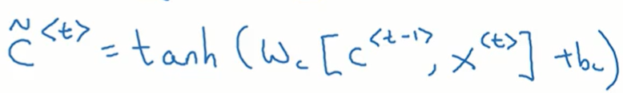
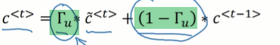

# 基础
## 是什么
# GRU
## 引入: 梯度消失问题
### 原理
在以前的深度神经网络中，我们也遇到过梯度消失的问题
越靠后的隐层，它的导数值就越大，学习的也越快
越靠前的隐层，它的导数值越小，该层的学习效率也越低


而在循环神经网络的时间步当中，因为同样的道理也会存在梯度消失的问题

TODO: 具体分析一下

以上图中的y^<3>为例
假如说它造成了一些损失，那么要往前追溯的话就要计算a<3>导致了多少损失, a<2>造成了多少损失, a<1>造成了多少损失
以及x<3>造成了多少损失，x<2>造成了多少损失，x<1>造成了多少损失
其实就是求他们的导数
如果出现了梯度消失的话: 这些值相对y^<3>的导数就会越来越小
即便是当前输出的y^<3>是错误的, 他也很难去调整靠前的输入的权重来让最终的训练结果变得更加正确

造成的影响就是: 它可以调整，离自己很近的这几个值, 比如针对y^<3>，它可以去调整a3, a2, X3, X2等等
但他就很难调整到X1和a1了
梯度传播不过去, 误差也很难真正的变小

这其实就会导致: 每一个单词的预测比如y^<3>: 其实受离它最近的字符影响最大

但在文本中却不是这么回事
举例来说, 下面绿色部分的was显然是根据前面黄色部分的cat决定的
单数是同型嘛
但在RNN当中, 其实cat是很难影响到绿色方块了, 因为他们离的太远了, 梯度传播不过去就没有办法调整它的权重
可能会导致绿色方块这个位置的错误率下降不下来, 从而导致整个RNN的效果不佳


### 什么时候会出现
在DNN当中是当我们的隐层过多的时候
而在RNN当中是当我们的时间步过多的时候，或者说当我们的序列过长的时候⭐
因为在RNN当中，梯度是沿着时间逆向传播的, 所以时间步过多的话，就容易出现梯度消失

## 引入: 梯度爆炸问题
和普通的DNN一样，RNN也可能出现梯度爆炸的问题
只是同样出现的概率较小，而且很容易发现
因为梯度爆炸会导致梯度变成非常巨大的值，可能会显示出大量的梯度是NaN, 此时我们可以进行调整

一种调整方案是使用梯度修剪: 就是你观察你的梯度向量，如果其中各个分量的值太大了，你就对你的梯度向量进行等比缩放，让整个梯度向量变小

而梯度下降就更难发现一些
TODO: 梯度下降是不是就是模型训练的会特别慢，导致非常长的时间难以到达一个理想效果，这是不是就是如何发现梯度下降

更重要的是他比较难以解决

## GRU 门控制单元: 简化版本
### 是什么
用于解决梯度消失问题
###  Gru vs lstm
这两个都可以给rnn带来记忆功能
其中LSTM先出现是在1997年
而GRU出现是在2014年
他们两个效果相差不大, 而gru更容易计算
###  RNN单元
这是我们以前学习的计算，RNN当中一个时间步的激活值的公式


其中rnn当中的一个时间步的具体计算展开就是这张图片
准确来说是时间步当中每一个神经元的计算过程
它也叫做一个RNN单元

### GRU单元 简化版本 `Γ`  ``Γ``  ```Γ```  ````Γ````  `````Γ`````  ``````Γ``````  ```````Γ``````` 
我们会使用类似RNN单元的图来讲解gru能控制单元


还是针对这个句子两个蓝色方框，这是RNN不善于处理的地方，因为他们离得太远了
但后面的那个was又依赖于前面的cat的单数数


此时我们可以引入一个记忆细胞c
它的作用就是记住小猫的单复数，然后在下面遇到was的时候提供信息
我们知道在前面普通的rnn网络当中，每个神经元会输出一个激活值a<t>
在这里我们对它换个标志叫做c<t>
此处仅仅是换一个标志而已
在下面的LSTM章节,  C和a的值其实是有区别的，但在本章中没有区别，仅仅是换个标志


我们先把整体模型放在这
注意这是隐层中的一个时间步当中的一个神经元
该神经元还是接收a输出a
只是在这里我们将a就改成了c
所以下面左边的输入和右边的输出其实都是只有一个, 只是我们可以用a来标记它，也可以用C来标记它. 当然在这里我们用C来标记它
此外还从底部接受一个输入x

在原本的rnn当中，我们会分别为x和c分配权重得到z
然后z通过tanh得到下一层的输出c2
c2又可以通过sigmoid函数得到y^

这里则不同, 主要是C2，也就是当前神经元的右侧输出计算方法不同
注意每一个c其实是包含所有前文提供的信息

在这里我们要引入一个门的概念，它使用Γ表示: 这个值为0的时候就代表不更新,  = 1的时候就代表更新
其实这个值是一个连续值, 比如它可能 = 0.13就代表部分更新


对于这一段话，我们想要让模型记住，前面出现了cat，从而后面应该使用单数was
我们知道每一个单词输入到模型当中, 都会计算出来一个c: 这个C其实表示的就是前文的信息
假如说在cat这个单词就对应一个c, 或者说这个单词对应的时间步就对应一个c, 其中包含了the cat这两个字母提供了上文信息
那接下来那个was就是需要这个上文信息啊
但在传统的RNN当中, 后面出现的which already....会不断的往c中添加新的信息，从而将真正需要的信息the cat挤得很远, 从而变得不太重要
我们希望适当降低weight already等等这些单词的权重, 多暴露cat这个时间步对应的C当中的信息

这就可以通过Γ这个门来控制

看这幅图
在cat的上头，它的Γ = 1, 就代表这个时间步有更新c的权利，从而将cat提供的上下文信息也写进去
但which对应的Γ = 0, 也就代表着它不能更新C, 此时即便经过该时间步的运算C中还是仅有the cat的信息
注意: 其实Γ是很难完全 = 0或 = 1的, 它可能 = 0.13 0.98之类的. 所以cat 之后 The which already等等还是会有部分信息添加到c当中. 只是我们这里纯粹的把它当成只有0和1两个离散值会更好说明一些

一直等到was的时候, 我们再次将Γ设置为1, 也就是代表此处又可以更新c中的值, 将was提供的上下文信息也写入进去
因为在到达was这个单词的时候，其实 Cat提供的信息已经使用过了, 接下来可能 CAt提供的上下文就没有那么重要了, 我们就可以开启Γ，让它 = 1从而让不断的往其中写入信息，把之前的信息覆盖掉
⚠️⭐上面的过程描述好像是我们手动控制Γ一样，但这样只是为了方便理解，Γ =多少同样是神经网络学习到的，因为神经网络就是从数据中学习规律，只要was单复数是有cat决定的，随着训练的增加，神经网络迟早能学习到要多记录cat的信息，并使用cat的信息决定was。或者从数字的角度来说，它迟早能把Γ调整的就像我们上图标记的那样正确，即便Γ一开始只是随机值...

所以γ就相当于是能否更新c的大门: 打开了就能更新，关上了就不能更新. 稍微看一点点就只能更新一点点，开了很多就能更新很多

我们再来看一下这张图

 首先要注意一点，这是针对单个神经元来画的
其实该神经元接收到的c<t>应该是上一个时间步的输出, 是一个列向量, 用于表示上下文特征
而这里单个神经元计算出来的c<t-1>则是一个经过了tanh计算之后的普通数值
多个神经元计算出来的数值累积在一块, 才形成当前时间步的最终输出c<t-1>, 这也是一个特征列向量

而且再回到RNN当中，一个神经元接收到外部输入的c, 接收到当前时间步输出的x, 它会计算出来一个新的c
计算步骤如下(注意下面是使用a, 下面的a就 = 我们这里说的c)

这种像RNN一样计算出来一个输出值c的做法, 在gru当中被叫计算侯选值
可以看到它的公式如下, 和上面是一样的

它这个参数被修改成了Wc, 个人猜测是因为这里计算出来的向量是c, 而不再使用a进行标记, 所以参数也改成了Wc
注意这个侯选值其实就是正正常常的，像RNN一样，根据输入的上一时刻的c和输入的x计算出来的这一时刻的c, 此处叫做候选值，他的头上有一道~, 记住c~

接下来我们计算门单元
门单元就是控制当前这个单词，或者说当前这个时间步: 是否允许他去更新上下文特征向量c
它也是由神经网络计算出来的，并且计算它也需要用到当前的上下文信息
下面就是它的计算公式
个人理解，黄色部分是一个新的权重向量，它用于专门更新Γ
而这个函数会通过sigmoid函数，最终输出一个0~1之间的值, 也就是控制开门的大小


而最终这个gru单元输出的c<t>

是下面这个式子
它本质上是两个式子相加: 黄色部分是取一部分候选值，绿色部分是再取一部分上一时刻特征向量的值
具体取的比例是通过Γ决定的


所以最终计算出来的当前时间步的输出c<t>其中有多少是以前的上下文, 又有多少是当前的上下文, 是由Γ决定这个比例的

个人理解，总体上来看，现在的gru模型
每个时间步要学习的参数包括: Wc也就是给上一时刻c分配的参数, Wx也就是给本次单词x分配的参数, Wu也就是给本次门单元Γ分配的参数
我想要不断学习这三个参数从而去控制他要记住什么要忘记什么, 或者说通过Γ来控制记住的比例.

Γ给我们的模型提供了另外的学习空间, 那我们的模型就能学到更多的东西 ⭐ 这近乎是神经网络的一种通用思想: 添加一组新的W，让机器有新的学习空间, 只是不同的W有不同的具体语义⭐⭐⭐

以前没有γ的时候
C只能不断更新: 去记住之前出现的每一个东西, 并且因为梯度消失的原因，使得他记住的东西总是越靠后的越重要，越靠前的越不重要，无法有效的调整这种权重分布
现在每个C都有一个门单元，Γ来控制, Γ又是可以调整的, 从而可以控制修改前后上下文的重要程度: 或者是说可以让记住某些东西遗忘某些东西

TODO: 靠前时间步当中的Γ的权重不会出现梯度消失吗
## 梯度消失
TODO: 为什么gru不会梯度消失

## GRU 完整版本
这是前面简化版的gru的三个计算公式


上面只有一个Γ，作为门
下面完整版当中有两个门
他们的计算公式是一样的，只是各自有各自的权重参数
下面这两个门被标记为r和z


其中z对应的就是我们前面的Γ: 它用于控制有多少信息是从上一时刻的上下文中取了过来的，有多少信息是从这一时刻的上下文信息中取过来的
他被叫做更新门

而其中的r则是另外一个门，它用于控制我们的候选状态，c~, 是否依赖上一时刻的上下文状态c<t-1>，依赖程度有多少
它被叫做重置门
现在我们计算C~的方法就要变一下了
在下面被标记成了h~
原来的计算公式是没有黄色部分的对吧，现在有了黄色部分就是用重置门来决定对上一时刻的上下文信息保留多少
当重置门 = 1的时候, 其实就是退化成了简画版的gru


其他的相比简化版的gru都没有变化


这是完整版的计算公式


TODO: 为什么要引入重置门
一个教程中说，如果不引入重置门，也就是简化版的gru: c<t-1>和c<t>是线性关系，引入之后就成了非线性关系了
TODO: 我没有太理解
# LSTM 长短期记忆
## 是什么
和gru效果类似
比gru出现的时间更早也更复杂一些
## 原理
### 公式
这是前面学过的gru的5个公式


第1个是求出来后选值
第二第三是两个门
第四第5本质上是一样的，就是当前神经元的输出

 LSTM的公式和Gru类似
我们一个一个来看
左边是GrU的公式
右边是LSTM的公式
这里是在候选值c~ , 标黄的部分不一样
注意在LSTM的模型当中，a和c分开了，它们是两个量
在gru的模型当中，这两个是等同的，即a=c，是在用两个符号指代同一个东西


接下来是更新门
黄色和绿色部分不一样的话，主要是gru当中使用c
LSTM当中使用a

注意在gru的模型当中，我们使用更新门来控制以前的上下文特征列向量和本次计算出来的候选值之间所占的比例
绿色的部分用于分配比例


但是在LSTM当中，这两个部分则成了独立的两个门, 其中左边就是上面我们已经看到的更新门，而右边绿色部分独立成了一个新的门
这个门是LSTM当中独有的，它其实就相当于gru当中的一-Γu 
它的公式和更新门是一样的, 叫做遗忘门


总结一下LSTM当中的第1和第2个门
他们分别是更新门和遗忘，我们对应的就是gru当中的Γu


gru当中有一个重置门
而LSTM当中有一个输出门
这是gru当中的重置门


下面这是LSTM当中的输出门
他们的公式本质是一样的，只是所使用的a和c不一样


总结一下，LSTM当中的三个门
个人理解他们的计算公式都是一样的: 都是针对先前的上下文和本次的输入x进行计算
只是它们的权重参数不一样


下面这个公式用于计算LSTM新出出的c
他和gru的公式其实是一样的
只是左边gru当中是使用（一个更新门） + （1-这个更新门）来决定分配比例
而LSTM当中是使用两个独立的门：更新门和遗忘门来决定从之前的上下文中取多少信息，从本次的上下文中取多少信息
这里就给了当前神经元进行记忆和遗忘的权利，它可以从之前的上下文信息中保留更多的比例 


而注意LSTM当中独有的更新门: 它用于确定从上面输出的c当中取多少的比例作为当前神经元的真正输出a


这和gru的重置门不一样，gru的重置门是用于设置从上一个神经元输出的c当中取多少的比例
而LSTM的输出门则是用于设置从当前神经元的c中取多少比例, 作为当前神经元的真正输出a

总体上LSTM的公式如下
它一共有三个门
其中有两个能用于控制更新和遗忘
一个门用于控制输出的比例


可以看出来LSTM和gru的作用大体相同
TODO: 为什么最后一个公式不一样

### 示意图
左图是普通rnn的模型
右图是LSTM的模型

而这是LSTM的示意图
可见每个神经元接收两个输入a, c
并输出两个输出

其中a代表短期记忆
c代表沉淀下来的长期记忆
更新长期记忆使用下面一个公式: 就是通过更新门和遗忘门来决定从之前的长期记忆c<t-1>中保留多少，从本次的候选状态c~中取出多少
它本质上可以当做对以前长期记忆和当前候选值的线性组合


而计算出来当前后选值C~ 
和普通的RNN一样: 通过上一时间步的输入a和本次输入的x进行计算


而从这个角度理解当前神经元输出的a，本质上是从当前神经元对应的长期记忆c中提取出来一部分, 并且中间还经过了一个非线性函数tanh
TODO: 那这里输出的a还是短期记忆吗, 为什么要拿长期记忆来更新短期记忆


### 梯度下降
## 优缺点
能够进行长短期记忆，所以对于序列数据处理的更好
但是它的参数更多，训练起来更加复杂

gru的训练更简单, 他只有两个门，而lstm有三个门
## RNN vs GRU vs LSTM
ChatGPT

RNN因为梯度爆炸，导致不适合处理长文本

GRU和LSTM通过选择性的遗忘和更新，具备关注重点内容的能力，从而更适合处理长文本
GRU有两个门，更新门和重置门，所谓的门，其实就是0-1之间的数值，用于控制保留、更新信息的比例之类的（ps，所以，门都是通过sigmoid激活函数转换为0-1的）

重置门（Reset Gate）：重置门决定了在当前时间步中，如何结合前一个时间步的隐层状态和当前输入来计算临时隐层状态的候选值。
更新门（Update Gate）：更新门决定了在当前时间步中，如何将临时隐藏状态与前一个时间步的隐藏状态进行结合，形成当前时间步的最终隐藏状态。
总之，两个门提供了学习空间，共神经网络自己学习怎么分配本次信息和当前信息的比例

LSTM有三个门
输入门可以控制新信息是否应该被加入到记忆中。如果输入门关闭，那么新信息将被忽略。如果输入门打开，那么新信息将被添加到记忆中。
遗忘门可以控制之前的记忆有多少应该被保留。如果遗忘门关闭，那么之前的记忆将被完全忘记。如果遗忘门打开，那么之前的记忆将被保留。
输出门可以控制哪些信息应该被输出给下一个单词。如果输出门关闭，那么记忆中的信息将被忽略。如果输出门打开，那么记忆中的信息将被输出。
总之也是提供学习空间

还有这些门，都是在每个时间步运算的，个人理解，就是每来一个单词（每来一个新信息）就会经过门的处理, 来确定怎么遗忘，怎么保留。或者说选中重要信息，忽略次要信息

每个单词都会输入到多个神经元，是每个神经元中都要进行门运算吗
ChatGPT说，每个神经元都会执行门运算
# 双向循环神经网络 BRNN
## 是什么
双向的RNN
使得某个时间步可以获得，不单单来自上文的信息，还能获得来自下文的信息
## 原理
### 问题
假如我们想要判断Teddy是否是个人名或者说是个商品名，仅仅依靠上文是不够的
还需要依靠下文
看到下文说它是一个泰迪熊，那泰迪很明显是一个商品名或者说动物名


事实上，不管上图中的方块是普通的rnn单元，还是之前学的Gru， LSTM他们都是前向模型，也就是只能看前文，不能看后文

想看后文，需要使用双向的BRNN
### 双向RNN
我们以这种方式画出来一个简单的单向的RNN模型
每个方块都是一个RNN单元，它接收两个输入输出一个y^

下面对其进行改造


接下来我们添加绿色模块
单看绿色模块发现它其实也是rnn模型，每个方块接收两个输入
输出一个输出y^
只是它的方向是反过来的
紫色加绿色一块就是双向RNN

 
大体来说,  上图的运算过程是: 先前项运算由输入的x1和a1, 不断向右推进
 注意这个过程中不计算y^
 然后反向计算由输入的x4a4不断往左运算
 等这一轮跑下来，再最后计算y^，这样就能应用上下文信息了
进行预测时的公式如下

注意这里仅仅是朝右方向运算和朝左方向运算，它们都属于前向传播，此时还没有进行反向传播
他其实就是拿到了紫色的前向上下文
和绿色的反向上下文
其实就是两个列向量啊，这两个链向量综合描述了前文信息和后文信息
这样就可以对这两个列向量分配权重来决定上下文中哪个信息是重要的, 从而增大这一点的预测正确的可能性


个人理解也可以理解，双向rn的运行过程是: 先从左往右推进计算，x1a1等等, 不断往右推进, 注意此时不计算y^
然后反过来从右往左推进: 从x4和a4不断往左推进，此时这个过程中就可以不断的计算y^了，而不需要等到反向推进完成再计算y^
TODO: 有一个问题是，对于一些语料它依赖的信息可能非常非常靠前, 而我们这个模型一般是一个句子，一个句子地去进行输入和训练的, 那是不是他也无法依赖太靠前的信息. 比如好几个句子之前的信息

上述模型也可以用于改造gru和LSTM
## 优缺点
它并不适用于某些任务
比如语音输入
因为双向RNN需要将整个序列输入到模型中, 他前后都过一遍才会预测，中间某个位置的输出值
如果语音输入应用普通的双向RNN: 就会出现需要等待用户输入完毕之后, 在预测显示用户输入话语的情况. 而无法做到一边说一边输入
此时需要更复杂的模型
# 深层循环神经网络 RNNs
## 是什么
个人理解之前学的rnn网络都是只有一个隐层
它之所以横向展开，只是将一个隐层不同的时间步给画出来了
其实RNN网络也可以有很多个隐层，每个隐层可以有自己的时间步

## 原理
首先这是一个普通的深度神经网络，我们将它竖着画了
正好其中每一个小方块都是一个隐层


之前我们使用a<1>这种来表示一个隐层当中的第1个时间步
现在我们要给rn网络添加不同的隐层
所以标记符号也要更改一下，使用a[1]<0>: 来表示第1个隐层的第0个时间步 

 这个就是原来的，只有一个隐层的情况
 从左到右就是当前隐层的不同时间步
 按理来说它的上面应该输出的是y^: 也就是当前隐层的输出
 之前我们拿到这个第1个隐层的输出y^就当做运算结束了
但现在我们却不要y^了，而是将这里计算出来的a直接传递给下一个隐层


这就是一个拥有三层隐层, 每个隐层有4个时间步的神经网络模型
每个隐层之所以有4个时间步，是因为我们输入的序列个数是4: 比如说一句话，里头只有4个单词


我们来看一下标号为5的那个第2层的第3个时间步是怎么计算的
他会接收到两个输入
一个是从7号过来的输入
一个是从6号过来的输入
这两个输入其实都是a
它会分别给这两个输入来赋予权重


TODO: 这里需要总结一下围度问题
假定x都是one-hot向量编码的一个个单词，那么对于第1个隐层输入的是1万维的列向量(假定每个单词都被编码为1万维的列向量)
而假定第1个隐层有100个神经元，则当前引擎输出的a应当都是只有100个维度，它代表浓缩的上下文
那是不是说下一层神经元接受到的输入就是只有100个维度到向量了

当然深度循环神经网络也可以应用于gru或LSTM
或者你也可以构建最复杂的深度的双向循环的普通RNN或者gru或者LSTM, 但是他们需要大量的时间去训练

TODO: 我发现我有一个非常重要的问题没有弄明白
上面这个深层模型到底是先从左往右再从下到上走，还是先从下到上再从左往右走

##  RNNs有多少层
视频中说普通的深度神经网络可能会有几十层上百层甚至上千层
但对于RNNs来说，三层都已经不算少了
视频中说它近乎不可能超过100层
因为它除了藏身还有时间步带来的宽度, 超过100层也过于复杂了
# %auto-expand-line-384%